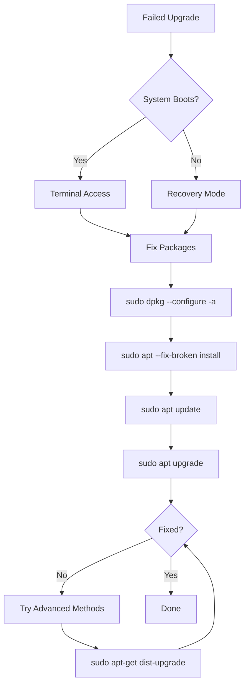

# Ubuntu Package Troubleshooting

## Introduction

Package management is a fundamental part of using Ubuntu, but sometimes things don't go as planned. Whether you're facing dependency issues, broken packages, or repository errors, understanding how to troubleshoot these problems is an essential skill for any Ubuntu user.

This guide will walk you through common Ubuntu package management issues and provide practical solutions to resolve them. By the end, you'll have the knowledge and confidence to diagnose and fix package-related problems on your own.

## Common Package Management Issues

### 1. Broken Dependencies

One of the most common package management issues is broken dependencies, which occurs when a package requires another package that isn't installed or has the wrong version.

#### Diagnosing Dependency Issues

```bash
# List broken packages
sudo apt --fix-broken install
```

If you have broken packages, you'll see output similar to:

```
Reading package lists... Done
Building dependency tree... Done
Reading state information... Done
Correcting dependencies... Failed
The following packages have unmet dependencies:
 package-a : Depends: package-b (>= 2.0) but 1.8 is installed
E: Error, pkgProblemResolver::Resolve generated breaks, this may be caused by held packages.
```

#### Resolving Dependency Issues

Let's fix the broken dependencies:

```bash
# Try to fix broken packages
sudo apt --fix-broken install

# If that doesn't work, try forcing package reconfiguration
sudo dpkg --configure -a

# Update package lists and try upgrading
sudo apt update
sudo apt upgrade
```

### 2. Package Installation Failures

Sometimes package installations fail unexpectedly. Here's how to troubleshoot:

#### Diagnosing Installation Failures

If you get an error during installation, check the detailed error message:

```bash
sudo apt install package-name -V
```

The `-V` flag provides verbose output to help identify the problem.

#### Common Installation Error Scenarios

**Scenario 1: Locked dpkg Database**

```
E: Could not get lock /var/lib/dpkg/lock-frontend. It is held by process 1234
```

**Solution:**
```bash
# Find the process using the lock
ps aux | grep -i apt

# Wait for the process to finish or kill it if necessary
sudo kill -9 PROCESS_ID

# Clean up lock files if process is gone but lock remains
sudo rm /var/lib/dpkg/lock-frontend
sudo rm /var/lib/dpkg/lock
sudo dpkg --configure -a
```

**Scenario 2: Disk Space Issues**

```
E: You don't have enough free space in /var/cache/apt/archives/
```

**Solution:**
```bash
# Clean apt cache
sudo apt clean

# Check disk space
df -h

# Remove old kernel versions if needed
sudo apt autoremove
```

### 3. Repository Issues

Repository problems can prevent package updates and installations.

#### Diagnosing Repository Problems

```bash
sudo apt update
```

Look for errors like:

```
Err:1 http://archive.ubuntu.com/ubuntu jammy InRelease
  Could not resolve 'archive.ubuntu.com'
```

#### Fixing Repository Issues

**Internet Connection Problems:**
```bash
# Check your internet connection
ping -c 4 google.com

# If DNS is the issue, try using a different DNS server
sudo nano /etc/resolv.conf
# Add: nameserver 8.8.8.8
```

**Invalid Repository:**
```bash
# Edit sources list
sudo nano /etc/apt/sources.list

# Comment out problematic repositories by adding # at the beginning of the line
# Save and exit, then update
sudo apt update
```

**GPG Key Issues:**
```bash
# If you see "NO_PUBKEY" errors, import the missing key
sudo apt-key adv --keyserver keyserver.ubuntu.com --recv-keys MISSING_KEY_ID
```

### 4. Handling Held Packages

Sometimes packages are "held back" during upgrades.

```bash
# List held packages
apt-mark showhold

# Remove hold
sudo apt-mark unhold package-name

# Force installation of a specific version
sudo apt install package-name=version
```

## Advanced Troubleshooting Techniques

### Using dpkg for Low-Level Troubleshooting

The `dpkg` command offers more direct control over package management:

```bash
# Get information about installed packages
dpkg -l | grep package-name

# Check package status
dpkg -s package-name

# Reconfigure a package
sudo dpkg-reconfigure package-name

# Force removal of a problematic package
sudo dpkg --remove --force-remove-reinstreq package-name
```

### Package Verification and Repair

```bash
# Verify integrity of installed packages
sudo debsums -c

# Reinstall a possibly corrupted package
sudo apt install --reinstall package-name
```

### Using apt-cache for Dependency Analysis

```bash
# Check package dependencies
apt-cache depends package-name

# See what packages depend on a specific package
apt-cache rdepends package-name

# Search for a package
apt-cache search keyword
```

### Troubleshooting with Synaptic Package Manager

If you prefer a graphical interface, Synaptic can help troubleshoot package issues:

```bash
# Install Synaptic if not already installed
sudo apt install synaptic

# Launch Synaptic
sudo synaptic
```

In Synaptic, you can:
1. Filter for broken packages
2. Fix broken packages (Edit → Fix Broken Packages)
3. Force specific versions by right-clicking a package

## Common Troubleshooting Workflows

Let's walk through some real-world scenarios:

### Scenario: Broken System After Failed Upgrade



### Step-by-Step Process:

1. Boot into recovery mode if necessary:
   - Hold Shift during boot
   - Select "Advanced options for Ubuntu"
   - Select "Recovery mode"
   - Select "root" or "netroot"

2. Fix the packages:
   ```bash
   sudo mount -o remount,rw /    # If in recovery mode
   sudo dpkg --configure -a
   sudo apt --fix-broken install
   sudo apt update
   sudo apt upgrade
   ```

3. If the system is still broken:
   ```bash
   # Try a distribution upgrade
   sudo apt-get dist-upgrade
   
   # As a last resort, force-install critical packages
   sudo apt install --reinstall ubuntu-desktop
   ```

### Scenario: Can't Install New Software Due to Dependency Hell

```bash
# Example error
# E: Unable to correct problems, you have held broken packages.

# Check what's broken
sudo apt-get check

# Try to find the problematic package
apt-cache policy package-name package-dependency

# Try installing with aptitude which has better dependency resolution
sudo apt install aptitude
sudo aptitude install package-name

# If aptitude suggests solutions, review them carefully before accepting
```

## Preventive Measures

To avoid package management issues in the future:

1. Always backup before major upgrades:
   ```bash
   sudo apt update && sudo apt upgrade
   # Backup important files
   ```

2. Use PPAs and third-party repositories cautiously
3. Don't interrupt package installations
4. Keep your system updated regularly:
   ```bash
   sudo apt update && sudo apt upgrade
   ```

5. Remove unnecessary packages:
   ```bash
   sudo apt autoremove
   ```

## Summary

In this guide, we've covered the most common Ubuntu package management issues and their solutions:

- Fixing broken dependencies
- Resolving installation failures
- Addressing repository problems
- Handling held packages
- Using advanced troubleshooting techniques

Remember that package management is integral to keeping your Ubuntu system running smoothly. The skills you've learned here will help you maintain a healthy system and quickly recover from package-related issues when they arise.

## Additional Resources

- The Ubuntu community forums: [https://ubuntuforums.org/](https://ubuntuforums.org/)
- The Debian Package Management documentation: [https://www.debian.org/doc/manuals/debian-reference/ch02.en.html](https://www.debian.org/doc/manuals/debian-reference/ch02.en.html)
- The `apt` and `dpkg` man pages:
  ```bash
  man apt
  man dpkg
  ```

## Exercises

1. Deliberately break a package dependency (on a test system!) and practice fixing it.
2. Create a shell script that performs basic package system maintenance.
3. Research how to create a local package repository for offline systems.
4. Install a package from source and convert it to a `.deb` package using `checkinstall`.
5. Set up a regular maintenance schedule for your Ubuntu system that includes package updates and cleaning.