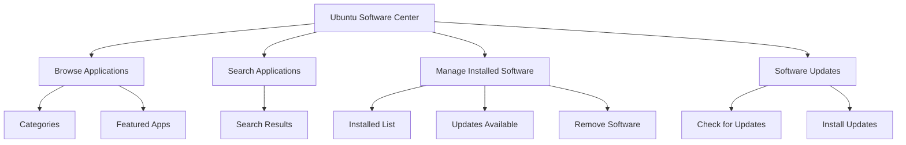

# Ubuntu Software Center

## Introduction

The Ubuntu Software Center is a user-friendly graphical application that allows Ubuntu users to browse, install, update, and remove software packages with ease. It serves as an approachable front-end to Ubuntu's powerful package management system, making software installation accessible for beginners without requiring command-line knowledge.

Originally introduced in Ubuntu 9.10 (Karmic Koala), the Software Center has evolved over time. In modern Ubuntu releases, it has been replaced by "Ubuntu Software" (based on GNOME Software), but the core functionality remains similar. This guide covers both the classic Ubuntu Software Center and its modern replacement, which we'll refer to collectively as "Ubuntu Software Center" for simplicity.

## Understanding the Ubuntu Software Center

### What is the Ubuntu Software Center?

The Ubuntu Software Center is a comprehensive application that:

- Provides a graphical interface for installing, removing, and updating software
- Organizes applications into categories for easy browsing
- Allows users to search for specific applications
- Displays ratings, reviews, and screenshots to help users make informed decisions
- Manages software updates in a convenient way
- Handles both free and paid software applications



### Technical Background

Behind its user-friendly interface, the Ubuntu Software Center utilizes Ubuntu's package management system, primarily:

- APT (Advanced Package Tool) - The underlying package management infrastructure
- dpkg - The base system for handling .deb package installation
- Software repositories - Online collections of packages available for installation

The Software Center essentially provides a graphical interface to these command-line tools, making them accessible to all users regardless of technical experience.

## Getting Started with Ubuntu Software Center

### Launching the Software Center

To open the Ubuntu Software Center:

1. Click on the Ubuntu Software icon in your application dock or launcher
2. Alternatively, click the "Activities" button in the top-left corner and search for "Software"

The application will open to the home screen, displaying featured and popular applications.

### The Main Interface

When you open Ubuntu Software Center, you'll see:

- A search bar at the top for finding specific applications
- Featured applications highlighted on the main page
- Category navigation to browse applications by type
- Tabs for "Explore" (browse), "Installed" (manage), and "Updates"

## Installing Software

### Browsing for Applications

To find applications by category:

1. Click on a category from the main page (such as "Games", "Graphics", or "Development")
2. Browse through the available applications in that category
3. Click on any application to view more details

### Searching for Applications

To search for a specific application:

1. Click in the search bar at the top of the window
2. Type the name or functionality you're looking for (e.g., "video editor", "browser", "python")
3. Press Enter to see the search results
4. Click on any result to view more details

### Application Details

When viewing an application, you'll see:

- The application name and icon
- A description of the application's functionality
- Screenshots (for many applications)
- User ratings and reviews
- Size of the application
- Developer information
- Additional technical details

### Installing an Application

To install an application:

1. Click the "Install" button next to the application
2. Enter your password when prompted (this is required for system changes)
3. Wait for the installation to complete
4. Once installed, you can launch the application from your Applications menu

**Example: Installing Firefox**

If you want to install the Firefox web browser:

1. Open Ubuntu Software Center
2. Type "Firefox" in the search bar
3. Click on Firefox in the search results
4. Click the "Install" button
5. Enter your password when prompted
6. Wait for the installation to complete
7. Launch Firefox from your Applications menu

## Managing Installed Software

### Viewing Installed Applications

To see what applications you have installed:

1. Open Ubuntu Software Center
2. Click on the "Installed" tab
3. Browse through the list of installed applications

### Removing Applications

To uninstall an application:

1. Open Ubuntu Software Center
2. Go to the "Installed" tab
3. Find the application you want to remove
4. Click the "Remove" button
5. Enter your password when prompted
6. Wait for the uninstallation to complete

### Updating Software

Ubuntu Software Center also manages software updates:

1. Open Ubuntu Software Center
2. Click on the "Updates" tab
3. Click "Check for Updates" if updates aren't already showing
4. Review the available updates
5. Click "Update All" to install all updates, or select individual updates
6. Enter your password when prompted
7. Wait for the updates to complete

## Advanced Usage

### Adding Software Repositories

Sometimes, you may want to add additional software sources (repositories):

1. Open "Software & Updates" from your system settings
2. Go to the "Other Software" tab
3. Click "Add" to add a new repository
4. Enter the repository details (usually in the format `ppa:username/repository`)
5. Click "Add Source" and enter your password
6. After closing this window, Ubuntu Software Center will refresh its available software list

### Installing .deb Files

You can also use Ubuntu Software Center to install .deb package files:

1. Download a .deb file from a trusted source
2. Right-click the file and select "Open with Software Install"
3. Ubuntu Software Center will open with details about the package
4. Click "Install" and enter your password
5. Wait for the installation to complete

## Troubleshooting Common Issues

### Software Center Won't Open

If Ubuntu Software Center doesn't open:

1. Try running it from the terminal to see error messages:
   ```bash
   gnome-software
   ```

2. Try refreshing the package cache:
   ```bash
   sudo apt update
   ```

### Installation Errors

If you encounter errors during installation:

1. Check your internet connection
2. Ensure you have sufficient disk space
3. Try updating your package lists:
   ```bash
   sudo apt update
   ```

4. If a specific package has issues, try installing via terminal:
   ```bash
   sudo apt install package-name
   ```

### Missing Applications

If you can't find an application in Ubuntu Software Center:

1. Ensure your software sources are properly configured
2. Try searching using alternative terms or check spelling
3. The software might not be in the standard repositories - check if you need to add a PPA or other repository

## Comparison with Command-Line Package Management

While Ubuntu Software Center is user-friendly, understanding the related command-line tools can be helpful:

| Ubuntu Software Center | Command-Line Equivalent | Description |
|------------------------|-------------------------|-------------|
| Browse/Search | `apt search [term]` | Search for packages |
| Install | `sudo apt install [package]` | Install a package |
| Remove | `sudo apt remove [package]` | Remove a package |
| Update | `sudo apt update && sudo apt upgrade` | Update package list and upgrade software |

The Software Center handles these operations with a graphical interface, but knowing the command-line alternatives can be useful for troubleshooting or when working in environments without a GUI.

## Ubuntu Software vs. Snap Store

In newer Ubuntu versions, you'll notice two software stores:

1. **Ubuntu Software** - Handles both traditional Debian packages (.deb) and Snap packages
2. **Snap Store** - Focuses exclusively on Snap packages (containerized applications)

The presence of both can sometimes cause confusion. The key differences:

- **Ubuntu Software** handles traditional .deb packages and Snaps
- **Snap Store** only handles Snap packages
- Snap packages are containerized and include dependencies
- Traditional .deb packages integrate more deeply with the system

Most users can simply use Ubuntu Software for all their needs.

## Summary

The Ubuntu Software Center provides a user-friendly way to:

- Browse and discover new applications
- Install software without using the command line
- Manage and update installed applications
- Remove unwanted software
- Keep your system up to date

This graphical approach to package management makes Ubuntu accessible to beginners while still leveraging the powerful package management system underneath. As you become more familiar with Ubuntu, you may find yourself using a combination of the Software Center and command-line tools depending on your specific needs.

## Additional Resources

- [Ubuntu Software Center Official Documentation](https://help.ubuntu.com/stable/ubuntu-help/addremove.html)
- [Ubuntu Package Management Command Line Guide](https://ubuntu.com/server/docs/package-management)
- [Introduction to Snap Packages](https://snapcraft.io/docs/getting-started)

## Practice Exercises

1. Install a popular text editor (like Visual Studio Code or Atom) using Ubuntu Software Center
2. Find and install a PDF reader from the "Office" category
3. Check for and install any available updates on your system
4. Remove an application you no longer need
5. Try installing the same application using both Ubuntu Software Center and the command line with `apt install`
6. Compare the process and results of both methods