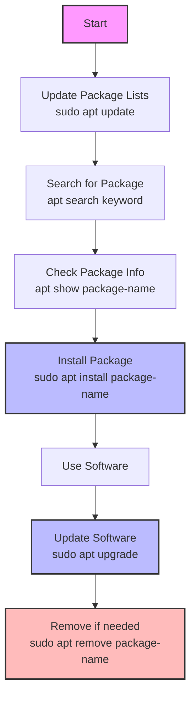

# Ubuntu Package Installation

## Introduction

Ubuntu, one of the most popular Linux distributions, uses a robust package management system that makes installing, updating, and removing software straightforward and efficient. Unlike Windows or macOS, where you typically download installers from websites, Ubuntu provides centralized package repositories containing thousands of pre-configured software packages ready for installation.

This guide will walk you through various methods to install software on Ubuntu, providing you with the knowledge and confidence to manage packages effectively on your system.

## Package Management Fundamentals

Before diving into installation commands, let's understand some key concepts:

- **Package**: A compressed archive containing all the files needed for a specific software application.
- **Repository**: A storage location containing collections of packages that can be installed.
- **Package Manager**: A tool that automates the process of installing, upgrading, configuring, and removing packages.

Ubuntu primarily uses the following package management tools:

- **APT** (Advanced Package Tool): The main command-line package management system
- **dpkg**: The underlying package manager that APT uses
- **Snap**: A newer package format for cross-distribution compatibility
- **Synaptic**: A graphical package manager (GUI alternative)

## Installing Packages with APT

The Advanced Package Tool (APT) is the most common way to install software on Ubuntu.

### Updating Repository Information

Before installing any packages, it's good practice to update your package lists:

```bash
sudo apt update
```

This command refreshes the list of available packages and their versions without installing or upgrading any packages.

#### Output example:
```
Hit:1 http://archive.ubuntu.com/ubuntu jammy InRelease
Get:2 http://security.ubuntu.com/ubuntu jammy-security InRelease [110 kB]
Get:3 http://archive.ubuntu.com/ubuntu jammy-updates InRelease [119 kB]
Fetched 229 kB in 2s (114 kB/s)
Reading package lists... Done
Building dependency tree... Done
Reading state information... Done
All packages are up to date.
```

### Installing a Single Package

To install a package:

```bash
sudo apt install package-name
```

For example, to install the popular text editor Vim:

```bash
sudo apt install vim
```

#### Output example:
```
Reading package lists... Done
Building dependency tree... Done
Reading state information... Done
The following additional packages will be installed:
  vim-runtime
Suggested packages:
  ctags vim-doc vim-scripts
The following NEW packages will be installed:
  vim vim-runtime
0 upgraded, 2 newly installed, 0 to remove and 0 not upgraded.
Need to get 7,128 kB of archives.
After this operation, 33.3 MB of additional disk space will be used.
Do you want to continue? [Y/n] y
```

### Installing Multiple Packages

You can install multiple packages simultaneously by listing them with spaces:

```bash
sudo apt install package1 package2 package3
```

For example:

```bash
sudo apt install git curl wget
```

### Installing a Specific Version of a Package

If you need a specific version:

```bash
sudo apt install package-name=version
```

For example:

```bash
sudo apt install nginx=1.18.0-0ubuntu1
```

### Automatically Confirming Installation

To skip the confirmation prompt during installation:

```bash
sudo apt install -y package-name
```

## Installing from DEB Files

Sometimes you may need to install a package that's not in the official repositories. Ubuntu packages are typically distributed as `.deb` files.

### Using dpkg

```bash
sudo dpkg -i package-name.deb
```

If there are dependency issues, fix them with:

```bash
sudo apt -f install
```

### Using APT with Local Files

A better approach that automatically handles dependencies:

```bash
sudo apt install ./package-name.deb
```

## Using Snap Packages

Snap is a newer packaging system developed by Canonical (the company behind Ubuntu).

### Installing a Snap Package

```bash
sudo snap install package-name
```

For example:

```bash
sudo snap install vlc
```

#### Output example:
```
vlc 3.0.18 from VideoLAN✓ installed
```

### Finding Available Snap Packages

```bash
snap find keyword
```

For example:

```bash
snap find media-player
```

## Using the Software Center

Ubuntu includes a graphical Software Center that provides a user-friendly way to browse and install applications.

1. Open the Ubuntu Software Center from your applications menu
2. Use the search function to find software
3. Click the "Install" button for the application you want

This is particularly helpful for beginners who prefer a visual interface over command-line tools.

## Practical Examples

Let's walk through some real-world package installation scenarios:

### Example 1: Setting Up a Web Development Environment

To set up a basic web development environment with Node.js, npm, and VS Code:

```bash
# Update package lists
sudo apt update

# Install Node.js and npm
sudo apt install -y nodejs npm

# Install Visual Studio Code via Snap
sudo snap install code --classic
```

### Example 2: Installing a LAMP Stack

To install a LAMP (Linux, Apache, MySQL, PHP) stack:

```bash
# Update package lists
sudo apt update

# Install Apache web server
sudo apt install -y apache2

# Install MySQL server
sudo apt install -y mysql-server

# Install PHP and common extensions
sudo apt install -y php libapache2-mod-php php-mysql

# Restart Apache to enable PHP
sudo systemctl restart apache2
```

### Example 3: Installing and Configuring Git

```bash
# Install Git
sudo apt install -y git

# Configure your user information
git config --global user.name "Your Name"
git config --global user.email "your.email@example.com"

# Verify installation
git --version
```

## Troubleshooting Common Installation Issues

### Package Not Found

If you receive a "package not found" error:

1. Update your package lists: `sudo apt update`
2. Check the package name for typos
3. The package might be in a different repository; you may need to add it:

```bash
sudo add-apt-repository ppa:repository-name/ppa
sudo apt update
```

### Dependency Issues

If you encounter dependency problems:

```bash
sudo apt -f install
```

This attempts to fix broken dependencies.

### Permission Denied Errors

If you see "permission denied" errors, you likely forgot to use `sudo` for a command that requires administrative privileges.

## Advanced Package Management

### Searching for Packages

To search for packages:

```bash
apt search keyword
```

### Viewing Package Information

To see details about a package:

```bash
apt show package-name
```

### Listing Installed Packages

To see all installed packages:

```bash
apt list --installed
```

Or filter by pattern:

```bash
apt list --installed | grep pattern
```

## Package Management Workflow

Here's a diagram of a typical Ubuntu package management workflow:



## Summary

In this guide, we've covered:

- The fundamentals of Ubuntu's package management system
- Installing software using APT, dpkg, and Snap
- Using the Ubuntu Software Center
- Practical examples for common installation scenarios
- Troubleshooting common installation issues
- Advanced package management commands

Ubuntu's package management system is powerful, efficient, and once mastered, much more convenient than manual installation methods used in other operating systems. With the commands and concepts you've learned, you should be able to confidently install and manage software on your Ubuntu system.

## Practice Exercises

1. Update your package lists and install the `htop` system monitor tool.
2. Search for a package related to "image editing" and install one of the options.
3. Install the Firefox web browser using Snap.
4. Install the `build-essential` package which provides compilation tools.
5. Check what version of Python is available in the repositories.

## Additional Resources

- [Ubuntu Package Management Documentation](https://ubuntu.com/server/docs/package-management)
- [APT Command Guide](https://itsfoss.com/apt-command-guide/)
- [Snap Package Documentation](https://snapcraft.io/docs)
- [Difference Between APT and APT-GET](https://itsfoss.com/apt-vs-apt-get-difference/)