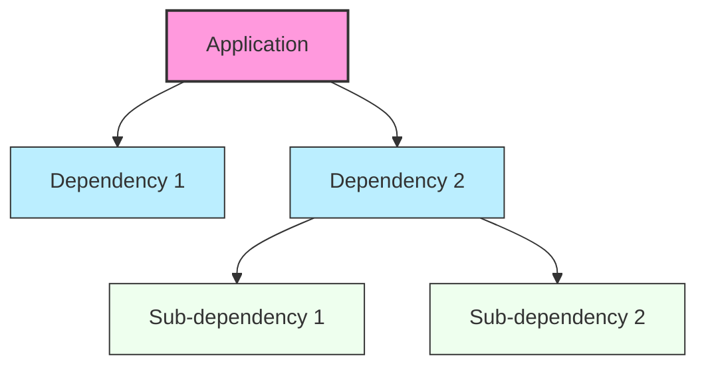

# Ubuntu Package Removal

## Introduction

Package removal is an essential skill for Ubuntu system management. As you install and use various software on your Ubuntu system, you'll eventually need to remove packages that are no longer needed. Improper package removal can lead to dependency issues or leftover configuration files cluttering your system.

In this guide, we'll explore various methods to remove packages in Ubuntu, understand the differences between removal options, and learn best practices to maintain a clean and efficient system.

## Understanding Package Removal in Ubuntu

Ubuntu's package management system (primarily through the APT tool) offers several ways to remove software, each with different effects on your system:

1. **Remove**: Uninstalls the package but keeps configuration files
2. **Purge**: Completely removes the package and its configuration files
3. **Autoremove**: Removes packages that were automatically installed as dependencies but are no longer needed

Let's examine each method in detail.

## Basic Package Removal

The most basic way to remove a package is using the `apt remove` command:

```bash
sudo apt remove package_name
```

This command removes the binary files of the package but keeps the configuration files intact, which is useful if you plan to reinstall the package later and want to preserve your settings.

### Example: Removing VLC Media Player

```bash
sudo apt remove vlc
```

**Output:**
```
Reading package lists... Done
Building dependency tree... Done
Reading state information... Done
The following packages will be REMOVED:
  vlc vlc-bin vlc-plugin-base
0 upgraded, 0 newly installed, 3 to remove and 0 not upgraded.
After this operation, 7,456 kB disk space will be freed.
Do you want to continue? [Y/n] y
(Reading database ... 231042 files and directories currently installed.)
Removing vlc (3.0.16-1ubuntu1) ...
Removing vlc-plugin-base:amd64 (3.0.16-1ubuntu1) ...
Removing vlc-bin (3.0.16-1ubuntu1) ...
Processing triggers for desktop-file-utils (0.26-1ubuntu3) ...
Processing triggers for hicolor-icon-theme (0.17-2) ...
Processing triggers for mailcap (3.70+nmu1ubuntu1) ...
```

## Complete Package Removal (Purge)

When you want to completely remove a package including its configuration files, use the `purge` command:

```bash
sudo apt purge package_name
```

This ensures no traces of the package remain on your system.

### Example: Purging Apache Web Server

```bash
sudo apt purge apache2
```

**Output:**
```
Reading package lists... Done
Building dependency tree... Done
Reading state information... Done
The following packages will be REMOVED:
  apache2*
0 upgraded, 0 newly installed, 1 to remove and 0 not upgraded.
After this operation, 547 kB disk space will be freed.
Do you want to continue? [Y/n] y
(Reading database ... 230989 files and directories currently installed.)
Removing apache2 (2.4.52-1ubuntu4) ...
Purging configuration files for apache2 (2.4.52-1ubuntu4) ...
```

You can also combine `remove` and `purge` in a single command when you've already removed a package but want to remove its configuration files later:

```bash
sudo apt purge --auto-remove package_name
```

## Removing Dependent Packages

When you install an application, Ubuntu often installs other packages as dependencies. To remove these automatically installed dependencies that are no longer needed:

```bash
sudo apt autoremove
```

This command is particularly useful for cleaning up your system after removing several packages.

### Example: Running Autoremove

```bash
sudo apt autoremove
```

**Output:**
```
Reading package lists... Done
Building dependency tree... Done
Reading state information... Done
The following packages will be REMOVED:
  libavcodec58 libavformat58 libavutil56 libdvdnav4 libdvdread8 libebml5
  libmatroska7 libmpg123-0 libpostproc55 libsdl2-2.0-0 libswresample3
  libswscale5 libupnp13 libva-drm2 libva-x11-2 libva2 libvlc-bin libvlc5
  libvlccore9
0 upgraded, 0 newly installed, 19 to remove and 0 not upgraded.
After this operation, 23.2 MB disk space will be freed.
Do you want to continue? [Y/n] y
```

## Visualizing Package Dependencies

Understanding package dependencies can help you make better decisions about package removal. Let's create a simple diagram that shows how packages relate to each other:



## Advanced Removal Techniques

### Removing Multiple Packages

You can remove multiple packages at once by listing them:

```bash
sudo apt remove package1 package2 package3
```

### Simulating Package Removal

Before actually removing packages, you can simulate the process to see what would happen:

```bash
sudo apt --simulate remove package_name
```

### Removing Packages with Wildcards

You can use wildcards to remove multiple related packages:

```bash
sudo apt remove 'package*'
```

**Note:** Be extremely careful with wildcards as they might match more packages than intended. Always use `--simulate` first.

## Common Scenarios and Best Practices

### Scenario 1: Removing a Package While Keeping Configuration

This is useful when you plan to reinstall the package later and want to preserve your settings:

```bash
sudo apt remove nginx
```

### Scenario 2: Completely Removing All Traces of a Package

When you want to ensure no configuration files remain:

```bash
sudo apt purge --auto-remove mysql-server
```

### Scenario 3: Cleaning Up After Software Experiments

After trying out several applications, clean up dependencies:

```bash
sudo apt autoremove && sudo apt autoclean
```

### Best Practices

1. **Always update package lists before removal:**
   ```bash
   sudo apt update
   ```

2. **Use `--simulate` for important system packages:**
   ```bash
   sudo apt --simulate remove package_name
   ```

3. **Combine commands for thorough cleaning:**
   ```bash
   sudo apt purge package_name && sudo apt autoremove && sudo apt autoclean
   ```

4. **Check remaining configuration files:**
   ```bash
   dpkg -l | grep '^rc'
   ```
   
   This shows packages that were removed but still have configuration files. You can purge them with:
   ```bash
   dpkg -l | grep '^rc' | awk '{print $2}' | xargs sudo apt purge -y
   ```

## Troubleshooting Package Removal Issues

### Problem: Broken Dependencies

If you encounter dependency errors during removal:

```bash
sudo apt --fix-broken install
```

### Problem: Package Stuck in "Half-Installed" State

```bash
sudo dpkg --configure -a
```

### Problem: Unable to Remove a Package

Force remove a problematic package:

```bash
sudo dpkg --remove --force-remove-reinstreq package_name
```

**Warning:** Use this method only as a last resort, as it can potentially leave your system in an inconsistent state.

## Summary

Proper package removal is crucial for maintaining a clean and efficient Ubuntu system. In this guide, we've covered:

- Basic package removal with `apt remove`
- Complete removal with `apt purge`
- Cleaning up dependencies with `apt autoremove`
- Advanced techniques for handling multiple packages
- Troubleshooting common package removal issues

By following these practices, you'll be able to maintain your Ubuntu system and prevent it from accumulating unnecessary software that consumes disk space and potentially introduces security vulnerabilities.

## Additional Resources

- The Ubuntu package management system is based on APT (Advanced Package Tool). Learn more about APT by reading its manual:
  ```bash
  man apt
  ```
- For more information about specific package details, use:
  ```bash
  apt show package_name
  ```

## Exercises

1. Install a simple application like `htop`, then practice removing it with different methods:
   ```bash
   sudo apt install htop
   sudo apt remove htop
   sudo apt install htop
   sudo apt purge htop
   ```

2. Find and remove orphaned packages on your system:
   ```bash
   sudo apt autoremove
   ```

3. List all packages that have been removed but still have configuration files:
   ```bash
   dpkg -l | grep '^rc'
   ```

By mastering package removal techniques, you're taking an important step toward becoming proficient in Ubuntu system administration!