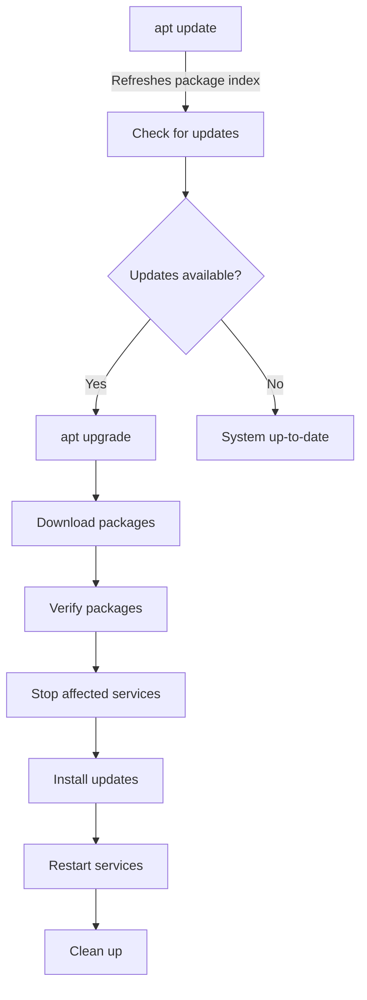

# Ubuntu Package Updating

## Introduction

Keeping your Ubuntu system updated is one of the most important maintenance tasks for ensuring security, stability, and access to the latest features. Ubuntu's package management system makes this process straightforward, but understanding the underlying concepts will help you maintain your system more effectively.

In this guide, we'll explore how package updates work in Ubuntu, the different types of updates available, and the various methods to keep your system current. This knowledge is essential for both beginners and those looking to deepen their understanding of Ubuntu's package ecosystem.

## Understanding Package Updates

### What is a Package Update?

A package update is a newer version of software that has been released to fix bugs, patch security vulnerabilities, or add new features to an existing application or library.

Ubuntu organizes software into packages that contain all the necessary files, dependencies, and installation instructions needed to install and run an application or system component.

### Types of Updates in Ubuntu

Ubuntu categorizes updates into several types:

1. **Security Updates**: Critical fixes for security vulnerabilities
2. **Bug Fixes**: Corrections for software issues and bugs
3. **Feature Updates**: New functionality and enhancements
4. **Distribution Upgrades**: Major version upgrades (e.g., Ubuntu 22.04 to 24.04)

## Basic Update Commands

### Updating the Package Index

Before installing updates, you need to refresh the package index:

```bash
sudo apt update
```

**Sample Output:**
```
Hit:1 http://archive.ubuntu.com/ubuntu jammy InRelease
Get:2 http://security.ubuntu.com/ubuntu jammy-security InRelease [110 kB]
Get:3 http://archive.ubuntu.com/ubuntu jammy-updates InRelease [119 kB]
...
Reading package lists... Done
Building dependency tree... Done
Reading state information... Done
25 packages can be upgraded. Run 'apt list --upgradable' to see them.
```

This command doesn't actually install updates; it just refreshes the list of available packages and their versions.

### Viewing Available Updates

To see what packages can be updated:

```bash
apt list --upgradable
```

**Sample Output:**
```
Listing... Done
firefox/jammy-security 115.0+build2-0ubuntu0.22.04.1 amd64 [upgradable from: 114.0+build3-0ubuntu0.22.04.1]
libreoffice-calc/jammy-updates 1:7.3.2-0ubuntu2 amd64 [upgradable from: 1:7.3.1-0ubuntu1]
...
```

### Installing Updates

To install all available updates:

```bash
sudo apt upgrade
```

This command will show you a summary of changes and ask for confirmation before proceeding.

For a safer approach that won't remove any packages:

```bash
sudo apt upgrade --without-new-pkgs
```

To update everything, including installing new dependencies and removing obsolete packages:

```bash
sudo apt full-upgrade
```
or the older equivalent:
```bash
sudo apt dist-upgrade
```

### Updating Specific Packages

To update just one package:

```bash
sudo apt install --only-upgrade package_name
```

For example, to update only Firefox:

```bash
sudo apt install --only-upgrade firefox
```

## The Update Process Explained

When you run `sudo apt upgrade`, the following steps happen:



1. The package manager calculates dependencies and identifies what needs to be updated
2. New packages are downloaded from Ubuntu repositories
3. Package integrity is verified
4. Running services affected by the update may be stopped
5. New packages are installed, replacing older versions
6. Affected services are restarted
7. Temporary files are cleaned up

## Automatic Updates

### Enabling Unattended Upgrades

Ubuntu can install important security updates automatically. To set this up:

1. Install the unattended-upgrades package:

```bash
sudo apt install unattended-upgrades
```

2. Configure it with:

```bash
sudo dpkg-reconfigure -plow unattended-upgrades
```

3. Select "Yes" when prompted to enable automatic updates.

### Customizing Automatic Updates

The main configuration file is located at `/etc/apt/apt.conf.d/50unattended-upgrades`.

To edit it:

```bash
sudo nano /etc/apt/apt.conf.d/50unattended-upgrades
```

Common settings you might want to adjust:

```
// Automatically reboot when needed
Unattended-Upgrade::Automatic-Reboot "true";

// Specify when to reboot
Unattended-Upgrade::Automatic-Reboot-Time "02:00";

// Which updates to install automatically
Unattended-Upgrade::Allowed-Origins {
    "${distro_id}:${distro_codename}-security";
    "${distro_id}:${distro_codename}-updates";
    // "${distro_id}:${distro_codename}-proposed"; // Uncomment for pre-release updates
};
```

## Update Management for Multiple Systems

For managing updates across multiple Ubuntu systems, consider these approaches:

### Using Landscape

Canonical offers Landscape, a systems management tool that can deploy updates across multiple Ubuntu systems:

1. Centralized update management
2. Scheduling of update windows
3. Compliance reporting

### Using Ansible for Updates

For a free, open-source solution, Ansible can automate updates:

```bash
# Example Ansible playbook for updating Ubuntu systems
- name: Update all Ubuntu servers
  hosts: ubuntu_servers
  become: yes
  tasks:
    - name: Update apt cache
      apt:
        update_cache: yes
        cache_valid_time: 3600

    - name: Upgrade all packages
      apt:
        upgrade: dist
        autoclean: yes
        autoremove: yes
```

## Best Practices for Package Updates

### Create a Update Schedule

Establish a regular update routine:
- Daily for security updates
- Weekly for regular system updates
- Monthly for larger feature updates

### Backup Before Major Updates

Always back up important data before major updates:

```bash
# Simple example of backing up home directory
sudo tar -czf /backup/home_backup_$(date +%Y%m%d).tar.gz /home
```

### Test Updates in Non-Production First

For critical systems, test updates in a development environment before applying them to production.

### Review Release Notes

Before installing major updates, review the release notes:
```bash
apt changelog package_name
```

## Troubleshooting Update Issues

### Fixing Failed Updates

If an update fails, try:

```bash
sudo apt clean
sudo apt update
sudo apt --fix-broken install
sudo apt upgrade
```

### Dealing with Held Packages

Sometimes packages may be "held back":

```bash
sudo apt full-upgrade
```

Or to upgrade a specific held package:

```bash
sudo apt install package_name
```

### Fixing Repository Issues

If you're having problems with a repository:

```bash
# Remove problematic repository
sudo add-apt-repository --remove ppa:repository-name/ppa

# Update and try again
sudo apt update
sudo apt upgrade
```

### Package Conflicts

When packages conflict, you may need to make a decision:

```bash
sudo apt install -f
```

This attempts to fix dependency issues automatically.

## Understanding Update Configuration Files

Key files that control update behavior:

1. `/etc/apt/sources.list` - Main repository list
2. `/etc/apt/sources.list.d/` - Additional repository configurations
3. `/etc/apt/apt.conf.d/` - APT behavior configurations
4. `/etc/apt/preferences.d/` - Package pinning preferences

Example of sources.list contents:

```
deb http://archive.ubuntu.com/ubuntu/ jammy main restricted
deb http://archive.ubuntu.com/ubuntu/ jammy-updates main restricted
deb http://security.ubuntu.com/ubuntu jammy-security main restricted
```

## Summary

Keeping Ubuntu systems updated is crucial for security, stability, and functionality. We've covered:

- The basics of package updates and types
- Essential commands for updating your system
- How to configure automatic updates
- Best practices for update management
- Troubleshooting common update issues

By following these guidelines and understanding the underlying concepts, you'll be able to maintain a healthy, secure, and up-to-date Ubuntu system.

## Additional Resources

- [Ubuntu Official Documentation on Package Management](https://help.ubuntu.com/community/AptGet/Howto)
- [Security Updates and Best Practices on Ubuntu](https://ubuntu.com/security)

## Exercises

1. **Basic Update Practice**: Update your system's package index and list what packages need updating.
2. **Selective Updates**: Try updating only a single package on your system.
3. **Automatic Updates**: Configure unattended-upgrades to automatically install security updates.
4. **Update Script**: Write a bash script that updates your system and logs the results to a file.
5. **Explore Changelog**: Use the `apt changelog` command to review recent changes to a package you frequently use.