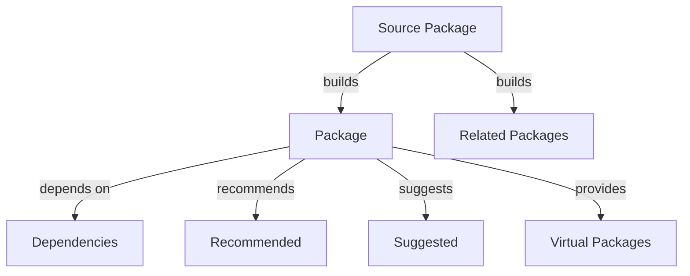

# Ubuntu Package Searching

## Introduction

Finding the right software packages is a crucial skill for any Ubuntu user. Whether you're looking for a specific application, library, or development tool, Ubuntu provides several powerful commands to search through its vast software repositories. In this guide, we'll explore various methods to search for packages in Ubuntu, understand the output of these commands, and learn how to make informed decisions about which packages to install.

## Why Package Searching Matters

Before diving into the commands, let's understand why efficient package searching is important:

- It helps you find the exact software you need
- It allows you to discover alternatives to a specific program
- It helps you verify if a package is available before attempting installation
- It provides information about package versions, descriptions, and dependencies

## Basic Package Searching with APT

The Advanced Package Tool (APT) is Ubuntu's primary package management system. Let's start with the most common search commands.

### Using `apt search`

The `apt search` command searches package names and descriptions for a given keyword:

```bash
apt search firefox
```

Sample output:
```
Sorting... Done
Full Text Search... Done
firefox/jammy-updates,jammy-security,now 114.0+build2-0ubuntu0.22.04.1 amd64 [installed]
  Safe and easy web browser from Mozilla

firefox-locale-en/jammy-updates,jammy-security,now 114.0+build2-0ubuntu0.22.04.1 amd64 [installed,automatic]
  English language pack for Firefox

...
```

The output shows matching packages with:
- Package name (before the slash)
- Distribution version/repository information
- Version number
- Architecture (amd64, i386, all, etc.)
- Installation status (if applicable)
- Short description

To search for an exact package name, use:

```bash
apt search --names-only firefox
```

This restricts the search to package names only, which is useful when you have a specific package in mind and want to filter out results that only mention your search term in the description.

### Using `apt-cache search`

The older `apt-cache search` command provides similar functionality:

```bash
apt-cache search text-editor
```

Sample output:
```
aee - easy-to-use screen-oriented text editor
bvi - binary file editor
e3 - very small editor
...
```

This command is still useful and often returns more concise results than `apt search`.

### Viewing Detailed Package Information

Once you've found an interesting package, you can get more information about it:

```bash
apt show vlc
```

Sample output:
```
Package: vlc
Version: 3.0.16-1build7
Priority: optional
Section: universe/video
Origin: Ubuntu
...
Description: multimedia player and streamer
 VLC is the VideoLAN project's media player. It plays MPEG, MPEG-2, MPEG-4,
 DivX, MOV, WMV, QuickTime, WebM, FLAC, MP3, Ogg/Vorbis files, DVDs, VCDs,
 podcasts, and multimedia streams from various network sources.
...
```

This provides comprehensive information including:
- Package version and priority
- Dependencies and recommended packages
- Detailed description
- Package size
- Maintainer information

## Advanced Package Searching

### Searching with Regular Expressions

Both `apt search` and `apt-cache search` support regular expressions:

```bash
apt search '^python3-'
```

This searches for all packages that start with "python3-".

### Finding Packages Providing a Specific File

If you need a package that provides a specific file, use the `apt-file` tool:

```bash
sudo apt install apt-file
sudo apt-file update
apt-file search /usr/bin/curl
```

Sample output:
```
curl: /usr/bin/curl
```

This is extremely useful when you encounter "command not found" errors and need to find which package provides that command.

### Using dpkg for Local Package Search

You can search through already installed packages with `dpkg`:

```bash
dpkg -l | grep ssh
```

Sample output:
```
ii  libssh-4:amd64                   0.9.6-2ubuntu0.22.04.1             amd64        tiny C SSH library (OpenSSL flavor)
ii  openssh-client                   1:8.9p1-3ubuntu0.1                 amd64        secure shell (SSH) client, for secure access to remote machines
ii  openssh-server                   1:8.9p1-3ubuntu0.1                 amd64        secure shell (SSH) server, for secure access from remote machines
ii  openssh-sftp-server              1:8.9p1-3ubuntu0.1                 amd64        secure shell (SSH) sftp server module, for SFTP access from remote machines
```

The `ii` at the beginning indicates that the package is installed.

## Using GUI Tools for Package Searching

For those who prefer graphical interfaces, Ubuntu offers several options:

### Ubuntu Software Center

The Ubuntu Software Center provides a user-friendly interface for searching and installing packages. You can access it from the Applications menu or by running:

```bash
software-center
```

### Synaptic Package Manager

Synaptic is a more advanced graphical package management tool:

```bash
sudo apt install synaptic
sudo synaptic
```

Synaptic offers powerful search capabilities, filtering options, and detailed package information.

## Practical Examples

Let's go through some real-world scenarios:

### Example 1: Finding a PDF Reader

Suppose you need a PDF reader but aren't sure which one to install:

```bash
apt search pdf viewer
```

From the results, you might decide to check the details of a specific package:

```bash
apt show evince
```

After reviewing the information, you can install your chosen package:

```bash
sudo apt install evince
```

### Example 2: Finding Development Libraries

If you're developing a program that needs to interface with MySQL:

```bash
apt search --names-only 'libmysql.*-dev'
```

This will show development packages related to MySQL.

### Example 3: Finding a Package for a Specific Command

If you try to run a command that isn't installed:

```bash
$ ffmpeg
Command 'ffmpeg' not found, but can be installed with:
sudo apt install ffmpeg
```

Ubuntu often suggests the package to install. If it doesn't, you can use:

```bash
apt-file search bin/ffmpeg
```

## Understanding Package Relationships

When searching for packages, it's helpful to understand how packages relate to each other:



You can view these relationships with:

```bash
apt-cache depends package-name
apt-cache rdepends package-name  # reverse dependencies
```

## Tips for Effective Package Searching

1. **Be specific** - Use precise terms to narrow your search
2. **Use multiple search terms** - Combine terms with spaces to find packages matching all terms
3. **Check package status** - Look for `[installed]` to see if a package is already installed
4. **Read descriptions carefully** - Many packages have similar names but different purposes
5. **Look at package popularity** - More popular packages often have better support
6. **Check package version** - Newer isn't always better, but outdated packages may lack features

## Summary

Ubuntu provides a robust set of tools for searching and finding software packages:
- `apt search` and `apt-cache search` for general package searching
- `apt show` and `apt-cache show` for detailed package information
- `apt-file` for finding which package provides a specific file
- `dpkg -l` for listing installed packages
- GUI tools like Ubuntu Software Center and Synaptic for visual browsing

Mastering these package searching techniques will help you efficiently find and install the software you need, troubleshoot dependency issues, and explore the vast ecosystem of Ubuntu software.

## Additional Resources

- [Ubuntu Package Management documentation](https://help.ubuntu.com/community/AptGet/Howto)
- [Debian Package Management Cheatsheet](https://wiki.debian.org/PackageManagement)
- Run `man apt` for detailed information on APT commands
- Run `man apt-file` for more information on searching for files

## Exercises

1. Search for packages that provide web servers. Compare the options and their descriptions.
2. Find all packages related to Python development for machine learning.
3. Install the `apt-file` tool and find which package provides the `convert` command.
4. Use regular expressions to find all packages that start with "lib" and contain "ssl".
5. Use the Synaptic Package Manager to explore packages by category and find a terminal emulator.