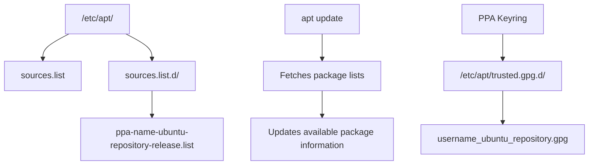

# Ubuntu PPA Management

## Introduction

Personal Package Archives (PPAs) are special software repositories designed for Ubuntu users. They allow developers and communities to distribute software that isn't available in the official Ubuntu repositories or to provide more recent versions than those officially packaged. This guide explains how PPAs work, how to add and manage them, and when it's appropriate to use them.

## What are PPAs?

PPAs (Personal Package Archives) are unofficial repositories hosted on Launchpad, Canonical's software collaboration platform. They provide a way for individuals or teams to make packages available to Ubuntu users outside of the official channels.

### Why PPAs exist:

- Distribute software not yet accepted into official repositories
- Provide newer versions of software than what's available in official repositories
- Test packages before they are submitted to the official repositories
- Distribute niche software with limited audience

A PPA has this general format: `ppa:<username>/<repository>`

## Adding a PPA Repository

Adding a PPA to your system involves using the `add-apt-repository` command. This will add the repository information and import the PPA's GPG key for package verification.

### Basic Syntax

```bash
sudo add-apt-repository ppa:username/repository
sudo apt update
```

### Example: Adding the Latest GIMP PPA

Let's add a PPA for the latest version of GIMP image editor:

```bash
# Add the PPA
sudo add-apt-repository ppa:otto-kesselgulasch/gimp

# Update package lists
sudo apt update

# Install GIMP
sudo apt install gimp
```

**Output:**
```
 GIMP (GNU Image Manipulation Program) is a free and open source advanced picture editor.
 You can use it to edit, enhance, and retouch photos and scans, create drawings, and make your own images.
 It has dozens of special-purpose tools and filters, including a clone brush, pencil, airbrush, selection tools, and bezier paths.
 It can read and write a large number of file formats, and has many powerful features.
 More info: https://launchpad.net/~otto-kesselgulasch/+archive/ubuntu/gimp
Press [ENTER] to continue or Ctrl+c to cancel adding it.

...

Hit:1 http://archive.ubuntu.com/ubuntu jammy InRelease
Get:2 http://archive.ubuntu.com/ubuntu jammy-updates InRelease [119 kB]
Get:3 http://ppa.launchpad.net/otto-kesselgulasch/gimp/ubuntu jammy InRelease [18.1 kB]
...
```

## Listing Installed PPAs

To see which PPAs are currently installed on your system, use one of these commands:

```bash
# List all repositories including PPAs
grep -r --include="*.list" "^deb " /etc/apt/sources.list /etc/apt/sources.list.d/

# Alternative: use apt-cache policy
apt-cache policy
```

**Example Output:**
```
/etc/apt/sources.list.d/otto-kesselgulasch-ubuntu-gimp-jammy.list:deb http://ppa.launchpad.net/otto-kesselgulasch/gimp/ubuntu jammy main
```

## Removing a PPA

There are two main ways to remove a PPA:

### Method 1: Using add-apt-repository

```bash
sudo add-apt-repository --remove ppa:username/repository
sudo apt update
```

### Method 2: Using ppa-purge

The `ppa-purge` tool not only removes the PPA but also downgrades any packages that were installed from it back to the official Ubuntu versions.

```bash
# Install ppa-purge
sudo apt install ppa-purge

# Remove a PPA and downgrade its packages
sudo ppa-purge ppa:username/repository
```

**Example: Removing the GIMP PPA:**
```bash
sudo ppa-purge ppa:otto-kesselgulasch/gimp
```

**Output:**
```
Updating packages lists
PPA to be removed: otto-kesselgulasch gimp
Warning: Could not find package list for PPA: otto-kesselgulasch gimp
Updating packages lists
PPA purged successfully
```

## Working with PPA Keys

Each PPA uses a GPG key to ensure package integrity. Sometimes you might need to manage these keys manually.

### Adding a Key Manually

```bash
# Import a PPA key from keyserver
sudo apt-key adv --keyserver keyserver.ubuntu.com --recv-keys KEY_ID
```

### Listing Keys

```bash
# List installed APT keys
sudo apt-key list
```

**Example Output:**
```
/etc/apt/trusted.gpg
--------------------
pub   rsa4096 2021-05-18 [SC] [expires: 2025-05-17]
      1234ABCD5678EFGH9012IJKL3456MNOP7890QRST
uid           [ unknown] Launchpad PPA for Otto Kesselgulasch
```

## Understanding PPA Structure

Let's understand how PPAs are organized in the system:



When you add a PPA, the system:
1. Creates a new list file in `/etc/apt/sources.list.d/`
2. Adds the repository's GPG key to your system's trusted keys
3. Updates the package database with `apt update`

## Best Practices for PPA Management

### When to Use PPAs

- When you need a newer version of software
- When you need software not available in official repositories
- When testing software before it's officially released

### PPA Safety Considerations

PPAs can introduce security and stability risks since they're not officially maintained by Ubuntu. Before adding a PPA, consider:

```bash
# Check the PPA's reputation by visiting its Launchpad page
# Example URL: https://launchpad.net/~username/+archive/ubuntu/repository

# Check how frequently the PPA is updated
# Check how many people use the PPA
# Review any reported issues
```

### Troubleshooting Common PPA Issues

#### GPG Key Errors

If you see "NO_PUBKEY" errors:

```bash
# Manually import the missing key
sudo apt-key adv --keyserver keyserver.ubuntu.com --recv-keys MISSING_KEY_ID
```

#### Repository Not Found

If a PPA cannot be found:

```bash
# Check if the PPA exists for your Ubuntu version
# Visit: https://launchpad.net/~username/+archive/ubuntu/repository
```

#### Conflicting Packages

When packages from different PPAs conflict:

```bash
# Use ppa-purge to remove the problematic PPA
sudo ppa-purge ppa:problematic/ppa
```

## Practical Examples

### Example 1: Installing the Latest Node.js

```bash
# Add Node.js repository
sudo add-apt-repository ppa:nodejs/node

# Update and install
sudo apt update
sudo apt install nodejs

# Verify installation
node --version
```

### Example 2: Adding a Development PPA for Testing

```bash
# Add a development PPA for a specific application
sudo add-apt-repository ppa:developer/application-dev

# Install the development version
sudo apt update
sudo apt install application-dev

# If problems occur, revert to stable version
sudo ppa-purge ppa:developer/application-dev
```

### Example 3: Managing Multiple PHP Versions

```bash
# Add PHP repository
sudo add-apt-repository ppa:ondrej/php

# Install multiple PHP versions
sudo apt update
sudo apt install php7.4 php8.0 php8.1

# Switch between PHP versions using update-alternatives
sudo update-alternatives --config php
```

## Creating Your Own PPA (Advanced)

For advanced users who want to create their own PPA:

1. Create a Launchpad account and set up GPG keys
2. Build your package using the Debian packaging system
3. Upload your package to your PPA

```bash
# Example: Building a package
debuild -S -sa

# Example: Uploading to PPA
dput ppa:yourusername/yourrepository ../yourpackage_version_source.changes
```

## Summary

PPAs are a powerful feature of Ubuntu's package management system that give you access to software not available in the official repositories. In this guide, you've learned:

- What PPAs are and why they're useful
- How to add, list, and remove PPAs
- How to manage PPA keys
- Best practices for PPA usage
- Practical examples of common PPA usage
- Advanced topics like creating your own PPA

By mastering PPA management, you gain flexibility in managing software on your Ubuntu system, allowing you to access the latest software versions while maintaining system integrity.

## Additional Resources

- [Launchpad PPA Documentation](https://help.launchpad.net/Packaging/PPA)
- [Ubuntu Community Help: PPAs](https://help.ubuntu.com/community/PPA)
- [Debian Packaging Guide](https://www.debian.org/doc/manuals/packaging-tutorial/packaging-tutorial.en.pdf)

## Exercises

1. Add a PPA for a text editor of your choice, install the software, then remove the PPA using `ppa-purge`.
2. List all PPAs currently installed on your system and investigate what each one provides.
3. Find three software packages that benefit from using PPAs instead of the official repositories. Compare the version differences.
4. Practice troubleshooting by intentionally adding a non-existent PPA and resolving the resulting errors.
5. Research and document the process of creating a simple PPA for a basic application.