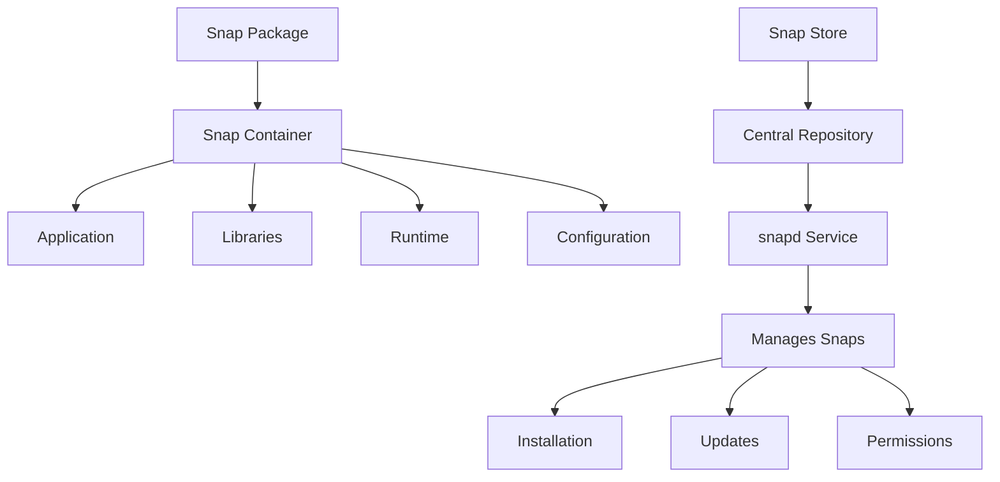

# Ubuntu Snap Packages

## Introduction

Snap packages (or simply "snaps") represent a modern approach to package management in Ubuntu and other Linux distributions. Developed by Canonical, snaps are self-contained applications that include their dependencies and run in an isolated environment. This isolation makes them more secure and allows them to work consistently across different Linux distributions.

In this guide, we'll explore how snap packages work, how they differ from traditional package management methods, and how to use them effectively in your Ubuntu system.

## What Are Snap Packages?

Snaps are containerized software packages designed to be secure, sandboxed, and distribution-agnostic. Each snap is isolated from the rest of your system, running in a controlled environment that limits its access to your files and system resources.

Key characteristics of snap packages include:

- **Self-contained**: Each snap includes most of the libraries and runtime components it needs
- **Auto-updating**: Snaps update automatically in the background
- **Sandboxed**: Applications run in isolation for improved security
- **Consistent across distributions**: The same snap works on Ubuntu, Debian, Fedora, and other Linux distributions
- **Rollback support**: You can revert to previous versions if needed

## How Snap Packages Work

Snaps use a different approach to software installation compared to traditional package managers like APT. Let's look at how snap packages work under the hood:



1. **snapd**: The core technology behind snaps is a daemon called `snapd`, which runs in the background and manages all aspects of snap packages.

2. **Confinement**: Snaps run in a sandbox with limited access to the system through well-defined interfaces.

3. **Channels**: Snaps use channels (stable, candidate, beta, edge) to control which version you receive.

4. **Snap Store**: A centralized repository where developers publish their snap packages.

## Installing and Using Snap

### Prerequisites

Most modern Ubuntu versions come with snap pre-installed. If you're using an older version or a different distribution, you might need to install it:

```bash
sudo apt update
sudo apt install snapd
```

### Basic Snap Commands

#### Installing a Snap Package

```bash
sudo snap install vlc
```

**Output:**
```
vlc 3.0.18 from VideoLAN✓ installed
```

#### Listing Installed Snaps

```bash
snap list
```

**Output:**
```
Name    Version    Rev    Tracking    Publisher    Notes
core    16-2.58.2  14447  latest/stable  canonical✓  core
snapd   2.58.2     17883  latest/stable  canonical✓  snapd
vlc     3.0.18     2344   latest/stable  videolan✓   -
```

#### Finding Available Snaps

You can search for available snaps using the following command:

```bash
snap find text-editor
```

**Output:**
```
Name               Version    Publisher    Notes    Summary
sublime-text       4.0.0      sublime-text  classic  Text editing for code, markup and prose
atom               1.60.0     snapcrafters  classic  A hackable text editor for the 21st Century
code               1.74.3     vscode✓       classic  Code editing. Redefined.
```

#### Updating a Snap

Snaps update automatically by default, but you can manually update them:

```bash
sudo snap refresh vlc
```

**Output:**
```
snap "vlc" has no updates available
```

#### Removing a Snap

```bash
sudo snap remove vlc
```

**Output:**
```
vlc removed
```

## Understanding Snap Interfaces

Snap interfaces define how a snap can interact with the system or other snaps. They control permissions and access to resources.

To see available interfaces:

```bash
snap interfaces
```

To connect an interface to a snap:

```bash
sudo snap connect vlc:removable-media
```

This gives VLC access to removable media devices.

## Working with Snap Channels

Snap packages use channels to specify different release tracks:

- **stable**: Well-tested, production-ready releases
- **candidate**: Release candidates ready for final testing
- **beta**: Newer features, might have some issues
- **edge**: Latest development versions

To install from a specific channel:

```bash
sudo snap install vlc --channel=beta
```

To switch channels for an installed snap:

```bash
sudo snap refresh vlc --channel=stable
```

## Creating Your First Snap Package

For developers, creating a snap package is relatively straightforward. Here's a simple example for a Python application:

1. First, install `snapcraft`:

```bash
sudo snap install snapcraft --classic
```

2. Create a new directory for your snap:

```bash
mkdir my-python-app
cd my-python-app
```

3. Initialize a new snapcraft project:

```bash
snapcraft init
```

4. Edit the generated `snapcraft.yaml` file:

```yaml
name: my-python-app
base: core22
version: '0.1'
summary: My first Python snap
description: |
  This is a simple Python application packaged as a snap.

grade: devel
confinement: strict

parts:
  my-python-app:
    plugin: python
    source: .
    python-packages:
      - flask

apps:
  my-python-app:
    command: bin/python3 -m flask run --host=0.0.0.0
    daemon: simple
    plugs:
      - network
      - network-bind
```

5. Add a simple Flask application in a file named `app.py`:

```python
from flask import Flask

app = Flask(__name__)

@app.route('/')
def hello():
    return "Hello from my snap package!"

if __name__ == '__main__':
    app.run(host='0.0.0.0')
```

6. Build your snap:

```bash
snapcraft
```

7. Install your local snap:

```bash
sudo snap install my-python-app_0.1_amd64.snap --dangerous
```

## Advantages of Snap Packages

1. **Security**: Applications run in isolated environments with limited access to system resources.

2. **Simplicity**: Dependency conflicts are eliminated since each snap contains its own libraries.

3. **Up-to-date software**: Snaps receive updates directly from developers without waiting for distribution repositories.

4. **Transactional updates**: If an update fails, the system automatically rolls back to the previous working version.

5. **Cross-distribution compatibility**: The same snap package works on Ubuntu, Debian, Fedora, and many other Linux distributions.

## Disadvantages of Snap Packages

1. **Larger size**: Snaps can be larger than traditional packages because they include dependencies.

2. **Slower startup**: First-time launches might be slower due to the containerization.

3. **Resource usage**: Running multiple snaps can consume more memory since libraries aren't shared.

4. **Limited filesystem access**: By default, snaps have restricted access to the filesystem.

## Snap vs. Traditional Package Management

Here's a comparison between snap and traditional package management:

| Feature | Snap | APT (Traditional) |
|---------|------|-------------------|
| Package format | Self-contained | Dependency-based |
| Updates | Automatic | Manual or scheduled |
| Rollbacks | Built-in | Limited |
| Security | Sandboxed | System-integrated |
| Size | Larger | Smaller |
| Startup speed | Slower | Faster |
| Distribution support | Cross-distribution | Distribution-specific |
| Installation source | Snap Store | Distribution repositories |

## Practical Examples

### Example 1: Installing and Using a Productivity Application

Let's install the Slack communication tool:

```bash
sudo snap install slack
```

After installation, you can launch it from your applications menu or run:

```bash
slack
```

### Example 2: Installing a Development Environment

Install Visual Studio Code with snap:

```bash
sudo snap install code --classic
```

The `--classic` flag gives the application full access to the system, which is necessary for some development tools.

### Example 3: Managing Multiple Versions

With snap, you can have multiple versions of an application installed:

```bash
sudo snap install node --channel=14/stable
sudo snap install node --channel=16/stable --classic
```

Switch between versions using:

```bash
sudo snap refresh node --channel=14/stable
```

## Troubleshooting Snap Packages

### Problem: Snap Package Won't Install

If you encounter errors during installation, try:

```bash
sudo snap install package-name --dangerous
```

### Problem: Snap Has No Access to Files

Connect the snap to your home directory:

```bash
sudo snap connect application-name:home
```

### Problem: Outdated Snap

Force a refresh of all snaps:

```bash
sudo snap refresh
```

## Summary

Snap packages represent a modern approach to software distribution in Ubuntu and other Linux distributions. They offer improved security through isolation, automatic updates, and cross-distribution compatibility. While they have some drawbacks like larger size and slightly slower startup, the benefits often outweigh these limitations for many use cases.

As a Ubuntu user, understanding how to work with snap packages is essential, as more applications are becoming available in this format. Snaps coexist perfectly with traditional package management systems, giving you the flexibility to choose the right approach for each application.

## Additional Resources

- [Official Snap Documentation](https://snapcraft.io/docs)
- [Ubuntu Snap Store](https://snapcraft.io/store)
- [Snapcraft Developer Guide](https://snapcraft.io/docs/snapcraft-overview)

## Exercises

1. Install three different applications using snap and compare their performance to APT-installed equivalents.

2. Create a simple snap package for a basic script or application you've written.

3. Experiment with different snap channels for an application like Firefox or Chromium.

4. Explore snap interfaces and try connecting and disconnecting various permissions to see how they affect application behavior.

5. Set up a development environment using only snap packages.