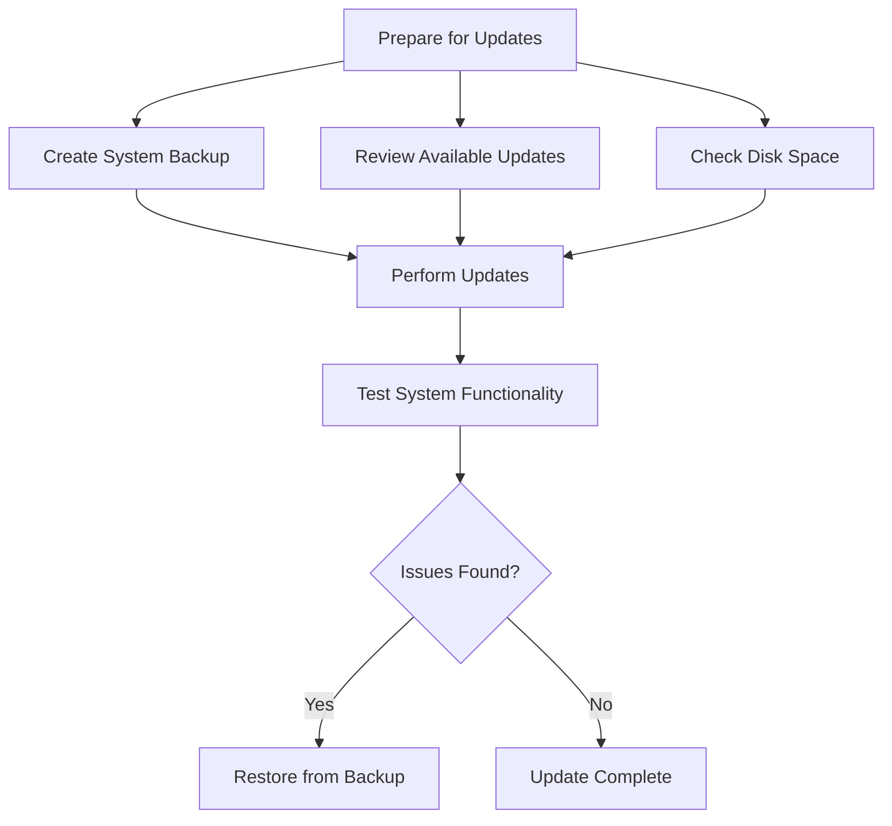

# Ubuntu System Updates

## Introduction

Keeping your Ubuntu system up-to-date is one of the most important responsibilities of a system administrator. Regular updates ensure your system remains secure, stable, and equipped with the latest features. This guide will walk you through understanding Ubuntu's update mechanisms, performing updates through various methods, and establishing best practices for system maintenance.

Ubuntu uses the Advanced Package Tool (APT) system for package management. This robust system handles dependencies, installations, removals, and updates of software packages, making system maintenance relatively straightforward compared to some other operating systems.

## Understanding Ubuntu Package Management

Before diving into updates, it's essential to understand how Ubuntu organizes software:

### Package Repositories

Ubuntu software is distributed through repositories - collections of packages maintained by Ubuntu developers and the community. The main repository types include:

- **Main**: Officially supported, open-source software maintained by Canonical
- **Universe**: Community-maintained open-source software
- **Restricted**: Proprietary drivers for devices
- **Multiverse**: Software with legal or copyright restrictions
- **Backports**: Newer versions of packages from future Ubuntu releases
- **Security**: Critical security updates
- **Updates**: Recommended updates and bug fixes

### APT Package Manager

The APT (Advanced Package Tool) is the core of Ubuntu's package management system, with several front-end tools:

- `apt`: Modern, user-friendly command-line tool
- `apt-get`: Traditional command-line tool
- `apt-cache`: Package information querying tool
- `dpkg`: Low-level package manager
- Software Center/Software Updater: Graphical interfaces

## Checking for Updates

Before applying updates, you should check what updates are available for your system.

### Using Command Line

To update the package lists from repositories:

```bash
sudo apt update
```

This command doesn't install anything; it merely retrieves the latest information about available packages and their versions.

Example output:
```
Hit:1 http://archive.ubuntu.com/ubuntu jammy InRelease
Get:2 http://security.ubuntu.com/ubuntu jammy-security InRelease [110 kB]
Get:3 http://archive.ubuntu.com/ubuntu jammy-updates InRelease [119 kB]
Get:4 http://archive.ubuntu.com/ubuntu jammy-backports InRelease [108 kB]
Get:5 http://security.ubuntu.com/ubuntu jammy-security/main amd64 Packages [1,045 kB]
Get:6 http://archive.ubuntu.com/ubuntu jammy-updates/main amd64 Packages [1,265 kB]
Fetched 2,647 kB in 3s (882 kB/s)
Reading package lists... Done
Building dependency tree... Done
Reading state information... Done
65 packages can be upgraded. Run 'apt list --upgradable' to see them.
```

To see which packages can be upgraded:

```bash
apt list --upgradable
```

Example output:
```
Listing... Done
firefox/jammy-security 112.0+build1-0ubuntu0.22.04.1 amd64 [upgradable from: 111.0.1+build1-0ubuntu0.22.04.1]
libreoffice-calc/jammy-updates 1:7.3.7-0ubuntu0.22.04.2 amd64 [upgradable from: 1:7.3.6-0ubuntu0.22.04.1]
openssh-client/jammy-security 1:8.9p1-3ubuntu0.4 amd64 [upgradable from: 1:8.9p1-3ubuntu0.3]
...
```

### Using Graphical Interface

Ubuntu provides a graphical Software Updater:

1. Open the "Software Updater" application from your applications menu
2. Click "Check for updates"
3. The tool will scan your system and show available updates

## Installing Updates

After checking for available updates, you can proceed to install them.

### Command Line Updates

To upgrade all packages to their latest versions:

```bash
sudo apt upgrade
```

This will prompt you to confirm before proceeding.

For a safer approach that doesn't remove any packages:

```bash
sudo apt upgrade --without-new-pkgs
```

To upgrade packages and handle complex dependencies (may add or remove packages):

```bash
sudo apt full-upgrade
```

or the older equivalent:

```bash
sudo apt-get dist-upgrade
```

Example output of an upgrade operation:
```
Reading package lists... Done
Building dependency tree... Done
Reading state information... Done
Calculating upgrade... Done
The following packages will be upgraded:
  firefox firefox-locale-en libreoffice-calc openssh-client
4 upgraded, 0 newly installed, 0 to remove and 0 not upgraded.
Need to get 68.7 MB of archives.
After this operation, 213 kB of additional disk space will be used.
Do you want to continue? [Y/n] y
Get:1 http://security.ubuntu.com/ubuntu jammy-security/main amd64 firefox amd64 112.0+build1-0ubuntu0.22.04.1 [57.5 MB]
...
```

### Upgrading Specific Packages

To upgrade only specific packages:

```bash
sudo apt install package-name
```

This will upgrade the package if it's already installed or install it if it's not.

### Automating Updates

For servers or systems requiring automatic updates, Ubuntu provides the `unattended-upgrades` package:

```bash
sudo apt install unattended-upgrades
```

Configure it by editing `/etc/apt/apt.conf.d/50unattended-upgrades`.

Basic configuration to enable security updates automatically:

```bash
sudo dpkg-reconfigure -plow unattended-upgrades
```

## Understanding Update Types

Ubuntu updates are categorized by their importance and potential impact:

### Security Updates

Critical for system security, these fix vulnerabilities and should be applied promptly.

### Bug Fixes

These address software issues but aren't critical from a security perspective.

### Feature Updates

Add new capabilities to existing software.

### Distribution Upgrades

These are major updates that move your system to a newer Ubuntu release (e.g., from 20.04 LTS to 22.04 LTS).

## Distribution Upgrades

Ubuntu releases new versions regularly:

- Regular releases: Every 6 months, supported for 9 months
- LTS (Long-Term Support) releases: Every 2 years, supported for 5 years

To upgrade to a new release version:

For graphical upgrade:
```bash
update-manager
```

For command-line upgrade:
```bash
sudo do-release-upgrade
```

For upgrading to development releases:
```bash
sudo do-release-upgrade -d
```

## Best Practices for System Updates

### 1. Regular Update Schedule

Establish a regular update routine:
- Daily or weekly for security updates
- Monthly for general updates
- Plan for distribution upgrades when current version approaches end-of-life

### 2. Pre-Update Preparations



- Always back up important data before major updates
- Check disk space: `df -h`
- Review what will be updated before confirming
- Schedule updates during low-usage periods

### 3. Post-Update Verification

After updating:

```bash
# Check system status
systemctl status

# Check if reboot is required
[ -f /var/run/reboot-required ] && echo "Reboot required" || echo "No reboot needed"

# Verify no broken packages
sudo apt-get check
```

### 4. Handling Failed Updates

If an update fails:

```bash
# Fix broken packages
sudo apt --fix-broken install

# Reconfigure packages
sudo dpkg --configure -a

# Clean APT cache and try again
sudo apt clean
sudo apt update
```

## Common Update Commands Reference

Here's a quick reference for the most commonly used update commands:

| Command | Function |
|---------|----------|
| `sudo apt update` | Update package lists |
| `sudo apt upgrade` | Install available updates |
| `sudo apt full-upgrade` | Upgrade with dependency handling |
| `sudo apt install [package]` | Install/upgrade specific package |
| `sudo apt autoremove` | Remove unneeded packages |
| `sudo apt clean` | Clean package cache |
| `do-release-upgrade` | Upgrade to new Ubuntu version |

## Real-World Scenarios

### Scenario 1: Regular Maintenance for a Web Server

For a production web server, you might use this maintenance routine:

```bash
#!/bin/bash
# Server update script
# Log file for update records
LOG_FILE="/var/log/system-updates.log"

echo "Update started at $(date)" >> $LOG_FILE

# Update package lists
sudo apt update >> $LOG_FILE 2>&1

# Install security updates only
sudo apt upgrade -y -o Dpkg::Options::="--force-confdef" -o Dpkg::Options::="--force-confold" >> $LOG_FILE 2>&1

# Check if reboot is needed
if [ -f /var/run/reboot-required ]; then
    echo "Reboot required. Scheduling reboot for midnight." >> $LOG_FILE
    sudo shutdown -r 00:00
else
    echo "No reboot required." >> $LOG_FILE
fi

echo "Update completed at $(date)" >> $LOG_FILE
```

### Scenario 2: Updating a Development Environment

For a development machine, you might want to update more aggressively:

```bash
# Update package lists
sudo apt update

# Full upgrade including new packages
sudo apt full-upgrade

# Clean up unused packages
sudo apt autoremove

# Clean package cache
sudo apt clean
```

### Scenario 3: Minimal System Downtime

When system availability is critical:

```bash
# Install unattended-upgrades for automatic security updates
sudo apt install unattended-upgrades

# Configure for security updates only
sudo nano /etc/apt/apt.conf.d/50unattended-upgrades

# Enable automatic updates
sudo dpkg-reconfigure -plow unattended-upgrades

# Use live patching for kernel updates
sudo snap install canonical-livepatch
sudo canonical-livepatch enable YOUR_TOKEN_HERE
```

## Troubleshooting Update Issues

### Package Locks

If you encounter "Could not get lock" errors:

```bash
# Check what process is using apt
ps aux | grep -i apt

# Remove lock files (only if necessary)
sudo rm /var/lib/apt/lists/lock
sudo rm /var/lib/dpkg/lock
sudo rm /var/lib/dpkg/lock-frontend
```

### Failed Dependencies

For dependency issues:

```bash
# Fix broken dependencies
sudo apt --fix-broken install

# Force package configuration
sudo dpkg --configure -a
```

### Repository Issues

If repository updates fail:

```bash
# Test connectivity to repositories
ping archive.ubuntu.com

# Try switching to a different mirror
sudo nano /etc/apt/sources.list
```

## Summary

Keeping Ubuntu systems updated is a critical aspect of system administration that ensures security, stability, and access to new features. By understanding package management concepts, mastering update commands, and implementing best practices, you can maintain a healthy system with minimal downtime.

Regular updates should be part of your routine system maintenance. For mission-critical systems, consider implementing automated security updates while carefully planning larger upgrades during maintenance windows.

## Additional Resources

- [Ubuntu Server Guide - Package Management](https://ubuntu.com/server/docs)
- [APT Command Handbook](https://www.debian.org/doc/manuals/apt-guide/)
- [Ubuntu Security Notices](https://ubuntu.com/security/notices)

## Exercises

1. Set up a testing environment using a virtual machine and practice performing system updates.
2. Create a shell script to automate your update routine with logging.
3. Configure `unattended-upgrades` to automatically install security updates on your system.
4. Practice recovering from a simulated failed update using a recovery shell.
5. Research and list the differences between update mechanisms in Ubuntu and another Linux distribution.