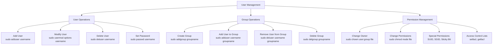

# Ubuntu User Management

## Introduction

User management is a fundamental aspect of system administration in Ubuntu and other Linux distributions. It involves creating and managing user accounts, organizing users into groups, and controlling access to system resources through permissions. Effective user management is crucial for maintaining system security, organizing access levels, and ensuring that users can only perform actions appropriate to their roles.

In this guide, we'll explore the essential concepts and commands for Ubuntu user management, providing practical examples that you can apply in real-world scenarios.

## Understanding Users and Groups in Ubuntu

### What are Users?

In Ubuntu, a user is an entity that can log into the system and perform operations. Each user has:

- A unique username
- A unique user ID (UID)
- A home directory (usually `/home/username`)
- A default shell (often `/bin/bash`)
- Membership in one or more groups

Users can be:
- **Regular users**: Normal accounts for people using the system
- **System users**: Special accounts used by services and applications
- **Root user**: The superuser account with unrestricted privileges

### What are Groups?

Groups are collections of users that share the same access permissions to files and resources. Each group has:

- A unique group name
- A unique group ID (GID)
- A list of members (users)

Groups help simplify permission management by allowing you to assign permissions to multiple users at once.

## Viewing User and Group Information

### Viewing Currently Logged-in Users

To see who is currently logged into the system:

```bash
who
```

Example output:
```
john     tty1         2023-03-10 09:15
sarah    pts/0        2023-03-10 10:22 (192.168.1.5)
robert   pts/1        2023-03-10 11:05 (192.168.1.10)
```

For more detailed information:

```bash
w
```

Example output:
```
 10:30:25 up  1:43,  3 users,  load average: 0.08, 0.15, 0.10
USER     TTY      FROM             LOGIN@   IDLE   JCPU   PCPU WHAT
john     tty1                      09:15    1:10m  0.05s  0.05s -bash
sarah    pts/0    192.168.1.5      10:22    3.00s  0.15s  0.06s top
robert   pts/1    192.168.1.10     11:05    0.00s  0.06s  0.03s w
```

### Viewing User Information

To view information about a specific user:

```bash
id username
```

Example:
```bash
id john
```

Output:
```
uid=1000(john) gid=1000(john) groups=1000(john),4(adm),24(cdrom),27(sudo),30(dip),46(plugdev)
```

To see user account details:

```bash
getent passwd username
```

Example:
```bash
getent passwd john
```

Output:
```
john:x:1000:1000:John Smith,,,:/home/john:/bin/bash
```

The output fields are delimited by colons in this order:
1. Username
2. Password indicator (x means it's stored in `/etc/shadow`)
3. UID
4. GID
5. User info/comments
6. Home directory
7. Default shell

### Viewing Group Information

To see all groups a user belongs to:

```bash
groups username
```

Example:
```bash
groups john
```

Output:
```
john : john adm cdrom sudo dip plugdev
```

To view detailed group information:

```bash
getent group groupname
```

Example:
```bash
getent group sudo
```

Output:
```
sudo:x:27:john,sarah
```

The fields are:
1. Group name
2. Password indicator
3. GID
4. List of members

## Creating and Managing Users

### Adding a New User

To create a new user:

```bash
sudo adduser username
```

Example:
```bash
sudo adduser alex
```

This command:
1. Creates a home directory
2. Copies the default files from `/etc/skel/`
3. Prompts for password and user information
4. Creates a corresponding primary group

Example output:
```
Adding user `alex' ...
Adding new group `alex' (1003) ...
Adding new user `alex' (1003) with group `alex' ...
Creating home directory `/home/alex' ...
Copying files from `/etc/skel' ...
New password: 
Retype new password: 
passwd: password updated successfully
Changing the user information for alex
Enter the new value, or press ENTER for the default
    Full Name []: Alex Johnson
    Room Number []: 
    Work Phone []: 
    Home Phone []: 
    Other []: 
Is the information correct? [Y/n] Y
```

For more control, you can use the lower-level `useradd` command:

```bash
sudo useradd -m -d /home/alex -s /bin/bash -g developers -G sudo,adm alex
```

This creates a user named "alex" with:
- `-m`: Creates a home directory
- `-d`: Sets the home directory path
- `-s`: Sets the default shell
- `-g`: Sets the primary group
- `-G`: Adds additional groups

### Setting or Changing Passwords

To set or change a user's password:

```bash
sudo passwd username
```

Example:
```bash
sudo passwd alex
```

Output:
```
New password: 
Retype new password: 
passwd: password updated successfully
```

Users can change their own passwords by simply running:

```bash
passwd
```

### Modifying User Accounts

To modify an existing user account:

```bash
sudo usermod [options] username
```

Common options:
- `-c`: Change user information/comment
- `-d`: Change home directory
- `-g`: Change primary group
- `-G`: Replace all secondary groups
- `-a -G`: Append to secondary groups
- `-s`: Change default shell
- `-L`: Lock the account
- `-U`: Unlock the account

Examples:

Add user to a group:
```bash
sudo usermod -a -G sudo alex
```

Change default shell:
```bash
sudo usermod -s /bin/zsh alex
```

Change home directory:
```bash
sudo usermod -d /home/new_home alex
```

### Deleting User Accounts

To delete a user account:

```bash
sudo deluser username
```

Example:
```bash
sudo deluser alex
```

To delete the user's home directory and mail spool as well:

```bash
sudo deluser --remove-home username
```

For complete removal including all files owned by the user:

```bash
sudo deluser --remove-all-files username
```

## Managing Groups

### Creating Groups

To create a new group:

```bash
sudo addgroup groupname
```

Example:
```bash
sudo addgroup developers
```

Output:
```
Adding group `developers' (GID 1004) ...
Done.
```

### Adding Users to Groups

To add an existing user to a group:

```bash
sudo adduser username groupname
```

Example:
```bash
sudo adduser john developers
```

Output:
```
Adding user `john' to group `developers' ...
Adding user john to group developers
Done.
```

Alternatively, you can use:

```bash
sudo usermod -a -G groupname username
```

Example:
```bash
sudo usermod -a -G developers sarah
```

### Removing Users from Groups

To remove a user from a group:

```bash
sudo deluser username groupname
```

Example:
```bash
sudo deluser john developers
```

Output:
```
Removing user `john' from group `developers' ...
Done.
```

### Deleting Groups

To delete a group:

```bash
sudo delgroup groupname
```

Example:
```bash
sudo delgroup developers
```

Output:
```
Removing group `developers' ...
Done.
```

## Understanding and Managing Permissions

### Basic Permissions Concepts

In Ubuntu, every file and directory has three permission categories:
- **Owner**: The user who owns the file
- **Group**: The group associated with the file
- **Others**: Everyone else

Each category can have three permission types:
- **Read (r)**: View file contents or list directory contents
- **Write (w)**: Modify file contents or create/delete files in a directory
- **Execute (x)**: Run a file as a program or access files within a directory

### Viewing Permissions

To view file permissions:

```bash
ls -l filename
```

Example:
```bash
ls -l /etc/passwd
```

Output:
```
-rw-r--r-- 1 root root 2635 Feb 15 12:30 /etc/passwd
```

The first 10 characters represent:
- Position 1: File type (- for regular file, d for directory)
- Positions 2-4: Owner permissions (rwx)
- Positions 5-7: Group permissions (rwx)
- Positions 8-10: Others permissions (rwx)

### Changing File Ownership

To change the owner of a file or directory:

```bash
sudo chown username:groupname filename
```

Example:
```bash
sudo chown john:developers project.txt
```

To change ownership recursively for directories:

```bash
sudo chown -R username:groupname directory
```

Example:
```bash
sudo chown -R john:developers /home/john/projects
```

### Changing File Permissions

#### Using chmod with Symbolic Mode

```bash
chmod [who][operation][permissions] filename
```

- **who**: u (user/owner), g (group), o (others), a (all)
- **operation**: + (add), - (remove), = (set)
- **permissions**: r (read), w (write), x (execute)

Examples:

Add execute permission for the owner:
```bash
chmod u+x script.sh
```

Remove write permission from others:
```bash
chmod o-w file.txt
```

Set read and write for owner, read-only for group and others:
```bash
chmod u=rw,go=r file.txt
```

#### Using chmod with Numeric Mode

```bash
chmod [mode] filename
```

Where mode is a 3-digit number:
- First digit: Owner permissions
- Second digit: Group permissions
- Third digit: Others permissions

Each permission has a value:
- Read (r) = 4
- Write (w) = 2
- Execute (x) = 1

Add them together to get the desired permission level.

Examples:

Give full permissions to owner, read/execute to group and others:
```bash
chmod 755 script.sh
```
(7=4+2+1 for owner, 5=4+1 for group, 5=4+1 for others)

Give read/write to owner, read-only to group and others:
```bash
chmod 644 file.txt
```
(6=4+2 for owner, 4 for group, 4 for others)

## Special Permissions and Attributes

### SUID, SGID, and Sticky Bit

Ubuntu has three special permissions:

1. **SUID (Set User ID)**: When applied to an executable file, it runs with the permissions of the file owner instead of the user executing it.

2. **SGID (Set Group ID)**: 
   - When applied to an executable file, it runs with the permissions of the file's group.
   - When applied to a directory, new files created within it inherit the directory's group.

3. **Sticky Bit**: When applied to a directory, users can only delete files they own, even if they have write permissions for the directory.

Setting these special permissions:

```bash
# SUID
chmod u+s filename
# or
chmod 4XXX filename

# SGID
chmod g+s filename
# or
chmod 2XXX filename

# Sticky Bit
chmod +t directory
# or
chmod 1XXX directory
```

Examples:

Set SUID on a file:
```bash
chmod u+s /usr/bin/program
```

Set SGID on a directory:
```bash
chmod g+s /shared/projects
```

Set sticky bit on a directory:
```bash
chmod +t /shared/uploads
```

## User Management Files

Ubuntu stores user and group information in several key files:

1. `/etc/passwd`: Contains basic user information (username, UID, GID, home directory, shell)
2. `/etc/shadow`: Stores encrypted passwords and password expiry information
3. `/etc/group`: Contains group information
4. `/etc/gshadow`: Stores encrypted group passwords
5. `/etc/sudoers`: Defines which users can run commands with sudo
6. `/etc/login.defs`: Default settings for user and password creation

### Editing the sudoers File

To safely edit the sudoers file:

```bash
sudo visudo
```

Example entry to give a user sudo privileges:
```
username ALL=(ALL:ALL) ALL
```

Example entry to give a group sudo privileges:
```
%groupname ALL=(ALL:ALL) ALL
```

Example to allow a user to run specific commands without a password:
```
username ALL=(ALL) NOPASSWD: /bin/mount, /bin/umount
```

## Advanced User Management

### Setting User Limits

You can control resource usage by configuring limits in `/etc/security/limits.conf`:

```bash
sudo nano /etc/security/limits.conf
```

Example entries:
```
# Limit maximum number of processes
john          soft    nproc           1024
john          hard    nproc           2048

# Limit maximum file size
@developers   soft    fsize           10485760
@developers   hard    fsize           104857600
```

### Password Policies

To set password expiration policies:

```bash
sudo chage [options] username
```

Common options:
- `-l`: List a user's password expiry information
- `-d`: Set last password change date
- `-m`: Set minimum days between password changes
- `-M`: Set maximum days a password remains valid
- `-W`: Set days before expiry to warn the user
- `-I`: Set days after expiry until account is locked
- `-E`: Set account expiry date

Example:
```bash
sudo chage -M 90 -W 7 john
```
This sets the password to expire in 90 days with a warning 7 days before expiry.

To view current settings:
```bash
sudo chage -l john
```

Output:
```
Last password change                                : Mar 10, 2023
Password expires                                    : Jun 08, 2023
Password inactive                                   : never
Account expires                                     : never
Minimum number of days between password change      : 0
Maximum number of days between password change      : 90
Number of days of warning before password expires   : 7
```

## Practical Examples

### Scenario 1: Setting Up a Shared Directory

Create a shared directory for a development team:

```bash
# Create a group for developers
sudo addgroup developers

# Add users to the group
sudo usermod -a -G developers john
sudo usermod -a -G developers sarah
sudo usermod -a -G developers alex

# Create a shared directory
sudo mkdir -p /shared/projects

# Set ownership and permissions
sudo chown root:developers /shared/projects
sudo chmod 2775 /shared/projects
```

This setup:
- Creates a "developers" group
- Adds three users to the group
- Creates a shared directory
- Sets the group to "developers" with SGID (2) so that new files inherit the group
- Sets permissions so group members can read, write, and access the directory (775)

### Scenario 2: Creating a Service User

Create a user for running a web service:

```bash
# Create a system user with no home directory and no login shell
sudo useradd --system --no-create-home --shell /usr/sbin/nologin webservice

# Create the service directory
sudo mkdir -p /var/www/myapp

# Set appropriate ownership
sudo chown -R webservice:webservice /var/www/myapp

# Set permissions
sudo chmod -R 750 /var/www/myapp
```

This setup:
- Creates a system user (not intended for login)
- Creates a directory for the web application
- Sets appropriate ownership and permissions

### Scenario 3: Temporary Contractor Access

Grant temporary access to a contractor:

```bash
# Create user with expiry date
sudo adduser contractor

# Set account expiration (expires on December 31, 2023)
sudo chage -E 2023-12-31 contractor

# Add to appropriate groups
sudo usermod -a -G projects contractor

# Create a restricted directory
sudo mkdir -p /projects/contractor
sudo chown contractor:projects /projects/contractor
sudo chmod 750 /projects/contractor
```

This setup:
- Creates a contractor account
- Sets an expiration date
- Adds the user to a specific project group
- Creates a restricted work directory

## Visualizing User Management



## Summary

Ubuntu user management is an essential skill for system administrators. In this guide, we've covered:

- Creating and managing user accounts
- Creating and managing groups
- Understanding and setting file permissions
- Managing special permissions
- Working with system files related to users and groups
- Implementing password policies
- Real-world scenarios for effective user management

Mastering these concepts will help you maintain a secure and well-organized system where users have appropriate access to resources based on their roles and responsibilities.

## Additional Resources

- Official Ubuntu documentation: [User Management](https://help.ubuntu.com/community/UserManagement)
- Manual pages: `man passwd`, `man useradd`, `man usermod`, `man chmod`
- Ubuntu community forums: [Ask Ubuntu](https://askubuntu.com/)

## Exercises

1. Create a new regular user named "trainee" with a home directory and the bash shell.
2. Create a group named "training" and add the "trainee" user to it.
3. Create a directory at `/training/exercises` owned by the "trainee" user and the "training" group.
4. Set permissions so that only the "trainee" user and members of the "training" group can access the directory.
5. Create a file in the directory that can be read and written by the owner but only read by the group.
6. Configure the "trainee" account to expire in 30 days.
7. Set up a shared directory where all members of the "training" group can create files, but users can only delete their own files.