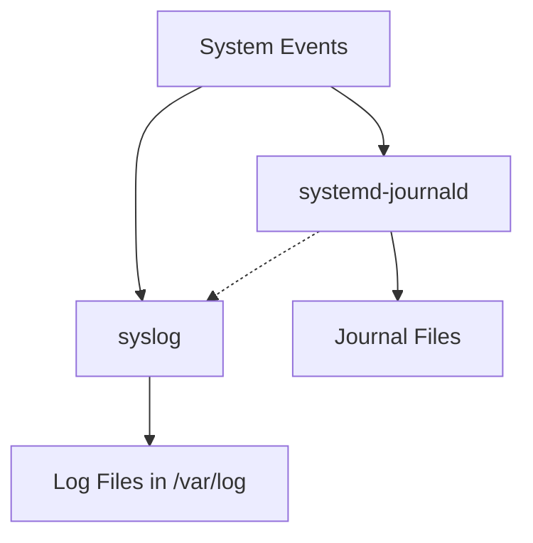

# Ubuntu Log Management

## Introduction

Log management is a critical aspect of system administration in Ubuntu. Logs are essentially the system's diary, recording events, errors, warnings, and other important information as they occur. Properly managing these logs can help you troubleshoot issues, monitor system health, and even detect security breaches.

In this guide, we'll explore how Ubuntu handles logs, where they're stored, how to read and analyze them, and how to implement effective log management practices. Whether you're managing a personal computer or a server, understanding logs is an essential skill for any Ubuntu administrator.

## Understanding System Logs in Ubuntu

### What Are System Logs?

System logs are text files that contain messages about system events. These events can range from:
- System startups and shutdowns
- User logins and authentication attempts
- Application crashes and errors
- Hardware issues
- Security alerts
- Service status changes

### The Logging System in Ubuntu

Ubuntu primarily uses two logging systems:

1. **syslog** - The traditional UNIX logging system
2. **systemd-journald** - A newer logging system introduced with systemd

Each has its own advantages, and Ubuntu uses both simultaneously:



## Log File Locations

### The `/var/log` Directory

Most log files in Ubuntu are stored in the `/var/log` directory. Let's explore some of the most important logs:

```bash
ls -la /var/log
```

Key log files include:

| Log File | Description |
|----------|-------------|
| `/var/log/syslog` | General system logs and messages |
| `/var/log/auth.log` | Authentication logs |
| `/var/log/kern.log` | Kernel messages |
| `/var/log/dmesg` | Boot messages |
| `/var/log/apt/` | Package management logs |
| `/var/log/apache2/` | Apache web server logs |
| `/var/log/mysql/` | MySQL database logs |

### Application-Specific Logs

Many applications create their own log files. These are usually stored in:
- Their own subdirectory under `/var/log`
- User-specific locations like `~/.config/`
- Custom locations specified in their configuration files

## Reading and Analyzing Logs

### Basic Log Reading

The simplest way to view a log file is using tools like `cat`, `less`, or `tail`:

```bash
# View entire log file
cat /var/log/syslog

# View log file with pagination
less /var/log/syslog

# View only the last 50 lines
tail -n 50 /var/log/syslog

# Monitor log file in real-time
tail -f /var/log/syslog
```

### Using `journalctl`

For logs captured by systemd, use `journalctl`:

```bash
# View all journal entries
journalctl

# View kernel messages
journalctl -k

# View logs for a specific service
journalctl -u apache2.service

# View logs since the last boot
journalctl -b

# View logs from a specific time range
journalctl --since "2023-06-01" --until "2023-06-02 12:00:00"
```

#### Example Output from `journalctl`

```
Jun 01 14:23:04 ubuntu-server systemd[1]: Starting Ubuntu Advantage Timer...
Jun 01 14:23:04 ubuntu-server systemd[1]: Started Ubuntu Advantage Timer.
Jun 01 14:23:05 ubuntu-server sshd[1234]: Accepted password for user from 192.168.1.100 port 52617
Jun 01 14:23:05 ubuntu-server sshd[1234]: pam_unix(sshd:session): session opened for user by (uid=0)
```

### Filtering Logs

When dealing with large log files, filtering becomes essential:

```bash
# Search for specific terms in a log file
grep "error" /var/log/syslog

# Show only login failures
grep "Failed password" /var/log/auth.log

# Using journalctl with filtering
journalctl -u ssh.service | grep "Failed"
```

## Log Rotation

Log files can grow very large over time. Ubuntu uses `logrotate` to manage this growth by automatically:
- Compressing old logs
- Creating new log files
- Deleting logs beyond a certain age

### How Logrotate Works

Logrotate is typically configured to run daily through a cron job. Its configuration is split across:
- Main configuration: `/etc/logrotate.conf`
- Application-specific configurations: `/etc/logrotate.d/`

Here's a typical logrotate configuration for the Apache web server:

```
/var/log/apache2/*.log {
    weekly
    missingok
    rotate 52
    compress
    delaycompress
    notifempty
    create 640 root adm
    sharedscripts
    postrotate
        if systemctl is-active --quiet apache2.service ; then
            systemctl reload apache2.service
        fi
    endscript
}
```

This configuration:
- Rotates logs weekly
- Keeps 52 weeks of logs
- Compresses old logs
- Creates new log files with specific permissions
- Reloads Apache after rotation

## Advanced Log Management

### Centralized Logging

For managing multiple systems, consider setting up centralized logging with tools like:
- **Rsyslog** - Enhanced syslog for forwarding logs to a central server
- **ELK Stack** (Elasticsearch, Logstash, Kibana) - Full logging and analysis platform

Basic rsyslog server configuration (`/etc/rsyslog.conf`):

```
# Enable UDP and TCP reception
module(load="imudp")
input(type="imudp" port="514")
module(load="imtcp")
input(type="imtcp" port="514")

# Define log templates and rules
template(name="RemoteLogFile" type="string" string="/var/log/remote/%HOSTNAME%/%PROGRAMNAME%.log")
*.* ?RemoteLogFile
```

Client configuration:

```
*.* @logserver.example.com:514
```

### Log Monitoring

To proactively monitor logs, consider these tools:
- **Logwatch** - Daily log analyzer and reporter
- **Fail2ban** - Monitors logs and blocks suspicious activity
- **OSSEC** - Host-based intrusion detection that monitors logs

Example installation of Logwatch:

```bash
sudo apt install logwatch
```

Configure a daily email report by editing `/etc/cron.daily/00logwatch`:

```
/usr/sbin/logwatch --output mail --mailto admin@example.com --detail high
```

## Troubleshooting with Logs

Logs are invaluable for troubleshooting. Here's a systematic approach:

1. **Identify related services**: Determine which services are involved in the issue
2. **Check appropriate logs**: Look at logs for those services
3. **Look for errors around the time the issue occurred**: Use time filtering
4. **Search for specific error codes or messages**: Use grep or similar tools
5. **Check related services**: Sometimes issues cascade from one service to another

### Example: Troubleshooting SSH Connection Issues

```bash
# Check SSH service status
systemctl status ssh

# Look at SSH logs
journalctl -u ssh.service -n 50

# Check authentication logs
grep "sshd" /var/log/auth.log

# Check for failed attempts
grep "Failed password" /var/log/auth.log
```

## Security Considerations

Logs contain sensitive information, so security is important:
- **Protect log files**: Ensure proper permissions are set
- **Encrypt logs when transferring**: Use TLS/SSL for remote logging
- **Implement log integrity monitoring**: Detect unauthorized log changes
- **Create a log retention policy**: Balance storage needs with compliance requirements

Check log permissions:

```bash
ls -la /var/log/auth.log
```

Should show restrictive permissions like:

```
-rw-r----- 1 syslog adm 12345 Jun 1 08:30 /var/log/auth.log
```

## Practical Examples

### Example 1: Analyzing Failed Login Attempts

Let's identify potential brute force attacks:

```bash
# Count failed SSH login attempts by IP
grep "Failed password" /var/log/auth.log | awk '{print $11}' | sort | uniq -c | sort -nr
```

Output might look like:

```
45 192.168.1.101
23 192.168.1.102
7 192.168.1.103
```

### Example 2: Identifying System Boot Times

```bash
# Show system boots
journalctl --list-boots

# Analyze time between boots
journalctl -b -0 | grep "kernel: Linux version"
journalctl -b -1 | grep "kernel: Linux version"
```

### Example 3: Creating a Custom Logging Solution

Build a simple script to monitor disk space and log warnings:

```bash
#!/bin/bash
# disk_monitor.sh

log_file="/var/log/disk_monitor.log"
threshold=90

usage=$(df -h / | grep / | awk '{print $5}' | sed 's/%//')

if [ "$usage" -gt "$threshold" ]; then
    message="$(date): WARNING - Disk usage at ${usage}% (threshold: ${threshold}%)"
    echo "$message" >> "$log_file"
    logger -p user.warning "$message"
fi
```

Add to crontab to run hourly:

```bash
crontab -e
# Add line:
0 * * * * /path/to/disk_monitor.sh
```

## Summary

Log management is a critical skill for Ubuntu system administrators. We've covered:

- The basics of Ubuntu's logging systems (syslog and journald)
- Where logs are stored and how to access them
- How to read, filter, and analyze logs
- Log rotation and management
- Advanced topics like centralized logging and monitoring
- Practical troubleshooting examples

By mastering log management, you'll be better equipped to maintain system health, troubleshoot issues, and ensure security on your Ubuntu systems.

## Additional Resources

- [Ubuntu Server Guide - Logging](https://ubuntu.com/server/docs)
- [The systemd Journal](https://www.freedesktop.org/software/systemd/man/journalctl.html)
- [Rsyslog Documentation](https://www.rsyslog.com/doc/master/)

## Exercises

1. Set up log rotation for a custom application log file.
2. Create a bash script that checks for failed login attempts and emails a report.
3. Configure rsyslog to forward specific logs to a remote server.
4. Use journalctl to find all errors that occurred during the last system boot.
5. Set up Logwatch to send daily log summaries via email.