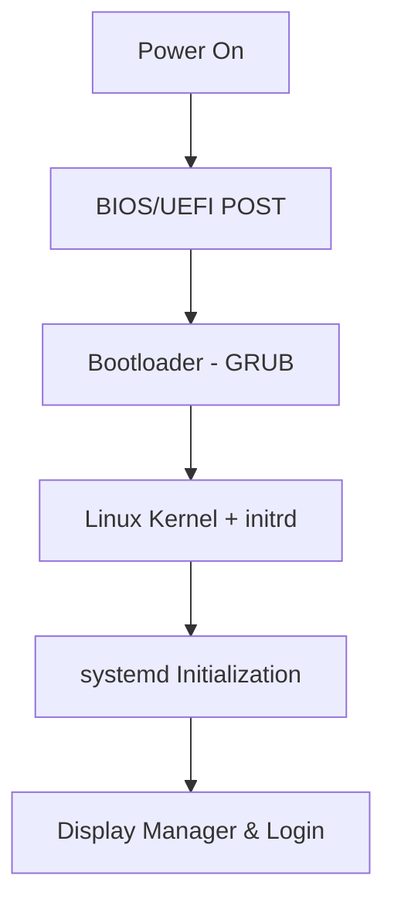

# Ubuntu Boot Management

## Introduction

Boot management is a critical aspect of Ubuntu system administration. Understanding how Ubuntu starts up, the role of the bootloader, and how to troubleshoot boot issues are essential skills for any system administrator. This guide will walk you through the Ubuntu boot process, explain how to configure and manage GRUB (GRand Unified Bootloader), and provide solutions for common boot problems.

## Understanding the Ubuntu Boot Process

The Ubuntu boot process follows a sequence of stages from power-on to the login screen. Let's break down this process:

1. **BIOS/UEFI Stage**: When you power on your computer, the BIOS/UEFI firmware initializes hardware and performs a Power-On Self-Test (POST).

2. **Bootloader Stage**: The BIOS/UEFI hands control to the bootloader (GRUB in Ubuntu).

3. **Kernel Initialization**: GRUB loads the selected Linux kernel and initial RAM disk (initrd).

4. **Init System**: The kernel starts the init system (systemd in modern Ubuntu versions).

5. **User Space**: Finally, systemd brings up user space services and displays the login screen.

Let's visualize this process:



## Working with GRUB Bootloader

GRUB (GRand Unified Bootloader) is the default bootloader for Ubuntu. It provides a menu that allows you to choose which operating system or kernel to boot.

### Accessing the GRUB Menu

By default, GRUB's menu may be hidden during boot. To access it:

1. Restart your Ubuntu system
2. Press and hold the `Shift` key during boot (for BIOS systems) or the `Esc` key (for UEFI systems)

### Basic GRUB Configuration

GRUB's configuration is stored in `/etc/default/grub` and `/etc/grub.d/` directories. After making changes to GRUB configuration, you need to update GRUB with:

```bash
sudo update-grub
```

Here's a simple example of modifying the `/etc/default/grub` file:

```bash
# Open the GRUB configuration file
sudo nano /etc/default/grub

# Modify the timeout (in seconds) to display the GRUB menu
GRUB_TIMEOUT=10

# Save the file (Ctrl+O, then Enter, then Ctrl+X)

# Update GRUB to apply changes
sudo update-grub
```

### Common GRUB Configuration Options

Here are some important configuration options in `/etc/default/grub`:

| Option | Description | Example |
|--------|-------------|---------|
| `GRUB_TIMEOUT` | How long to display the menu (seconds) | `GRUB_TIMEOUT=5` |
| `GRUB_DEFAULT` | Default menu entry to boot | `GRUB_DEFAULT=0` |
| `GRUB_CMDLINE_LINUX` | Kernel parameters for normal mode | `GRUB_CMDLINE_LINUX="quiet splash"` |
| `GRUB_CMDLINE_LINUX_DEFAULT` | Additional kernel parameters | `GRUB_CMDLINE_LINUX_DEFAULT="quiet splash"` |
| `GRUB_DISABLE_OS_PROBER` | Disable/enable OS detection | `GRUB_DISABLE_OS_PROBER=false` |

### Managing Kernel Boot Parameters

Kernel parameters control how the Linux kernel behaves during boot. You can add or modify them in the GRUB configuration.

For example, to fix display issues during boot, you might add the `nomodeset` parameter:

```bash
# Add nomodeset parameter to GRUB_CMDLINE_LINUX_DEFAULT
sudo nano /etc/default/grub

# Change this line:
GRUB_CMDLINE_LINUX_DEFAULT="quiet splash"

# To this:
GRUB_CMDLINE_LINUX_DEFAULT="quiet splash nomodeset"

# Save and update GRUB
sudo update-grub
```

### Managing Boot Entries

You can customize which entries appear in the GRUB menu by editing the configuration files in `/etc/grub.d/`.

For example, to make a custom boot entry:

1. Create a new file in `/etc/grub.d/` (with a number prefix to determine order)
2. Make it executable
3. Add your custom menu entries
4. Update GRUB

```bash
# Create a custom entry file
sudo nano /etc/grub.d/40_custom

# Add a custom entry (example for a custom kernel)
menuentry "Ubuntu with Custom Kernel" {
    set root=(hd0,1)
    linux /boot/vmlinuz-custom root=/dev/sda1 ro quiet splash
    initrd /boot/initrd.img-custom
}

# Save the file
# Make it executable
sudo chmod +x /etc/grub.d/40_custom

# Update GRUB
sudo update-grub
```

## Boot Recovery Options

Ubuntu provides several recovery options if your system won't boot properly.

### Recovery Mode

Recovery mode provides a menu of repair options. To access it:

1. Restart your system
2. Access the GRUB menu
3. Select "Advanced options for Ubuntu"
4. Choose a kernel version with "(recovery mode)"

The recovery menu includes options like:

- **resume**: Continue normal boot
- **clean**: Free up disk space
- **dpkg**: Repair broken packages
- **fsck**: Check filesystem for errors
- **grub**: Update GRUB bootloader
- **network**: Enable networking
- **root**: Drop to root shell prompt
- **system-summary**: Display system summary

### Using a Live USB

If you can't boot into your system at all, you can use an Ubuntu Live USB to:

1. Boot from the Live USB
2. Mount your Ubuntu partition
3. Fix issues using the terminal

Example of repairing GRUB from a Live USB:

```bash
# Boot from Live USB and open terminal
# Mount your Ubuntu installation
sudo mount /dev/sdaX /mnt  # Replace sdaX with your Ubuntu partition

# Mount virtual filesystems
sudo mount --bind /dev /mnt/dev
sudo mount --bind /proc /mnt/proc
sudo mount --bind /sys /mnt/sys

# Chroot into your installation
sudo chroot /mnt

# Reinstall GRUB
grub-install /dev/sda  # Replace sda with your drive (not partition)

# Update GRUB
update-grub

# Exit chroot
exit

# Unmount everything
sudo umount /mnt/dev
sudo umount /mnt/proc
sudo umount /mnt/sys
sudo umount /mnt

# Reboot
sudo reboot
```

## Troubleshooting Common Boot Issues

### GRUB Rescue Prompt

If you see a `grub rescue>` prompt, GRUB couldn't find its configuration files. This can happen after partition changes or filesystem corruption.

```
# At grub rescue prompt, find your boot partition:
grub rescue> ls
(hd0) (hd0,msdos5) (hd0,msdos3) (hd0,msdos2) (hd0,msdos1)

# Check each partition for GRUB files:
grub rescue> ls (hd0,msdos1)/boot/grub

# If files are found, set prefix and root:
grub rescue> set prefix=(hd0,msdos1)/boot/grub
grub rescue> set root=(hd0,msdos1)

# Load normal module:
grub rescue> insmod normal
grub rescue> normal
```

### Kernel Panic

A kernel panic occurs when the Linux kernel encounters a fatal error. Signs include frozen system with error messages containing "Kernel panic".

Common causes and solutions:

1. **Incompatible hardware**: Boot with an older kernel from GRUB menu
2. **Corrupt initramfs**: Rebuild it with `sudo update-initramfs -u -k all`
3. **Missing modules**: Add needed modules to `/etc/initramfs-tools/modules`

### Failed Updates

Sometimes updates to the kernel or GRUB can cause boot failures. You can:

1. Boot into an older kernel from the GRUB menu
2. Fix the update issue with:

```bash
# Update package database
sudo apt update

# Fix any broken dependencies
sudo apt --fix-broken install

# Reinstall the problematic package (example: grub)
sudo apt install --reinstall grub-efi-amd64

# Update GRUB
sudo update-grub
```

## Configuring Boot Options with systemd

In modern Ubuntu versions, systemd manages the system initialization after the kernel loads.

### Viewing Boot Time Information

Systemd provides tools to analyze the boot process:

```bash
# View boot time statistics
systemd-analyze

# View detailed boot time for each service
systemd-analyze blame

# View boot process as a tree
systemd-analyze critical-chain
```

Sample output:

```
$ systemd-analyze
Startup finished in 4.036s (firmware) + 3.010s (loader) + 2.388s (kernel) + 10.340s (userspace) = 19.774s

$ systemd-analyze blame
8.453s NetworkManager-wait-online.service
3.764s snap-core-10823.mount
3.340s snapd.service
2.124s dev-sda3.device
1.714s systemd-journal-flush.service
1.689s udisks2.service
```

### Managing systemd Services

Systemd services can affect boot time and behavior. You can manage them with:

```bash
# List all services
systemctl list-unit-files --type=service

# Disable a service from starting at boot
sudo systemctl disable SERVICE_NAME

# Enable a service to start at boot
sudo systemctl enable SERVICE_NAME

# Check status of a service
systemctl status SERVICE_NAME
```

For example, to disable an unused printer service:

```bash
# Check if it's running
systemctl status cups.service

# Disable it if not needed
sudo systemctl disable cups.service
```

### Creating Custom systemd Boot Options

You can create custom systemd services to run specific tasks during boot:

1. Create a service file in `/etc/systemd/system/`:

```bash
sudo nano /etc/systemd/system/myboot.service
```

2. Add content:

```
[Unit]
Description=My Custom Boot Script
After=network.target

[Service]
Type=simple
ExecStart=/path/to/my/script.sh
User=myuser

[Install]
WantedBy=multi-user.target
```

3. Make the script executable:

```bash
sudo chmod +x /path/to/my/script.sh
```

4. Enable the service:

```bash
sudo systemctl enable myboot.service
```

## Summary

In this guide, we've covered essential aspects of Ubuntu boot management:

- The Ubuntu boot process from power-on to login
- GRUB configuration and customization
- Boot recovery options for when things go wrong
- Troubleshooting common boot issues
- Managing boot options with systemd

Mastering these concepts will help you maintain stable Ubuntu systems and quickly recover from any boot issues that may arise.

## Additional Resources

- [Ubuntu Server Guide: Boot and Recovery](https://ubuntu.com/server/docs/boot-and-recovery)
- [GRUB2 Documentation](https://www.gnu.org/software/grub/manual/grub/grub.html)
- [systemd Documentation](https://systemd.io/)

## Exercises

1. Modify your GRUB timeout to 15 seconds and verify the change works.
2. Create a custom GRUB entry that boots with the `nomodeset` parameter.
3. Use `systemd-analyze blame` to identify the three slowest services during boot on your system.
4. Create a simple systemd service that writes the current date to a log file when your system boots.
5. Practice entering recovery mode and using the root shell to fix a simulated issue.