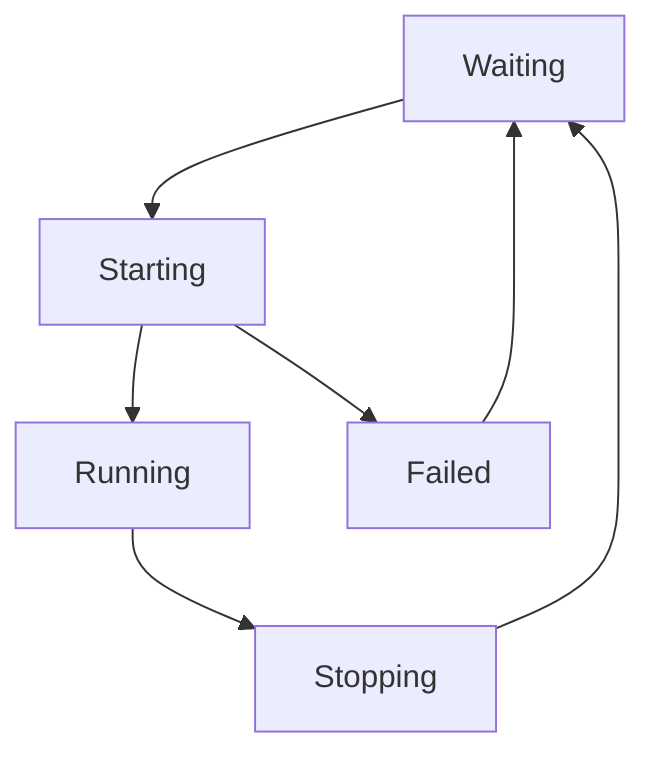

# Ubuntu Init Systems

## Introduction

Init systems are the first processes that start when a Linux system boots up, and they're responsible for bringing the system to a usable state. They initialize all other processes and services, making them a critical component of any Ubuntu system.

In this guide, we'll explore the evolution of init systems in Ubuntu, from the traditional SysVinit to the modern systemd. Understanding init systems is essential for anyone looking to manage Ubuntu servers or perform system administration tasks effectively.

## Evolution of Init Systems in Ubuntu

Ubuntu has used several init systems throughout its history:

1. **SysVinit** - The traditional init system (Ubuntu 6.06 to 9.04)
2. **Upstart** - Developed by Ubuntu/Canonical (Ubuntu 9.10 to 14.10)
3. **systemd** - The current standard (Ubuntu 15.04 onwards)

Let's look at each of these in detail.

<br />

## SysVinit - The Traditional Approach

SysVinit (System V init) is the classic init system that Ubuntu inherited from Debian and other Unix-like systems.

### Key Concepts

- **Process ID 1**: SysVinit runs as PID 1, the first process started by the kernel
- **Runlevels**: Different system states (0-6) representing various operational modes
- **Sequential Startup**: Services start in a defined order, with dependencies handled manually

### Common Runlevels

| Runlevel | Description                                 |
|----------|---------------------------------------------|
| 0        | Halt/Shutdown                               |
| 1        | Single-user mode (rescue mode)              |
| 2-5      | Multi-user modes (Ubuntu used 2 as default) |
| 6        | Reboot                                      |

### Basic SysVinit Commands

```bash
# Check current runlevel
runlevel

# Change to a different runlevel
init 3

# Start a service
service apache2 start

# Stop a service
service apache2 stop

# Check service status
service apache2 status
```

### Example: Creating a SysVinit Service Script

A SysVinit service script in `/etc/init.d/myservice`:

```bash
#!/bin/sh
### BEGIN INIT INFO
# Provides:          myservice
# Required-Start:    $network $remote_fs $syslog
# Required-Stop:     $network $remote_fs $syslog
# Default-Start:     2 3 4 5
# Default-Stop:      0 1 6
# Short-Description: Example service
### END INIT INFO

case "$1" in
  start)
    echo "Starting myservice"
    # Commands to start service
    ;;
  stop)
    echo "Stopping myservice"
    # Commands to stop service
    ;;
  restart)
    echo "Restarting myservice"
    $0 stop
    $0 start
    ;;
  status)
    # Check if service is running
    ;;
  *)
    echo "Usage: $0 {start|stop|restart|status}"
    exit 1
    ;;
esac

exit 0
```

To install the service:

```bash
# Make the script executable
chmod +x /etc/init.d/myservice

# Register the service
update-rc.d myservice defaults
```

### Limitations of SysVinit

- Sequential startup is slow
- No parallel service starting
- Difficult dependency management
- Lacks advanced features like socket activation

<br />

## Upstart - Ubuntu's Innovation

Upstart was developed by Canonical (Ubuntu's parent company) to address SysVinit limitations. It uses an event-based approach to service management.

### Key Concepts

- **Event-based**: Services start in response to events
- **Job Configuration**: Services defined in configuration files
- **Parallel Startup**: Services can start in parallel when possible

### Basic Upstart Commands

```bash
# Start a service
start apache2

# Stop a service
stop apache2

# Check service status
status apache2

# Restart a service
restart apache2
```

### Example: Creating an Upstart Job

An Upstart job configuration in `/etc/init/myservice.conf`:

```bash
# myservice - example Upstart job

description "Example service description"

start on runlevel [2345]
stop on runlevel [016]

respawn
respawn limit 10 5

setuid nobody
setgid nogroup

exec /usr/local/bin/myservice --options
```

### Upstart Job States



### Debugging Upstart Jobs

```bash
# View all configured jobs
initctl list

# Check job log
cat /var/log/upstart/myservice.log

# Manually emit an event
initctl emit some-event
```

<br />

## systemd - The Modern Standard

systemd is the current init system in Ubuntu (since 15.04) and most other Linux distributions. It provides advanced service management capabilities.

### Key Concepts

- **Units**: Different types of resources to manage (services, sockets, targets, etc.)
- **Dependencies**: Clear definition of relationships between services
- **Parallelization**: Optimized parallel startup
- **Targets**: Groups of units (replacement for runlevels)
- **Socket Activation**: Services start only when needed

### Unit Types

| Unit Type | Extension | Purpose                            |
|-----------|-----------|------------------------------------|
| Service   | .service  | System services                    |
| Socket    | .socket   | IPC/network sockets                |
| Target    | .target   | Group of units (like runlevels)    |
| Timer     | .timer    | Scheduled tasks (cron alternative) |
| Mount     | .mount    | Filesystem mount points            |
| Device    | .device   | Device units                       |

### Basic systemd Commands

```bash
# Start a service
systemctl start apache2.service

# Stop a service
systemctl stop apache2.service

# Enable a service to start at boot
systemctl enable apache2.service

# Disable a service from starting at boot
systemctl disable apache2.service

# Check service status
systemctl status apache2.service

# Restart a service
systemctl restart apache2.service

# Reload service configuration
systemctl reload apache2.service

# List all running services
systemctl list-units --type=service --state=running
```

### Example: Creating a systemd Service

A systemd service file in `/etc/systemd/system/myservice.service`:

```ini
[Unit]
Description=My Custom Service
After=network.target

[Service]
Type=simple
User=nobody
Group=nogroup
ExecStart=/usr/local/bin/myservice --option1 --option2
Restart=on-failure
RestartSec=5s

[Install]
WantedBy=multi-user.target
```

After creating or modifying a service file:

```bash
# Reload systemd configuration
systemctl daemon-reload

# Enable and start the service
systemctl enable myservice.service
systemctl start myservice.service
```

### systemd Target Units

Targets are systemd's replacement for runlevels:

| Target            | Equivalent Runlevel | Description                 |
|-------------------|---------------------|-----------------------------|
| poweroff.target   | 0                   | Shutdown system             |
| rescue.target     | 1                   | Single-user mode            |
| multi-user.target | 3                   | Multi-user mode without GUI |
| graphical.target  | 5                   | Multi-user mode with GUI    |
| reboot.target     | 6                   | Reboot system               |

### Viewing systemd Logs with journalctl

```bash
# View system logs
journalctl

# View logs for a specific service
journalctl -u apache2.service

# View logs since last boot
journalctl -b

# Follow logs in real-time
journalctl -f

# View logs within a time range
journalctl --since "2023-01-01" --until "2023-01-02 03:00"
```

### Analyzing systemd Boot Time

```bash
# Show system boot analysis
systemd-analyze

# Show detailed startup times for services
systemd-analyze blame

# View startup as a timeline
systemd-analyze plot > startup.svg
```

## Practical Examples

### Example 1: Creating a Custom Web Server Service

Let's create a systemd service for a Node.js web application:

```ini
# /etc/systemd/system/nodeapp.service
[Unit]
Description=Node.js Web Application
After=network.target

[Service]
Type=simple
User=nodeuser
WorkingDirectory=/var/www/nodeapp
ExecStart=/usr/bin/node /var/www/nodeapp/server.js
Restart=on-failure
Environment=NODE_ENV=production
StandardOutput=journal

[Install]
WantedBy=multi-user.target
```

Deploy the service:

```bash
# Create a user for the service
sudo adduser --system --no-create-home nodeuser

# Apply proper permissions
sudo chown -R nodeuser:nogroup /var/www/nodeapp

# Enable and start the service
sudo systemctl daemon-reload
sudo systemctl enable nodeapp.service
sudo systemctl start nodeapp.service

# Check the status
sudo systemctl status nodeapp.service
```

### Example 2: Creating a Timer for Regular Tasks

Instead of using cron, we can use systemd timers:

```ini
# /etc/systemd/system/backup.service
[Unit]
Description=Database Backup Service

[Service]
Type=oneshot
ExecStart=/usr/local/bin/backup-script.sh
User=backup
```

```ini
# /etc/systemd/system/backup.timer
[Unit]
Description=Run database backup daily

[Timer]
OnCalendar=*-*-* 01:00:00
Persistent=true

[Install]
WantedBy=timers.target
```

Activate the timer:

```bash
sudo systemctl daemon-reload
sudo systemctl enable backup.timer
sudo systemctl start backup.timer

# Verify timer is active
sudo systemctl list-timers
```

### Example 3: Troubleshooting a Failed Service

When a service fails to start, follow these steps:

```bash
# Check service status
sudo systemctl status myservice.service

# View detailed logs
sudo journalctl -u myservice.service -n 100

# Check service configuration issues
sudo systemd-analyze verify /etc/systemd/system/myservice.service

# Temporarily start the service with more logging
sudo SYSTEMD_LOG_LEVEL=debug /lib/systemd/systemd-executemyservice.service
```

## Comparing Init Systems

Let's compare the three init systems covered:

| Feature                  | SysVinit      | Upstart             | systemd            |
|--------------------------|---------------|---------------------|--------------------|
| First Used in Ubuntu     | 6.06          | 9.10                | 15.04              |
| Startup Process          | Sequential    | Event-based         | Dependency-based   |
| Parallel Service Startup | No            | Yes                 | Yes                |
| Resource Management      | Limited       | Basic               | Advanced           |
| Socket Activation        | No            | Limited             | Yes                |
| Journal/Logging          | No            | Basic               | Advanced           |
| Configuration Format     | Shell scripts | Configuration files | Unit files         |
| Service Isolation        | No            | Limited             | Advanced (cgroups) |

## Summary

In this guide, we've explored the evolution of init systems in Ubuntu:

1. **SysVinit**: The traditional sequential init system
2. **Upstart**: Ubuntu's event-based improvement
3. **systemd**: The current comprehensive init and service management system

Understanding init systems is crucial for Ubuntu system administrators. These systems control how your services start, run, and stop, and knowing how to manage them properly can help you:

- Create reliable system services
- Troubleshoot boot problems
- Optimize startup times
- Configure sophisticated service dependencies

As you progress in your system administration journey, you'll find that mastering systemd in particular will give you powerful tools for managing complex Ubuntu deployments.

## Further Learning

To continue your learning journey with Ubuntu init systems:

- Experiment with creating different types of systemd units
- Practice troubleshooting boot issues
- Learn about more advanced systemd features like socket activation and resource control
- Study the systemd journal system for comprehensive logging

## Exercises

1. Create a simple systemd service that runs a Python script of your choice
2. Set up a systemd timer that executes a task every 15 minutes
3. Configure a service that depends on another service being available first
4. Write a socket-activated service that only starts when a connection is received
5. Compare boot times before and after optimizing your systemd configuration

## Additional Resources

- [systemd Documentation](https://www.freedesktop.org/wiki/Software/systemd/)
- [Ubuntu Server Guide - Service Management](https://ubuntu.com/server/docs)
- `man systemd` and `man systemctl` - Comprehensive manual pages
- [Upstart Cookbook](http://upstart.ubuntu.com/cookbook/) - For historical reference