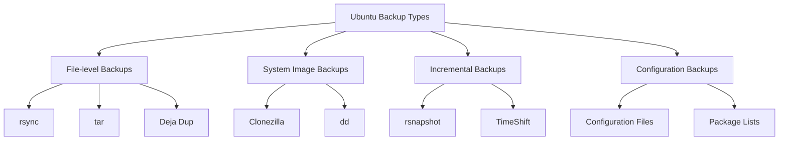

# Ubuntu System Backup

## Introduction

Backing up your Ubuntu system is a critical aspect of system administration that helps safeguard your data against hardware failures, accidental deletions, malware attacks, or system corruption. A good backup strategy ensures that you can quickly restore your system to a working state with minimal data loss.

In this guide, we'll explore various backup methods available for Ubuntu systems, ranging from simple file backups to complete system images. By the end, you'll understand the importance of system backups and be equipped with practical knowledge to implement a robust backup strategy for your Ubuntu system.

## Why Backup Your Ubuntu System?

Before diving into the "how," let's understand the "why":

- **Data Protection**: Prevents permanent loss of important files and documents
- **Disaster Recovery**: Allows quick recovery from system failures
- **System Migration**: Facilitates moving your environment to new hardware
- **Configuration Preservation**: Saves time spent on system configuration and customization
- **Peace of Mind**: Reduces stress knowing your data is safe

## Types of Ubuntu Backups

There are several approaches to backing up an Ubuntu system:



Let's explore each method in detail.

## File-Level Backup Solutions

### 1. Using `rsync` for Simple Backups

`rsync` is a powerful file synchronization tool that efficiently copies files from one location to another.

#### Basic `rsync` Backup Command

```bash
rsync -avzh --progress /source/directory /destination/directory
```

Let's break down the options:
- `-a`: Archive mode (preserves permissions, ownership, timestamps)
- `-v`: Verbose output
- `-z`: Compress data during transfer
- `-h`: Human-readable format
- `--progress`: Shows progress during transfer

#### Example: Backing Up Home Directory to External Drive

```bash
sudo rsync -avzh --progress /home/username /media/external-drive/backups/
```

#### Excluding Files from Backup

Create an exclude file (`exclude.txt`):

```
*.tmp
.cache/
node_modules/
.git/
```

Then use it with rsync:

```bash
rsync -avzh --progress --exclude-from='exclude.txt' /home/username /media/external-drive/backups/
```

#### Setting Up Automated Backups with `rsync` and `cron`

1. Create a backup script:

```bash
#!/bin/bash
# File: backup.sh

BACKUP_DATE=$(date +%Y-%m-%d)
rsync -avzh --progress --exclude-from='/home/username/exclude.txt' /home/username /media/external-drive/backups/$BACKUP_DATE/
```

2. Make the script executable:

```bash
chmod +x backup.sh
```

3. Add a cron job to run it weekly:

```bash
crontab -e
```

Add this line to run every Sunday at 2 AM:

```
0 2 * * 0 /path/to/backup.sh
```

### 2. Using `tar` for Archiving Backups

The `tar` utility creates compressed archive files, making it ideal for backups.

#### Creating a Backup Archive

```bash
tar -czvf backup-$(date +%Y-%m-%d).tar.gz /home/username
```

Options explained:
- `-c`: Create a new archive
- `-z`: Compress with gzip
- `-v`: Verbose output
- `-f`: Specify archive file name

#### Restoring from a `tar` Archive

```bash
tar -xzvf backup-2023-03-15.tar.gz -C /path/to/restore/
```

Options:
- `-x`: Extract files
- `-C`: Specify directory to extract to

### 3. Using Deja Dup (Backup Tool with GUI)

Deja Dup provides a user-friendly graphical interface for backups.

#### Installation

```bash
sudo apt install deja-dup
```

#### Using Deja Dup

1. Launch Deja Dup from the applications menu
2. Select folders to back up
3. Choose backup location
4. Set schedule
5. Start backup

## System-Level Backup Solutions

### 1. Using Timeshift for System Snapshots

Timeshift creates incremental snapshots of your system, similar to Windows System Restore or macOS Time Machine.

#### Installation

```bash
sudo apt install timeshift
```

#### Creating a System Snapshot

1. Launch Timeshift with elevated privileges:

```bash
sudo timeshift-gtk
```

2. Select the snapshot type (RSYNC or BTRFS)
3. Choose the backup location
4. Select backup frequency
5. Click "Create" to make a manual snapshot

#### Restoring a System Snapshot

1. Boot into a live Ubuntu environment if system won't boot
2. Install and launch Timeshift
3. Select the snapshot to restore
4. Click "Restore" and follow the prompts

### 2. Using Clonezilla for Disk Imaging

Clonezilla creates complete disk images for full system backup and recovery.

#### Creating a System Image with Clonezilla

1. Download and create a bootable Clonezilla USB drive
2. Boot from the Clonezilla live USB
3. Select "device-image" to create an image of the disk
4. Choose the source disk
5. Select a destination to save the image
6. Follow the prompts to complete the process

#### Restoring a System from Clonezilla Image

1. Boot from Clonezilla live USB
2. Select "device-image" to restore an image
3. Locate your saved image
4. Select the target disk for restoration
5. Follow the prompts to restore the system

### 3. Using `dd` for Low-Level Disk Copying

The `dd` command creates bit-by-bit copies of disks or partitions.

#### Creating a Disk Image

```bash
sudo dd if=/dev/sda of=/path/to/backup/disk.img bs=4M status=progress
```

Parameters:
- `if`: Input file (source disk)
- `of`: Output file (destination)
- `bs`: Block size
- `status=progress`: Show progress

#### Restoring a Disk Image

```bash
sudo dd if=/path/to/backup/disk.img of=/dev/sda bs=4M status=progress
```

⚠️ **Warning**: `dd` is powerful but dangerous. Make absolutely sure you specify the correct source and destination to avoid data loss.

## Backing Up Specific System Components

### 1. Package Lists and Repositories

Save a list of installed packages:

```bash
dpkg --get-selections > installed_packages.txt
```

Backup repository information:

```bash
sudo cp -R /etc/apt/sources.list* /path/to/backup/
```

Restore packages:

```bash
sudo apt update
cat installed_packages.txt | sudo dpkg --set-selections
sudo apt-get dselect-upgrade
```

### 2. Configuration Files

Most system configuration files reside in `/etc`. Back them up with:

```bash
sudo tar -czvf etc-backup.tar.gz /etc
```

For specific configurations, consider backing up:
- `/etc/fstab`: Mount points
- `/etc/network/interfaces`: Network configuration
- `/etc/ssh/sshd_config`: SSH server configuration

### 3. User Configurations

Important user configurations are stored in hidden folders in the home directory:

```bash
tar -czvf user-configs.tar.gz ~/.config ~/.local ~/.mozilla ~/.ssh ~/.bashrc ~/.profile
```

## Best Practices for Ubuntu System Backups

1. **Follow the 3-2-1 Backup Rule**:
   - Keep 3 copies of your data
   - Store backups on 2 different media types
   - Keep 1 backup offsite

2. **Test Your Backups Regularly**:
   - Verify that you can actually restore from your backups
   - Perform test restores periodically

3. **Automate Your Backups**:
   - Use cron jobs or systemd timers
   - Set up email notifications for backup success/failure

4. **Document Your Backup Process**:
   - Keep notes on how to restore your system
   - Include commands and procedures

5. **Secure Your Backups**:
   - Encrypt sensitive data
   - Store backups in secure locations

## Creating a Comprehensive Backup Strategy

A complete backup strategy might include:

1. **Daily incremental backups** of important data using `rsync` or Deja Dup
2. **Weekly system snapshots** using Timeshift
3. **Monthly full system images** using Clonezilla
4. **Regular offsite backups** to cloud storage or remote servers

Example backup script combining multiple methods:

```bash
#!/bin/bash
# Comprehensive backup script

# Variables
BACKUP_DATE=$(date +%Y-%m-%d)
HOME_DIR="/home/username"
BACKUP_DIR="/media/external-drive/backups/$BACKUP_DATE"
LOG_FILE="/var/log/system-backup.log"

# Create backup directory
mkdir -p $BACKUP_DIR

# Log start
echo "Starting backup on $BACKUP_DATE" | tee -a $LOG_FILE

# 1. Back up home directory
echo "Backing up home directory..." | tee -a $LOG_FILE
rsync -avzh --progress --exclude-from='/home/username/exclude.txt' $HOME_DIR $BACKUP_DIR/home/ | tee -a $LOG_FILE

# 2. Back up package list
echo "Backing up package list..." | tee -a $LOG_FILE
dpkg --get-selections > $BACKUP_DIR/installed_packages.txt

# 3. Back up repositories
echo "Backing up repository information..." | tee -a $LOG_FILE
sudo cp -R /etc/apt/sources.list* $BACKUP_DIR/apt/

# 4. Back up system configuration
echo "Backing up system configuration..." | tee -a $LOG_FILE
sudo tar -czf $BACKUP_DIR/etc-backup.tar.gz /etc

# 5. Create Timeshift snapshot (if not already scheduled)
echo "Creating Timeshift snapshot..." | tee -a $LOG_FILE
sudo timeshift --create --comments "Scheduled backup $BACKUP_DATE"

# Log completion
echo "Backup completed on $(date)" | tee -a $LOG_FILE
```

## Troubleshooting Backup Issues

### Common Problems and Solutions

1. **Insufficient Space**
   - Error: `No space left on device`
   - Solution: Free up space or use a larger backup device

2. **Permission Denied**
   - Error: `Permission denied`
   - Solution: Run the backup command with `sudo` or fix permissions on source/destination

3. **Network Timeouts for Remote Backups**
   - Error: `Connection timed out`
   - Solution: Check network connection, use the `--timeout` option with `rsync`

4. **Corrupted Backups**
   - Problem: Backup files are corrupted or incomplete
   - Solution: Verify integrity with checksums, ensure proper dismounting of drives

## Summary

In this guide, we've covered multiple approaches to backing up an Ubuntu system:

- File-level backups with `rsync`, `tar`, and Deja Dup
- System snapshots with Timeshift
- Complete disk images with Clonezilla and `dd`
- Backing up specific system components
- Creating a comprehensive backup strategy
- Troubleshooting common backup issues

Remember that a good backup strategy is regular, automated, and tested. The best backup is one that you can successfully restore from when needed. Start with a simple backup plan and gradually enhance it as you become more comfortable with the tools and processes.

## Additional Resources

- [Ubuntu Community Wiki - BackupYourSystem](https://help.ubuntu.com/community/BackupYourSystem)
- [The rsync manual page](https://linux.die.net/man/1/rsync)
- [Timeshift GitHub repository](https://github.com/teejee2008/timeshift)
- [Clonezilla official website](https://clonezilla.org/)

## Exercises

1. Create a simple backup script using `rsync` to back up your home directory to an external drive.
2. Set up Timeshift and create a system snapshot, then intentionally change some system settings and practice restoring the snapshot.
3. Install and configure Deja Dup to automatically back up your Documents folder to a cloud storage location.
4. Create a complete backup strategy document for your Ubuntu system, including what to back up, when, and where.
5. Practice restoring files from your backups to verify they work correctly.