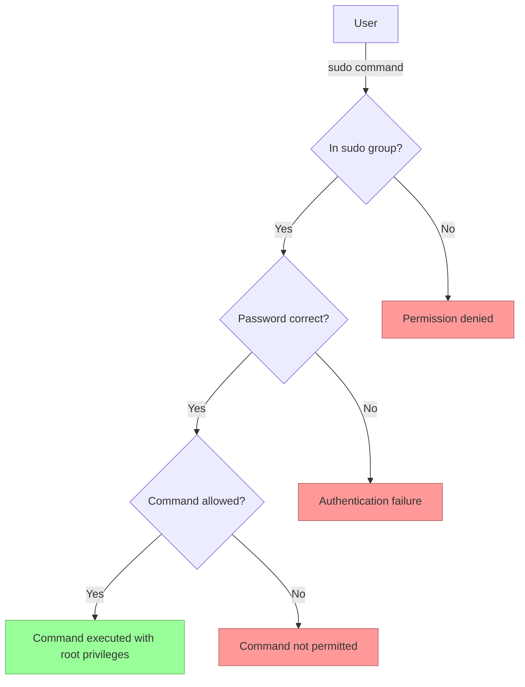

# Ubuntu Sudo Privileges

## Introduction

In Ubuntu and other Linux distributions, the concept of `sudo` (Superuser Do) is fundamental to system administration and security. Sudo allows authorized users to execute commands with elevated privileges temporarily, without needing to log in as the root user directly. This approach follows the principle of least privilege, which is a cornerstone of good security practices.

This guide will walk you through everything you need to know about sudo privileges in Ubuntu, from basic concepts to advanced configuration techniques.

## What is Sudo?

Sudo is a program that allows users to run commands with the security privileges of another user, by default the superuser (root). It provides a way to grant specific users or groups administrative access without sharing the root password.

The primary benefits of using sudo include:

- **Enhanced Security**: Limited and controlled access to root privileges
- **Accountability**: All sudo commands are logged, creating an audit trail
- **Convenience**: No need to log in and out as different users
- **Granularity**: Permissions can be tailored to specific commands or users

## Basic Sudo Usage

### Checking Sudo Access

To check if your user has sudo privileges, run:

```bash
sudo -v
```

If you have sudo access, you'll be prompted for your password. If not, you'll see an error message.

### Running Commands with Sudo

To run a command with sudo privileges:

```bash
sudo command_name
```

For example, to view the contents of a protected file:

```bash
sudo cat /etc/shadow
```

Output (example):
```
root:!:18906:0:99999:7:::
daemon:*:18885:0:99999:7:::
bin:*:18885:0:99999:7:::
sys:*:18885:0:99999:7:::
sync:*:18885:0:99999:7:::
[additional entries...]
```

### Understanding Sudo Authentication

When you use sudo, you'll be prompted for your password (not the root password). By default:

- The password prompt times out after 5 minutes of inactivity
- Sudo maintains a timestamp file to remember your credentials temporarily
- You can use the `-k` flag to invalidate the timestamp: `sudo -k`

## Managing Sudo Access

### Who Can Use Sudo?

In Ubuntu, members of the `sudo` group automatically receive sudo privileges. To check if a user is in the sudo group:

```bash
groups username
```

### Adding a User to Sudo Group

To grant a user sudo privileges, add them to the sudo group:

```bash
sudo usermod -aG sudo username
```

Alternatively, you can use:

```bash
sudo adduser username sudo
```

### Removing a User from Sudo Group

To revoke sudo privileges:

```bash
sudo deluser username sudo
```

## Configuration with the Sudoers File

The sudo system is configured through the `/etc/sudoers` file. This file defines who can use sudo and what commands they can run.

### Safely Editing Sudoers

**Never** edit the sudoers file directly with a regular text editor. Always use the `visudo` command:

```bash
sudo visudo
```

`visudo` locks the sudoers file, performs syntax checking, and prevents corruption of the sudo configuration.

### Sudoers File Structure

The sudoers file uses the following syntax:

```
user_or_group    host=(run_as_user:run_as_group)    commands
```

Example entries:

```
# Allow members of group sudo to execute any command
%sudo   ALL=(ALL:ALL) ALL

# Allow user john to run apt commands without a password
john    ALL=(ALL) NOPASSWD: /usr/bin/apt, /usr/bin/apt-get
```

### Creating Custom Sudo Rules

Let's create a rule that allows users in the 'developers' group to restart specific services:

1. First, create the group:

```bash
sudo groupadd developers
```

2. Add users to the group:

```bash
sudo usermod -aG developers username
```

3. Add a custom rule to sudoers:

```bash
sudo visudo
```

Add the following line:

```
%developers ALL=(ALL) /bin/systemctl restart apache2, /bin/systemctl restart mysql
```

This allows any user in the 'developers' group to restart the Apache and MySQL services, but nothing else with sudo.

## Advanced Sudo Configuration

### Command Aliases

Sudoers allows you to create command aliases for easier management:

```
# Define a command alias for web server operations
Cmnd_Alias WEB_CMDS = /bin/systemctl restart apache2, /bin/systemctl status apache2, /bin/systemctl reload apache2

# Allow webadmins to use these commands
%webadmins ALL=(ALL) WEB_CMDS
```

### Limiting Environment Variables

For enhanced security, you can control which environment variables are preserved when using sudo:

```
Defaults env_keep = "HOME PATH"
```

### Password-free Sudo for Specific Commands

To allow specific commands without a password:

```
username ALL=(ALL) NOPASSWD: /path/to/command
```

### Configuring Sudo Timeout

Change how long sudo credentials are cached:

```
Defaults timestamp_timeout=15
```

This sets the timeout to 15 minutes (default is 5).

## Sudo Logging and Security

### Viewing Sudo Logs

Sudo logs all activities to the system logs. To view sudo activities:

```bash
sudo grep sudo /var/log/auth.log
```

Example output:
```
May 10 14:23:22 ubuntu-server sudo: john : TTY=pts/0 ; PWD=/home/john ; USER=root ; COMMAND=/usr/bin/apt update
May 10 14:24:15 ubuntu-server sudo: john : TTY=pts/0 ; PWD=/home/john ; USER=root ; COMMAND=/usr/bin/apt upgrade
```

### Security Best Practices

1. **Limit sudo access**: Only grant sudo privileges to users who need them
2. **Use command restrictions**: Limit users to only the commands they need
3. **Enable sudo logging**: Ensure logs are being properly stored and monitored
4. **Regularly audit sudoers file**: Review and clean up sudo permissions
5. **Use NOPASSWD sparingly**: Only use for trusted users and non-sensitive commands
6. **Set appropriate timeout**: Adjust the timeout based on your security requirements

## Troubleshooting Sudo Issues

### Common Problems and Solutions

1. **"username is not in the sudoers file"**
   ```bash
   sudo adduser username sudo
   ```

2. **Forgot Password**
   If you can't use sudo because you forgot your password, boot into recovery mode to reset it.

3. **Broken Sudoers File**
   If you've broken the sudoers file, boot into recovery mode and run:
   ```bash
   pkexec visudo
   ```

4. **Sudo Command Not Found**
   If sudo isn't installed:
   ```bash
   apt-get update && apt-get install sudo
   ```

## Visualizing Sudo Privileges Flow



## Real-world Scenarios

### Scenario 1: Setting Up a Web Development Environment

A team of web developers needs to manage Apache configuration files but shouldn't have full root access:

```bash
# Create a group for web developers
sudo groupadd webdev

# Add users to the group
sudo usermod -aG webdev developer1
sudo usermod -aG webdev developer2

# Edit sudoers file
sudo visudo
```

Add these lines:
```
Cmnd_Alias APACHE_CMDS = /bin/systemctl restart apache2, /bin/systemctl reload apache2, /usr/bin/nano /etc/apache2/sites-available/*
%webdev ALL=(ALL) APACHE_CMDS
```

This allows web developers to restart/reload Apache and edit site configuration files.

### Scenario 2: Database Administration

For database administrators who need specific MySQL privileges:

```bash
# Create a group
sudo groupadd dbadmin

# Add users
sudo usermod -aG dbadmin dba1

# Edit sudoers
sudo visudo
```

Add:
```
Cmnd_Alias DB_CMDS = /bin/systemctl restart mysql, /usr/bin/mysql, /usr/bin/mysqldump
%dbadmin ALL=(ALL) DB_CMDS
```

### Scenario 3: Limited Package Management

To allow a junior admin to update but not install new packages:

```bash
# Edit sudoers
sudo visudo
```

Add:
```
junior_admin ALL=(ALL) /usr/bin/apt update, /usr/bin/apt upgrade, !/usr/bin/apt install *, !/usr/bin/apt remove *
```

This allows updating but explicitly prevents installing or removing packages.

## Summary

Understanding and properly configuring sudo privileges is essential for maintaining security while allowing necessary administrative access in Ubuntu systems. Key points covered in this guide:

- Sudo allows temporary elevation of privileges without sharing the root password
- The sudoers file controls who can use sudo and what commands they can run
- Always use `visudo` to edit the sudoers file
- Custom rules can be created to grant specific privileges
- Regular auditing and proper logging are critical for security

By following these principles and practices, you can maintain a secure Ubuntu system while still providing the necessary privileges for users to perform their tasks.

## Further Resources

- [Ubuntu Official Documentation on Sudo](https://help.ubuntu.com/community/Sudo)
- [Sudo Manual Page](https://man7.org/linux/man-pages/man8/sudo.8.html)
- [Linux Security Best Practices Guide](https://www.linux.com/training-tutorials/linux-security-best-practices-2/)

## Exercises

1. Create a new user and grant them sudo privileges to only restart the SSH service
2. Configure sudo to require password re-entry for every command for a specific user
3. Set up a custom sudo rule that allows users in a custom group to only view log files in `/var/log/`
4. Audit your current system's sudoers file and identify any potential security issues
5. Create a command alias for network troubleshooting tools and assign it to a specific user