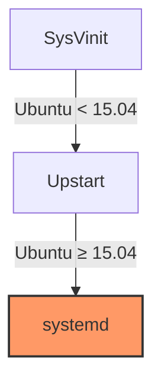

# Ubuntu Service Management

## Introduction

Service management is a fundamental aspect of Ubuntu system administration. In a Linux environment like Ubuntu, many processes run in the background to handle various system functions - from network connectivity and printing services to web servers and databases. These background processes are called **services** or **daemons**.

Effectively managing these services is crucial for:
- Ensuring system stability and reliability
- Optimizing system performance
- Controlling resource usage
- Maintaining system security
- Enabling required functionality

This guide explores Ubuntu service management, focusing primarily on **systemd** - the modern service and system manager used in Ubuntu since version 15.04. We'll cover how to start, stop, and monitor services, understand service configurations, and implement best practices for effective service management.

## Understanding Services in Ubuntu

### What Are Services?

Services (also called daemons) are programs that run in the background without direct user interaction. They typically:
- Start automatically when the system boots
- Perform specific system functions
- Continue running indefinitely until stopped

Examples of common services include:
- `ssh` - Secure Shell server for remote access
- `apache2` - Web server
- `mysql` - Database server
- `cron` - Task scheduler
- `ufw` - Uncomplicated Firewall

### Service Management Evolution

Ubuntu's service management has evolved over time:



1. **SysVinit**: The traditional Unix initialization system
2. **Upstart**: Used in Ubuntu 9.10 to 15.04
3. **systemd**: The current service manager (since Ubuntu 15.04)

This guide focuses on systemd, as it's used in all current Ubuntu versions.

## Systemd Fundamentals

### Systemd Units

Systemd manages various system resources as "units." The most common unit types include:

- **Service units (.service)**: System services
- **Socket units (.socket)**: Inter-process communication sockets
- **Target units (.target)**: Group of units (similar to runlevels)
- **Timer units (.timer)**: Scheduled tasks (alternative to cron)
- **Mount units (.mount)**: Filesystem mount points

### Unit Files Location

Systemd unit files are stored in several locations:

- `/lib/systemd/system/`: System default unit files
- `/etc/systemd/system/`: System-specific unit files (overrides defaults)
- `/usr/lib/systemd/user/`: User default unit files
- `~/.config/systemd/user/`: User-specific unit files

## Basic Service Management Commands

### Viewing Services

To list all active services:

```bash
systemctl list-units --type=service
```

Sample output:

```
UNIT                       LOAD   ACTIVE SUB     DESCRIPTION
apache2.service            loaded active running Apache2 HTTP Server
avahi-daemon.service       loaded active running Avahi mDNS/DNS-SD Stack
cron.service               loaded active running Regular background program processing daemon
dbus.service               loaded active running D-Bus System Message Bus
networkd-dispatcher.service loaded active running Dispatcher daemon for systemd-networkd
nginx.service              loaded active running A high performance web server and a reverse proxy server
ssh.service                loaded active running OpenBSD Secure Shell server
systemd-logind.service     loaded active running Login Service
ufw.service                loaded active exited  Uncomplicated firewall
```

To see all services (including inactive):

```bash
systemctl list-units --type=service --all
```

To check a specific service status:

```bash
systemctl status apache2
```

Sample output:

```
● apache2.service - The Apache HTTP Server
     Loaded: loaded (/lib/systemd/system/apache2.service; enabled; vendor preset: enabled)
     Active: active (running) since Tue 2023-05-09 14:32:45 UTC; 2min 33s ago
       Docs: https://httpd.apache.org/docs/2.4/
   Main PID: 12345 (apache2)
      Tasks: 6 (limit: 4620)
     Memory: 10.2M
        CPU: 136ms
     CGroup: /system.slice/apache2.service
             ├─12345 /usr/sbin/apache2 -k start
             ├─12346 /usr/sbin/apache2 -k start
             └─12347 /usr/sbin/apache2 -k start
```

### Starting and Stopping Services

To start a service:

```bash
sudo systemctl start apache2
```

To stop a service:

```bash
sudo systemctl stop apache2
```

To restart a service:

```bash
sudo systemctl restart apache2
```

To reload a service's configuration without restarting:

```bash
sudo systemctl reload apache2
```

To restart a service only if it's running:

```bash
sudo systemctl try-restart apache2
```

### Enabling and Disabling Services

To configure a service to start at boot:

```bash
sudo systemctl enable apache2
```

To prevent a service from starting at boot:

```bash
sudo systemctl disable apache2
```

To enable and immediately start a service:

```bash
sudo systemctl enable --now apache2
```

To disable and immediately stop a service:

```bash
sudo systemctl disable --now apache2
```

## Managing Service Dependencies

Services often depend on other services or system resources. Systemd handles these dependencies automatically.

To view a service's dependencies:

```bash
systemctl list-dependencies apache2
```

Sample output:

```
apache2.service
● ├─system.slice
● ├─apache2.socket
● ├─sysinit.target
● │ ├─apparmor.service
● │ ├─dev-hugepages.mount
● │ ├─dev-mqueue.mount
● │ ├─sys-fs-fuse-connections.mount
● │ ├─sys-kernel-config.mount
● │ └─sys-kernel-debug.mount
● ├─network-online.target
● │ └─NetworkManager-wait-online.service
● └─basic.target
●   ├─paths.target
●   ├─sockets.target
●   │ ├─dbus.socket
```

## Creating Custom Services

You can create your own systemd service for any application or script you want to run as a daemon.

### Example: Creating a Custom Python Web Server Service

1. Create a simple Python script:

```bash
sudo nano /usr/local/bin/simple_web_server.py
```

Add the following content:

```python
#!/usr/bin/env python3
import http.server
import socketserver

PORT = 8000
Handler = http.server.SimpleHTTPRequestHandler

with socketserver.TCPServer(("", PORT), Handler) as httpd:
    print(f"Serving at port {PORT}")
    httpd.serve_forever()
```

2. Make the script executable:

```bash
sudo chmod +x /usr/local/bin/simple_web_server.py
```

3. Create a systemd service file:

```bash
sudo nano /etc/systemd/system/simple-web.service
```

Add the following content:

```ini
[Unit]
Description=Simple Python HTTP Server
After=network.target

[Service]
Type=simple
User=www-data
WorkingDirectory=/var/www/html
ExecStart=/usr/local/bin/simple_web_server.py
Restart=on-failure

[Install]
WantedBy=multi-user.target
```

4. Reload systemd to recognize the new service:

```bash
sudo systemctl daemon-reload
```

5. Start and enable the service:

```bash
sudo systemctl enable --now simple-web
```

6. Check the service status:

```bash
sudo systemctl status simple-web
```

## Understanding Service Configuration

### Anatomy of a Systemd Unit File

Systemd service units consist of three main sections:

1. **[Unit]**: Basic information and dependencies
2. **[Service]**: Service-specific configuration
3. **[Install]**: Installation information

Let's examine a typical service file:

```bash
cat /lib/systemd/system/ssh.service
```

```ini
[Unit]
Description=OpenBSD Secure Shell server
Documentation=man:sshd(8) man:sshd_config(5)
After=network.target auditd.service
ConditionPathExists=!/etc/ssh/sshd_not_to_be_run

[Service]
EnvironmentFile=-/etc/default/ssh
ExecStartPre=/usr/sbin/sshd -t
ExecStart=/usr/sbin/sshd -D $SSHD_OPTS
ExecReload=/usr/sbin/sshd -t
ExecReload=/bin/kill -HUP $MAINPID
KillMode=process
Restart=on-failure
RestartPreventExitStatus=255
Type=notify
RuntimeDirectory=sshd
RuntimeDirectoryMode=0755

[Install]
WantedBy=multi-user.target
Alias=sshd.service
```

### Important Unit File Options

#### [Unit] Section Options

- **Description**: Human-readable description
- **Documentation**: Where to find documentation
- **After/Before**: Order of starting services (not dependencies)
- **Requires**: Hard dependencies
- **Wants**: Soft dependencies
- **Conflicts**: Services that cannot run simultaneously

#### [Service] Section Options

- **Type**: Service startup type (simple, forking, oneshot, etc.)
- **ExecStart**: Command to start the service
- **ExecStop**: Command to stop the service
- **ExecReload**: Command to reload the service
- **Restart**: When to restart the service (always, on-failure, etc.)
- **User/Group**: Which user/group to run as
- **WorkingDirectory**: Working directory for the service
- **Environment/EnvironmentFile**: Environment variables

#### [Install] Section Options

- **WantedBy**: Which target should include this service
- **Alias**: Alternative names for the service

## Modifying Existing Services

You should never directly edit files in `/lib/systemd/system/`. Instead, create override files:

1. Create an override directory:

```bash
sudo systemctl edit apache2
```

This opens an editor where you can add override settings:

```ini
[Service]
# Add additional environment variables
Environment="APACHE_LOG_DIR=/var/log/custom"

# Change the restart behavior
Restart=always
RestartSec=5
```

The changes will be saved to `/etc/systemd/system/apache2.service.d/override.conf`.

2. Reload systemd configuration:

```bash
sudo systemctl daemon-reload
```

3. Restart the service for changes to take effect:

```bash
sudo systemctl restart apache2
```

## Advanced Service Management

### Managing Service Logs

Systemd includes a powerful logging system called **journald** that collects and manages service logs.

To view logs for a specific service:

```bash
journalctl -u apache2
```

To follow logs in real-time:

```bash
journalctl -u apache2 -f
```

To view logs since a specific time:

```bash
journalctl -u apache2 --since "2023-05-09 14:30:00"
```

To view logs for the current boot:

```bash
journalctl -u apache2 -b
```

### Service Resource Management

Systemd allows you to set resource limits for services using "cgroups" (control groups).

To create resource limitations, edit the service or create an override:

```bash
sudo systemctl edit apache2
```

Add resource constraints:

```ini
[Service]
# Limit CPU usage
CPUQuota=50%

# Limit memory usage
MemoryLimit=512M

# Limit I/O
IOWeight=500
```

### Socket Activation

Socket activation allows services to start on-demand when a connection is made, saving resources.

A simple socket unit example:

```ini
[Unit]
Description=My Service Socket

[Socket]
ListenStream=12345
Accept=yes

[Install]
WantedBy=sockets.target
```

### Service Timers

Systemd timers can replace traditional cron jobs for scheduled tasks:

1. Create a service file:

```bash
sudo nano /etc/systemd/system/backup.service
```

```ini
[Unit]
Description=Daily Backup Service

[Service]
Type=oneshot
ExecStart=/usr/local/bin/backup-script.sh
User=backup
```

2. Create a timer file:

```bash
sudo nano /etc/systemd/system/backup.timer
```

```ini
[Unit]
Description=Run backup daily at 2am

[Timer]
OnCalendar=*-*-* 02:00:00
Persistent=true

[Install]
WantedBy=timers.target
```

3. Enable the timer:

```bash
sudo systemctl enable --now backup.timer
```

4. List active timers:

```bash
systemctl list-timers
```

## Troubleshooting Service Issues

### Common Service Problems and Solutions

1. **Service fails to start**

Check logs for error messages:

```bash
journalctl -u my-service -n 50
```

Check for configuration errors:

```bash
sudo my-service-binary --check-config
```

2. **Service starts but crashes immediately**

Look for resource issues:

```bash
journalctl -u my-service | grep -i "out of memory"
```

Check permissions:

```bash
ls -la /path/to/service/files
```

3. **Service won't enable at boot**

Check for dependency issues:

```bash
systemctl list-dependencies --reverse my-service
```

Verify installation target:

```bash
grep "WantedBy" /etc/systemd/system/my-service.service
```

### Service Recovery Techniques

1. **Reset failed service status**:

```bash
sudo systemctl reset-failed my-service
```

2. **Force stop a service**:

```bash
sudo systemctl kill -s SIGKILL my-service
```

3. **Reload all unit files**:

```bash
sudo systemctl daemon-reload
```

## Best Practices for Service Management

1. **Always use systemctl commands** rather than directly manipulating service files or processes
2. **Create override files** instead of editing default unit files
3. **Set appropriate resource limits** to prevent service issues
4. **Implement proper logging** for troubleshooting
5. **Use socket activation** for infrequently used services
6. **Implement service monitoring** for critical services
7. **Document custom services** for future reference
8. **Regularly check service status** as part of system maintenance
9. **Keep services updated** to patch security vulnerabilities
10. **Disable unnecessary services** to reduce attack surface

## Practical Examples

### Example 1: Securing an SSH Service

To enhance SSH security by changing the port and limiting login attempts:

1. Create an override file:

```bash
sudo systemctl edit ssh
```

2. Add custom options:

```ini
[Service]
# Add environment variable for SSH port
Environment="SSH_PORT=2222"

# Pass it to the command
ExecStart=
ExecStart=/usr/sbin/sshd -D $SSHD_OPTS -p ${SSH_PORT}
```

3. Edit SSH configuration:

```bash
sudo nano /etc/ssh/sshd_config
```

4. Add fail2ban protection:

```bash
sudo apt install fail2ban
sudo nano /etc/fail2ban/jail.local
```

```ini
[sshd]
enabled = true
port = 2222
filter = sshd
logpath = /var/log/auth.log
maxretry = 3
bantime = 3600
```

5. Restart services:

```bash
sudo systemctl restart ssh
sudo systemctl restart fail2ban
```

### Example 2: Setting Up a Web Server with Custom Directories

1. Install Apache:

```bash
sudo apt install apache2
```

2. Create an override file:

```bash
sudo systemctl edit apache2
```

3. Configure custom directories:

```ini
[Service]
Environment=APACHE_LOG_DIR=/var/log/custom-apache
Environment=APACHE_RUN_DIR=/var/run/custom-apache
Environment=APACHE_LOCK_DIR=/var/lock/custom-apache

# Create required directories on startup
ExecStartPre=/bin/mkdir -p ${APACHE_LOG_DIR} ${APACHE_RUN_DIR} ${APACHE_LOCK_DIR}
ExecStartPre=/bin/chown www-data:www-data ${APACHE_LOG_DIR} ${APACHE_RUN_DIR} ${APACHE_LOCK_DIR}
```

4. Restart Apache:

```bash
sudo systemctl restart apache2
```

## Summary

Ubuntu service management through systemd provides a powerful, flexible way to control background processes on your system. By understanding how to start, stop, enable, and configure services, you can maintain a stable and secure Ubuntu system.

Key takeaways:
- Services are background processes that perform specific system functions
- Systemd is the current service manager in Ubuntu
- Basic commands include `systemctl start`, `stop`, `enable`, and `status`
- Service configuration is done through unit files
- Custom services can be created for your own applications
- Systemd provides powerful logging, resource management, and scheduling capabilities

## Further Resources

### Documentation
- [Systemd Manual Pages](https://www.freedesktop.org/software/systemd/man/)
- [Ubuntu Server Guide](https://ubuntu.com/server/docs)

### Practice Exercises

1. Create a custom service for a simple application
2. Modify an existing service to use different resource limits
3. Set up a systemd timer to run a daily backup script
4. Configure a socket-activated service
5. Troubleshoot and fix a failing service