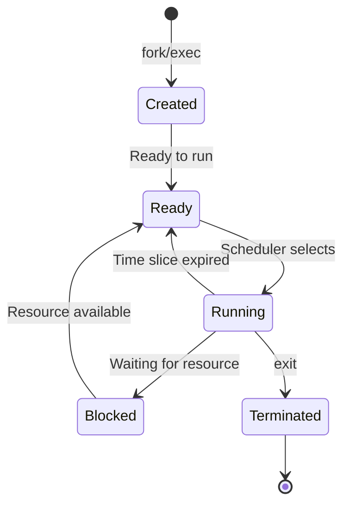

# Ubuntu Process Control

## Introduction

Process control is a fundamental aspect of Ubuntu system administration. Every program or command that runs on your Ubuntu system is executed as a process. Understanding how to monitor, manage, and control these processes is essential for maintaining system performance, troubleshooting issues, and optimizing resource utilization.

In this tutorial, we'll explore various tools and techniques for process control in Ubuntu, from basic process monitoring to advanced process manipulation. Whether you're a beginner system administrator or a curious Ubuntu user, this guide will provide you with the knowledge and skills to effectively manage processes on your system.

## Understanding Processes in Ubuntu

A process is simply a program in execution. When you run a command or start an application in Ubuntu, the system creates a process with a unique identifier called a Process ID (PID). Each process has:

- A unique PID
- A parent process (PPID)
- Resource allocations (CPU, memory, etc.)
- File descriptors
- Execution state

Processes in Ubuntu can be in different states:
- **Running**: The process is currently executing
- **Sleeping**: The process is waiting for a resource or event
- **Stopped**: The process has been suspended
- **Zombie**: The process has completed but still has an entry in the process table

## Basic Process Monitoring Commands

### The `ps` Command

The most fundamental tool for viewing processes is the `ps` command, which shows a snapshot of current processes.

```bash
ps
```

Output:
```
  PID TTY          TIME CMD
 4231 pts/0    00:00:00 bash
 4287 pts/0    00:00:00 ps
```

This basic output shows processes associated with your current terminal. For more detailed information, you can use various options:

```bash
ps aux
```

Output:
```
USER       PID %CPU %MEM    VSZ   RSS TTY      STAT START   TIME COMMAND
root         1  0.0  0.1 167244 11948 ?        Ss   10:30   0:02 /sbin/init
root         2  0.0  0.0      0     0 ?        S    10:30   0:00 [kthreadd]
ubuntu    4231  0.0  0.0  21952  5812 pts/0    Ss   11:42   0:00 bash
ubuntu    4288  0.0  0.0  39088  3328 pts/0    R+   11:45   0:00 ps aux
```

Common `ps` options:
- `a`: Show processes for all users
- `u`: Display detailed user-oriented format
- `x`: Include processes not attached to a terminal
- `f`: Show process hierarchy in a tree format

### The `top` Command

While `ps` provides a static snapshot, `top` gives a dynamic, real-time view of processes:

```bash
top
```

Output:
```
top - 11:47:23 up  1:17,  1 user,  load average: 0.00, 0.01, 0.05
Tasks: 108 total,   1 running, 107 sleeping,   0 stopped,   0 zombie
%Cpu(s):  0.0 us,  0.3 sy,  0.0 ni, 99.7 id,  0.0 wa,  0.0 hi,  0.0 si,  0.0 st
MiB Mem :   3934.8 total,   2778.4 free,    332.3 used,    824.1 buff/cache
MiB Swap:   2048.0 total,   2048.0 free,      0.0 used.   3355.8 avail Mem 

  PID USER      PR  NI    VIRT    RES    SHR S  %CPU  %MEM     TIME+ COMMAND
 4289 ubuntu    20   0   42528   3872   3284 R   0.3   0.1   0:00.05 top
    1 root      20   0  167244  11948   8788 S   0.0   0.3   0:02.06 systemd
    2 root      20   0       0      0      0 S   0.0   0.0   0:00.00 kthreadd
```

Within `top`, you can use these key commands:
- `q`: Quit top
- `k`: Kill a process (it will prompt for PID)
- `r`: Renice a process (change priority)
- `f`: Select fields to display
- `u`: Filter by user
- `M`: Sort by memory usage
- `P`: Sort by CPU usage (default)

### The `htop` Command

A more user-friendly alternative to `top` is `htop`, which provides a colorful and interactive interface:

```bash
sudo apt install htop
htop
```

`htop` offers easier navigation with mouse support, a clearer display, and more intuitive process management.

## Process Control Commands

### Terminating Processes with `kill`

The `kill` command sends signals to processes. The most common use is to terminate a process:

```bash
kill PID
```

Replace `PID` with the process ID you want to terminate. By default, this sends the SIGTERM (15) signal, which asks the process to terminate gracefully.

For stubborn processes, you can use the SIGKILL (9) signal, which forcibly terminates the process:

```bash
kill -9 PID
```

Example:
```bash
# Start a sleep process in the background
sleep 1000 &
[1] 4321

# Kill it
kill 4321
[1]+  Terminated              sleep 1000
```

### Terminating Processes by Name with `pkill` and `killall`

To kill processes by name instead of PID:

```bash
pkill process_name
```

Or:

```bash
killall process_name
```

Example:
```bash
# Start multiple sleep processes
sleep 500 &
sleep 500 &
sleep 500 &

# Kill all sleep processes
killall sleep
[1]   Terminated              sleep 500
[2]   Terminated              sleep 500
[3]+  Terminated              sleep 500
```

### Suspending and Resuming Processes

You can suspend a running process with SIGSTOP (19) and resume it with SIGCONT (18):

```bash
# Suspend a process
kill -STOP PID

# Resume a process
kill -CONT PID
```

Example with a foreground process:
- Press `Ctrl+Z` to suspend the current foreground process
- Use `bg` to continue it in the background
- Use `fg` to bring it back to the foreground

```bash
$ sleep 100
^Z
[1]+  Stopped                 sleep 100

$ bg
[1]+ sleep 100 &

$ fg
sleep 100
```

## Process Prioritization

### Using `nice` and `renice`

Ubuntu uses a priority system with values ranging from -20 (highest priority) to 19 (lowest priority). By default, processes start with a nice value of 0.

Start a process with a specific priority using `nice`:

```bash
nice -n 10 command
```

Change the priority of a running process with `renice`:

```bash
renice 10 -p PID
```

Example:
```bash
# Start a process with lower priority
nice -n 10 find / -name "*.tmp" > /tmp/tmpfiles.txt 2>/dev/null &
[1] 4350

# Check its nice value
ps -o pid,ni,cmd -p 4350
  PID  NI CMD
 4350  10 find / -name *.tmp

# Change priority of running process
sudo renice -5 -p 4350
4350 (process ID) old priority 10, new priority -5

# Verify the change
ps -o pid,ni,cmd -p 4350
  PID  NI CMD
 4350  -5 find / -name *.tmp
```

Note that only root can set negative nice values, which give processes higher priority than the default.

## Process Limits and Control

### Using `ulimit`

The `ulimit` command allows you to control the resources available to processes:

```bash
# View current limits
ulimit -a

# Set maximum number of open files
ulimit -n 4096
```

To set permanent limits, modify `/etc/security/limits.conf`.

### Using cgroups

For more advanced process control, Ubuntu uses control groups (cgroups) to limit, account for, and isolate resource usage.

Basic cgroup management with `systemd`:

```bash
# Create a unit file for a service with limits
sudo nano /etc/systemd/system/myapp.service
```

Example unit file:
```
[Unit]
Description=My Application

[Service]
ExecStart=/usr/local/bin/myapp
CPUQuota=20%
MemoryLimit=512M

[Install]
WantedBy=multi-user.target
```

Apply the changes:
```bash
sudo systemctl daemon-reload
sudo systemctl start myapp
```

## Real-world Examples

### Example 1: Finding and Killing a Runaway Process

Imagine your system is running slow. Here's how to identify and terminate a resource-hungry process:

```bash
# Find top CPU-consuming processes
ps aux --sort=-%cpu | head -n 5

# Or use top and press P to sort by CPU
top

# Kill the problematic process
kill -15 PID  # Try graceful termination first
# If it doesn't respond
kill -9 PID   # Force termination
```

### Example 2: Running a Low-Priority Backup Job

When running a backup that shouldn't impact system performance:

```bash
nice -n 19 tar -czf /backup/home_backup.tar.gz /home/
```

### Example 3: Process Monitoring Script

Here's a simple bash script to monitor important system processes:

```bash
#!/bin/bash
# monitor_processes.sh - Keep track of critical system processes

CRITICAL_PROCESSES=("sshd" "nginx" "mysql")

check_process() {
  if pgrep "$1" > /dev/null
  then
    echo "✅ $1 is running"
  else
    echo "❌ $1 is NOT running"
    # Optionally attempt to restart the service
    # sudo systemctl start $1
  fi
}

echo "Checking system processes at $(date)"
echo "-----------------------------------"

for process in "${CRITICAL_PROCESSES[@]}"
do
  check_process "$process"
done
```

Make it executable:
```bash
chmod +x monitor_processes.sh
```

Run it:
```bash
./monitor_processes.sh
```

Output:
```
Checking system processes at Wed Mar 13 12:05:23 UTC 2025
-----------------------------------
✅ sshd is running
✅ nginx is running
❌ mysql is NOT running
```

## Process Flow Visualization

Here's a diagram illustrating the typical lifecycle of a process in Ubuntu:



## Summary

In this tutorial, we've covered the essential aspects of process control in Ubuntu:

- **Basic Process Monitoring**: Using `ps`, `top`, and `htop` to view and analyze processes
- **Process Control**: Terminating, suspending, and resuming processes with `kill`, `pkill`, and signal handling
- **Process Prioritization**: Managing process priorities with `nice` and `renice` to optimize system performance
- **Resource Limits**: Setting limits on process resources with `ulimit` and cgroups
- **Real-world Applications**: Practical examples of process management in system administration

Mastering process control is an essential skill for any Ubuntu system administrator. With these tools and techniques, you'll be better equipped to manage system resources, troubleshoot performance issues, and maintain a healthy Ubuntu environment.

## Additional Resources

- Run `man ps`, `man top`, and `man kill` for detailed documentation on each command
- The Linux Process Management section in the Ubuntu Server Guide
- The Debian Administrator's Handbook (available online)

## Practice Exercises

1. Write a script that lists all processes consuming more than 100MB of memory
2. Create a systemd service for an application with CPU and memory limits
3. Set up a cron job that monitors and logs system processes every hour
4. Practice using different signals with the `kill` command to understand their effects
5. Experiment with different nice values to observe their impact on system performance