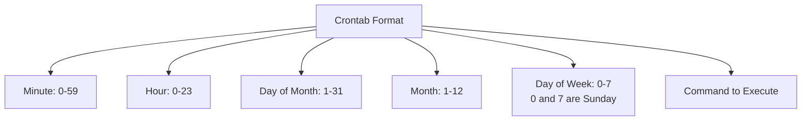

# Ubuntu Job Scheduling

## Introduction

Job scheduling is a fundamental aspect of system administration that allows you to automate tasks to run at specified times without manual intervention. In Ubuntu, several robust tools are available for scheduling jobs, making system maintenance and routine tasks more efficient and reliable.

Whether you need to perform regular backups, update your system, run scripts at specific intervals, or execute commands at particular times, Ubuntu's job scheduling tools provide flexible solutions to meet your automation needs.

In this guide, we'll explore the three primary job scheduling utilities in Ubuntu:

1. **cron** - For recurring tasks at specific intervals
2. **at** - For one-time task execution at a specified time
3. **systemd timers** - A modern alternative to cron with enhanced features

By the end of this guide, you'll have a solid understanding of how to implement job scheduling in your Ubuntu system for various administrative tasks.

## Cron: The Classic Job Scheduler

Cron is the traditional and most widely used job scheduling utility in Unix-like systems, including Ubuntu. It operates through a daemon called `crond` that constantly checks for scheduled tasks and executes them when due.

### Understanding Crontab Files

Cron jobs are defined in special configuration files called crontabs (cron tables). Each user on the system can have their own crontab file, and there's also a system-wide crontab.

### Crontab Commands

Here are the essential crontab commands:

```bash
# View your current crontab
crontab -l

# Edit your crontab
crontab -e

# Remove your crontab
crontab -r

# Edit another user's crontab (requires root privileges)
sudo crontab -u username -e
```

When you run `crontab -e` for the first time, you'll be prompted to choose a text editor. Once selected, a crontab file opens where you can define your scheduled tasks.

### Crontab Syntax

A crontab entry consists of six fields:

```
minute hour day_of_month month day_of_week command_to_execute
```

Each field can contain:
- A specific number
- An asterisk (`*`) meaning "every" value
- A range of numbers (e.g., `1-5`)
- A list of values separated by commas (e.g., `1,3,5`)
- Step values using `/` (e.g., `*/5` means "every 5")

Here's a visualization of the crontab format:



### Common Crontab Examples

Let's look at some practical examples:

```bash
# Run a backup script every day at 2:30 AM
30 2 * * * /home/user/scripts/backup.sh

# Run a system update every Monday at 3:00 AM
0 3 * * 1 apt update && apt upgrade -y

# Run a cleanup script at midnight on the 1st of every month
0 0 1 * * /home/user/scripts/cleanup.sh

# Run a script every 15 minutes
*/15 * * * * /home/user/scripts/check-status.sh

# Run a script every hour during work hours (9 AM - 5 PM) on weekdays
0 9-17 * * 1-5 /home/user/scripts/work-task.sh
```

### Managing Cron Job Output

By default, cron sends the output of jobs to the user's email. To redirect output, you can use:

```bash
# Redirect output to a log file
0 2 * * * /home/user/scripts/backup.sh >> /home/user/logs/backup.log 2>&1

# Discard all output
0 2 * * * /home/user/scripts/backup.sh > /dev/null 2>&1
```

### Special Cron Directories

Ubuntu also provides special directories for cron jobs:
- `/etc/cron.daily/` - Scripts run once a day
- `/etc/cron.hourly/` - Scripts run once an hour
- `/etc/cron.weekly/` - Scripts run once a week
- `/etc/cron.monthly/` - Scripts run once a month

To use these directories, simply place your executable scripts in them:

```bash
sudo cp myscript.sh /etc/cron.daily/
sudo chmod +x /etc/cron.daily/myscript.sh
```

## The At Command: One-time Job Scheduling

While cron is excellent for recurring tasks, sometimes you need to schedule a one-time job. That's where the `at` command comes in.

### Installing At

The `at` utility might not be installed by default on Ubuntu. Install it with:

```bash
sudo apt update
sudo apt install at
```

Verify that the `atd` service is running:

```bash
sudo systemctl status atd
```

If it's not running, start it with:

```bash
sudo systemctl start atd
sudo systemctl enable atd
```

### Basic At Usage

The `at` command syntax is straightforward:

```bash
at TIME
```

After entering this command, you'll get an interactive prompt where you can type the commands to be executed. Press Ctrl+D to save and exit.

### Time Specifications

The `at` command accepts various time formats:

```bash
# Specific time
at 2:30PM

# Time with date
at 2:30PM tomorrow
at 2:30PM July 31

# Relative time
at now + 30 minutes
at now + 1 hour
at now + 2 days
```

### At Command Examples

Let's look at some practical examples:

```bash
# Schedule a system restart in 30 minutes
$ at now + 30 minutes
at> sudo reboot
at> <Ctrl+D>
job 1 at Thu Mar 13 15:30:00 2025

# Schedule a backup at midnight
$ at midnight
at> /home/user/scripts/backup.sh
at> <Ctrl+D>
job 2 at Fri Mar 14 00:00:00 2025

# Schedule a task for a specific time and date
$ at 3:00PM March 15
at> echo "Meeting reminder" | mail -s "Important Meeting" user@example.com
at> <Ctrl+D>
job 3 at Sat Mar 15 15:00:00 2025
```

### Managing At Jobs

To manage scheduled at jobs:

```bash
# List all pending jobs
atq

# View the details of a specific job
at -c JOB_NUMBER

# Remove a specific job
atrm JOB_NUMBER
```

Example output:

```bash
$ atq
1	Thu Mar 13 15:30:00 2025 a user
2	Fri Mar 14 00:00:00 2025 a user
3	Sat Mar 15 15:00:00 2025 a user

$ at -c 1
#!/bin/sh
# atrun uid=1000 gid=1000
# mail user 0
umask 22
...
sudo reboot

$ atrm 1
```

## Systemd Timers: Modern Job Scheduling

Systemd timers are a more modern approach to job scheduling, offering advantages like:
- Better integration with systemd services
- More precise timing options
- Better logging and error handling
- Ability to handle job dependencies

### Creating a Basic Systemd Timer

A systemd timer setup requires two files:
1. A service file that defines what to execute
2. A timer file that defines when to execute it

Let's create a simple example to run a backup script:

1. Create the service file:

```bash
sudo nano /etc/systemd/system/backup.service
```

Add the following content:

```ini
[Unit]
Description=Run system backup script

[Service]
Type=oneshot
ExecStart=/home/user/scripts/backup.sh
User=user

[Install]
WantedBy=multi-user.target
```

2. Create the timer file:

```bash
sudo nano /etc/systemd/system/backup.timer
```

Add the following content:

```ini
[Unit]
Description=Run backup script daily at 2:30 AM

[Timer]
OnCalendar=*-*-* 02:30:00
Persistent=true

[Install]
WantedBy=timers.target
```

3. Enable and start the timer:

```bash
sudo systemctl daemon-reload
sudo systemctl enable backup.timer
sudo systemctl start backup.timer
```

### Understanding OnCalendar Format

The `OnCalendar` option uses the following format:

```
DayOfWeek Year-Month-Day Hour:Minute:Second
```

Examples:

```ini
# Every day at 2:30 AM
OnCalendar=*-*-* 02:30:00

# Every Monday at 3:00 AM
OnCalendar=Mon *-*-* 03:00:00

# Every 1st of the month at midnight
OnCalendar=*-*-01 00:00:00

# Every 15 minutes
OnCalendar=*:0/15
```

### Managing Systemd Timers

Here are common commands to manage systemd timers:

```bash
# List all timers
systemctl list-timers

# Check the status of a specific timer
systemctl status backup.timer

# Start, stop, or restart a timer
systemctl start backup.timer
systemctl stop backup.timer
systemctl restart backup.timer

# Enable or disable a timer at boot
systemctl enable backup.timer
systemctl disable backup.timer
```

Example output:

```bash
$ systemctl list-timers
NEXT                        LEFT       LAST                        PASSED       UNIT                         ACTIVATES
Thu 2025-03-13 15:50:00 UTC 13min left Thu 2025-03-13 15:40:00 UTC 6min ago    backup.timer                backup.service
...
```

## Advanced Job Scheduling Techniques

### Environment Variables in Cron Jobs

Cron jobs run with a minimal set of environment variables. If your script requires specific environment variables, you can set them in the crontab:

```bash
# Set environment variables in crontab
SHELL=/bin/bash
PATH=/usr/local/sbin:/usr/local/bin:/usr/sbin:/usr/bin:/sbin:/bin
MAILTO=user@example.com

# Use environment variables in cron jobs
0 2 * * * source ~/.profile && /home/user/scripts/backup.sh
```

### Handling Job Failures

For critical jobs, consider implementing error handling:

1. Using a wrapper script:

```bash
#!/bin/bash
# backup_wrapper.sh

if ! /home/user/scripts/backup.sh; then
    echo "Backup failed at $(date)" | mail -s "Backup Failure" admin@example.com
    exit 1
fi
```

2. Using systemd's failure handling:

```ini
[Unit]
Description=Run system backup script
OnFailure=backup-failure-notification.service

[Service]
Type=oneshot
ExecStart=/home/user/scripts/backup.sh
```

### Anacron for Laptops and Desktops

Unlike cron, which assumes your system is always running, anacron is designed for systems that aren't running 24/7, like laptops and desktops. It ensures that scheduled jobs run even if the system was off when they were scheduled.

Install anacron:

```bash
sudo apt install anacron
```

Anacron configuration is in `/etc/anacrontab`:

```bash
# /etc/anacrontab format:
# period delay job-identifier command
1       5       cron.daily      run-parts --report /etc/cron.daily
7       10      cron.weekly     run-parts --report /etc/cron.weekly
@monthly 15     cron.monthly    run-parts --report /etc/cron.monthly
```

### Job Scheduling with Environment Considerations

For resource-intensive tasks, consider the system load:

```bash
# Run backup only when system load is below 1.5
0 2 * * * [[ $(cat /proc/loadavg | cut -d' ' -f1) < 1.5 ]] && /home/user/scripts/backup.sh

# Using batch command (executes when system load permits)
0 2 * * * echo "/home/user/scripts/backup.sh" | batch
```

## Real-world Examples

### Automated System Updates

```bash
#!/bin/bash
# /etc/cron.daily/auto-update

# Log file setup
LOG_FILE="/var/log/auto-update.log"
exec > >(tee -a "$LOG_FILE") 2>&1

echo "===== Auto Update Started at $(date) ====="

# Update package lists
apt update

# Apply security updates only
apt upgrade -s | grep "^Inst" | grep -i security | awk '{print $2}' | xargs apt -y install

# Clean up
apt autoremove -y
apt clean

echo "===== Auto Update Completed at $(date) ====="
```

### Database Backup

```bash
#!/bin/bash
# /home/user/scripts/db-backup.sh

# Configuration
DB_NAME="myapp_db"
DB_USER="dbadmin"
BACKUP_DIR="/backups/database"
RETENTION_DAYS=7

# Create backup directory if it doesn't exist
mkdir -p "$BACKUP_DIR"

# Create timestamp
TIMESTAMP=$(date +%Y%m%d-%H%M%S)
BACKUP_FILE="$BACKUP_DIR/$DB_NAME-$TIMESTAMP.sql.gz"

# Perform backup
echo "Starting backup of $DB_NAME at $(date)"
mysqldump -u "$DB_USER" -p"$DB_PASSWORD" "$DB_NAME" | gzip > "$BACKUP_FILE"

# Check if backup was successful
if [ $? -eq 0 ]; then
    echo "Backup completed successfully: $BACKUP_FILE"
else
    echo "Backup failed!"
    exit 1
fi

# Remove old backups
find "$BACKUP_DIR" -name "$DB_NAME-*.sql.gz" -mtime +$RETENTION_DAYS -delete
echo "Removed backups older than $RETENTION_DAYS days"
```

Set up as a systemd timer:

```bash
# /etc/systemd/system/db-backup.service
[Unit]
Description=Database Backup Service

[Service]
Type=oneshot
ExecStart=/home/user/scripts/db-backup.sh
User=dbadmin

[Install]
WantedBy=multi-user.target
```

```bash
# /etc/systemd/system/db-backup.timer
[Unit]
Description=Run database backup daily at 1:00 AM

[Timer]
OnCalendar=*-*-* 01:00:00
Persistent=true

[Install]
WantedBy=timers.target
```

### Website Monitoring Script

```bash
#!/bin/bash
# /home/user/scripts/website-monitor.sh

WEBSITE="https://example.com"
NOTIFICATION_EMAIL="admin@example.com"
TIMEOUT=10

# Check if website is accessible
if curl -s --head --request GET "$WEBSITE" --max-time "$TIMEOUT" | grep "200 OK" > /dev/null; then
    echo "Website is up: $WEBSITE"
else
    echo "Website is DOWN: $WEBSITE" | mail -s "Website Down Alert" "$NOTIFICATION_EMAIL"
fi
```

Set up to run every 5 minutes with cron:

```bash
# Add to crontab with: crontab -e
*/5 * * * * /home/user/scripts/website-monitor.sh > /dev/null 2>&1
```

## Comparison of Job Scheduling Methods

Here's a comparison of the three job scheduling methods:

| Feature | Cron | At | Systemd Timers |
|---------|------|-------|---------------|
| Use Case | Recurring tasks | One-time tasks | Both recurring and one-time tasks |
| Syntax Complexity | Medium | Simple | High |
| Precision | Minute | Minute/Second | Microsecond |
| Logging | Limited | Limited | Integrated with journald |
| Dependencies | No | No | Yes (via systemd) |
| Missed Jobs Handling | No (use anacron) | No | Yes (with Persistent=true) |
| Modern Integration | No | No | Yes |

## Summary

Ubuntu offers multiple robust tools for job scheduling to automate your system administration tasks:

1. **Cron** is the traditional choice for recurring tasks, with its powerful but concise syntax.
2. **At** is perfect for one-time tasks that need to be scheduled for a specific time.
3. **Systemd timers** provide a modern alternative with enhanced features and better integration with the rest of the system.

Each tool has its strengths, and a proficient Ubuntu system administrator should be familiar with all three to choose the right tool for each automation need.

By leveraging these job scheduling capabilities, you can automate routine tasks, ensure system maintenance happens regularly, and reduce manual intervention, making your Ubuntu system more efficient and reliable.

## Additional Resources and Exercises

### Resources

- [Ubuntu Cron Documentation](https://help.ubuntu.com/community/CronHowto)
- [Systemd Timer Documentation](https://www.freedesktop.org/software/systemd/man/systemd.timer.html)
- [Linux Command Library: at Command](https://linuxcommandlibrary.com/man/at)

### Exercises

1. **Basic Cron Setup**:
   - Create a cron job that displays the current time and system uptime every hour.
   - Redirect the output to a log file in your home directory.

2. **At Command Practice**:
   - Schedule a task to display a reminder message in one hour.
   - Create a batch file of commands and schedule it to run tonight at 8 PM.

3. **Systemd Timer Challenge**:
   - Create a systemd timer that runs a script to check for system updates daily.
   - Modify it to also send you an email notification if updates are available.

4. **Advanced Scheduling**:
   - Create a backup solution that uses different frequencies for different directories.
   - Implement a condition to only run the backup when the system is idle.

5. **Monitoring Challenge**:
   - Create a scheduling solution that monitors multiple websites.
   - Implement a notification system that alerts you only if the site remains down after three consecutive checks.