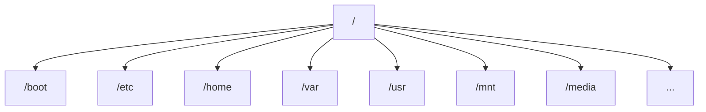

# Ubuntu Storage Management

## Introduction

Storage management is a fundamental aspect of Ubuntu system administration. Whether you're setting up a personal computer, a development server, or a production environment, understanding how to manage storage efficiently is crucial for maintaining system performance and reliability.

In Ubuntu, storage management involves several key areas: viewing and monitoring disk usage, partitioning drives, formatting with appropriate filesystems, mounting storage devices, and implementing advanced storage solutions like Logical Volume Management (LVM). This guide will walk you through these concepts with practical examples that you can apply in real-world scenarios.

## Basic Storage Concepts in Ubuntu

Ubuntu uses a hierarchical filesystem structure where everything starts from the root directory (`/`). Understanding this structure is essential for effective storage management.

### File System Hierarchy



Key directories:
- `/boot`: Contains files needed for system boot
- `/home`: User home directories
- `/var`: Variable data files (logs, databases, etc.)
- `/mnt` and `/media`: Mount points for storage devices
- `/etc`: System configuration files

## Viewing Disk Information

### Listing Block Devices

The `lsblk` command provides an overview of all block devices (disks and partitions) on your system:

```bash
sudo lsblk
```

Example output:
```
NAME        MAJ:MIN RM   SIZE RO TYPE MOUNTPOINT
sda           8:0    0 223.6G  0 disk 
├─sda1        8:1    0   512M  0 part /boot/efi
├─sda2        8:2    0     1G  0 part /boot
└─sda3        8:3    0 222.1G  0 part 
  ├─vg0-root 253:0    0    50G  0 lvm  /
  ├─vg0-swap 253:1    0     8G  0 lvm  [SWAP]
  └─vg0-home 253:2    0 164.1G  0 lvm  /home
sdb           8:16   0   1.8T  0 disk 
└─sdb1        8:17   0   1.8T  0 part /data
```

### Detailed Disk Information

For more detailed information, use `fdisk`:

```bash
sudo fdisk -l
```

### Checking Disk Space Usage

The `df` command shows file system disk space usage:

```bash
df -h
```

Example output:
```
Filesystem              Size  Used Avail Use% Mounted on
/dev/mapper/vg0-root     50G   18G   30G  38% /
/dev/mapper/vg0-home    164G   58G  106G  35% /home
/dev/sda2               944M  215M  729M  23% /boot
/dev/sda1               511M   12M  500M   3% /boot/efi
/dev/sdb1               1.8T  1.2T  600G  67% /data
```

For directory-specific disk usage, use the `du` command:

```bash
du -sh /var/log
```

Example output:
```
248M    /var/log
```

## Partitioning Disks

### Using Parted for Disk Partitioning

GNU Parted is a versatile tool for managing disk partitions:

```bash
sudo parted /dev/sdc
```

Once in the parted interface:

```
(parted) mklabel gpt    # Create a GPT partition table
(parted) unit GB        # Set unit to gigabytes for easier sizing
(parted) print          # View the current partition table
(parted) mkpart primary ext4 0GB 500GB  # Create a 500GB partition
(parted) print          # Verify the new partition
(parted) quit
```

### Using fdisk for Partitioning

The `fdisk` tool provides an interactive way to create and manage partitions:

```bash
sudo fdisk /dev/sdc
```

Example fdisk commands:
- `m`: Display help
- `n`: Add a new partition
- `p`: Print the partition table
- `w`: Write changes and exit

## Formatting Partitions

After creating a partition, you need to format it with a filesystem. Ubuntu supports various filesystems, with ext4 being the most common:

```bash
sudo mkfs.ext4 /dev/sdc1
```

For other filesystems:
- XFS: `sudo mkfs.xfs /dev/sdc1`
- BTRFS: `sudo mkfs.btrfs /dev/sdc1`

## Mounting Storage Devices

### Temporary Mounting

To mount a filesystem temporarily (until reboot):

```bash
sudo mkdir -p /mnt/data
sudo mount /dev/sdc1 /mnt/data
```

Verify the mount:

```bash
df -h /mnt/data
```

### Permanent Mounting (fstab)

For persistent mounts across reboots, edit the `/etc/fstab` file:

```bash
sudo nano /etc/fstab
```

Add a line like this:

```
/dev/sdc1    /mnt/data    ext4    defaults    0    2
```

You can also use UUID for more reliable mounting:

```bash
sudo blkid /dev/sdc1
```

Example output:
```
/dev/sdc1: UUID="e8a72b3a-8974-4252-8d23-c15cb0c041d6" TYPE="ext4"
```

Then in `/etc/fstab`:

```
UUID=e8a72b3a-8974-4252-8d23-c15cb0c041d6    /mnt/data    ext4    defaults    0    2
```

After editing fstab, apply changes with:

```bash
sudo mount -a
```

## Advanced Storage Management

### Logical Volume Management (LVM)

LVM provides flexible disk space management by allowing you to:
- Combine multiple physical disks into volume groups
- Create logical volumes that can be resized
- Move data between physical disks without downtime

#### Creating an LVM Setup

1. Install LVM tools if not already installed:

```bash
sudo apt install lvm2
```

2. Create physical volumes:

```bash
sudo pvcreate /dev/sdd /dev/sde
```

3. Create a volume group:

```bash
sudo vgcreate data_vg /dev/sdd /dev/sde
```

4. Create logical volumes:

```bash
sudo lvcreate -n projects_lv -L 500G data_vg
sudo lvcreate -n backups_lv -l 100%FREE data_vg  # Use all remaining space
```

5. Format the logical volumes:

```bash
sudo mkfs.ext4 /dev/data_vg/projects_lv
sudo mkfs.ext4 /dev/data_vg/backups_lv
```

6. Mount the logical volumes:

```bash
sudo mkdir -p /mnt/projects /mnt/backups
sudo mount /dev/data_vg/projects_lv /mnt/projects
sudo mount /dev/data_vg/backups_lv /mnt/backups
```

#### Extending Logical Volumes

One of the key benefits of LVM is the ability to extend volumes:

```bash
# Add a new disk to the volume group
sudo pvcreate /dev/sdf
sudo vgextend data_vg /dev/sdf

# Extend the logical volume
sudo lvextend -L +250G /dev/data_vg/projects_lv

# Resize the filesystem to use the new space
sudo resize2fs /dev/data_vg/projects_lv
```

### RAID Configuration

For data redundancy or performance improvements, Ubuntu supports software RAID through the `mdadm` tool:

```bash
# Install mdadm
sudo apt install mdadm

# Create a RAID 1 (mirroring) array
sudo mdadm --create /dev/md0 --level=1 --raid-devices=2 /dev/sdg1 /dev/sdh1

# Format the RAID array
sudo mkfs.ext4 /dev/md0

# Mount the RAID array
sudo mkdir -p /mnt/raid
sudo mount /dev/md0 /mnt/raid
```

## Monitoring Storage Health

### SMART Monitoring

Use the SMART tools to monitor disk health:

```bash
# Install smartmontools
sudo apt install smartmontools

# Check disk health
sudo smartctl -a /dev/sda
```

Example partial output:
```
SMART overall-health self-assessment test result: PASSED

SMART Attributes:
ID# ATTRIBUTE_NAME          VALUE WORST THRESH TYPE      UPDATED  WHEN_FAILED RAW_VALUE
  5 Reallocated_Sector_Ct   100   100   010    Pre-fail  Always       -       0
  9 Power_On_Hours          098   098   000    Old_age   Always       -       8760
197 Current_Pending_Sector  100   100   000    Old_age   Always       -       0
198 Offline_Uncorrectable   100   100   000    Old_age   Always       -       0
```

### Disk Usage Alerts

Set up alerts for disk space usage with a simple cron job:

```bash
sudo nano /usr/local/bin/disk-check.sh
```

Content of the script:

```bash
#!/bin/bash
THRESHOLD=90
FILESYSTEM="/dev/mapper/vg0-root"

USAGE=$(df -h | grep $FILESYSTEM | awk '{print $5}' | sed 's/%//')

if [ $USAGE -gt $THRESHOLD ]; then
  echo "ALERT: Disk usage on $FILESYSTEM is at $USAGE%" | mail -s "Disk Space Alert" admin@example.com
fi
```

Make it executable and add to cron:

```bash
sudo chmod +x /usr/local/bin/disk-check.sh
sudo crontab -e
```

Add this line to run the check daily:

```
0 9 * * * /usr/local/bin/disk-check.sh
```

## Practical Example: Setting Up a Data Drive

Let's walk through a complete example of adding a new data drive to your Ubuntu system:

1. Connect a new drive (shows up as `/dev/sdd`)
2. Create a partition:

```bash
sudo parted /dev/sdd
(parted) mklabel gpt
(parted) mkpart primary ext4 0% 100%
(parted) quit
```

3. Format the partition:

```bash
sudo mkfs.ext4 /dev/sdd1
```

4. Create a mount point and mount temporarily:

```bash
sudo mkdir -p /data
sudo mount /dev/sdd1 /data
```

5. Add to fstab for persistent mounting:

```bash
# Get the UUID
UUID=$(sudo blkid -s UUID -o value /dev/sdd1)

# Add to fstab
echo "UUID=$UUID /data ext4 defaults 0 2" | sudo tee -a /etc/fstab

# Test the fstab entry
sudo umount /data
sudo mount -a
```

6. Set appropriate permissions:

```bash
sudo chown -R www-data:www-data /data
sudo chmod -R 755 /data
```

7. Verify everything is working:

```bash
df -h /data
ls -la /data
```

## Summary

Ubuntu storage management is a critical aspect of system administration that involves:

1. Understanding the Linux file system hierarchy
2. Viewing disk information using tools like `lsblk`, `fdisk`, and `df`
3. Partitioning disks with `parted` or `fdisk`
4. Formatting partitions with appropriate filesystems
5. Mounting storage devices temporarily and permanently
6. Implementing advanced storage solutions like LVM and RAID
7. Monitoring storage health with SMART tools

By mastering these concepts, you'll be well-equipped to manage storage efficiently in your Ubuntu systems, whether for personal use, development, or production environments.

## Additional Resources

- [Ubuntu Server Guide - Storage](https://ubuntu.com/server/docs/storage)
- [LVM HowTo on Ubuntu Wiki](https://help.ubuntu.com/community/UbuntuDesktopLVM)
- [Disk Management Commands Cheat Sheet](https://www.linuxtrainingacademy.com/linux-commands-cheat-sheet/)

## Exercises

1. Add a new virtual disk to your Ubuntu VM and create two partitions on it, one for data and one for backups.
2. Set up an LVM volume group using two virtual disks and create logical volumes for different purposes.
3. Write a more sophisticated disk monitoring script that checks multiple mount points and sends alerts when any of them exceed a specified threshold.
4. Research and implement BTRFS or ZFS on Ubuntu and explore their advanced features like snapshots and compression.