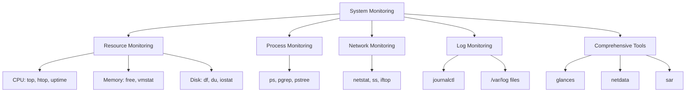

# Ubuntu System Monitoring

## Introduction

System monitoring is a critical skill for any Ubuntu administrator. By effectively monitoring your Ubuntu system, you can:

- Track resource usage (CPU, memory, disk, network)
- Identify performance bottlenecks
- Detect and resolve issues before they become critical
- Plan for capacity upgrades
- Ensure system reliability and stability

This guide will introduce you to various command-line tools and techniques for monitoring your Ubuntu system, helping you gain insights into its performance and health.

## Basic Monitoring Commands

Let's start with some fundamental commands that provide quick insights into your system's status.

### The `top` Command

The `top` command provides a dynamic real-time view of the running system. It displays system summary information and a list of processes currently being managed by the kernel.

```bash
$ top
```

**Output:**
```
top - 14:23:56 up 3 days, 12:45, 1 user, load average: 0.52, 0.58, 0.59
Tasks: 267 total,   1 running, 266 sleeping,   0 stopped,   0 zombie
%Cpu(s):  5.9 us,  1.5 sy,  0.0 ni, 92.1 id,  0.3 wa,  0.0 hi,  0.2 si,  0.0 st
MiB Mem :  15880.8 total,   5623.9 free,   4567.1 used,   5689.8 buff/cache
MiB Swap:   2048.0 total,   2048.0 free,      0.0 used.  10523.2 avail Mem 

  PID USER      PR  NI    VIRT    RES    SHR S  %CPU  %MEM     TIME+ COMMAND       
 1546 user      20   0 3896716 257524 107868 S   4.3   1.6   3:32.28 gnome-shell   
 3213 user      20   0  984300 100084  74328 S   2.3   0.6   0:42.39 firefox       
  986 root      20   0  474212  13568  11776 S   0.7   0.1   0:32.81 Xorg          
    1 root      20   0  168944  13564   8984 S   0.0   0.1   0:07.08 systemd       
```

**Key information in the `top` output:**
- System uptime and load averages (last 1, 5, and 15 minutes)
- Task statistics (total, running, sleeping, etc.)
- CPU usage breakdown
- Memory and swap usage
- List of processes with resource consumption

To exit `top`, press `q`.

### The `htop` Command

`htop` is an enhanced version of `top` with a more user-friendly interface. If it's not installed, you can install it using:

```bash
$ sudo apt install htop
```

Then run:

```bash
$ htop
```

`htop` offers more features than `top`, including:
- Color-coded output
- Visual indicators of CPU, memory, and swap usage
- Ability to scroll horizontally and vertically
- Mouse operation support
- More intuitive process management

### System Load with `uptime`

The `uptime` command shows how long the system has been running, the number of users, and the system load averages.

```bash
$ uptime
```

**Output:**
```
14:25:03 up 3 days, 12:47, 1 user, load average: 0.35, 0.54, 0.57
```

The load average numbers represent the average system load over the last 1, 5, and 15 minutes. In a single-core system, a load average of 1.0 means the CPU is fully utilized. For multi-core systems, divide the load average by the number of cores to determine utilization.

## Memory Monitoring

### Using `free`

The `free` command displays the amount of free and used memory in the system.

```bash
$ free -h
```

**Output:**
```
              total        used        free      shared  buff/cache   available
Mem:           15Gi       4.5Gi       5.4Gi       284Mi       5.5Gi        10Gi
Swap:         2.0Gi          0B       2.0Gi
```

The `-h` flag displays the output in a human-readable format (with units like G for gigabytes).

### Using `vmstat`

The `vmstat` command reports information about processes, memory, paging, block IO, traps, and CPU activity.

```bash
$ vmstat 3 5
```

This runs vmstat every 3 seconds for a total of 5 times.

**Output:**
```
procs -----------memory---------- ---swap-- -----io---- -system-- ------cpu-----
 r  b   swpd   free   buff  cache   si   so    bi    bo   in   cs us sy id wa st
 0  0      0 5536008 923888 4935524    0    0     2     9   85  152  6  2 92  0  0
 0  0      0 5536008 923888 4935524    0    0     0     0  423  766  5  1 94  0  0
 0  0      0 5535752 923888 4935524    0    0     0     0  380  672  5  1 94  0  0
 0  0      0 5535752 923888 4935524    0    0     0     0  374  654  5  1 94  0  0
 0  0      0 5535752 923888 4935524    0    0     0     5  425  745  5  1 94  0  0
```

## Disk Usage Monitoring

### The `df` Command

The `df` command reports file system disk space usage.

```bash
$ df -h
```

**Output:**
```
Filesystem      Size  Used Avail Use% Mounted on
/dev/sda1       234G   45G  178G  21% /
tmpfs           7.9G  1.8M  7.9G   1% /dev/shm
/dev/sda2       512M  6.1M  506M   2% /boot/efi
```

### The `du` Command

The `du` command estimates file space usage. It's useful for finding directories consuming large amounts of disk space.

```bash
$ du -sh /var/log
```

**Output:**
```
128M    /var/log
```

To find the top 5 largest directories in the current location:

```bash
$ du -h --max-depth=1 | sort -hr | head -5
```

**Output:**
```
45G     .
23G     ./home
10G     ./var
8.2G    ./usr
2.1G    ./opt
```

### Monitoring Disk I/O with `iostat`

The `iostat` command reports CPU and I/O statistics for devices and partitions. You'll need to install the `sysstat` package to use it:

```bash
$ sudo apt install sysstat
$ iostat -xz 2
```

**Output:**
```
Linux 5.15.0-67-generic (ubuntu-server)     03/13/2025     _x86_64_    (4 CPU)

avg-cpu:  %user   %nice %system %iowait  %steal   %idle
           5.21    0.00    1.43    0.32    0.00   93.05

Device            r/s     w/s     rkB/s     wkB/s   rrqm/s   wrqm/s  %rrqm  %wrqm r_await w_await aqu-sz rareq-sz wareq-sz  svctm  %util
sda              0.82    2.37     25.45     59.87     0.00     0.76   0.00  24.36    0.51    2.73   0.01    31.12    25.31   0.35   0.11
```

This shows the device I/O statistics updated every 2 seconds.

## Network Monitoring

### Using `netstat`

The `netstat` command displays network connections, routing tables, interface statistics, masquerade connections, and multicast memberships.

```bash
$ netstat -tuln
```

**Output:**
```
Active Internet connections (only servers)
Proto Recv-Q Send-Q Local Address           Foreign Address         State      
tcp        0      0 127.0.0.1:53            0.0.0.0:*               LISTEN     
tcp        0      0 0.0.0.0:22              0.0.0.0:*               LISTEN     
tcp6       0      0 ::1:53                  :::*                    LISTEN     
tcp6       0      0 :::22                   :::*                    LISTEN     
udp        0      0 127.0.0.1:53            0.0.0.0:*                          
udp        0      0 0.0.0.0:67              0.0.0.0:*                          
udp6       0      0 ::1:53                  :::*                               
```

The options used:
- `-t`: Display TCP connections
- `-u`: Display UDP connections
- `-l`: Show only listening sockets
- `-n`: Show numerical addresses instead of resolving hosts and ports

### Network Traffic with `iftop`

`iftop` is a tool that displays bandwidth usage on an interface.

```bash
$ sudo apt install iftop
$ sudo iftop -i eth0
```

This shows real-time network traffic on the eth0 interface.

### Monitoring Network Connections with `ss`

The `ss` command is another utility to investigate sockets, similar to netstat but more efficient.

```bash
$ ss -tuln
```

**Output:**
```
Netid  State   Recv-Q  Send-Q  Local Address:Port  Peer Address:Port Process
udp    UNCONN  0       0       127.0.0.1:53        0.0.0.0:*              
udp    UNCONN  0       0       0.0.0.0:67          0.0.0.0:*              
udp    UNCONN  0       0       [::1]:53            [::]:*                 
tcp    LISTEN  0       4096    127.0.0.1:53        0.0.0.0:*              
tcp    LISTEN  0       128     0.0.0.0:22          0.0.0.0:*              
tcp    LISTEN  0       4096    [::1]:53            [::]:*                 
tcp    LISTEN  0       128     [::]:22             [::]:*                 
```

## Process Monitoring

### Using `ps`

The `ps` command reports a snapshot of current processes.

```bash
$ ps aux | head -10
```

**Output:**
```
USER       PID %CPU %MEM    VSZ   RSS TTY      STAT START   TIME COMMAND
root         1  0.0  0.0 168944 13564 ?        Ss   Mar10   0:07 /sbin/init splash
root         2  0.0  0.0      0     0 ?        S    Mar10   0:00 [kthreadd]
root         3  0.0  0.0      0     0 ?        I<   Mar10   0:00 [rcu_gp]
root         4  0.0  0.0      0     0 ?        I<   Mar10   0:00 [rcu_par_gp]
root         5  0.0  0.0      0     0 ?        I<   Mar10   0:00 [slub_flushwq]
root         6  0.0  0.0      0     0 ?        I<   Mar10   0:00 [netns]
root         8  0.0  0.0      0     0 ?        I<   Mar10   0:00 [kworker/0:0H-events_highpri]
root        10  0.0  0.0      0     0 ?        I<   Mar10   0:00 [mm_percpu_wq]
root        11  0.0  0.0      0     0 ?        S    Mar10   0:00 [rcu_tasks_rude_]
```

The options used:
- `a`: Show processes for all users
- `u`: Display the process's user/owner
- `x`: Show processes not attached to a terminal

### Finding Processes with `pgrep`

Use `pgrep` to find processes by name:

```bash
$ pgrep firefox
```

**Output:**
```
3213
3256
3298
```

### Process Tree with `pstree`

The `pstree` command displays the processes in a tree format.

```bash
$ pstree
```

**Output:**
```
systemd─┬─ModemManager───2*[{ModemManager}]
        ├─NetworkManager───2*[{NetworkManager}]
        ├─accounts-daemon───2*[{accounts-daemon}]
        ├─avahi-daemon───avahi-daemon
        ├─containerd───9*[{containerd}]
        ├─cron
        ├─dbus-daemon
        ├─dockerd───11*[{dockerd}]
        ├─gdm3─┬─gdm-session-wor─┬─gdm-x-session─┬─Xorg
        │      │                 │               ├─gnome-session-b─┬─ssh-agent
        │      │                 │               │                 └─2*[{gnome-session-b}]
        │      │                 │               └─2*[{gdm-x-session}]
        │      │                 └─2*[{gdm-session-wor}]
        │      └─2*[{gdm3}]
        ├─irqbalance───{irqbalance}
        ├─packagekitd───2*[{packagekitd}]
[...]
```

## Advanced Monitoring Tools

### System Activity Reporter with `sar`

The `sar` command collects, reports, or saves system activity information. It's part of the `sysstat` package.

```bash
$ sudo apt install sysstat
$ sar -u 1 5
```

**Output:**
```
Linux 5.15.0-67-generic (ubuntu-server)     03/13/2025     _x86_64_    (4 CPU)

14:40:01        CPU     %user     %nice   %system   %iowait    %steal     %idle
14:40:02        all      5.25      0.00      1.50      0.25      0.00     93.00
14:40:03        all      5.21      0.00      1.40      0.30      0.00     93.09
14:40:04        all      5.15      0.00      1.45      0.33      0.00     93.07
14:40:05        all      5.30      0.00      1.48      0.29      0.00     92.93
14:40:06        all      5.22      0.00      1.52      0.31      0.00     92.95
Average:        all      5.23      0.00      1.47      0.30      0.00     93.01
```

This shows CPU usage statistics updated every 1 second for a total of 5 samples.

### Comprehensive Monitoring with `glances`

`glances` is an advanced, cross-platform monitoring tool that shows a large amount of system information in a single dashboard.

```bash
$ sudo apt install glances
$ glances
```

`glances` provides information about CPU, memory, load, processes, network, disk I/O, and more in a single interface. It's particularly useful for getting a comprehensive overview of system performance.

## Creating a System Monitoring Dashboard with `tmuxinator`

You can create a simple monitoring dashboard using `tmux` or `tmuxinator`. This allows you to view multiple monitoring tools simultaneously.

First, install the required packages:

```bash
$ sudo apt install tmux tmuxinator
```

Create a new tmuxinator configuration:

```bash
$ tmuxinator new system_monitor
```

Edit the configuration file with the following content:

```yaml
name: system_monitor
root: ~/

windows:
  - system:
      layout: tiled
      panes:
        - htop
        - watch -n 1 "free -h"
        - watch -n 1 "df -h"
        - watch -n 1 "netstat -tuln"
```

To start your monitoring dashboard:

```bash
$ tmuxinator start system_monitor
```

## System Monitoring with Visualization Using `netdata`

Netdata is a powerful, real-time performance monitoring solution with a web interface.

```bash
$ sudo apt install -y netdata
```

Once installed, you can access the web interface at `http://localhost:19999` or your server's IP address.

Netdata provides:
- Real-time monitoring (per-second updates)
- Thousands of metrics
- Interactive visualizations
- Zero configuration required
- Minimal system resources usage

## System Log Monitoring

### Viewing System Logs with `journalctl`

For systems using systemd (default in Ubuntu), you can use `journalctl` to view system logs:

```bash
$ journalctl -n 20
```

This shows the last 20 log entries.

To follow logs in real-time (similar to `tail -f`):

```bash
$ journalctl -f
```

To view logs for a specific service:

```bash
$ journalctl -u ssh
```

### Traditional Log Files

Traditional log files are located in the `/var/log` directory. Some important log files include:

```bash
$ sudo tail -n 20 /var/log/syslog
$ sudo tail -n 20 /var/log/auth.log
$ sudo tail -n 20 /var/log/kern.log
```

## Creating Monitoring Scripts

You can create simple bash scripts to automate monitoring tasks. Here's an example script that checks CPU, memory, and disk usage:

```bash
#!/bin/bash
# File: system_health.sh

echo "=== System Health Check ==="
echo "Date: $(date)"
echo ""

echo "--- CPU Usage ---"
top -bn1 | grep "Cpu(s)" | awk '{print $2 + $4 "% used"}'
echo ""

echo "--- Memory Usage ---"
free -h | grep "Mem:" | awk '{print "Total: " $2 "\tUsed: " $3 "\tFree: " $4}'
echo ""

echo "--- Disk Usage ---"
df -h / | grep "/" | awk '{print "Total: " $2 "\tUsed: " $3 "\tFree: " $4 "\tUse%: " $5}'
echo ""

echo "--- System Load ---"
uptime | awk '{print "Load Average: " $(NF-2) " " $(NF-1) " " $NF}'
echo ""

echo "=== End of Report ==="
```

Save this script to a file named `system_health.sh`, make it executable, and run it:

```bash
$ chmod +x system_health.sh
$ ./system_health.sh
```

You can also schedule this script to run periodically using cron:

```bash
$ crontab -e
```

Add the following line to run the script every hour and append output to a log file:

```
0 * * * * /path/to/system_health.sh >> /home/user/system_health_log.txt
```

## Visualizing System Information

Using Mermaid, we can visualize the relationship between different system monitoring tools:



## Summary

Monitoring your Ubuntu system is essential for maintaining optimal performance and preventing issues before they become critical. We've covered a variety of monitoring tools and techniques:

1. **Basic Monitoring**:
   - `top` and `htop` for real-time system overview
   - `uptime` for load averages

2. **Resource-Specific Monitoring**:
   - CPU monitoring with `top`, `htop`, and `sar`
   - Memory monitoring with `free` and `vmstat`
   - Disk usage monitoring with `df` and `du`
   - Disk I/O monitoring with `iostat`

3. **Network Monitoring**:
   - `netstat` and `ss` for connection information
   - `iftop` for bandwidth usage

4. **Process Monitoring**:
   - `ps`, `pgrep`, and `pstree`

5. **Advanced Monitoring**:
   - `glances` for comprehensive system monitoring
   - `netdata` for real-time visualization
   - Custom monitoring scripts
   - Tmux-based monitoring dashboards

By mastering these tools, you'll be well-equipped to monitor, troubleshoot, and optimize your Ubuntu systems.

## Additional Resources

- The [Ubuntu Server Guide](https://ubuntu.com/server/docs)
- The `man` pages for each command (e.g., `man top`)
- Community resources like [Ask Ubuntu](https://askubuntu.com)

## Exercises

1. Set up a tmux-based monitoring dashboard showing CPU, memory, disk, and network usage.
2. Create a bash script that checks if system resources exceed certain thresholds and sends an email alert.
3. Configure `netdata` and explore its web interface.
4. Practice using `journalctl` filters to find specific events in system logs.
5. Set up a cron job to regularly collect system statistics and store them for trend analysis.