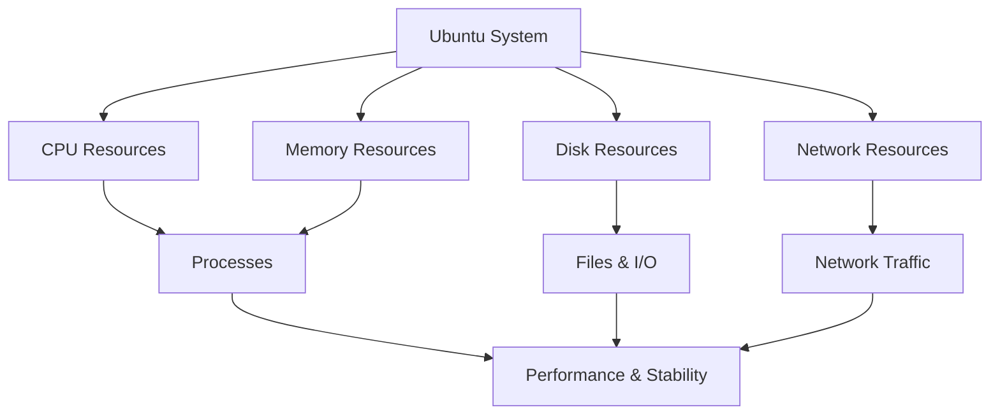

# Ubuntu Resource Monitoring

## Introduction

Resource monitoring is a critical aspect of Ubuntu system administration. It involves tracking and analyzing the usage of system resources such as CPU, memory, disk, and network to ensure optimal performance, identify bottlenecks, and troubleshoot issues. Effective resource monitoring helps administrators make informed decisions about capacity planning, performance optimization, and system maintenance.

In this guide, we'll explore various tools and techniques for monitoring resources in Ubuntu, ranging from command-line utilities to graphical applications. Whether you're managing a personal workstation or a production server, understanding how to monitor system resources is essential for maintaining a healthy Ubuntu system.

## Why Monitor System Resources?

Before diving into the tools and techniques, let's understand why resource monitoring is important:

- **Performance Optimization**: Identifying resource bottlenecks helps improve system performance
- **Capacity Planning**: Understanding resource usage trends helps plan for future hardware needs
- **Troubleshooting**: Diagnosing issues by correlating resource usage with system problems
- **Security**: Detecting unusual resource consumption that might indicate security breaches
- **Application Management**: Ensuring applications have sufficient resources to function properly

## Basic Command-Line Monitoring Tools

Ubuntu comes with several built-in command-line tools for monitoring system resources. Let's explore them one by one.

### top - Process Activity Monitor

The `top` command provides a dynamic real-time view of the running system, displaying information about CPU usage, memory usage, running processes, and more.

```bash
top
```

Example output:

```
top - 14:30:25 up 5 days, 2:34, 2 users, load average: 0.42, 0.55, 0.59
Tasks: 255 total,   1 running, 254 sleeping,   0 stopped,   0 zombie
%Cpu(s):  5.9 us,  2.0 sy,  0.0 ni, 91.7 id,  0.3 wa,  0.0 hi,  0.1 si,  0.0 st
MiB Mem :  16096.2 total,   7852.0 free,   3318.8 used,   4925.4 buff/cache
MiB Swap:   2048.0 total,   2048.0 free,      0.0 used.  12021.4 avail Mem 

  PID USER      PR  NI    VIRT    RES    SHR S  %CPU  %MEM     TIME+ COMMAND      
 1145 root      20   0  715556 108800  71132 S   6.0   0.7   5:23.34 Xorg         
 2145 ubuntu    20   0 4904636 286676 109448 S   2.7   1.7  14:28.38 gnome-shell  
 2976 ubuntu    20   0  906156  51532  38492 S   1.0   0.3   0:13.57 gnome-terminal
```

Key sections of the `top` output:
- **System summary**: Shows uptime, users, and load averages
- **Task summary**: Displays the total number of processes and their states
- **CPU usage**: Shows CPU utilization by different categories
- **Memory usage**: Displays physical and swap memory usage
- **Process list**: Shows details about individual processes

You can use the following keyboard shortcuts within `top`:
- Press `q` to quit
- Press `h` for help
- Press `k` to kill a process (you'll be prompted for the PID)
- Press `F` to configure the columns displayed
- Press `o` to change the sort order

### htop - Enhanced Process Viewer

`htop` is an improved version of `top` with a more user-friendly interface and additional features. You may need to install it first:

```bash
sudo apt install htop
```

To run htop:

```bash
htop
```

`htop` provides a colorful, easier-to-read interface with the ability to scroll horizontally and vertically, kill processes using the keyboard, and customize the display without editing configuration files.

### free - Memory Usage

The `free` command displays the amount of free and used memory in the system:

```bash
free -h
```

Example output:

```
              total        used        free      shared  buff/cache   available
Mem:           15Gi       3.2Gi       7.7Gi       293Mi       4.8Gi        12Gi
Swap:          2.0Gi          0B       2.0Gi
```

The `-h` flag makes the output human-readable (using units like M for megabytes and G for gigabytes).

### df - Disk Space Usage

To check disk space usage, use the `df` command:

```bash
df -h
```

Example output:

```
Filesystem      Size  Used Avail Use% Mounted on
/dev/sda1       237G   45G  181G  20% /
tmpfs           7.8G  1.7M  7.8G   1% /dev/shm
/dev/sda2       511M  6.1M  505M   2% /boot/efi
```

This shows disk usage for each mounted filesystem. The `-h` flag provides human-readable output.

### du - Directory Space Usage

To check the size of directories, use `du`:

```bash
du -sh /var/log
```

Example output:

```
76M    /var/log
```

The `-s` flag gives a summary (just the total) and `-h` provides human-readable sizes.

### vmstat - System Activity Monitor

The `vmstat` command reports information about processes, memory, paging, block I/O, traps, and CPU activity.

```bash
vmstat 1 5
```

This runs vmstat every 1 second for 5 reports. Example output:

```
procs -----------memory---------- ---swap-- -----io---- -system-- ------cpu-----
 r  b   swpd   free   buff  cache   si   so    bi    bo   in   cs us sy id wa st
 0  0      0 7932724 583160 4457724    0    0    46    24  118  244  6  2 92  0  0
 0  0      0 7932724 583160 4457724    0    0     0     0  294  507  1  0 99  0  0
 0  0      0 7932724 583160 4457724    0    0     0     0  290  485  1  0 99  0  0
 0  0      0 7932724 583160 4457724    0    0     0     0  267  449  0  0 100  0  0
 0  0      0 7932724 583160 4457724    0    0     0    36  294  511  1  0 99  0  0
```

### iostat - I/O Statistics

The `iostat` command reports CPU and I/O statistics for devices and partitions. You may need to install it first:

```bash
sudo apt install sysstat
```

To run iostat:

```bash
iostat -x 1 5
```

This shows extended statistics (-x) every 1 second for 5 reports.

### netstat - Network Statistics

The `netstat` command displays network connections, routing tables, interface statistics, masquerade connections, and multicast memberships. You may need to install it:

```bash
sudo apt install net-tools
```

To list all open ports:

```bash
netstat -tuln
```

Example output:

```
Active Internet connections (only servers)
Proto Recv-Q Send-Q Local Address           Foreign Address         State      
tcp        0      0 127.0.0.1:631           0.0.0.0:*               LISTEN     
tcp        0      0 127.0.0.1:5432          0.0.0.0:*               LISTEN     
tcp6       0      0 ::1:631                 :::*                    LISTEN     
udp        0      0 0.0.0.0:68              0.0.0.0:*                          
```

Options used:
- `-t`: Show TCP connections
- `-u`: Show UDP connections
- `-l`: Show only listening sockets
- `-n`: Don't resolve names (faster)

## Advanced Monitoring Tools

While basic command-line tools are useful for quick checks, more advanced tools provide deeper insights and better visualization of resource usage.

### sar - System Activity Reporter

The `sar` command collects, reports, and saves system activity information. It's part of the `sysstat` package:

```bash
sudo apt install sysstat
```

Enable the sysstat data collection service:

```bash
sudo systemctl enable sysstat
sudo systemctl start sysstat
```

View CPU usage statistics:

```bash
sar -u 1 5
```

View memory usage:

```bash
sar -r 1 5
```

View disk I/O statistics:

```bash
sar -b 1 5
```

The `sar` command can also access historical data, making it valuable for analyzing performance trends over time.

### atop - Advanced System Monitor

`atop` is an interactive monitor that can report the activity of all processes, even those that have already terminated.

```bash
sudo apt install atop
```

To run atop:

```bash
atop
```

`atop` records resource usage by all processes and provides historical data as well as real-time monitoring.

### iotop - I/O Monitor

`iotop` displays I/O usage information by processes, similar to top but focused on disk I/O.

```bash
sudo apt install iotop
```

To run iotop:

```bash
sudo iotop
```

### nmon - Performance Monitor

`nmon` (Nigel's Monitor) is a performance monitoring tool that can display CPU, memory, network, disk, file system, and more.

```bash
sudo apt install nmon
```

To run nmon:

```bash
nmon
```

Press the following keys to show different statistics:
- `c`: CPU statistics
- `m`: Memory statistics
- `d`: Disk statistics
- `n`: Network statistics
- `t`: Top processes
- `q`: Quit

### Graphical Monitoring Tools

Ubuntu offers several graphical tools for those who prefer a visual representation of system resources.

#### GNOME System Monitor

GNOME System Monitor is the default graphical monitoring tool in Ubuntu with GNOME desktop:

```bash
gnome-system-monitor
```

It provides tabs for:
- Processes: Lists all running processes with resource usage
- Resources: Shows graphs of CPU, memory, and network usage
- File Systems: Displays disk usage

#### Stacer

Stacer is a modern system optimizer and monitoring tool with a clean interface:

```bash
sudo apt install stacer
```

Stacer includes:
- System cleaner
- Startup apps manager
- Services manager
- Process monitor
- Resource usage graphs
- APT package manager integration

#### htop in Terminal

For users who prefer terminal-based applications but want graphical elements, `htop` provides a balance:

```bash
sudo apt install htop
```

To run htop:

```bash
htop
```

## Continuous Monitoring and Alerting

For production environments or servers, continuous monitoring and alerting are essential.

### Setting Up Monitoring with Prometheus and Grafana

For a more comprehensive monitoring solution, Prometheus (for data collection) and Grafana (for visualization) are popular options:

1. Install Prometheus:

```bash
sudo apt update
sudo apt install prometheus prometheus-node-exporter
```

2. Install Grafana:

```bash
sudo apt install -y software-properties-common
sudo add-apt-repository "deb https://packages.grafana.com/oss/deb stable main"
wget -q -O - https://packages.grafana.com/gpg.key | sudo apt-key add -
sudo apt update
sudo apt install grafana
```

3. Start and enable services:

```bash
sudo systemctl enable prometheus prometheus-node-exporter grafana-server
sudo systemctl start prometheus prometheus-node-exporter grafana-server
```

4. Access Grafana at http://your-server-ip:3000 (default credentials: admin/admin)

5. Add Prometheus as a data source in Grafana and import dashboard templates for Ubuntu/Linux systems.

This setup provides:
- Historical data storage
- Custom dashboards
- Alerting capabilities
- Remote monitoring

### Monitoring with Nagios

Nagios is a powerful monitoring system that can alert administrators when systems encounter problems:

```bash
sudo apt install nagios4
```

After installation, you'll need to configure Nagios to monitor your specific resources and set up alert thresholds.

## Creating a Simple Monitoring Script

For basic automated monitoring, you can create a simple bash script:

```bash
#!/bin/bash

# Simple resource monitoring script

echo "=== System Resource Monitor ==="
echo "Date: $(date)"
echo ""

echo "=== CPU Usage ==="
top -bn1 | grep "Cpu(s)" | sed "s/.*, *\([0-9.]*\)%* id.*/\1/" | awk '{print 100 - $1"%"}'
echo ""

echo "=== Memory Usage ==="
free -h | grep "Mem:"
echo ""

echo "=== Disk Usage ==="
df -h /
echo ""

echo "=== Most Resource-Intensive Processes ==="
ps aux --sort=-%cpu | head -6
echo ""

echo "=== System Load ==="
uptime
echo ""
```

Save this script as `monitor.sh`, make it executable with `chmod +x monitor.sh`, and run it with `./monitor.sh`.

You can schedule it to run periodically using cron:

```bash
# Run every 15 minutes and append to log file
*/15 * * * * /path/to/monitor.sh >> /path/to/resource_log.txt
```

## Visualizing Resource Usage with Simple Diagrams

Understanding resource relationships can be easier with diagrams:



## Best Practices for Resource Monitoring

1. **Establish Baselines**: Document normal resource usage patterns to identify abnormal behavior.

2. **Set Appropriate Thresholds**: Configure alerts based on meaningful thresholds to avoid alert fatigue.

3. **Monitor Trends Over Time**: Look for gradual changes that might indicate growing problems.

4. **Keep Historical Data**: Maintain monitoring history to analyze patterns and for capacity planning.

5. **Document Monitoring Procedures**: Create clear documentation for your monitoring setup and response procedures.

6. **Automate When Possible**: Use scripts and scheduled tasks to automate routine monitoring activities.

7. **Monitor from Multiple Perspectives**: Don't rely solely on one metric; consider the relationship between different resources.

8. **Regular Maintenance**: Regularly review and update your monitoring tools and configurations.

## Troubleshooting Common Resource Issues

### High CPU Usage

If you notice high CPU usage:

1. Identify the process consuming CPU:
   ```bash
   top -o %CPU
   ```

2. Investigate the process further:
   ```bash
   ps -p <PID> -o cmd=
   ```

3. Take appropriate action (optimize, restart, or limit the process).

### Memory Leaks

For memory-related issues:

1. Check memory usage:
   ```bash
   free -h
   ```

2. Find processes consuming excessive memory:
   ```bash
   ps aux --sort=-%mem | head
   ```

3. Use tools like `valgrind` for detailed memory analysis of specific applications.

### Disk Space Issues

When dealing with disk space problems:

1. Find large files:
   ```bash
   sudo find / -type f -size +100M -exec ls -lh {} \; | sort -rh
   ```

2. Find directories using the most space:
   ```bash
   sudo du -h --max-depth=1 / | sort -hr
   ```

3. Clean up unnecessary files:
   ```bash
   sudo apt clean
   sudo apt autoremove
   ```

## Summary

Effective resource monitoring is crucial for maintaining healthy Ubuntu systems. In this guide, we've explored:

- Basic command-line monitoring tools like `top`, `free`, and `df`
- Advanced monitoring tools like `sar`, `atop`, and `iotop`
- Graphical monitoring applications
- Setting up continuous monitoring with Prometheus and Grafana
- Creating custom monitoring scripts
- Best practices and troubleshooting techniques

By implementing a comprehensive monitoring strategy, you can ensure optimal performance, quickly identify and resolve issues, and make informed decisions about system management and capacity planning.

## Additional Resources

- [Ubuntu Server Guide - Monitoring](https://ubuntu.com/server/docs)
- [Prometheus Documentation](https://prometheus.io/docs/introduction/overview/)
- [Grafana Documentation](https://grafana.com/docs/grafana/latest/)
- [Linux Performance](http://www.brendangregg.com/linuxperf.html) by Brendan Gregg

## Exercises

1. Set up `htop` and customize its display to show the information most relevant to your needs.

2. Create a bash script that monitors disk space and sends an email alert when usage exceeds 80%.

3. Install and configure Prometheus and Grafana to monitor a local Ubuntu system.

4. Use `sar` to collect CPU, memory, and disk data over 24 hours, then analyze the patterns to identify peak usage times.

5. Create a cron job that logs resource usage to a file, then write a simple script to parse and summarize that log file.