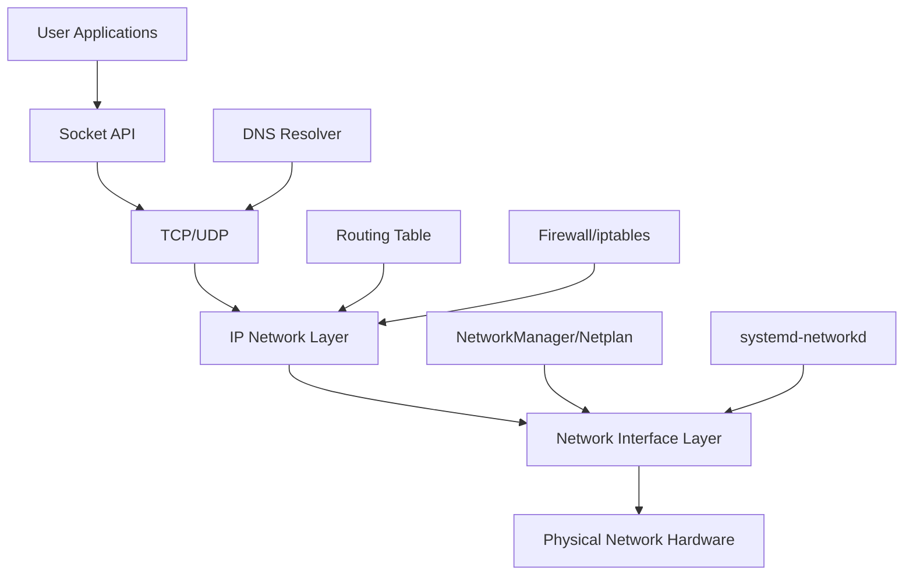

# Ubuntu Network Basics

## Introduction

Networking is a fundamental aspect of modern computing systems. For Ubuntu users, understanding how to configure, manage, and troubleshoot network connections is an essential skill. This guide introduces the basic concepts of networking in Ubuntu, providing you with the knowledge needed to effectively manage network connections, diagnose issues, and perform common networking tasks.

Ubuntu provides robust networking capabilities through a combination of command-line tools and graphical interfaces. Whether you're setting up a home server, configuring a workstation in an office environment, or just wanting to understand how your system communicates with the internet, these basics will help you build a solid foundation.

## Network Configuration in Ubuntu

### Network Interfaces

Every network connection in Ubuntu is managed through a network interface. These interfaces can be physical (like Ethernet cards) or virtual (like VPN connections).

To list all available network interfaces on your system, use the `ip` command:

```bash
ip link show
```

Example output:
```
1: lo: <LOOPBACK,UP,LOWER_UP> mtu 65536 qdisc noqueue state UNKNOWN mode DEFAULT group default qlen 1000
    link/loopback 00:00:00:00:00:00 brd 00:00:00:00:00:00
2: enp0s3: <BROADCAST,MULTICAST,UP,LOWER_UP> mtu 1500 qdisc fq_codel state UP mode DEFAULT group default qlen 1000
    link/ether 08:00:27:a6:b9:7c brd ff:ff:ff:ff:ff:ff
```

In this output:
- `lo` is the loopback interface (used for local communication within your system)
- `enp0s3` is an Ethernet interface (the naming convention varies based on hardware)

### Understanding Interface Names

In modern Ubuntu versions, network interfaces follow a predictable naming scheme:
- `en` prefix for Ethernet devices
- `wl` prefix for wireless (WiFi) devices
- `ww` prefix for wireless WAN devices

The rest of the name typically indicates the bus, slot, and function information.

### Checking IP Configuration

To view the IP address configuration for your interfaces, use:

```bash
ip addr show
```

Example output:
```
1: lo: <LOOPBACK,UP,LOWER_UP> mtu 65536 qdisc noqueue state UNKNOWN group default qlen 1000
    link/loopback 00:00:00:00:00:00 brd 00:00:00:00:00:00
    inet 127.0.0.1/8 scope host lo
       valid_lft forever preferred_lft forever
    inet6 ::1/128 scope host 
       valid_lft forever preferred_lft forever
2: enp0s3: <BROADCAST,MULTICAST,UP,LOWER_UP> mtu 1500 qdisc fq_codel state UP group default qlen 1000
    link/ether 08:00:27:a6:b9:7c brd ff:ff:ff:ff:ff:ff
    inet 192.168.1.100/24 brd 192.168.1.255 scope global dynamic noprefixroute enp0s3
       valid_lft 86386sec preferred_lft 86386sec
    inet6 fe80::a00:27ff:fea6:b97c/64 scope link 
       valid_lft forever preferred_lft forever
```

This shows:
- The loopback interface (`lo`) with the standard 127.0.0.1 IPv4 address
- The Ethernet interface (`enp0s3`) with an IPv4 address of 192.168.1.100/24 (CIDR notation)

## Network Configuration Methods

Ubuntu offers multiple ways to configure networking:

### 1. Netplan (Modern Ubuntu Method)

Starting with Ubuntu 18.04, Netplan became the default network configuration tool. It uses YAML files to define network configuration.

The configuration files are located in `/etc/netplan/` with filenames like `01-netcfg.yaml` or `50-cloud-init.yaml`.

Here's a simple example for configuring a static IP address:

```yaml
network:
  version: 2
  renderer: networkd
  ethernets:
    enp0s3:
      addresses:
        - 192.168.1.100/24
      gateway4: 192.168.1.1
      nameservers:
        addresses: [8.8.8.8, 8.8.4.4]
```

After modifying a Netplan configuration file, apply the changes with:

```bash
sudo netplan apply
```

### 2. NetworkManager (Desktop-oriented)

NetworkManager is a dynamic network control and configuration daemon, particularly useful in desktop environments. It provides a graphical interface and also can be controlled via the `nmcli` command-line tool.

To list connections with NetworkManager:

```bash
nmcli connection show
```

Example output:
```
NAME                UUID                                  TYPE      DEVICE 
Wired connection 1  e8b68c14-1dec-4a9a-87a3-ac7a4ce4ed91  ethernet  enp0s3 
```

To connect to a specific network:

```bash
nmcli connection up "Wired connection 1"
```

### 3. systemd-networkd (Server-oriented)

For server installations, systemd-networkd provides a network management daemon. It's controlled through configuration files in `/etc/systemd/network/`.

## Basic Networking Commands

Here are essential commands for network troubleshooting and management:

### Connectivity Testing

**Ping**: Test basic connectivity to a host:

```bash
ping google.com
```

Example output:
```
PING google.com (142.250.185.174) 56(84) bytes of data.
64 bytes from sfo03s29-in-f14.1e100.net (142.250.185.174): icmp_seq=1 ttl=119 time=8.76 ms
64 bytes from sfo03s29-in-f14.1e100.net (142.250.185.174): icmp_seq=2 ttl=119 time=8.89 ms
^C
--- google.com ping statistics ---
2 packets transmitted, 2 received, 0% packet loss, time 1001ms
rtt min/avg/max/mdev = 8.762/8.826/8.891/0.064 ms
```

**Traceroute**: Show the path packets take to reach a destination:

```bash
traceroute google.com
```

Example output:
```
traceroute to google.com (142.250.185.174), 30 hops max, 60 byte packets
 1  _gateway (192.168.1.1)  1.263 ms  1.148 ms  1.128 ms
 2  96.120.89.17 (96.120.89.17)  10.776 ms  10.756 ms  10.736 ms
 3  * * *
 4  xe-9-0-7-0-sur01.santaclara.ca.sfba.comcast.net (68.85.132.113)  14.440 ms  14.417 ms  14.397 ms
 5  po-300-xar02.santaclara.ca.sfba.comcast.net (162.151.78.241)  12.874 ms  12.853 ms  12.839 ms
 6  be-32271-cs02.sunnyvale.ca.ibone.comcast.net (96.110.41.229)  14.520 ms  13.021 ms  14.495 ms
 7  be-1311-cr11.sunnyvale.ca.ibone.comcast.net (96.110.36.145)  14.474 ms  14.453 ms  14.429 ms
 8  be-301-cr11.9greatoaks.ca.ibone.comcast.net (96.110.37.222)  13.204 ms  11.732 ms  11.715 ms
 9  be-304-cr11.losangeles.ca.ibone.comcast.net (96.110.37.58)  25.090 ms  25.073 ms  28.249 ms
10  be-33652-pe02.losangeles.ca.ibone.comcast.net (96.110.38.34)  27.619 ms  27.601 ms  27.582 ms
11  50.242.151.22 (50.242.151.22)  27.566 ms  8.991 ms  9.528 ms
12  142.251.50.78 (142.251.50.78)  9.063 ms  9.041 ms 74.125.243.10 (74.125.243.10)  9.020 ms
13  108.170.247.33 (108.170.247.33)  9.461 ms 142.251.50.221 (142.251.50.221)  8.979 ms  8.960 ms
14  142.250.232.127 (142.250.232.127)  8.942 ms  8.927 ms  8.908 ms
15  sfo03s29-in-f14.1e100.net (142.250.185.174)  8.895 ms  8.874 ms  8.859 ms
```

### Network Diagnostics

**Host and DNS Lookup**:

```bash
host google.com
```

Example output:
```
google.com has address 142.250.185.174
google.com has IPv6 address 2607:f8b0:4005:808::200e
google.com mail is handled by 10 smtp.google.com.
```

**Network Statistics**:

```bash
ss -tuln
```

Example output:
```
Netid   State     Recv-Q    Send-Q        Local Address:Port       Peer Address:Port    Process  
udp     UNCONN    0         0             127.0.0.53%lo:53              0.0.0.0:*                
udp     UNCONN    0         0             0.0.0.0:68                    0.0.0.0:*                
tcp     LISTEN    0         4096          127.0.0.53%lo:53              0.0.0.0:*                
tcp     LISTEN    0         128           0.0.0.0:22                    0.0.0.0:*                
tcp     LISTEN    0         128                 [::]:22                    [::]:*  
```

### Network Information

**Network Interface Details**:

```bash
ethtool enp0s3
```

Example output:
```
Settings for enp0s3:
	Supported ports: [ TP ]
	Supported link modes:   10baseT/Half 10baseT/Full 
	                        100baseT/Half 100baseT/Full 
	                        1000baseT/Full 
	Supported pause frame use: No
	Supports auto-negotiation: Yes
	Supported FEC modes: Not reported
	Advertised link modes:  10baseT/Half 10baseT/Full 
	                        100baseT/Half 100baseT/Full 
	                        1000baseT/Full 
	Advertised pause frame use: No
	Advertised auto-negotiation: Yes
	Advertised FEC modes: Not reported
	Speed: 1000Mb/s
	Duplex: Full
	Port: Twisted Pair
	PHYAD: 0
	Transceiver: internal
	Auto-negotiation: on
	MDI-X: off (auto)
	Supports Wake-on: umbg
	Wake-on: d
	Current message level: 0x00000007 (7)
			       drv probe link
	Link detected: yes
```

## Network Architecture Overview

Understanding Ubuntu's network architecture helps in troubleshooting and advanced configurations.



This diagram shows how data flows from applications through the network stack to the physical hardware, with various management tools controlling different aspects of the network.

## Practical Examples

### Example 1: Configuring a Static IP with Netplan

Let's say you want to set a static IP for a server running Ubuntu 20.04:

1. Create or edit the Netplan configuration file:

```bash
sudo nano /etc/netplan/01-netcfg.yaml
```

2. Add the following configuration:

```yaml
network:
  version: 2
  renderer: networkd
  ethernets:
    enp0s3:
      addresses:
        - 192.168.1.50/24
      gateway4: 192.168.1.1
      nameservers:
        addresses: [8.8.8.8, 1.1.1.1]
```

3. Apply the configuration:

```bash
sudo netplan apply
```

4. Verify the changes:

```bash
ip addr show enp0s3
```

### Example 2: Connecting to a WiFi Network Using NetworkManager

For desktop users who need to connect to a wireless network:

1. List available WiFi networks:

```bash
nmcli device wifi list
```

2. Connect to a WiFi network:

```bash
nmcli device wifi connect "NetworkName" password "NetworkPassword"
```

3. Verify the connection:

```bash
nmcli connection show
```

### Example 3: Basic Network Troubleshooting

If you're having network issues, follow these steps:

1. Check if the interface is up:

```bash
ip link show enp0s3
```

2. Verify IP configuration:

```bash
ip addr show enp0s3
```

3. Test local connectivity:

```bash
ping 127.0.0.1
```

4. Test gateway connectivity:

```bash
ping $(ip route | grep default | awk '{print $3}')
```

5. Test DNS resolution:

```bash
host google.com
```

6. Check routing:

```bash
ip route show
```

## Advanced Networking Concepts

### Ubuntu Firewall (UFW)

Ubuntu comes with a simple firewall configuration tool called UFW (Uncomplicated Firewall). It's a user-friendly interface for managing iptables.

Basic UFW commands:

```bash
# Enable UFW
sudo ufw enable

# Allow SSH connections
sudo ufw allow ssh

# Allow specific port
sudo ufw allow 80/tcp

# Check status
sudo ufw status
```

### Network Namespaces

For advanced users, Ubuntu supports network namespaces, which provide isolated network environments:

```bash
# Create a new namespace
sudo ip netns add myns

# List namespaces
ip netns list

# Execute commands in a namespace
sudo ip netns exec myns ip addr
```

## Summary

This guide covered the fundamentals of networking in Ubuntu, including:

- Understanding and identifying network interfaces
- Different configuration methods (Netplan, NetworkManager, systemd-networkd)
- Essential networking commands for diagnostics and troubleshooting
- Practical examples for common networking tasks
- Introduction to advanced concepts like UFW and network namespaces

By mastering these basics, you'll be well-equipped to manage network configurations in Ubuntu for both desktop and server environments.

## Additional Resources

To further enhance your Ubuntu networking knowledge:

1. Explore the Ubuntu Server Guide (especially the Networking section)
2. Practice with the various commands mentioned in this guide
3. Try setting up different network configurations in a test environment

## Practice Exercises

1. Configure a static IP address for your Ubuntu system using Netplan.
2. Set up port forwarding through UFW for a web server.
3. Create a network bridge to connect a virtual machine to your physical network.
4. Use `tcpdump` to capture and analyze network traffic on your system.
5. Configure IPv6 on your Ubuntu system alongside IPv4.