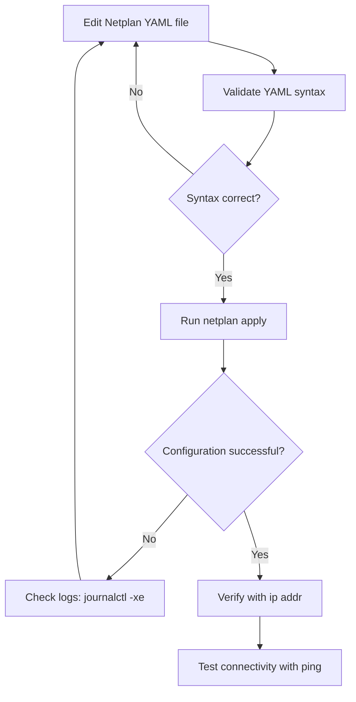

# Ubuntu Network Configuration

## Introduction

Network configuration is a fundamental skill for any Ubuntu system administrator or user. Whether you're setting up a home server, configuring a workstation in a corporate environment, or deploying cloud instances, understanding how to properly configure network settings is essential.

In this guide, we'll explore Ubuntu's networking system, focusing on how to configure network interfaces, set up static IP addresses, manage DNS settings, and troubleshoot common network issues. Ubuntu uses Netplan as its network configuration tool starting from version 18.04, which we'll cover in detail.

## Network Configuration Basics

### Understanding Network Interfaces

Before diving into configuration, let's understand the basic network interfaces you might encounter on an Ubuntu system:

- **eth0, eth1, etc.** - Traditional names for Ethernet interfaces (older systems)
- **ens33, enp0s3, etc.** - Modern predictable network interface names (newer systems)
- **lo** - Loopback interface (always present)
- **wlan0, wlp2s0, etc.** - Wireless network interfaces

You can view your network interfaces using the `ip` command:

```bash
ip addr show
```

Example output:

```
1: lo: <LOOPBACK,UP,LOWER_UP> mtu 65536 qdisc noqueue state UNKNOWN group default qlen 1000
    link/loopback 00:00:00:00:00:00 brd 00:00:00:00:00:00
    inet 127.0.0.1/8 scope host lo
       valid_lft forever preferred_lft forever
    inet6 ::1/128 scope host 
       valid_lft forever preferred_lft forever
2: enp0s3: <BROADCAST,MULTICAST,UP,LOWER_UP> mtu 1500 qdisc fq_codel state UP group default qlen 1000
    link/ether 08:00:27:a9:b2:d1 brd ff:ff:ff:ff:ff:ff
    inet 192.168.1.100/24 brd 192.168.1.255 scope global dynamic enp0s3
       valid_lft 85559sec preferred_lft 85559sec
    inet6 fe80::a00:27ff:fea9:b2d1/64 scope link 
       valid_lft forever preferred_lft forever
```

## Netplan - Ubuntu's Network Configuration Tool

Since Ubuntu 18.04, Netplan has become the standard way to configure networking. Netplan uses YAML files to define network configuration, which are then rendered into configurations for the chosen backend (either NetworkManager or systemd-networkd).

### Netplan Configuration Files

Netplan configuration files are stored in the following locations:
- `/etc/netplan/*.yaml`

The main configuration file is usually named:
- `/etc/netplan/01-netcfg.yaml` or
- `/etc/netplan/50-cloud-init.yaml` (on cloud instances) or
- `/etc/netplan/00-installer-config.yaml` (on desktop installations)

### Basic Netplan Structure

Netplan YAML files follow this basic structure:

```yaml
network:
  version: 2
  renderer: networkd  # or NetworkManager
  ethernets:
    # Ethernet configuration
  wifis:
    # WiFi configuration
  bridges:
    # Bridge configuration
  bonds:
    # Bond configuration
```

## Configuring a Static IP Address

Let's look at how to configure a static IP address using Netplan:

1. Edit the Netplan configuration file:

```bash
sudo nano /etc/netplan/01-netcfg.yaml
```

2. Add the following configuration (adjust according to your network interface and desired IP):

```yaml
network:
  version: 2
  renderer: networkd
  ethernets:
    enp0s3:
      addresses:
        - 192.168.1.100/24
      routes:
        - to: default
          via: 192.168.1.1
      nameservers:
        addresses: [8.8.8.8, 8.8.4.4]
```

This configuration:
- Sets a static IP of 192.168.1.100 with a subnet mask of 255.255.255.0 (/24)
- Sets the default gateway to 192.168.1.1
- Uses Google's DNS servers (8.8.8.8 and 8.8.4.4)

3. Apply the configuration:

```bash
sudo netplan apply
```

### Using DHCP

If you prefer to use DHCP instead of a static IP:

```yaml
network:
  version: 2
  renderer: networkd
  ethernets:
    enp0s3:
      dhcp4: true
```

## Configuring Wi-Fi Networks

For wireless network configuration, use the `wifis` section in Netplan:

```yaml
network:
  version: 2
  renderer: networkd
  wifis:
    wlp2s0:
      dhcp4: true
      access-points:
        "My-WiFi-SSID":
          password: "my-wifi-password"
```

For security reasons, you might want to protect the file containing your WiFi password:

```bash
sudo chmod 600 /etc/netplan/01-netcfg.yaml
```

## Advanced Network Configurations

### Bonding Network Interfaces

Bonding allows you to combine multiple network interfaces into a single logical "bonded" interface for redundancy or increased throughput:

```yaml
network:
  version: 2
  renderer: networkd
  ethernets:
    enp0s3:
      dhcp4: false
    enp0s8:
      dhcp4: false
  bonds:
    bond0:
      interfaces: [enp0s3, enp0s8]
      addresses: [192.168.1.100/24]
      gateway4: 192.168.1.1
      nameservers:
        addresses: [8.8.8.8, 8.8.4.4]
      parameters:
        mode: active-backup
        primary: enp0s3
```

### Creating Network Bridges

Bridges are useful for virtual machine setups like KVM or container technologies:

```yaml
network:
  version: 2
  renderer: networkd
  ethernets:
    enp0s3:
      dhcp4: false
  bridges:
    br0:
      interfaces: [enp0s3]
      addresses: [192.168.1.100/24]
      gateway4: 192.168.1.1
      nameservers:
        addresses: [8.8.8.8, 8.8.4.4]
      parameters:
        stp: true
        forward-delay: 4
```

## Network Configuration Workflow

Here's a diagram of the typical Ubuntu network configuration workflow:



## DNS Configuration

### Setting DNS Servers

DNS servers can be specified in the Netplan configuration file:

```yaml
network:
  version: 2
  renderer: networkd
  ethernets:
    enp0s3:
      addresses: [192.168.1.100/24]
      routes:
        - to: default
          via: 192.168.1.1
      nameservers:
        search: [example.com, local.lan]
        addresses: [8.8.8.8, 8.8.4.4]
```

The `search` domains allow you to use short hostnames instead of fully qualified domain names within those domains.

### Checking DNS Resolution

You can verify DNS resolution using the `dig` or `nslookup` commands:

```bash
dig google.com
```

```bash
nslookup ubuntu.com
```

## Troubleshooting Network Issues

### Common Commands for Network Troubleshooting

Here are some essential commands for diagnosing network problems:

1. Check interface status:
```bash
ip addr show
```

2. Test connectivity:
```bash
ping -c 4 8.8.8.8
```

3. Trace network route:
```bash
traceroute google.com
```

4. Check open ports:
```bash
sudo netstat -tuln
```

5. Verify DNS resolution:
```bash
nslookup google.com
```

6. Restart networking:
```bash
sudo netplan apply
```

7. Check network logs:
```bash
journalctl -u systemd-networkd
```

### Common Network Issues and Solutions

| Issue | Possible Cause | Solution |
|-------|----------------|----------|
| No IP address | DHCP failure or misconfiguration | Check DHCP server or verify static IP settings |
| Cannot reach internet | Default gateway issue | Verify gateway configuration and connectivity |
| DNS resolution failure | Incorrect DNS servers | Check nameserver configuration |
| Interface not up | Hardware or driver issue | Use `ip link set dev INTERFACE up` |
| Inconsistent connectivity | Network interface issues | Try `sudo ethtool INTERFACE` to check link status |

## Netplan Command Reference

| Command | Description |
|---------|-------------|
| `sudo netplan generate` | Generate configuration files for the renderer |
| `sudo netplan apply` | Apply configuration changes |
| `sudo netplan try` | Try configuration with a timeout for rollback |
| `netplan --debug generate` | Debug Netplan configuration generation |

## Network Interface Naming Scheme

Ubuntu uses predictable network interface names following the systemd/udev scheme:

- **en** - Ethernet
- **wl** - WLAN (Wireless LAN)
- **ww** - WWAN (Wireless WAN)

Followed by:
- **o** - On-board device
- **s** - Hotplug slot
- **p** - PCI geographic location
- **x** - MAC address

For example, `enp0s3` indicates an Ethernet device on PCI bus 0, slot 3.

If you prefer the old naming scheme (eth0, wlan0), you can disable predictable names by adding `net.ifnames=0 biosdevname=0` to your kernel command line in GRUB.

## Summary

In this guide, we've covered how to configure networking on Ubuntu systems using Netplan. We've explored:

- Basic network interface management
- Static IP configuration
- DHCP setup
- Wi-Fi configuration
- Advanced settings like bonding and bridging
- DNS configuration
- Troubleshooting techniques

Understanding network configuration is crucial for managing Ubuntu systems effectively. The switch to Netplan has made configuration more structured and consistent, with the power of YAML and the ability to apply configurations before committing to them.

## Exercises

1. Configure your Ubuntu system with a static IP address using Netplan.
2. Set up a bridge network interface for virtual machine connectivity.
3. Create a network bond for redundancy using two network interfaces.
4. Configure a system to use both a wired and wireless connection with proper routing.
5. Write a Netplan configuration that uses one DNS server for one domain and another DNS server for everything else.

## Additional Resources

- [Ubuntu Server Guide - Networking](https://ubuntu.com/server/docs/network-configuration)
- [Netplan Reference Documentation](https://netplan.io/reference)
- [Ubuntu Wiki - Network Configuration](https://help.ubuntu.com/community/NetworkConfigurationCommandLine)
- [The Linux Command Line: A Complete Introduction](http://linuxcommand.org/tlcl.php)