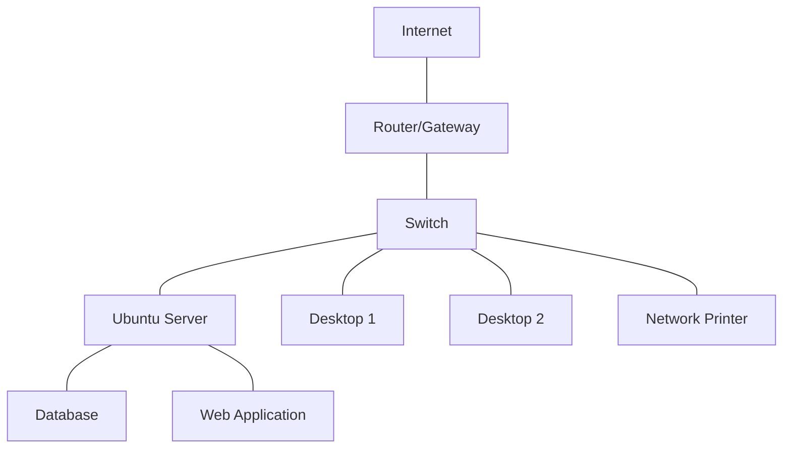

# Ubuntu Network Monitoring

## Introduction

Network monitoring is an essential skill for system administrators and developers working with Ubuntu systems. Effective monitoring helps you identify performance bottlenecks, detect security issues, troubleshoot connectivity problems, and optimize network resources. Ubuntu provides several built-in tools and supports many third-party utilities that make network monitoring straightforward and powerful.

In this guide, we'll explore various network monitoring techniques and tools available in Ubuntu, from basic command-line utilities to more advanced monitoring solutions. By the end, you'll have a comprehensive understanding of how to effectively monitor network activities on your Ubuntu systems.

## Basic Network Monitoring Tools

Ubuntu comes with several command-line utilities that provide immediate insights into your network status and activity.

### 1. `ping` - Basic Connectivity Testing

The `ping` command is one of the simplest tools to verify network connectivity between your Ubuntu machine and a remote host.

```bash
ping -c 4 google.com
```

Sample output:
```
PING google.com (142.250.185.78) 56(84) bytes of data.
64 bytes from sfo03s07-in-f14.1e100.net (142.250.185.78): icmp_seq=1 ttl=119 time=2.26 ms
64 bytes from sfo03s07-in-f14.1e100.net (142.250.185.78): icmp_seq=2 ttl=119 time=2.21 ms
64 bytes from sfo03s07-in-f14.1e100.net (142.250.185.78): icmp_seq=3 ttl=119 time=2.29 ms
64 bytes from sfo03s07-in-f14.1e100.net (142.250.185.78): icmp_seq=4 ttl=119 time=2.18 ms

--- google.com ping statistics ---
4 packets transmitted, 4 received, 0% packet loss, time 3005ms
rtt min/avg/max/mdev = 2.179/2.232/2.287/0.043 ms
```

The `-c 4` flag limits the ping to 4 packets. The output shows successful connectivity with packet travel times.

### 2. `netstat` - Network Statistics

The `netstat` command displays network connections, routing tables, interface statistics, and more.

```bash
netstat -tuln
```

Sample output:
```
Active Internet connections (only servers)
Proto Recv-Q Send-Q Local Address           Foreign Address         State      
tcp        0      0 0.0.0.0:22              0.0.0.0:*               LISTEN     
tcp        0      0 127.0.0.1:631           0.0.0.0:*               LISTEN     
tcp6       0      0 :::22                   :::*                    LISTEN     
tcp6       0      0 ::1:631                 :::*                    LISTEN     
udp        0      0 0.0.0.0:5353            0.0.0.0:*                          
udp        0      0 0.0.0.0:68              0.0.0.0:*                          
udp6       0      0 :::5353                 :::*                               
```

Flags explained:
- `-t`: Show TCP connections
- `-u`: Show UDP connections
- `-l`: Show only listening sockets
- `-n`: Show numerical addresses instead of resolving host names

### 3. `ss` - Socket Statistics

The `ss` command is a newer and faster alternative to `netstat`. It displays socket statistics.

```bash
ss -tuln
```

Sample output:
```
Netid   State    Recv-Q   Send-Q     Local Address:Port     Peer Address:Port  Process
udp     UNCONN   0        0                0.0.0.0:5353          0.0.0.0:*
udp     UNCONN   0        0                0.0.0.0:68            0.0.0.0:*
udp     UNCONN   0        0          127.0.0.53%lo:53            0.0.0.0:*
tcp     LISTEN   0        128              0.0.0.0:22            0.0.0.0:*
tcp     LISTEN   0        5          127.0.0.53%lo:53            0.0.0.0:*
tcp     LISTEN   0        128            127.0.0.1:631           0.0.0.0:*
```

### 4. `ifconfig` - Interface Configuration

The `ifconfig` command displays information about all network interfaces on your system.

```bash
ifconfig
```

Sample output:
```
ens33: flags=4163<UP,BROADCAST,RUNNING,MULTICAST>  mtu 1500
        inet 192.168.1.100  netmask 255.255.255.0  broadcast 192.168.1.255
        inet6 fe80::215:5dff:fe00:401  prefixlen 64  scopeid 0x20<link>
        ether 00:15:5d:00:04:01  txqueuelen 1000  (Ethernet)
        RX packets 14886  bytes 18080365 (18.0 MB)
        RX errors 0  dropped 0  overruns 0  frame 0
        TX packets 5281  bytes 533234 (533.2 KB)
        TX errors 0  dropped 0 overruns 0  carrier 0  collisions 0

lo: flags=73<UP,LOOPBACK,RUNNING>  mtu 65536
        inet 127.0.0.1  netmask 255.0.0.0
        inet6 ::1  prefixlen 128  scopeid 0x10<host>
        loop  txqueuelen 1000  (Local Loopback)
        RX packets 2312  bytes 199335 (199.3 KB)
        RX errors 0  dropped 0  overruns 0  frame 0
        TX packets 2312  bytes 199335 (199.3 KB)
        TX errors 0  dropped 0 overruns 0  carrier 0  collisions 0
```

> Note: In newer Ubuntu versions, `ifconfig` is deprecated and replaced by `ip addr`.

### 5. `ip` - IP Networking

The `ip` command is a powerful utility for displaying and manipulating routing, network devices, interfaces, and tunnels.

```bash
ip addr show
```

Sample output:
```
1: lo: <LOOPBACK,UP,LOWER_UP> mtu 65536 qdisc noqueue state UNKNOWN group default qlen 1000
    link/loopback 00:00:00:00:00:00 brd 00:00:00:00:00:00
    inet 127.0.0.1/8 scope host lo
       valid_lft forever preferred_lft forever
    inet6 ::1/128 scope host 
       valid_lft forever preferred_lft forever
2: ens33: <BROADCAST,MULTICAST,UP,LOWER_UP> mtu 1500 qdisc fq_codel state UP group default qlen 1000
    link/ether 00:15:5d:00:04:01 brd ff:ff:ff:ff:ff:ff
    inet 192.168.1.100/24 brd 192.168.1.255 scope global dynamic noprefixroute ens33
       valid_lft 85913sec preferred_lft 85913sec
    inet6 fe80::215:5dff:fe00:401/64 scope link noprefixroute 
       valid_lft forever preferred_lft forever
```

## Intermediate Network Monitoring Tools

These tools provide more detailed insights into network activities.

### 1. `iftop` - Bandwidth Monitoring by Interface

`iftop` shows bandwidth usage on an interface by host.

First, install it:

```bash
sudo apt install iftop
```

Then run:

```bash
sudo iftop -i ens33
```

The output is a real-time display showing connections and data transfer rates. You'll see source and destination hosts, and the bandwidth being used between them.

### 2. `nethogs` - Bandwidth Monitoring by Process

`nethogs` breaks down bandwidth usage by process.

Installation:

```bash
sudo apt install nethogs
```

Usage:

```bash
sudo nethogs ens33
```

Sample output:
```
NetHogs version 0.8.5

  PID USER     PROGRAM                      DEV        SENT      RECEIVED       
2540  ubuntu   /usr/bin/firefox             ens33     18.876     205.812 KB/sec
1254  ubuntu   /usr/lib/apt/methods/http    ens33      0.094       0.236 KB/sec
  ?   root     unknown TCP                             0.000       0.000 KB/sec
                                                      0.000       0.000 KB/sec
TOTAL                                                 18.970     206.048 KB/sec
```

### 3. `tcpdump` - Packet Analysis

`tcpdump` captures and displays network packets.

```bash
sudo tcpdump -i ens33 -c 10
```

Sample output:
```
tcpdump: verbose output suppressed, use -v or -vv for full protocol decode
listening on ens33, link-type EN10MB (Ethernet), capture size 262144 bytes
13:45:18.123456 IP ubuntu.ssh > 192.168.1.5.52613: Flags [P.], seq 123:191, ack 456, win 501, options [nop,nop,TS val 987654321 ecr 123456789], length 68
13:45:18.234567 IP 192.168.1.5.52613 > ubuntu.ssh: Flags [.], ack 191, win 501, options [nop,nop,TS val 123456790 ecr 987654321], length 0
...
10 packets captured
15 packets received by filter
0 packets dropped by kernel
```

The `-c 10` flag limits capture to 10 packets. The output shows packet source, destination, flags, sequence numbers, and more.

### 4. `nmap` - Port Scanning

`nmap` allows you to scan networks and hosts to identify open ports and services.

Installation:

```bash
sudo apt install nmap
```

Basic usage:

```bash
nmap 192.168.1.100
```

Sample output:
```
Starting Nmap 7.80 ( https://nmap.org ) at 2023-09-12 14:00 UTC
Nmap scan report for ubuntu (192.168.1.100)
Host is up (0.00042s latency).
Not shown: 997 closed ports
PORT    STATE SERVICE
22/tcp  open  ssh
80/tcp  open  http
631/tcp open  ipp

Nmap done: 1 IP address (1 host up) scanned in 0.29 seconds
```

## Advanced Network Monitoring

For continuous monitoring and visualization, these more advanced tools are excellent options.

### 1. Installing and Configuring `vnstat`

`vnstat` is a lightweight console-based network traffic monitor that keeps a log of network traffic.

Installation:

```bash
sudo apt install vnstat
```

Start the service:

```bash
sudo systemctl enable vnstat
sudo systemctl start vnstat
```

Check hourly stats:

```bash
vnstat -h
```

Sample output:
```
 ens33                                                                     14:32
  ^
  |
  |                                                     *
  |                                                     *                    *
  |                                                     *                    *
  |                                                     *                    *
  |                                          *          *     *              *
  |                      *                   *          *     *              *
  |                      *     *             *          *     *              *
  |                      *     *             *          *     *              *
  |                      *     *    *        *          *     *              *
  |                      *     *    *        *          *     *         *    *
  +-------------------------------------------------------------------------------------------------------->
    14 15 16 17 18 19 20 21 22 23 00 01 02 03 04 05 06 07 08 09 10 11 12 13 

  h  rx (KB)   tx (KB)   total (KB)
  14    2,566      238       2,804
  15      163      186         349
  16      148       84         232
  17      183      196         379
  18        0        0           0
  19    1,586      473       2,059
```

Daily statistics:

```bash
vnstat -d
```

Monthly statistics:

```bash
vnstat -m
```

### 2. Setting up Prometheus and Grafana for Network Monitoring

For enterprise-level monitoring, a Prometheus and Grafana setup provides powerful visualization capabilities.

First, install Prometheus:

```bash
sudo apt update
sudo apt install -y prometheus prometheus-node-exporter
```

Then install Grafana:

```bash
sudo apt-get install -y software-properties-common
sudo add-apt-repository "deb https://packages.grafana.com/oss/deb stable main"
wget -q -O - https://packages.grafana.com/gpg.key | sudo apt-key add -
sudo apt-get update
sudo apt-get install -y grafana
```

Start and enable the services:

```bash
sudo systemctl start prometheus
sudo systemctl enable prometheus
sudo systemctl start grafana-server
sudo systemctl enable grafana-server
```

Access Grafana at `http://your-server-ip:3000` (default username/password: admin/admin)

Configure Prometheus as a data source in Grafana and import network monitoring dashboards.

## Network Monitoring with Graphical Tools

For desktop Ubuntu users, graphical tools can provide a more intuitive monitoring experience.

### 1. `wireshark` - Graphical Packet Analyzer

Wireshark is a powerful packet analysis tool with a graphical interface.

Installation:

```bash
sudo apt install wireshark
```

During installation, you'll be asked if non-superusers should be able to capture packets. Choose according to your security preferences.

To start Wireshark:

```bash
wireshark
```

Using Wireshark:
1. Select a network interface from the main screen
2. Click the "Start capturing packets" button
3. Apply display filters to focus on specific traffic (e.g., `http` or `ip.addr == 192.168.1.100`)
4. Analyze packet contents by selecting individual packets

### 2. `nethogs-gtk` - Graphical Process Bandwidth Monitor

For a graphical view of per-process bandwidth usage:

```bash
sudo apt install nethogs-gtk
```

Launch it with:

```bash
sudo nethogs-gtk
```

## Creating a Network Monitoring Dashboard

We can use the `tmux` utility to create a simple dashboard with multiple monitoring tools running simultaneously.

Install tmux:

```bash
sudo apt install tmux
```

Create a script to set up a monitoring dashboard:

```bash
nano ~/network-dashboard.sh
```

Add the following content:

```bash
#!/bin/bash
# Create a new tmux session
tmux new-session -d -s netmonitor

# Split the window into panes
tmux split-window -h -t netmonitor
tmux split-window -v -t netmonitor:0.0
tmux split-window -v -t netmonitor:0.1

# Run different monitoring tools in each pane
tmux send-keys -t netmonitor:0.0 'watch -n 1 "ip addr show | grep -A 3 ens33"' C-m
tmux send-keys -t netmonitor:0.1 'sudo nethogs ens33' C-m
tmux send-keys -t netmonitor:0.2 'sudo iftop -i ens33' C-m
tmux send-keys -t netmonitor:0.3 'vnstat -l' C-m

# Attach to the session
tmux attach-session -t netmonitor
```

Make it executable:

```bash
chmod +x ~/network-dashboard.sh
```

Run the dashboard:

```bash
~/network-dashboard.sh
```

This will create a four-pane dashboard with different monitoring tools running in each pane. Press `Ctrl+B` followed by `d` to detach from the session (the monitoring will continue in the background).

## Network Monitoring as a Service

For continuous monitoring, we can set up a service that regularly checks network status and sends alerts.

Here's a simple script that monitors connectivity and logs issues:

```bash
nano ~/network-monitor.sh
```

Add the following:

```bash
#!/bin/bash

LOG_FILE="/var/log/network-monitor.log"
HOSTS="google.com 8.8.8.8 192.168.1.1"
EMAIL="admin@example.com"

# Ensure log file exists
touch $LOG_FILE

echo "Network monitoring started at $(date)" >> $LOG_FILE

for HOST in $HOSTS; do
  # Ping the host
  ping -c 3 $HOST > /dev/null 2>&1
  
  if [ $? -ne 0 ]; then
    # Ping failed, log the issue
    echo "$(date): Connection to $HOST failed" >> $LOG_FILE
    
    # Send an email alert
    echo "Connection to $HOST failed at $(date)" | mail -s "Network Alert: $HOST unreachable" $EMAIL
  else
    # Ping successful, log if needed
    echo "$(date): Connection to $HOST successful" >> $LOG_FILE
  fi
done
```

Make it executable:

```bash
chmod +x ~/network-monitor.sh
```

Create a systemd service and timer to run it every 5 minutes:

```bash
sudo nano /etc/systemd/system/network-monitor.service
```

Add:

```ini
[Unit]
Description=Network Connectivity Monitor Service
After=network.target

[Service]
Type=oneshot
ExecStart=/bin/bash /home/yourusername/network-monitor.sh

[Install]
WantedBy=multi-user.target
```

Create a timer:

```bash
sudo nano /etc/systemd/system/network-monitor.timer
```

Add:

```ini
[Unit]
Description=Run Network Connectivity Monitor every 5 minutes

[Timer]
OnBootSec=5min
OnUnitActiveSec=5min
Unit=network-monitor.service

[Install]
WantedBy=timers.target
```

Enable and start the timer:

```bash
sudo systemctl enable network-monitor.timer
sudo systemctl start network-monitor.timer
```

## Network Traffic Analysis with Flow Data

For enterprise environments, analyzing network flows can provide valuable insights.

### Installing and Configuring `ntopng`

`ntopng` is a high-speed web-based traffic analysis and flow collection tool.

Installation:

```bash
sudo apt-get install ntopng
```

Configure ntopng:

```bash
sudo nano /etc/ntopng/ntopng.conf
```

Basic configuration:

```
-i=ens33
-w=3000
--local-networks=192.168.1.0/24
```

Start the service:

```bash
sudo systemctl enable ntopng
sudo systemctl start ntopng
```

Access the web interface at `http://your-server-ip:3000`

## Network Topology Visualization

Understanding your network topology can be crucial for monitoring. Let's visualize a simple network:



You can discover and map your network using tools like:

```bash
sudo apt install nmap arp-scan
```

Scan your local network:

```bash
sudo arp-scan --localnet
```

## Summary

Network monitoring in Ubuntu provides essential visibility into your system's network activities, helping you identify issues, optimize performance, and ensure security. We've covered:

1. **Basic monitoring tools**: ping, netstat, ss, ifconfig, and ip
2. **Intermediate tools**: iftop, nethogs, tcpdump, and nmap  
3. **Advanced monitoring**: vnstat, Prometheus, and Grafana
4. **Graphical tools**: Wireshark and nethogs-gtk
5. **Creating dashboards** with tmux
6. **Setting up monitoring as a service**
7. **Flow-based analysis** with ntopng
8. **Network topology visualization**

These tools and techniques provide a comprehensive toolkit for monitoring network activity on Ubuntu systems, from simple connectivity checks to advanced traffic analysis and visualization.

## Additional Resources

For further learning, consider exploring:

- The `man` pages for each tool (e.g., `man tcpdump`)
- [Ubuntu Server Guide - Networking](https://ubuntu.com/server/docs)
- [Prometheus Documentation](https://prometheus.io/docs/introduction/overview/)
- [Grafana Documentation](https://grafana.com/docs/)
- [Wireshark User's Guide](https://www.wireshark.org/docs/)

## Exercises

1. Set up a basic network monitoring dashboard using tmux with at least three different tools.
2. Configure vnstat to monitor your network interfaces and generate daily reports.
3. Use tcpdump to capture HTTP traffic only, and analyze the results.
4. Create a script that monitors network latency to multiple destinations and logs the results.
5. Install and configure Prometheus and Grafana to visualize network metrics.