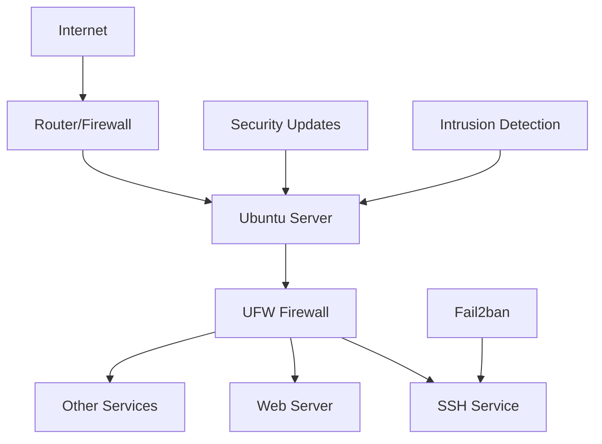

# Ubuntu Network Security

## Introduction

Network security is a critical aspect of system administration, especially in today's interconnected world. Ubuntu provides robust tools and features to secure your network connections, protect your data, and prevent unauthorized access. This guide covers essential network security concepts and implementations specifically for Ubuntu systems, helping beginners understand how to protect their networks from potential threats.

Network security in Ubuntu involves multiple layers of protection, from basic firewall configuration to advanced intrusion detection systems. By implementing proper security measures, you can significantly reduce the risk of security breaches while maintaining network functionality.

## Firewall Configuration

### Understanding UFW (Uncomplicated Firewall)

Ubuntu comes with UFW, a user-friendly interface for managing iptables, the traditional Linux firewall. UFW simplifies firewall management for beginners.

#### Installing UFW

UFW is typically pre-installed on Ubuntu, but if not, you can install it:

```bash
sudo apt update
sudo apt install ufw
```

#### Basic UFW Commands

Here are essential UFW commands to manage your firewall:

```bash
# Check UFW status
sudo ufw status

# Enable UFW
sudo ufw enable

# Disable UFW
sudo ufw disable

# Allow specific service
sudo ufw allow ssh

# Allow specific port
sudo ufw allow 22/tcp

# Deny specific service
sudo ufw deny http

# Delete a rule
sudo ufw delete deny http
```

#### Creating a Basic Firewall Configuration

Here's a step-by-step example of setting up a basic secure firewall for a web server:

```bash
# Reset UFW to default settings
sudo ufw reset

# Set default policies
sudo ufw default deny incoming
sudo ufw default allow outgoing

# Allow SSH (for remote administration)
sudo ufw allow ssh

# Allow HTTP and HTTPS
sudo ufw allow 80/tcp
sudo ufw allow 443/tcp

# Enable the firewall
sudo ufw enable
```

Output:
```
Command may disrupt existing ssh connections. Proceed with operation (y|n)? y
Firewall is active and enabled on system startup
```

### Advanced Firewall with iptables

For more complex configurations, you might need to use iptables directly:

```bash
# Allow established connections
sudo iptables -A INPUT -m conntrack --ctstate ESTABLISHED,RELATED -j ACCEPT

# Allow SSH from specific IP address
sudo iptables -A INPUT -p tcp -s 192.168.1.100 --dport 22 -j ACCEPT

# Drop all other incoming traffic
sudo iptables -A INPUT -j DROP
```

To make iptables rules persistent across reboots:

```bash
sudo apt install iptables-persistent
sudo netfilter-persistent save
```

## Securing SSH Access

SSH (Secure Shell) is commonly used for remote server administration and should be properly secured.

### Basic SSH Hardening

Edit the SSH configuration file:

```bash
sudo nano /etc/ssh/sshd_config
```

Implement these security-enhancing changes:

```
# Disable root login
PermitRootLogin no

# Use SSH Protocol 2
Protocol 2

# Disable password authentication (use key-based authentication)
PasswordAuthentication no

# Limit user access
AllowUsers yourusername

# Change default port (optional)
Port 2222

# Set idle timeout interval
ClientAliveInterval 300
ClientAliveCountMax 2
```

After making changes, restart the SSH service:

```bash
sudo systemctl restart ssh
```

### Setting Up Key-Based Authentication

Generate SSH keys on your client machine:

```bash
ssh-keygen -t ed25519 -C "your_email@example.com"
```

Copy the public key to your server:

```bash
ssh-copy-id username@server_ip
```

Or manually by adding the content of your `~/.ssh/id_ed25519.pub` to `~/.ssh/authorized_keys` on the server.

## Network Encryption

### Using OpenVPN for Secure Connections

OpenVPN provides encrypted tunnels for secure network communication.

Installation:

```bash
sudo apt update
sudo apt install openvpn
```

Basic server configuration (placed in `/etc/openvpn/server.conf`):

```
port 1194
proto udp
dev tun
ca ca.crt
cert server.crt
key server.key
dh dh2048.pem
server 10.8.0.0 255.255.255.0
ifconfig-pool-persist ipp.txt
push "redirect-gateway def1 bypass-dhcp"
push "dhcp-option DNS 208.67.222.222"
push "dhcp-option DNS 208.67.220.220"
keepalive 10 120
cipher AES-256-CBC
user nobody
group nogroup
persist-key
persist-tun
status openvpn-status.log
verb 3
```

### Implementing SSL/TLS for Web Services

For web servers, enable HTTPS using Let's Encrypt:

```bash
sudo apt install certbot
sudo apt install python3-certbot-apache  # For Apache
# OR
sudo apt install python3-certbot-nginx   # For Nginx

# Obtain and install certificate
sudo certbot --apache  # For Apache
# OR
sudo certbot --nginx   # For Nginx
```

## Network Monitoring and Intrusion Detection

### Setting Up Fail2ban

Fail2ban helps protect against brute force attacks by temporarily banning IP addresses with suspicious activity.

```bash
sudo apt install fail2ban
```

Create a custom configuration:

```bash
sudo cp /etc/fail2ban/jail.conf /etc/fail2ban/jail.local
sudo nano /etc/fail2ban/jail.local
```

Basic SSH protection configuration:

```
[sshd]
enabled = true
port = ssh
filter = sshd
logpath = /var/log/auth.log
maxretry = 3
bantime = 3600
```

Start and enable the service:

```bash
sudo systemctl enable fail2ban
sudo systemctl start fail2ban
```

### Using Snort for Intrusion Detection

Snort is a powerful network intrusion detection system:

```bash
sudo apt install snort
```

During installation, you'll be asked to configure your network settings.

Check Snort status:

```bash
sudo systemctl status snort
```

Basic Snort rule example (add to `/etc/snort/rules/local.rules`):

```
alert icmp any any -> $HOME_NET any (msg:"ICMP test"; sid:10000001; rev:1;)
```

Test your configuration:

```bash
sudo snort -T -c /etc/snort/snort.conf
```

## Network Hardening Best Practices

### Disable Unused Network Services

List all listening services:

```bash
sudo ss -tulpn
```

Disable unnecessary services:

```bash
sudo systemctl stop service_name
sudo systemctl disable service_name
```

### Regular Security Updates

Keep your system updated:

```bash
sudo apt update
sudo apt upgrade
```

Enable automatic security updates:

```bash
sudo apt install unattended-upgrades
sudo dpkg-reconfigure -plow unattended-upgrades
```

### Network Security Auditing

Use tools like Lynis for security auditing:

```bash
sudo apt install lynis
sudo lynis audit system
```

## Understanding Network Security with Diagrams

The following diagram illustrates a typical Ubuntu network security setup:



This layered approach creates multiple security barriers that attackers would need to overcome.

## Practical Example: Securing a Web Server

Let's put everything together to secure an Ubuntu web server:

1. **Update the system**:
```bash
sudo apt update && sudo apt upgrade -y
```

2. **Configure firewall**:
```bash
sudo ufw default deny incoming
sudo ufw default allow outgoing
sudo ufw allow ssh
sudo ufw allow http
sudo ufw allow https
sudo ufw enable
```

3. **Secure SSH**:
```bash
# Generate SSH key on your local machine
ssh-keygen -t ed25519

# Copy key to server
ssh-copy-id user@server_ip

# Edit SSH config
sudo nano /etc/ssh/sshd_config
```

Edit these lines:
```
PermitRootLogin no
PasswordAuthentication no
```

Restart SSH:
```bash
sudo systemctl restart ssh
```

4. **Install and configure Fail2ban**:
```bash
sudo apt install fail2ban
sudo cp /etc/fail2ban/jail.conf /etc/fail2ban/jail.local
sudo systemctl enable fail2ban
sudo systemctl start fail2ban
```

5. **Enable HTTPS**:
```bash
sudo apt install certbot python3-certbot-apache
sudo certbot --apache
```

6. **Set up regular updates**:
```bash
sudo apt install unattended-upgrades
sudo dpkg-reconfigure -plow unattended-upgrades
```

## Troubleshooting Network Security Issues

### Common UFW Issues

**Problem**: UFW blocks legitimate traffic
**Solution**: Check your rules and add exceptions as needed:

```bash
sudo ufw status numbered
sudo ufw allow from trusted_ip to any port service_port
```

**Problem**: Rules not taking effect
**Solution**: Reload UFW:

```bash
sudo ufw reload
```

### SSH Access Problems

**Problem**: Locked out of SSH
**Solution**: If you have physical access or console access:

```bash
sudo ufw disable  # Temporarily disable firewall
sudo systemctl stop fail2ban  # Stop fail2ban
```

Then fix your configuration and re-enable security.

## Summary

Ubuntu provides powerful tools for network security that, when properly configured, create a robust defense system. Key points to remember:

1. Use UFW or iptables to control incoming and outgoing traffic
2. Secure SSH with key-based authentication and disable password login
3. Implement encryption for sensitive data transmission
4. Set up monitoring and intrusion detection with Fail2ban and Snort
5. Follow best practices like disabling unused services and regular updates
6. Regularly audit your security setup

By following these guidelines, even beginners can establish a secure network environment on Ubuntu systems.

## Additional Resources

- [Ubuntu Security Documentation](https://ubuntu.com/security)
- [UFW Community Help Wiki](https://help.ubuntu.com/community/UFW)
- [OpenVPN Documentation](https://openvpn.net/community-resources/)

## Exercises

1. Set up UFW with a default deny policy and create rules to allow only SSH, HTTP, and HTTPS traffic.
2. Configure SSH to use key-based authentication and disable password authentication.
3. Install and configure Fail2ban to protect your SSH service with custom ban rules.
4. Use `nmap` (install with `sudo apt install nmap`) to scan your server and identify open ports, then secure any unnecessary services.
5. Set up unattended security updates and create a weekly security check routine.