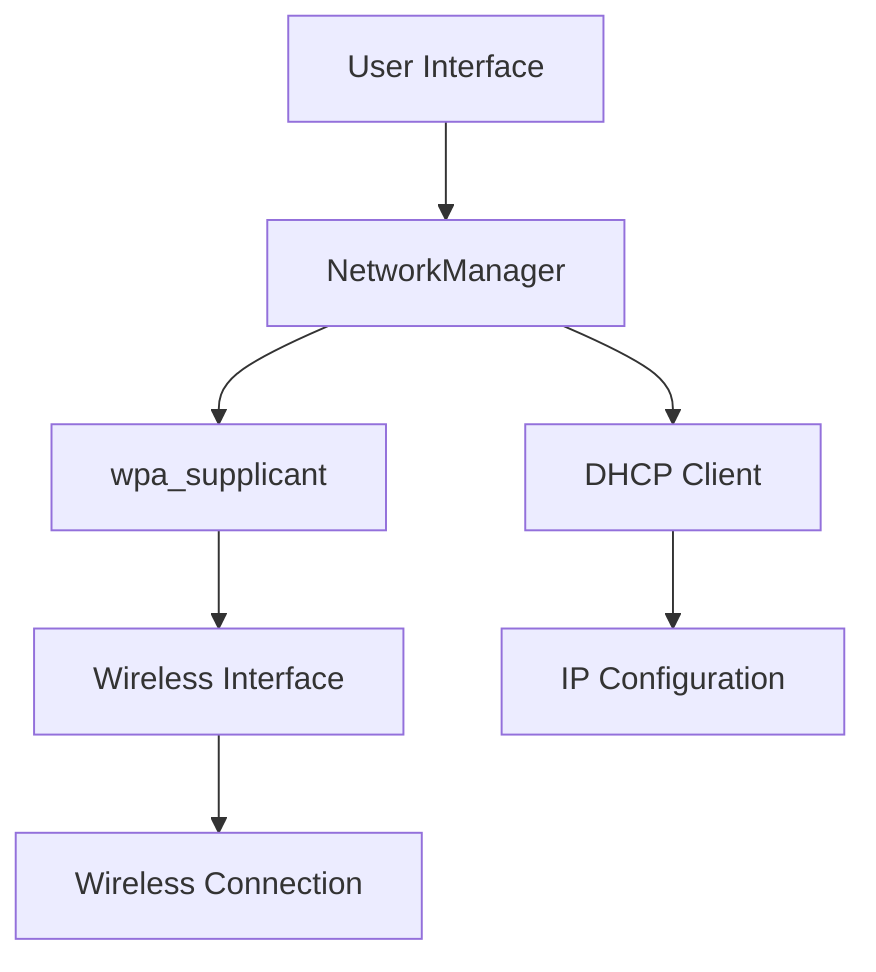

# Ubuntu Wireless Settings

## Introduction

Wireless networking is an essential feature of modern computing, allowing users to connect to networks without physical cables. Ubuntu provides robust tools for managing wireless connections, making it accessible even for beginners. This guide will walk you through understanding, configuring, and troubleshooting wireless settings in Ubuntu, empowering you to establish reliable wireless connections.

## Understanding Wireless Networking in Ubuntu

Ubuntu uses NetworkManager as its primary tool for managing network connections, including wireless networks. This system provides both command-line tools and graphical interfaces to help users connect to wireless networks.

<br />

### Key Components of Ubuntu's Wireless System

1. **NetworkManager** - The main service that manages network connections
2. **wpa_supplicant** - Handles Wi-Fi security protocols (WPA/WPA2/WPA3)
3. **Network interfaces** - Hardware components (like your wireless card)
4. **Drivers** - Software that allows Ubuntu to communicate with your wireless hardware

<br />



## Checking Your Wireless Hardware

Before configuring wireless settings, you should verify that Ubuntu recognizes your wireless hardware correctly.

### Using Terminal Commands

Open a terminal and use these commands to check your wireless hardware:

```bash
# Check if wireless interfaces are detected
ip link show

# Get detailed information about wireless interfaces
iwconfig

# Check for hardware details including driver information
sudo lshw -C network
```

Example output for `ip link show`:

```
1: lo: <LOOPBACK,UP,LOWER_UP> mtu 65536 qdisc noqueue state UNKNOWN mode DEFAULT group default qlen 1000
    link/loopback 00:00:00:00:00:00 brd 00:00:00:00:00:00
2: wlp2s0: <BROADCAST,MULTICAST,UP,LOWER_UP> mtu 1500 qdisc noqueue state UP mode DORMANT group default qlen 1000
    link/ether 11:22:33:44:55:66 brd ff:ff:ff:ff:ff:ff
```

In this output, `wlp2s0` is the wireless interface.

## Connecting to Wireless Networks

Ubuntu offers multiple ways to connect to wireless networks. We'll cover both graphical and command-line methods.

### Using the Graphical Interface

1. Click on the network icon in the top-right corner of your screen.
2. You'll see a list of available wireless networks.
3. Click on your desired network.
4. If the network is secured, enter the password when prompted.
5. After a moment, you should be connected to the network.

### Using the Terminal

For users who prefer command-line interfaces, NetworkManager provides `nmcli`:

```bash
# List available Wi-Fi networks
nmcli device wifi list

# Connect to a network
nmcli device wifi connect SSID-Name password wireless-password
```

Example:

```bash
# List networks
$ nmcli device wifi list
IN-USE  SSID                MODE   CHAN  RATE        SIGNAL  BARS  SECURITY  
        MyHomeNetwork       Infra  6     130 Mbit/s  90      ▂▄▆█  WPA2      
        NeighborWiFi        Infra  11    130 Mbit/s  75      ▂▄▆_  WPA2      
        CoffeeShopFree      Infra  1     65 Mbit/s   60      ▂▄__  --        

# Connect to a network
$ nmcli device wifi connect MyHomeNetwork password mys3cr3tpassw0rd
Device 'wlp2s0' successfully activated with 'a1b2c3d4-5678-90ab-cdef-ghijklmnopqr'.
```

## Managing Saved Wireless Networks

Ubuntu saves information about networks you've connected to before, making it easier to reconnect.

### Viewing Saved Networks (GUI)

1. Open "Settings"
2. Click on "Network"
3. Click on "Wi-Fi"
4. Click on the gear icon next to a connected network, or click "See All Connections"

### Managing Saved Networks (Terminal)

```bash
# List all saved connections
nmcli connection show

# Show details of a specific connection
nmcli connection show "MyHomeNetwork"

# Delete a saved connection
nmcli connection delete "MyHomeNetwork"
```

## Advanced Wireless Configuration

### Setting Up Static IP Address

By default, most networks use DHCP to assign IP addresses. If you need a static IP:

1. Open "Settings" → "Network" → "Wi-Fi"
2. Click the gear icon next to your network
3. Switch from "Automatic (DHCP)" to "Manual"
4. Enter your desired IP address, netmask, gateway, and DNS servers
5. Click "Apply"

Via terminal:

```bash
# Modify an existing connection to use static IP
nmcli connection modify MyHomeNetwork \
    ipv4.method manual \
    ipv4.addresses 192.168.1.100/24 \
    ipv4.gateway 192.168.1.1 \
    ipv4.dns "8.8.8.8,8.8.4.4"

# Reconnect to apply changes
nmcli connection up MyHomeNetwork
```

### Creating a Wi-Fi Hotspot

Ubuntu can turn your computer into a Wi-Fi hotspot:

1. Open "Settings" → "Network" → "Wi-Fi"
2. Click the menu button (three dots) and select "Turn On Wi-Fi Hotspot"
3. Configure the name and password
4. Click "Turn On"

Via terminal:

```bash
# Create a hotspot
nmcli device wifi hotspot ssid MyHotspot password mys3cr3tpassw0rd
```

## Troubleshooting Wireless Issues

### Common Problems and Solutions

#### 1. No Wireless Networks Appear

Check if wireless is enabled:

```bash
# Check if wireless is enabled
nmcli radio wifi

# Enable wireless if it's off
nmcli radio wifi on
```

#### 2. Can't Connect to a Network

Verify password and signal strength:

```bash
# Check signal strength
nmcli device wifi list

# Forget and reconnect to network
nmcli connection delete "MyHomeNetwork"
nmcli device wifi connect MyHomeNetwork password mys3cr3tpassw0rd
```

#### 3. Driver Issues

Some wireless cards require proprietary drivers:

1. Open "Software & Updates"
2. Go to the "Additional Drivers" tab
3. Look for available drivers for your wireless card
4. Apply changes if needed

Via terminal:

```bash
# Check for available drivers
ubuntu-drivers devices

# Install a specific driver
sudo apt install package-name

# Install all recommended drivers
sudo ubuntu-drivers autoinstall
```

#### 4. Weak Signal or Dropped Connections

Improve signal strength:

```bash
# Check current power management settings
iwconfig wlp2s0 | grep "Power Management"

# Disable power management for better connection (may use more battery)
sudo iwconfig wlp2s0 power off
```

## Using Network Configuration Files

Ubuntu stores network configuration in specific files:

### NetworkManager Connections

Located in `/etc/NetworkManager/system-connections/`:

```bash
# List connection files
ls /etc/NetworkManager/system-connections/

# View content (requires root privileges)
sudo cat /etc/NetworkManager/system-connections/MyHomeNetwork
```

Example connection file:

```ini
[connection]
id=MyHomeNetwork
uuid=a1b2c3d4-5678-90ab-cdef-ghijklmnopqr
type=wifi
interface-name=wlp2s0

[wifi]
mode=infrastructure
ssid=MyHomeNetwork

[wifi-security]
auth-alg=open
key-mgmt=wpa-psk
psk=mys3cr3tpassw0rd

[ipv4]
method=auto

[ipv6]
addr-gen-mode=stable-privacy
method=auto
```

## Advanced Wireless Security

### Connecting to Enterprise Networks (WPA2-Enterprise)

Many corporate or educational networks use WPA2-Enterprise, which requires username and password:

```bash
# Connect to WPA2-Enterprise network
nmcli connection add \
    type wifi \
    con-name "CompanyWiFi" \
    ifname wlp2s0 \
    ssid "CompanyWiFi" \
    wifi-sec.key-mgmt wpa-eap \
    802-1x.eap peap \
    802-1x.phase2-auth mschapv2 \
    802-1x.identity "your-username" \
    802-1x.password "your-password"
```

### Using Hidden Networks

```bash
# Connect to a hidden network
nmcli connection add \
    type wifi \
    con-name "HiddenNetwork" \
    ifname wlp2s0 \
    ssid "HiddenNetwork" \
    wifi.hidden yes \
    wifi-sec.key-mgmt wpa-psk \
    wifi-sec.psk "your-password"
```

## Monitoring Wireless Performance

### Using Network Tools

```bash
# Install network monitoring tools
sudo apt install wavemon

# Monitor wireless in real-time
wavemon
```

### Checking Connection Quality

```bash
# Check connection quality
watch -n 1 "iwconfig wlp2s0 | grep -E 'Signal|Quality'"
```

## Summary

In this guide, we've covered:

1. Understanding Ubuntu's wireless networking components
2. Checking wireless hardware and drivers
3. Connecting to wireless networks using both GUI and terminal
4. Managing saved wireless connections
5. Advanced configurations including static IP and hotspots
6. Troubleshooting common wireless issues
7. Working with network configuration files
8. Advanced wireless security features
9. Monitoring wireless network performance

Ubuntu's wireless networking system provides powerful tools for both beginners and advanced users to establish and maintain reliable wireless connections.

## Additional Resources

- The `man` pages for various commands: `man nmcli`, `man iwconfig`
- Ubuntu documentation: [https://help.ubuntu.com/community/WifiDocs](https://help.ubuntu.com/community/WifiDocs)
- NetworkManager documentation: [https://networkmanager.dev/](https://networkmanager.dev/)

## Exercises

1. Connect to a wireless network using only terminal commands.
2. Create a wireless hotspot and connect another device to it.
3. Set up a static IP address for your wireless connection.
4. Use `wavemon` to monitor the signal strength of your wireless connection as you move around.
5. Review the NetworkManager connection file for your wireless network and identify the various sections and settings.