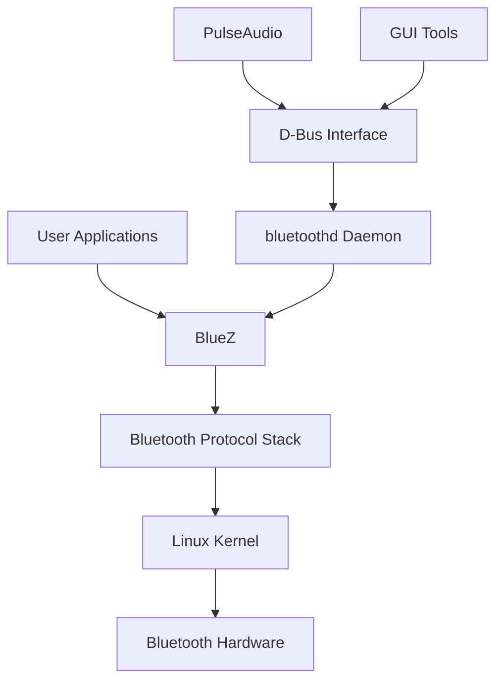

# Ubuntu Bluetooth Configuration

## Introduction

Bluetooth technology enables wireless communication between devices over short distances, making it essential for connecting peripherals like keyboards, mice, headphones, and smartphones to your Ubuntu system. This guide provides a comprehensive overview of Bluetooth configuration in Ubuntu, from basic setup to advanced troubleshooting techniques.

Whether you're a new Ubuntu user trying to connect your first Bluetooth device or an experienced user looking to resolve connectivity issues, this guide will walk you through everything you need to know about managing Bluetooth connections on your Ubuntu system.

## Prerequisites

Before we begin, ensure you have:

- An Ubuntu system (this guide uses Ubuntu 22.04 LTS, but most instructions work for other versions)
- A Bluetooth adapter (most modern laptops have built-in Bluetooth)
- A Bluetooth device to connect (headphones, speaker, keyboard, etc.)

## Checking Bluetooth Hardware Status

First, let's verify that your Ubuntu system recognizes your Bluetooth hardware.

### Verifying Bluetooth Controller

Use the `hciconfig` command to check if your Bluetooth controller is detected:

```bash
hciconfig
```

Example output:
```
hci0:   Type: Primary  Bus: USB
        BD Address: 00:1A:7D:DA:71:13  ACL MTU: 1021:4  SCO MTU: 180:4
        UP RUNNING 
        RX bytes:8761 acl:229 sco:0 events:322 errors:0
        TX bytes:4282 acl:132 sco:0 commands:74 errors:0
```

If you don't see any output, your Bluetooth adapter might not be detected or enabled.

### Checking Bluetooth Service Status

Verify if the Bluetooth service is running:

```bash
systemctl status bluetooth
```

Example output:
```
��� bluetooth.service - Bluetooth service
     Loaded: loaded (/lib/systemd/system/bluetooth.service; enabled; vendor preset: enabled)
     Active: active (running) since Mon 2023-02-20 09:15:23 UTC; 3h 24min ago
       Docs: man:bluetoothd(8)
   Main PID: 1234 (bluetoothd)
     Status: "Running"
      Tasks: 1 (limit: 4915)
     Memory: 2.3M
        CPU: 143ms
     CGroup: /system.slice/bluetooth.service
             └─1234 /usr/lib/bluetooth/bluetoothd
```

If the service isn't running, start it with:

```bash
sudo systemctl start bluetooth
```

To ensure it starts automatically on boot:

```bash
sudo systemctl enable bluetooth
```

## Installing Bluetooth Tools

Ubuntu comes with basic Bluetooth functionality, but you might need additional tools for more advanced management.

### Command Line Tools

Install the main Bluetooth packages:

```bash
sudo apt update
sudo apt install bluetooth bluez bluez-tools rfkill
```

For a graphical interface:

```bash
sudo apt install blueman
```

## Basic Bluetooth Configuration

### Using Bluetooth Settings

The easiest way to manage Bluetooth in Ubuntu is through the Settings application:

1. Open the Ubuntu Settings application
2. Click on "Bluetooth" in the left sidebar
3. Toggle the switch to turn Bluetooth on
4. Your system will automatically scan for nearby devices

### Using Blueman (Bluetooth Manager)

If you installed Blueman, you can use it for more advanced management:

1. Open Blueman from your applications menu
2. Click on "Search" to discover nearby devices
3. Right-click on a device and select "Pair" to initiate pairing

### Command Line Configuration

For terminal enthusiasts, you can manage Bluetooth using the `bluetoothctl` command-line tool:

```bash
bluetoothctl
```

This opens an interactive Bluetooth control shell. Here are some common commands:

```
# Turn Bluetooth controller on
power on

# Enable device scanning
scan on

# List discovered devices
devices

# Pair with a device (replace XX:XX:XX:XX:XX:XX with the device's MAC address)
pair XX:XX:XX:XX:XX:XX

# Connect to a paired device
connect XX:XX:XX:XX:XX:XX

# Trust a device (for automatic connections)
trust XX:XX:XX:XX:XX:XX

# Disconnect a device
disconnect XX:XX:XX:XX:XX:XX

# Turn off scanning
scan off

# Exit bluetoothctl
quit
```

Example session:
```
[bluetooth]# power on
Changing power on succeeded
[bluetooth]# scan on
Discovery started
[CHG] Controller 00:1A:7D:DA:71:13 Discovering: yes
[NEW] Device 00:11:22:33:44:55 Bluetooth Speaker
[bluetooth]# pair 00:11:22:33:44:55
Attempting to pair with 00:11:22:33:44:55
[CHG] Device 00:11:22:33:44:55 Connected: yes
[CHG] Device 00:11:22:33:44:55 Paired: yes
Pairing successful
[bluetooth]# connect 00:11:22:33:44:55
Attempting to connect to 00:11:22:33:44:55
[CHG] Device 00:11:22:33:44:55 Connected: yes
Connection successful
```

## Bluetooth Configuration Files

Ubuntu's Bluetooth configuration files are located in several directories:

### Main Configuration File

The main configuration file is located at `/etc/bluetooth/main.conf`. You can edit this file to change system-wide Bluetooth settings:

```bash
sudo nano /etc/bluetooth/main.conf
```

Common settings you might want to adjust:

```ini
# Bluetooth device name (visible to others)
Name = %h-0

# Default device discoverability (hidden, limited, or discoverable)
DiscoverableTimeout = 0

# Enable or disable automatic device connections
AutoConnect=true

# Set default controller mode (dual, bredr, or le)
ControllerMode = dual
```

After making changes, restart the Bluetooth service:

```bash
sudo systemctl restart bluetooth
```

## Pairing and Connecting Devices

### Pairing Process

Pairing establishes a trusted relationship between devices:

1. Put your Bluetooth device in pairing mode (refer to device manual)
2. In Ubuntu's Bluetooth settings or Blueman, click "+" or "Search"
3. Select your device from the list
4. Enter a PIN if prompted (common PINs are 0000 or 1234)

### Managing Trusted Devices

You can view and manage paired devices with:

```bash
bluetoothctl paired-devices
```

To remove a paired device:

```bash
bluetoothctl remove XX:XX:XX:XX:XX:XX
```

## Audio Configuration with Bluetooth

### Setting Up Bluetooth Audio

Ubuntu uses PulseAudio to manage Bluetooth audio. Ensure you have the necessary packages:

```bash
sudo apt install pulseaudio-module-bluetooth
```

After connecting a Bluetooth audio device, select it as your output device:

1. Click on the sound icon in the top-right corner
2. Select "Sound Settings"
3. Under "Output", choose your Bluetooth device

### Troubleshooting Audio Issues

If your Bluetooth audio device connects but doesn't play audio:

1. Restart PulseAudio:
   ```bash
   pulseaudio -k
   pulseaudio --start
   ```

2. Check if your device appears in PulseAudio:
   ```bash
   pactl list short sinks
   ```

3. If using A2DP (high-quality audio) profile, try switching to HSP/HFP profile and back:
   ```bash
   pacmd set-card-profile bluez_card.XX_XX_XX_XX_XX_XX headset_head_unit
   pacmd set-card-profile bluez_card.XX_XX_XX_XX_XX_XX a2dp_sink
   ```

## Advanced Bluetooth Configuration

### Improving Connection Stability

If you experience frequent disconnects:

1. Add your device to the trusted list:
   ```bash
   bluetoothctl trust XX:XX:XX:XX:XX:XX
   ```

2. Modify the connection parameters in `/etc/bluetooth/main.conf`:
   ```ini
   [General]
   FastConnectable = true
   ReconnectAttempts=7
   ReconnectIntervals=1,2,4,8,16,32,64
   ```

### Enabling Bluetooth at Startup

Ensure Bluetooth automatically starts with your system:

```bash
sudo systemctl enable bluetooth
```

To also have it powered on at startup, create a startup application or modify `/etc/bluetooth/main.conf`:

```ini
[Policy]
AutoEnable=true
```

## Bluetooth Security

### Understanding Bluetooth Security Risks

Bluetooth can pose security risks if not properly configured:

1. **Bluejacking**: Receiving unsolicited messages
2. **Bluesnarfing**: Unauthorized access to information
3. **Bluebugging**: Taking control of device functions

### Securing Your Bluetooth Connection

To enhance Bluetooth security:

1. Only enable Bluetooth when needed
2. Make your device non-discoverable:
   ```bash
   bluetoothctl discoverable off
   ```

3. Use strong PINs during pairing
4. Remove old/unused paired devices
5. Keep your system updated:
   ```bash
   sudo apt update && sudo apt upgrade
   ```

## Troubleshooting Common Issues

### Device Not Detected

If Ubuntu doesn't detect your Bluetooth device:

1. Check if Bluetooth is blocked by rfkill:
   ```bash
   rfkill list
   ```

2. Unblock it if necessary:
   ```bash
   sudo rfkill unblock bluetooth
   ```

3. Restart the Bluetooth service:
   ```bash
   sudo systemctl restart bluetooth
   ```

### Connection Issues

If you have trouble connecting to a paired device:

1. Remove the device and pair again:
   ```bash
   bluetoothctl remove XX:XX:XX:XX:XX:XX
   # Then pair again
   ```

2. Reset the Bluetooth controller:
   ```bash
   sudo hciconfig hci0 reset
   ```

3. Check for conflicting devices:
   ```bash
   bluetoothctl devices
   ```

### Debug Mode

For persistent issues, enable Bluetooth debugging:

1. Stop the Bluetooth service:
   ```bash
   sudo systemctl stop bluetooth
   ```

2. Start Bluetooth in debug mode:
   ```bash
   sudo bluetoothd -d
   ```

## Bluetooth Configuration with D-Bus

For advanced users, you can interact with the Bluetooth subsystem using D-Bus:

```bash
gdbus introspect --system --dest org.bluez --object-path /org/bluez
```

Example of toggling Bluetooth through D-Bus:

```bash
gdbus call --system --dest org.bluez --object-path /org/bluez/hci0 \
  --method org.freedesktop.DBus.Properties.Set org.bluez.Adapter1 Powered "<true>"
```

## Bluetooth Architecture in Ubuntu

Understanding how Bluetooth components work together can help with troubleshooting:



The BlueZ stack is Linux's official Bluetooth protocol stack, managed by the `bluetoothd` daemon. Applications interact with it through the D-Bus messaging system.

## Real-World Applications

### Setting Up a Bluetooth Game Controller

Connect a PlayStation or Xbox controller to Ubuntu:

```bash
# Enter bluetoothctl
bluetoothctl

# Inside bluetoothctl
power on
scan on
# Put your controller in pairing mode
# Look for something like "Wireless Controller"
pair XX:XX:XX:XX:XX:XX
connect XX:XX:XX:XX:XX:XX
trust XX:XX:XX:XX:XX:XX
```

Test your controller with:

```bash
sudo apt install jstest-gtk
jstest-gtk
```

### Creating a Bluetooth File Transfer Service

Share files between your phone and Ubuntu:

1. Install ObexFTP:
   ```bash
   sudo apt install obexftp obexpushd
   ```

2. Start the OBEX push server:
   ```bash
   obexpushd -B -n -o ~/Downloads
   ```

3. On your phone, find your Ubuntu computer and send files to it

### Using Your Phone as a Remote Control

Control media playback on Ubuntu using your phone:

1. Install the required packages:
   ```bash
   sudo apt install pulseaudio-module-bluetooth mpris2
   ```

2. Connect your phone via Bluetooth
3. Install a media control app on your phone (like "KDE Connect" or "Unified Remote")
4. Configure the app to control your Ubuntu system

## Summary

Ubuntu provides robust Bluetooth support for a wide range of devices and use cases. In this guide, we've covered:

- Basic Bluetooth setup and configuration
- Pairing and connecting different types of devices
- Audio configuration for Bluetooth speakers and headphones
- Advanced configuration for improved stability and security
- Troubleshooting common Bluetooth issues
- Real-world applications of Bluetooth in Ubuntu

With these skills, you should be able to successfully connect and manage Bluetooth devices on your Ubuntu system.

## Additional Resources

- [Official Ubuntu Bluetooth Documentation](https://help.ubuntu.com/community/BluetoothSetup)
- [BlueZ Project Website](http://www.bluez.org/)
- [Arch Linux Bluetooth Wiki](https://wiki.archlinux.org/title/Bluetooth) (contains advanced information applicable to Ubuntu)

## Exercises

1. Connect a Bluetooth speaker or headphones to your Ubuntu system and configure it as the default audio output.
2. Write a shell script that automatically connects to a specific Bluetooth device when it becomes available.
3. Use `bluetoothctl` to scan for devices, then research one of the unfamiliar devices you discover to understand what it is.
4. Configure your system to automatically connect to your Bluetooth devices when they come into range.
5. Use D-Bus commands to toggle your Bluetooth adapter on and off, and experiment with other D-Bus Bluetooth commands.