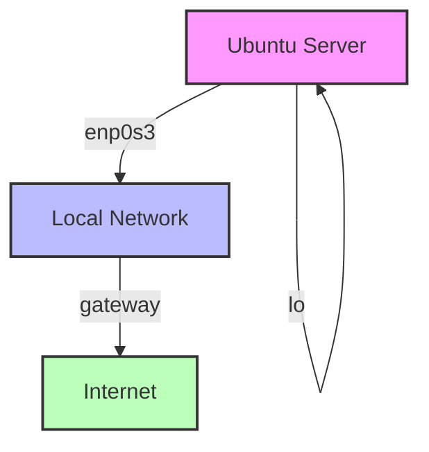

# Ubuntu IP Addressing

## Introduction

IP addressing is a fundamental aspect of network configuration that allows your Ubuntu system to communicate with other devices on local networks and the internet. In this guide, we'll explore how IP addressing works in Ubuntu, covering both traditional and modern methods for configuring network interfaces.

Ubuntu uses the TCP/IP protocol suite for networking, which requires each network interface to have a properly configured IP address. Whether you're setting up a home server, configuring a development environment, or troubleshooting network issues, understanding IP addressing in Ubuntu is essential.

## Understanding IP Addresses in Ubuntu

An IP address is a numerical label assigned to each device connected to a computer network. Ubuntu, like other operating systems, uses IP addresses to identify and communicate with devices.

### Types of IP Addresses

1. **IPv4 Addresses**: The traditional 32-bit address format (e.g., `192.168.1.100`)
2. **IPv6 Addresses**: The newer 128-bit address format (e.g., `2001:0db8:85a3:0000:0000:8a2e:0370:7334`)

### IP Configuration Types

Ubuntu supports two primary methods for obtaining IP addresses:

1. **Dynamic IP (DHCP)**: Automatically assigned by a DHCP server
2. **Static IP**: Manually configured and doesn't change

## Checking Your Current IP Configuration

Before making changes, it's helpful to check your current IP configuration. Ubuntu provides several commands for this purpose.

### Using the `ip` Command (Modern Method)

The `ip` command is part of the `iproute2` package and is the modern way to manage network configurations in Ubuntu.

```bash
ip addr show
```

Example output:

```
1: lo: <LOOPBACK,UP,LOWER_UP> mtu 65536 qdisc noqueue state UNKNOWN group default qlen 1000
    link/loopback 00:00:00:00:00:00 brd 00:00:00:00:00:00
    inet 127.0.0.1/8 scope host lo
       valid_lft forever preferred_lft forever
    inet6 ::1/128 scope host 
       valid_lft forever preferred_lft forever
2: enp0s3: <BROADCAST,MULTICAST,UP,LOWER_UP> mtu 1500 qdisc fq_codel state UP group default qlen 1000
    link/ether 08:00:27:a9:7a:bc brd ff:ff:ff:ff:ff:ff
    inet 192.168.1.105/24 brd 192.168.1.255 scope global dynamic enp0s3
       valid_lft 86390sec preferred_lft 86390sec
    inet6 fe80::a00:27ff:fea9:7abc/64 scope link 
       valid_lft forever preferred_lft forever
```

To display just the IP address without additional information:

```bash
ip -4 addr show enp0s3 | grep -oP '(?<=inet\s)\d+(\.\d+){3}'
```

### Using the `ifconfig` Command (Legacy Method)

The `ifconfig` command is a legacy tool but is still commonly used. If it's not installed, you can add it with:

```bash
sudo apt install net-tools
```

Then check your IP configuration:

```bash
ifconfig
```

Example output:

```
enp0s3: flags=4163<UP,BROADCAST,RUNNING,MULTICAST>  mtu 1500
        inet 192.168.1.105  netmask 255.255.255.0  broadcast 192.168.1.255
        inet6 fe80::a00:27ff:fea9:7abc  prefixlen 64  scopeid 0x20<link>
        ether 08:00:27:a9:7a:bc  txqueuelen 1000  (Ethernet)
        RX packets 8553  bytes 8784253 (8.7 MB)
        RX errors 0  dropped 0  overruns 0  frame 0
        TX packets 5091  bytes 654841 (654.8 KB)
        TX errors 0  dropped 0 overruns 0  carrier 0  collisions 0

lo: flags=73<UP,LOOPBACK,RUNNING>  mtu 65536
        inet 127.0.0.1  netmask 255.0.0.0
        inet6 ::1  prefixlen 128  scopeid 0x10<host>
        loop  txqueuelen 1000  (Local Loopback)
        RX packets 452  bytes 41952 (41.9 KB)
        RX errors 0  dropped 0  overruns 0  frame 0
        TX packets 452  bytes 41952 (41.9 KB)
        TX errors 0  dropped 0 overruns 0  carrier 0  collisions 0
```

## Configuring IP Addresses in Ubuntu

Ubuntu has evolved its network configuration methods over different releases. We'll cover both the modern Netplan approach (used in Ubuntu 18.04 and later) and traditional methods (for older systems or for backward compatibility).

### Modern Method: Using Netplan

Ubuntu 18.04 and later versions use Netplan for network configuration. Netplan uses YAML files to configure network interfaces and renders them to the appropriate backend (either NetworkManager or systemd-networkd).

Netplan configuration files are located in the `/etc/netplan/` directory with a `.yaml` extension.

#### Example 1: Configuring a Dynamic IP (DHCP)

1. Create or edit a Netplan configuration file:

```bash
sudo nano /etc/netplan/01-netcfg.yaml
```

2. Add the following configuration for DHCP:

```yaml
network:
  version: 2
  renderer: networkd
  ethernets:
    enp0s3:
      dhcp4: true
```

3. Apply the changes:

```bash
sudo netplan apply
```

#### Example 2: Configuring a Static IP

1. Edit the Netplan configuration file:

```bash
sudo nano /etc/netplan/01-netcfg.yaml
```

2. Add a static IP configuration:

```yaml
network:
  version: 2
  renderer: networkd
  ethernets:
    enp0s3:
      dhcp4: no
      addresses:
        - 192.168.1.100/24
      gateway4: 192.168.1.1
      nameservers:
        addresses: [8.8.8.8, 8.8.4.4]
```

3. Apply the changes:

```bash
sudo netplan apply
```

### Legacy Method: Using /etc/network/interfaces

In older Ubuntu versions (pre-18.04), network interfaces were configured using the `/etc/network/interfaces` file.

#### Example 1: Configuring a Dynamic IP (DHCP)

1. Edit the interfaces file:

```bash
sudo nano /etc/network/interfaces
```

2. Configure the interface for DHCP:

```
auto enp0s3
iface enp0s3 inet dhcp
```

3. Restart the networking service:

```bash
sudo systemctl restart networking
```

#### Example 2: Configuring a Static IP

1. Edit the interfaces file:

```bash
sudo nano /etc/network/interfaces
```

2. Configure the interface with a static IP:

```
auto enp0s3
iface enp0s3 inet static
    address 192.168.1.100
    netmask 255.255.255.0
    gateway 192.168.1.1
    dns-nameservers 8.8.8.8 8.8.4.4
```

3. Restart the networking service:

```bash
sudo systemctl restart networking
```

## Temporary IP Address Configuration

Sometimes you may need to temporarily change your IP configuration without modifying system files. Ubuntu provides commands for this purpose.

### Using the `ip` Command

To temporarily add an IP address:

```bash
sudo ip addr add 192.168.1.200/24 dev enp0s3
```

To remove it:

```bash
sudo ip addr del 192.168.1.200/24 dev enp0s3
```

### Using the `ifconfig` Command (Legacy)

To temporarily add an IP address:

```bash
sudo ifconfig enp0s3 192.168.1.200 netmask 255.255.255.0 up
```

## Network Interface Naming in Ubuntu

Ubuntu uses predictable network interface names based on firmware, topology, and device type. Some common naming schemes include:

- `en`: Ethernet interfaces (e.g., `enp0s3`)
- `wl`: Wireless LAN interfaces (e.g., `wlp2s0`)
- `ww`: WWAN interfaces (e.g., `wwp0s20f0u2i12`)

If you prefer the traditional naming convention (eth0, wlan0), you can modify the GRUB configuration:

1. Edit the GRUB configuration:

```bash
sudo nano /etc/default/grub
```

2. Add `net.ifnames=0 biosdevname=0` to the `GRUB_CMDLINE_LINUX` line:

```
GRUB_CMDLINE_LINUX="net.ifnames=0 biosdevname=0"
```

3. Update GRUB and reboot:

```bash
sudo update-grub
sudo reboot
```

## Troubleshooting IP Configuration Issues

### 1. Checking Network Connectivity

To check if your interface is up:

```bash
ip link show
```

To ping a remote host:

```bash
ping -c 4 8.8.8.8
```

### 2. Checking DNS Resolution

To verify DNS resolution:

```bash
nslookup google.com
```

Or:

```bash
dig google.com
```

### 3. Resolving Common Issues

#### DHCP Not Working

If DHCP isn't working, you can manually request an IP address:

```bash
sudo dhclient -r enp0s3
sudo dhclient enp0s3
```

#### Interface Not Coming Up

If an interface doesn't come up automatically, bring it up manually:

```bash
sudo ip link set enp0s3 up
```

## Advanced IP Addressing Topics

### Multiple IP Addresses on a Single Interface

You can assign multiple IP addresses to a single interface in Ubuntu.

Using Netplan:

```yaml
network:
  version: 2
  renderer: networkd
  ethernets:
    enp0s3:
      addresses:
        - 192.168.1.100/24
        - 192.168.1.101/24
      gateway4: 192.168.1.1
```

Using the ip command (temporarily):

```bash
sudo ip addr add 192.168.1.101/24 dev enp0s3
```

### Network Visualization with Mermaid

Here's a simple diagram showing a typical Ubuntu network configuration:



## Summary

In this guide, we've covered the essentials of IP addressing in Ubuntu, including:

- Understanding IP address types and configurations
- Checking current IP configurations using modern and legacy commands
- Configuring static and dynamic IP addresses using Netplan and legacy methods
- Temporary IP address configuration
- Understanding network interface naming
- Troubleshooting common IP configuration issues
- Advanced IP addressing topics

Ubuntu provides flexible and powerful tools for managing IP addresses, allowing you to configure your network to meet your specific requirements. Whether you're setting up a simple home network or a complex server environment, understanding these concepts will help you effectively manage your Ubuntu systems.

## Additional Resources

- [Ubuntu Server Guide - Network Configuration](https://ubuntu.com/server/docs)
- [Netplan Reference Documentation](https://netplan.io/)
- [Linux Network Administrators Guide](https://tldp.org/LDP/nag2/index.html)

## Exercises

1. Configure your Ubuntu system with a static IP address, then verify it using both the `ip` and `ifconfig` commands.
2. Add a second IP address to a network interface using Netplan, then test connectivity to both IP addresses.
3. Create a backup of your current network configuration, then experiment with changing between DHCP and static IP configurations.
4. Write a simple bash script that displays your current IP address, subnet mask, and default gateway.
5. Configure your system to use Google's DNS servers (8.8.8.8 and 8.8.4.4) and verify that DNS resolution works correctly.