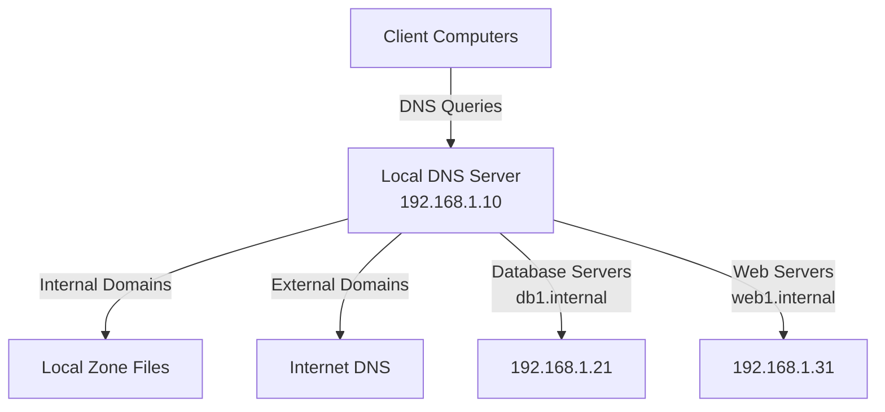

# Ubuntu DNS Configuration

## Introduction

Domain Name System (DNS) is a fundamental networking service that translates human-readable domain names (like example.com) into IP addresses (like 93.184.216.34) that computers use to identify each other on the network. Proper DNS configuration is essential for any Ubuntu system to navigate the internet or local networks efficiently.

In this guide, we'll walk through how to configure DNS settings on Ubuntu systems, understand the key configuration files, and troubleshoot common DNS issues. Whether you're setting up a workstation, server, or planning to run your own DNS server, this knowledge is crucial for maintaining reliable network connectivity.

## DNS Configuration Files in Ubuntu

Ubuntu uses several files and utilities to manage DNS configuration. Let's explore the most important ones:

### /etc/resolv.conf

This is the primary file that contains DNS resolver information, including:

- Which nameservers to query
- The domain search order
- Various query options

A typical `/etc/resolv.conf` file might look like this:

```bash
nameserver 8.8.8.8
nameserver 8.8.4.4
search example.com
options timeout:2 attempts:3
```

In this example:
- `nameserver` entries specify DNS servers to use (Google's public DNS in this case)
- `search` specifies a domain to append to unqualified hostnames
- `options` configures resolver behavior

> **Note:** On modern Ubuntu systems, `/etc/resolv.conf` is often managed automatically by system services like NetworkManager, systemd-resolved, or resolvconf. Manual changes to this file may be overwritten.

### /etc/hosts

The `/etc/hosts` file provides static mappings between IP addresses and hostnames:

```bash
127.0.0.1       localhost
127.0.1.1       ubuntu-desktop

# The following lines are desirable for IPv6 capable hosts
::1             localhost ip6-localhost ip6-loopback
fe00::0         ip6-localnet
ff00::0         ip6-mcastprefix
ff02::1         ip6-allnodes
ff02::2         ip6-allrouters

192.168.1.10    fileserver
192.168.1.11    printserver
```

This file is checked before DNS queries are sent, making it useful for:
- Local hostname resolution
- Overriding DNS entries
- Blocking websites (by redirecting domains to 127.0.0.1)

### /etc/nsswitch.conf

The Name Service Switch configuration file determines the order in which different name resolution methods are used:

```bash
# /etc/nsswitch.conf
hosts:          files dns mdns4_minimal [NOTFOUND=return]
```

This line tells the system to check the local files (like `/etc/hosts`) first, then query DNS servers, and finally use multicast DNS.

## Configuring DNS on Ubuntu Desktop

Ubuntu Desktop typically uses NetworkManager to handle network connections and DNS configuration. Here's how to configure DNS using the graphical interface:

### Using the GUI

1. Click on the network icon in the top-right corner of your screen
2. Select "Settings" or "Edit Connections"
3. Choose your active connection and click the gear icon
4. Navigate to the "IPv4" or "IPv6" tab
5. Change the "Method" dropdown to "Automatic (DHCP) addresses only" to set DNS manually
6. Enter your preferred DNS servers in the "DNS servers" field (e.g., "8.8.8.8, 1.1.1.1")
7. Click "Apply"

### Using NetworkManager via Command Line

You can also use the `nmcli` command:

```bash
# Show current connection details
nmcli device show | grep DNS

# Set DNS servers for a specific connection
nmcli connection modify "My Connection" ipv4.dns "8.8.8.8 8.8.4.4"

# Apply changes
nmcli connection up "My Connection"
```

## Configuring DNS on Ubuntu Server

On Ubuntu Server, you'll typically use different methods to configure DNS.

### Netplan Configuration

Modern Ubuntu Server installations use Netplan for network configuration. Create or edit a file in `/etc/netplan/` (usually named something like `01-netcfg.yaml` or `50-cloud-init.yaml`):

```yaml
network:
  version: 2
  ethernets:
    enp0s3:
      dhcp4: yes
      nameservers:
        addresses: [8.8.8.8, 1.1.1.1]
        search: [example.com, local.lan]
```

Apply the changes with:

```bash
sudo netplan apply
```

### Systemd-resolved

Many Ubuntu systems use systemd-resolved for DNS resolution management. Configure it by editing `/etc/systemd/resolved.conf`:

```bash
[Resolve]
DNS=8.8.8.8 1.1.1.1
FallbackDNS=9.9.9.9
Domains=example.com
```

Restart the service to apply changes:

```bash
sudo systemctl restart systemd-resolved
```

Check the status:

```bash
systemd-resolve --status
```

## Setting Up a Local DNS Resolver with Bind9

For more advanced setups, you might want to run your own DNS server using Bind9:

### Installation

```bash
sudo apt update
sudo apt install bind9 bind9utils bind9-doc
```

### Basic Configuration

Edit the main configuration file `/etc/bind/named.conf.options`:

```bash
options {
    directory "/var/cache/bind";
    
    // Forward DNS queries to Google's DNS
    forwarders {
        8.8.8.8;
        8.8.4.4;
    };
    
    // Allow recursive queries from local network only
    allow-recursion {
        127.0.0.1/8;
        192.168.1.0/24;
    };
    
    // Enable IPv6
    listen-on-v6 { any; };
    
    // Recommended security settings
    dnssec-validation auto;
    auth-nxdomain no;
};
```

### Checking Configuration and Restarting

```bash
# Check configuration syntax
sudo named-checkconf

# Restart the service
sudo systemctl restart bind9

# Check status
sudo systemctl status bind9
```

### Creating a Local Zone

To create a local zone for your network, edit `/etc/bind/named.conf.local`:

```bash
zone "local.lan" {
    type master;
    file "/etc/bind/db.local.lan";
};
```

Then create the zone file `/etc/bind/db.local.lan`:

```bash
$TTL    604800
@       IN      SOA     ns1.local.lan. admin.local.lan. (
                  3     ; Serial
             604800     ; Refresh
              86400     ; Retry
            2419200     ; Expire
             604800 )   ; Negative Cache TTL
;
@       IN      NS      ns1.local.lan.
ns1     IN      A       192.168.1.10
web     IN      A       192.168.1.20
db      IN      A       192.168.1.30
```

Don't forget to restart Bind9 after making changes:

```bash
sudo systemctl restart bind9
```

## Troubleshooting DNS Issues

When you encounter DNS problems, these tools can help diagnose the issues:

### Using dig

The `dig` command is excellent for testing DNS resolution:

```bash
# Basic query
dig example.com

# Query a specific DNS server
dig @8.8.8.8 example.com

# Query for a specific record type
dig example.com MX
```

Example output:

```
; <<>> DiG 9.16.1-Ubuntu <<>> example.com
;; global options: +cmd
;; Got answer:
;; ->>HEADER<<- opcode: QUERY, status: NOERROR, id: 31245
;; flags: qr rd ra; QUERY: 1, ANSWER: 1, AUTHORITY: 0, ADDITIONAL: 1

;; OPT PSEUDOSECTION:
; EDNS: version: 0, flags:; udp: 65494
;; QUESTION SECTION:
;example.com.			IN	A

;; ANSWER SECTION:
example.com.		86400	IN	A	93.184.216.34

;; Query time: 28 msec
;; SERVER: 127.0.0.53#53(127.0.0.53)
;; WHEN: Wed Feb 15 09:32:42 UTC 2023
;; MSG SIZE  rcvd: 56
```

### Using host and nslookup

These utilities provide simpler alternatives to `dig`:

```bash
# Basic host query
host example.com

# Basic nslookup query
nslookup example.com
```

### Checking systemd-resolved Status

If your system uses systemd-resolved:

```bash
# Check status
systemd-resolve --status

# Flush the DNS cache
sudo systemd-resolve --flush-caches
```

### Checking DNS Response Time

```bash
# Use +stats option with dig to see query time
dig +stats example.com
```

### Common Issues and Solutions

1. **Unable to resolve any domains**
   - Check internet connectivity
   - Verify DNS server addresses
   - Check firewall rules (UDP port 53)

2. **Some domains resolve, others don't**
   - Try alternative DNS servers
   - Clear the DNS cache
   - Check for entries in `/etc/hosts` that might be outdated

3. **Slow DNS resolution**
   - Try using DNS servers closer to your geographical location
   - Consider using a local caching DNS resolver
   - Check for network congestion

## DNS Security Considerations

When configuring DNS, keep these security best practices in mind:

### Use Secure DNS Providers

Consider using DNS providers that offer security features:
- Cloudflare (1.1.1.1)
- Quad9 (9.9.9.9)
- Google Public DNS (8.8.8.8)

### Enable DNSSEC

DNSSEC adds authentication to DNS responses, helping prevent DNS spoofing attacks:

```bash
# In /etc/bind/named.conf.options for Bind9
options {
    dnssec-validation auto;
    dnssec-enable yes;
}
```

### Use DNS over HTTPS (DoH) or DNS over TLS (DoT)

These protocols encrypt DNS traffic, preventing eavesdropping:

```bash
# Install stubby for DNS over TLS
sudo apt install stubby

# Configure DoH in Firefox
# Navigate to Settings > Network Settings > Enable DNS over HTTPS
```

## Real-World Applications

Let's explore some practical applications of DNS configuration in Ubuntu:

### Setting Up a Development Environment

For web development, it's common to use local domain names. Edit your `/etc/hosts` file:

```bash
127.0.0.1   myproject.local
127.0.0.1   api.myproject.local
127.0.0.1   admin.myproject.local
```

### Creating a Multi-Server Environment

In a larger setup with multiple servers, running your own DNS server can simplify management:



### Running a Caching DNS Server

Improve performance by setting up a caching DNS server for your network:

```bash
# In /etc/bind/named.conf.options
options {
    directory "/var/cache/bind";
    
    forwarders {
        8.8.8.8;
        1.1.1.1;
    };
    
    // Define cache size
    max-cache-size 256M;
    
    // Cache tuning
    max-cache-ttl 86400;  // 1 day
    max-ncache-ttl 3600;  // 1 hour
    
    allow-query { 192.168.1.0/24; localhost; };
    recursion yes;
};
```

## Summary

In this guide, we've covered:

- The fundamentals of DNS and its importance in Ubuntu networking
- Key configuration files like `/etc/resolv.conf`, `/etc/hosts`, and `/etc/nsswitch.conf`
- How to configure DNS on both Ubuntu Desktop and Server systems
- Setting up a local DNS server with Bind9
- Tools and techniques for troubleshooting DNS issues
- Security considerations for DNS configuration
- Real-world applications of DNS in various environments

DNS configuration is a critical skill for any Ubuntu system administrator or power user. Properly configured DNS ensures reliable network connectivity and can enhance security, performance, and management of your systems.

## Additional Resources

Here are some useful resources to deepen your understanding of DNS configuration:

- Ubuntu Server Guide - DNS section
- BIND 9 Administrator Reference Manual
- RFC 1034 and RFC 1035 (DNS specification documents)
- dig, host, and nslookup man pages (`man dig`, `man host`, `man nslookup`)

## Practice Exercises

1. Configure your Ubuntu system to use Cloudflare's DNS servers (1.1.1.1 and 1.0.0.1)
2. Set up local domain names for your development projects in `/etc/hosts`
3. Install and configure a caching DNS server with Bind9
4. Create a local DNS zone for your home or lab network
5. Use `dig` and other tools to troubleshoot DNS resolution for various domains