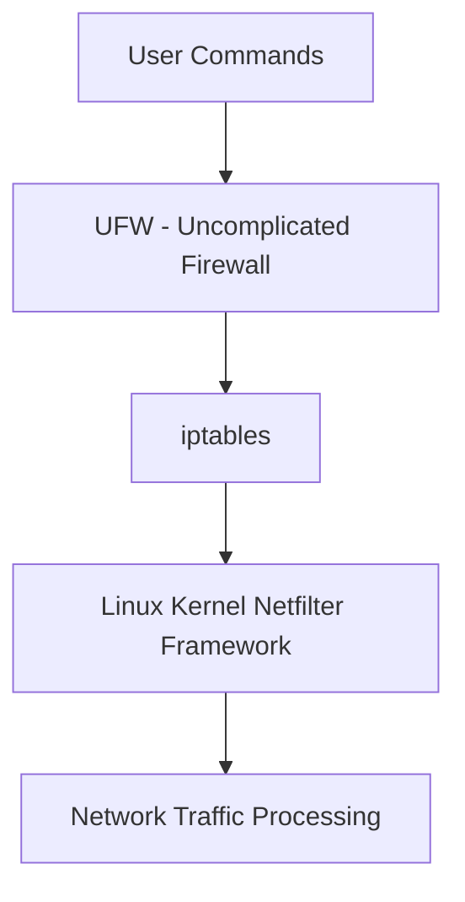

# Ubuntu Firewall Management

## Introduction

A firewall is a critical security component that monitors and controls incoming and outgoing network traffic based on predetermined security rules. In Ubuntu, the default firewall configuration tool is **UFW** (Uncomplicated Firewall), which provides a user-friendly interface to the more complex **iptables** firewall system.

This guide will walk you through the essential concepts of Ubuntu's firewall system, showing you how to configure, manage, and optimize your firewall settings to enhance your system's security while maintaining necessary network connectivity.

## Understanding UFW and iptables

Before diving into commands and configurations, let's understand the relationship between UFW and iptables:



- **iptables** is a powerful, low-level firewall utility that directly interfaces with the Linux kernel's netfilter framework.
- **UFW** acts as a frontend to iptables, making firewall management more accessible without sacrificing functionality.

## Getting Started with UFW

### Checking UFW Status

First, let's check if UFW is installed and its current status:

```bash
sudo ufw status
```

Output if UFW is inactive:
```
Status: inactive
```

### Installing UFW

If UFW is not installed (rare in modern Ubuntu distributions), you can install it with:

```bash
sudo apt update
sudo apt install ufw
```

### Enabling UFW

To enable the firewall with default settings:

```bash
sudo ufw enable
```

Output:
```
Firewall is active and enabled on system startup
```

To disable the firewall:

```bash
sudo ufw disable
```

## Basic UFW Configuration

### Default Policies

Setting default policies determines how to handle traffic that doesn't match any specific rules:

```bash
sudo ufw default deny incoming
sudo ufw default allow outgoing
```

This configuration:
- Blocks all incoming connections by default
- Allows all outgoing connections by default

### Managing Rules for Specific Services

#### Allowing Specific Services

```bash
sudo ufw allow ssh
```

Output:
```
Rule added
Rule added (v6)
```

This allows SSH connections (port 22). You can also specify ports directly:

```bash
sudo ufw allow 22/tcp
```

#### Common Service Rules

Here are rules for common services:

```bash
sudo ufw allow http          # Allow HTTP (port 80)
sudo ufw allow https         # Allow HTTPS (port 443)
sudo ufw allow 53/udp        # Allow DNS queries
sudo ufw allow 3306/tcp      # Allow MySQL connections
```

#### Denying Specific Services

```bash
sudo ufw deny telnet         # Deny Telnet (port 23)
```

### Managing Rules for Specific Ports

You can also manage rules for specific ports:

```bash
sudo ufw allow 8080/tcp      # Allow TCP traffic on port 8080
sudo ufw deny 25/tcp         # Deny SMTP traffic
```

### Managing Rules for IP Addresses

To allow connections from a specific IP address:

```bash
sudo ufw allow from 192.168.1.100
```

To allow connections from a specific IP address to a specific port:

```bash
sudo ufw allow from 192.168.1.100 to any port 22
```

To allow connections from a subnet:

```bash
sudo ufw allow from 192.168.1.0/24
```

### Deleting Rules

You can delete rules by specifying the rule number or the rule itself:

```bash
sudo ufw status numbered
```

Output example:
```
Status: active

     To                         Action      From
     --                         ------      ----
[ 1] 22/tcp                     ALLOW IN    Anywhere
[ 2] 80/tcp                     ALLOW IN    Anywhere
[ 3] 443/tcp                    ALLOW IN    Anywhere
```

To delete rule number 2:

```bash
sudo ufw delete 2
```

Alternatively, you can delete a rule by specifying it:

```bash
sudo ufw delete allow 80/tcp
```

## Advanced UFW Configuration

### Rate Limiting

Rate limiting helps protect against brute force attacks by limiting connection attempts:

```bash
sudo ufw limit ssh
```

This limits SSH connection attempts to 6 per 30 seconds from a single IP address.

### Application Profiles

UFW integrates with application profiles to simplify configuration:

```bash
sudo ufw app list
```

Output example:
```
Available applications:
  Apache
  Apache Full
  Apache Secure
  CUPS
  OpenSSH
```

To allow an application profile:

```bash
sudo ufw allow "Apache Full"
```

### Logging

Enable logging to track blocked connections:

```bash
sudo ufw logging on
```

You can set the logging level:

```bash
sudo ufw logging medium
```

Available levels: low, medium, high, full

### Reset UFW

If you need to start fresh:

```bash
sudo ufw reset
```

This removes all rules and reverts to default settings.

## Practical Examples

### Securing a Web Server

For a typical web server, you might use:

```bash
sudo ufw default deny incoming
sudo ufw default allow outgoing
sudo ufw allow ssh
sudo ufw allow http
sudo ufw allow https
sudo ufw enable
```

### Setting Up a Development Environment

For a development environment:

```bash
sudo ufw default deny incoming
sudo ufw default allow outgoing
sudo ufw allow ssh
sudo ufw allow 3000:5000/tcp  # Common development ports
sudo ufw enable
```

### Securing a Database Server

For a database server:

```bash
sudo ufw default deny incoming
sudo ufw default allow outgoing
sudo ufw allow ssh
sudo ufw allow from 192.168.1.0/24 to any port 3306  # Allow MySQL from local network only
sudo ufw enable
```

## Understanding Firewall Logs

UFW logs are stored in `/var/log/ufw.log`. You can view recent entries with:

```bash
sudo grep UFW /var/log/syslog
```

Example log entry:
```
Apr 15 15:32:20 ubuntu-server kernel: [UFW BLOCK] IN=eth0 OUT= MAC=00:00:00:00:00:00:00:00:00:00:00:00:08:00 SRC=192.168.1.101 DST=192.168.1.10 LEN=60 TOS=0x00 PREC=0x00 TTL=64 ID=39510 DF PROTO=TCP SPT=43122 DPT=22 WINDOW=64240 RES=0x00 SYN URGP=0
```

This shows UFW blocked a connection attempt from `192.168.1.101` to port 22 (SSH).

## Using iptables Directly

While UFW is recommended for most users, you might occasionally need to work with iptables directly:

### Viewing Current iptables Rules

```bash
sudo iptables -L
```

### Saving and Restoring iptables Rules

```bash
sudo iptables-save > /path/to/iptables.rules
sudo iptables-restore < /path/to/iptables.rules
```

## Best Practices for Firewall Management

1. **Follow the principle of least privilege**: Only open ports that are necessary.
2. **Regularly review firewall rules**: Remove rules that are no longer needed.
3. **Monitor firewall logs**: Watch for suspicious activity and adjust rules accordingly.
4. **Use rate limiting** for vulnerable services like SSH.
5. **Create backups of working configurations** before making changes.
6. **Test new rules** thoroughly before implementing them in production.
7. **Document all changes** to firewall rules for future reference.

## Troubleshooting Common Issues

### Cannot Access a Service After Setting Up UFW

1. Check if the service is running:
   ```bash
   sudo systemctl status service-name
   ```

2. Verify the firewall rules:
   ```bash
   sudo ufw status
   ```

3. Check if the port is open:
   ```bash
   sudo ss -tuln | grep PORT_NUMBER
   ```

### UFW Rules Not Taking Effect

1. Try reloading UFW:
   ```bash
   sudo ufw reload
   ```

2. Check for conflicts with other firewall tools:
   ```bash
   sudo systemctl status firewalld
   ```

### Connection Attempts Being Blocked Unexpectedly

1. Check UFW logs:
   ```bash
   sudo grep UFW /var/log/syslog
   ```

2. Add a temporary rule to allow the traffic:
   ```bash
   sudo ufw allow from SOURCE_IP to any port PORT_NUMBER
   ```

## Summary

In this guide, we've covered the essentials of Ubuntu firewall management using UFW:

- Basic concepts of firewall protection in Ubuntu
- Managing firewall rules with UFW
- Configuring rules for services, ports, and IP addresses
- Advanced configurations including rate limiting and application profiles
- Real-world examples for common server types
- Troubleshooting common firewall issues

By following these practices, you can establish a solid security foundation for your Ubuntu system while maintaining the connectivity needed for your applications and services.

## Additional Resources

- [Ubuntu Security Documentation](https://ubuntu.com/security)
- [UFW Community Help Wiki](https://help.ubuntu.com/community/UFW)
- [Netfilter Project (iptables)](https://www.netfilter.org/)

## Exercises

1. Set up UFW on your Ubuntu system and create rules to allow SSH and HTTP traffic.
2. Configure rate limiting for SSH to protect against brute force attacks.
3. Use application profiles to manage firewall rules for a web server.
4. Practice viewing and interpreting UFW logs.
5. Create a backup of your firewall configuration and then practice restoring it.
6. Set up rules to allow traffic only from your local network to a specific service.