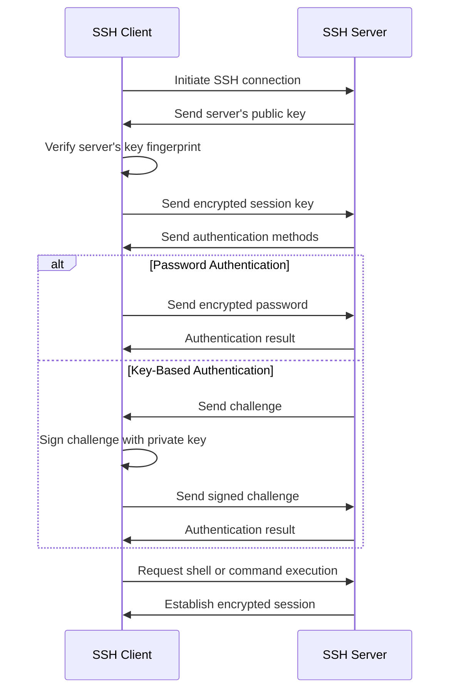

# Ubuntu SSH Configuration

## Introduction

Secure Shell (SSH) is a cryptographic network protocol that enables secure communication between computers over an unsecured network. It provides strong authentication and encrypted data communications between systems, making it an essential tool for system administrators, developers, and power users alike.

In this guide, we'll explore how to install, configure, and optimize SSH on Ubuntu systems. You'll learn everything from basic connection setup to advanced security configurations and troubleshooting techniques.

## Installing SSH Server on Ubuntu

Ubuntu typically comes with the SSH client pre-installed, but you may need to install the SSH server to allow incoming connections to your machine.

### Installing OpenSSH Server

To install the OpenSSH server, run:

```bash
sudo apt update
sudo apt install openssh-server
```

After installation, the SSH service should start automatically. You can verify its status with:

```bash
sudo systemctl status ssh
```

Expected output:
```
● ssh.service - OpenBSD Secure Shell server
     Loaded: loaded (/lib/systemd/system/ssh.service; enabled; vendor preset: enabled)
     Active: active (running) since Mon 2023-05-22 15:30:42 UTC; 5s ago
...
```

If the service isn't running, you can start it with:

```bash
sudo systemctl start ssh
```

To enable SSH to start automatically at system boot:

```bash
sudo systemctl enable ssh
```

## Basic SSH Usage

### Connecting to a Remote Server

The basic syntax for connecting to an SSH server is:

```bash
ssh username@hostname_or_ip
```

For example, to connect to a server with IP 192.168.1.100 as user "ubuntu":

```bash
ssh ubuntu@192.168.1.100
```

If your username on the remote server is the same as your local username, you can simply use:

```bash
ssh hostname_or_ip
```

### Using a Different Port

By default, SSH listens on port 22. To connect to a server using a different port:

```bash
ssh -p 2222 username@hostname_or_ip
```

### Executing Remote Commands

You can execute commands on a remote server without opening a full session:

```bash
ssh username@hostname_or_ip "command_to_execute"
```

For example, to check disk usage:

```bash
ssh ubuntu@192.168.1.100 "df -h"
```

## SSH Configuration Files

SSH configuration is primarily managed through configuration files. Understanding these files is crucial for proper setup:

### Server-Side Configuration

The main SSH server configuration file is located at:

```
/etc/ssh/sshd_config
```

This file controls how the SSH daemon behaves, including authentication methods, listening port, and security settings.

### Client-Side Configuration

For SSH clients, the system-wide configuration is stored at:

```
/etc/ssh/ssh_config
```

User-specific configurations are stored in:

```
~/.ssh/config
```

Creating a user-specific configuration file allows customized settings for different hosts.

## Setting Up SSH Keys

SSH keys provide a more secure authentication method compared to passwords. Let's set them up:

### Generating SSH Keys

To generate a new SSH key pair:

```bash
ssh-keygen -t ed25519 -C "your_email@example.com"
```

You can also use RSA with 4096 bits for compatibility with older systems:

```bash
ssh-keygen -t rsa -b 4096 -C "your_email@example.com"
```

This command generates two files:
- `~/.ssh/id_ed25519` (or `id_rsa`): Your private key (keep this secure!)
- `~/.ssh/id_ed25519.pub` (or `id_rsa.pub`): Your public key (share this)

### Copying Your Public Key to a Server

The easiest way to copy your public key to a server is using `ssh-copy-id`:

```bash
ssh-copy-id username@hostname_or_ip
```

This command adds your public key to the `~/.ssh/authorized_keys` file on the remote server.

If `ssh-copy-id` is not available, you can manually copy your key:

```bash
cat ~/.ssh/id_ed25519.pub | ssh username@hostname_or_ip "mkdir -p ~/.ssh && chmod 700 ~/.ssh && cat >> ~/.ssh/authorized_keys && chmod 600 ~/.ssh/authorized_keys"
```

### Testing Key-Based Authentication

After setting up your SSH key, try connecting to the server:

```bash
ssh username@hostname_or_ip
```

If your keys are properly set up, you should connect without being prompted for a password.

## Configuring the SSH Server

Let's examine some important configurations for the SSH server:

### Changing the Default Port

To change the default SSH port, edit the SSH server configuration:

```bash
sudo nano /etc/ssh/sshd_config
```

Find the line with `#Port 22` and change it to:

```
Port 2222  # Choose any port number between 1024 and 65535
```

After saving the file, restart the SSH service:

```bash
sudo systemctl restart ssh
```

Remember to update your firewall settings to allow traffic on the new port!

### Disabling Password Authentication

To enforce key-based authentication only, edit `/etc/ssh/sshd_config`:

```bash
sudo nano /etc/ssh/sshd_config
```

Find and modify these lines:

```
PasswordAuthentication no
ChallengeResponseAuthentication no
UsePAM no
```

Save the file and restart the SSH service:

```bash
sudo systemctl restart ssh
```

⚠️ **Warning**: Before disabling password authentication, ensure your SSH keys are properly set up and working! Otherwise, you may lock yourself out of the server.

### Limiting User Access

To restrict SSH access to specific users, add this to `/etc/ssh/sshd_config`:

```
AllowUsers user1 user2 admin
```

Or restrict by group:

```
AllowGroups ssh-users admin
```

### Timeout Settings

To prevent idle sessions from consuming resources, add these settings:

```
ClientAliveInterval 300
ClientAliveCountMax 2
```

This configuration will disconnect clients after approximately 10 minutes of inactivity.

## Creating an SSH Client Configuration

Creating a client configuration file can simplify connections to multiple servers:

```bash
nano ~/.ssh/config
```

Add host configurations like this:

```
Host webserver
    HostName 192.168.1.100
    User ubuntu
    Port 22
    IdentityFile ~/.ssh/id_ed25519

Host database
    HostName db.example.com
    User admin
    Port 2222
    IdentityFile ~/.ssh/database_key
```

With this configuration, you can simply type:

```bash
ssh webserver
```

Instead of:

```bash
ssh -i ~/.ssh/id_ed25519 ubuntu@192.168.1.100
```

## SSH Tunneling and Port Forwarding

SSH can create secure tunnels for forwarding network traffic:

### Local Port Forwarding

To forward a local port to a remote service:

```bash
ssh -L 8080:localhost:80 username@hostname_or_ip
```

This command forwards your local port 8080 to port 80 on the remote server.

### Remote Port Forwarding

To make a local service accessible from the remote server:

```bash
ssh -R 8080:localhost:3000 username@hostname_or_ip
```

This forwards port 8080 on the remote server to port 3000 on your local machine.

### Dynamic Port Forwarding (SOCKS Proxy)

To create a SOCKS proxy through SSH:

```bash
ssh -D 1080 username@hostname_or_ip
```

This sets up a SOCKS proxy on port 1080 that tunnels all traffic through the SSH connection.

## SSH Security Best Practices

To keep your SSH server secure, follow these best practices:

1. **Use SSH keys** instead of passwords
2. **Keep software updated**:
   ```bash
   sudo apt update && sudo apt upgrade
   ```
3. **Use strong ciphers** by adding to `/etc/ssh/sshd_config`:
   ```
   Ciphers chacha20-poly1305@openssh.com,aes256-gcm@openssh.com,aes128-gcm@openssh.com,aes256-ctr,aes192-ctr,aes128-ctr
   ```
4. **Use strong MAC algorithms**:
   ```
   MACs hmac-sha2-512-etm@openssh.com,hmac-sha2-256-etm@openssh.com,umac-128-etm@openssh.com
   ```
5. **Disable root login**:
   ```
   PermitRootLogin no
   ```
6. **Implement fail2ban** to protect against brute force attacks:
   ```bash
   sudo apt install fail2ban
   ```
7. **Use SSH over VPN** for additional security when possible

## Troubleshooting SSH Connections

Here are solutions to common SSH issues:

### Connection Refused

If you see "Connection refused" errors:

1. Verify SSH is running:
   ```bash
   sudo systemctl status ssh
   ```
2. Check firewall settings:
   ```bash
   sudo ufw status
   ```
3. Allow SSH through the firewall:
   ```bash
   sudo ufw allow ssh
   ```
   Or for a custom port:
   ```bash
   sudo ufw allow 2222/tcp
   ```

### Permission Denied Errors

For "Permission denied" errors:

1. Check username and password
2. Verify SSH key permissions:
   ```bash
   chmod 700 ~/.ssh
   chmod 600 ~/.ssh/id_ed25519
   chmod 600 ~/.ssh/id_ed25519.pub
   ```
3. Check authorized_keys file permissions:
   ```bash
   chmod 600 ~/.ssh/authorized_keys
   ```

### Debugging Connections

To see more information about connection issues:

```bash
ssh -v username@hostname_or_ip
```

For even more detailed output, use `-vv` or `-vvv`:

```bash
ssh -vvv username@hostname_or_ip
```

## SSH Connection Workflow

The following diagram illustrates how SSH connection establishment works:



## Practical Examples

Let's look at some real-world examples of SSH usage:

### Example 1: Automating File Transfers

Create a script to back up a website daily:

```bash
#!/bin/bash
# Website backup script

# Define variables
REMOTE_SERVER="webserver"
REMOTE_PATH="/var/www/html"
LOCAL_PATH="/backups/website"
FILENAME="website_backup_$(date +%Y%m%d).tar.gz"

# Create backup on remote server
ssh $REMOTE_SERVER "tar -czf /tmp/$FILENAME $REMOTE_PATH"

# Download the backup
scp $REMOTE_SERVER:/tmp/$FILENAME $LOCAL_PATH/

# Remove temporary file
ssh $REMOTE_SERVER "rm /tmp/$FILENAME"

echo "Backup completed: $LOCAL_PATH/$FILENAME"
```

### Example 2: Setting Up a Jump Host

Configure a jump host in your SSH config:

```
Host internal-server
    HostName 10.0.0.5
    User admin
    ProxyJump jumphost.example.com
    IdentityFile ~/.ssh/internal_key
```

Now you can reach the internal server through the jump host with:

```bash
ssh internal-server
```

### Example 3: Database Port Forwarding

To securely access a remote database server:

```bash
ssh -L 3306:database-server:3306 username@jump-server
```

Then connect to the database using localhost:3306 in your database client.

## Summary

SSH is a powerful tool for secure remote access and management of Ubuntu systems. In this guide, we covered:

- Installation and basic usage of SSH
- Configuration of both client and server settings
- Setting up and using SSH keys for authentication
- Enhancing security through proper configuration
- Using SSH tunneling and port forwarding
- Troubleshooting common SSH issues

By implementing these practices, you can ensure secure and efficient remote administration of your Ubuntu systems.

## Additional Resources

- [OpenSSH Documentation](https://www.openssh.com/manual.html)
- [Ubuntu Server Documentation](https://ubuntu.com/server/docs)
- [Linux Foundation SSH Security](https://www.linuxfoundation.org/blog/blog/classic-sysadmin-openssh-security-and-hardening)

## Exercises

1. Install OpenSSH server on your Ubuntu system and connect to it from another computer.
2. Generate SSH keys and set up passwordless authentication.
3. Configure your SSH server to use a non-standard port and disable root login.
4. Create an SSH config file with at least two host configurations.
5. Set up local port forwarding to securely access a web server running on a remote machine.