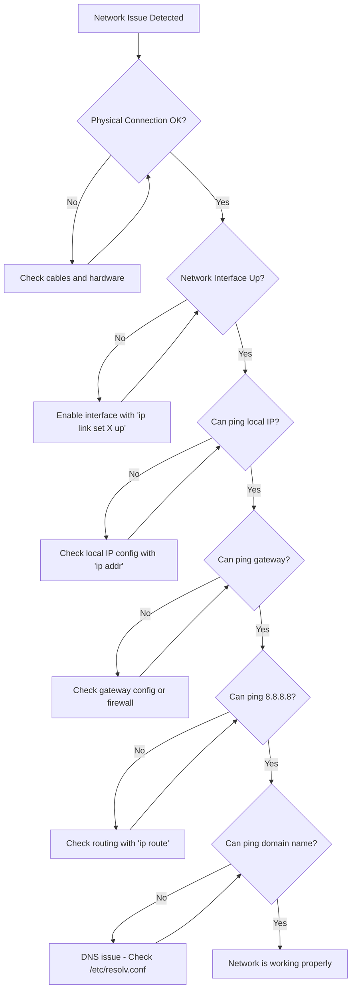

# Ubuntu Network Troubleshooting

Network issues can be frustrating, especially for beginners. This guide will walk you through the most common network problems in Ubuntu and provide practical solutions to diagnose and fix them.

## Introduction

When your Ubuntu system can't connect to the internet or network resources, productivity comes to a halt. Understanding how to diagnose and resolve these issues is an essential skill for any Ubuntu user. This guide covers the fundamentals of network troubleshooting in Ubuntu, from basic connectivity checks to more advanced diagnostic techniques.

## Basic Network Concepts in Ubuntu

Before diving into troubleshooting, let's understand some basic network components in Ubuntu:

- **Network Interface**: Physical or virtual connection points (like ethernet or wifi)
- **IP Address**: Unique identifier for your device on a network
- **DNS**: Domain Name System that translates domain names to IP addresses
- **Gateway**: Router that connects your local network to other networks
- **Firewall**: Security system that monitors and controls network traffic

## Essential Network Troubleshooting Commands

### 1. Checking Network Interface Status

The `ip` command is your primary tool for viewing and configuring network interfaces:

```bash
# List all network interfaces
ip addr show

# Check a specific interface (e.g., ethernet)
ip addr show eth0

# Check a specific interface (e.g., wifi)
ip addr show wlan0
```

Example output:
```
2: eth0: <BROADCAST,MULTICAST,UP,LOWER_UP> mtu 1500 qdisc pfifo_fast state UP group default qlen 1000
    link/ether 00:1e:4f:c8:43:fc brd ff:ff:ff:ff:ff:ff
    inet 192.168.1.100/24 brd 192.168.1.255 scope global dynamic noprefixroute eth0
       valid_lft 86389sec preferred_lft 86389sec
    inet6 fe80::3aed:5ff:fe34:65a2/64 scope link 
       valid_lft forever preferred_lft forever
```

### 2. Testing Basic Connectivity

Ping is the simplest way to test if you can reach a network destination:

```bash
# Test connectivity to a remote server
ping google.com

# Test connectivity with a specific number of packets
ping -c 4 8.8.8.8
```

Example output:
```
PING google.com (142.250.190.78) 56(84) bytes of data.
64 bytes from mia07s85-in-f14.1e100.net (142.250.190.78): icmp_seq=1 ttl=115 time=14.6 ms
64 bytes from mia07s85-in-f14.1e100.net (142.250.190.78): icmp_seq=2 ttl=115 time=13.8 ms
64 bytes from mia07s85-in-f14.1e100.net (142.250.190.78): icmp_seq=3 ttl=115 time=14.2 ms
64 bytes from mia07s85-in-f14.1e100.net (142.250.190.78): icmp_seq=4 ttl=115 time=14.0 ms

--- google.com ping statistics ---
4 packets transmitted, 4 received, 0% packet loss, time 3005ms
rtt min/avg/max/mdev = 13.793/14.159/14.647/0.324 ms
```

### 3. Checking DNS Resolution

If you can ping IP addresses but not domain names, you likely have a DNS issue:

```bash
# Test DNS resolution
nslookup github.com

# Alternative DNS lookup
dig github.com
```

Example output for `nslookup`:
```
Server:		127.0.0.53
Address:	127.0.0.53#53

Non-authoritative answer:
Name:	github.com
Address: 140.82.114.4
```

### 4. Tracing Network Routes

Trace the path packets take to reach a destination:

```bash
# Trace route to a destination
traceroute google.com

# For systems without traceroute installed
sudo apt install traceroute
```

Example output:
```
traceroute to google.com (142.250.190.78), 30 hops max, 60 byte packets
 1  _gateway (192.168.1.1)  1.902 ms  1.822 ms  1.794 ms
 2  96.120.106.30 (96.120.106.30)  10.986 ms  12.472 ms  12.456 ms
 3  68.85.160.113 (68.85.160.113)  12.539 ms  12.532 ms  12.523 ms
 [...]
 8  142.250.190.78 (142.250.190.78)  14.566 ms  12.458 ms  13.945 ms
```

### 5. Checking Network Services

The `netstat` or `ss` command helps identify which services are listening on which ports:

```bash
# Show all listening ports and their processes
sudo ss -tulpn

# Using netstat (if installed)
sudo netstat -tulpn
```

Example output:
```
Netid  State   Recv-Q  Send-Q   Local Address:Port   Peer Address:Port  Process
udp    UNCONN  0       0        127.0.0.53%lo:53     0.0.0.0:*          users:(("systemd-resolve",pid=889,fd=12))
tcp    LISTEN  0       128      127.0.0.1:631        0.0.0.0:*          users:(("cupsd",pid=1015,fd=7))
tcp    LISTEN  0       128      127.0.0.53%lo:53     0.0.0.0:*          users:(("systemd-resolve",pid=889,fd=13))
tcp    LISTEN  0       128      0.0.0.0:22           0.0.0.0:*          users:(("sshd",pid=1291,fd=3))
```

## Common Network Issues and Solutions

### Problem 1: No Internet Connection

#### Diagnosis Steps:

1. Check physical connections (cables, router power)
2. Verify network interface status:

```bash
ip addr show
```

3. Test local network connectivity:

```bash
ping 192.168.1.1  # Replace with your router IP
```

4. Test DNS resolution:

```bash
ping 8.8.8.8      # Google's DNS, to test general internet connectivity
ping google.com   # To test DNS resolution
```

#### Solutions:

1. **If the interface is down:**

```bash
# Bring up a network interface
sudo ip link set eth0 up

# For WiFi connections
sudo ip link set wlan0 up
```

2. **If DHCP is not working:**

```bash
# Request a new IP address
sudo dhclient eth0
```

3. **If DNS is not resolving:**

Edit your DNS configuration:

```bash
sudo nano /etc/systemd/resolved.conf
```

Add Google's DNS servers:

```
[Resolve]
DNS=8.8.8.8 8.8.4.4
```

Then restart the service:

```bash
sudo systemctl restart systemd-resolved
```

### Problem 2: WiFi Connection Issues

#### Diagnosis Steps:

1. Check if WiFi is enabled:

```bash
rfkill list
```

2. Scan for available networks:

```bash
sudo iwlist wlan0 scan | grep ESSID
```

3. Check your network configuration:

```bash
nmcli device wifi list
```

#### Solutions:

1. **If WiFi is blocked:**

```bash
# Unblock WiFi
sudo rfkill unblock wifi
```

2. **If the driver isn't loaded properly:**

```bash
# Identify WiFi adapter
lspci | grep -i wireless

# Check loaded drivers
lsmod | grep iwl

# Install wireless tools (if needed)
sudo apt install wireless-tools
```

3. **Connect to a WiFi network:**

```bash
# Using NetworkManager CLI
nmcli device wifi connect "Network_SSID" password "network_password"
```

### Problem 3: Network Configuration Issues

#### Checking Network Manager Configuration

```bash
# Check NetworkManager status
systemctl status NetworkManager

# List saved connections
nmcli connection show
```

#### Static IP Configuration

If you need to set a static IP:

```bash
# Create a new connection with static IP
sudo nmcli connection add con-name "Static Ethernet" ifname eth0 type ethernet ip4 192.168.1.100/24 gw4 192.168.1.1
sudo nmcli connection modify "Static Ethernet" ipv4.dns "8.8.8.8 8.8.4.4"
sudo nmcli connection up "Static Ethernet"
```

#### Using Network Configuration Files

For more permanent configuration, edit the Netplan configuration:

```bash
sudo nano /etc/netplan/01-netcfg.yaml
```

Example configuration:

```yaml
network:
  version: 2
  renderer: networkd
  ethernets:
    eth0:
      dhcp4: no
      addresses: [192.168.1.100/24]
      gateway4: 192.168.1.1
      nameservers:
        addresses: [8.8.8.8, 8.8.4.4]
```

Apply the changes:

```bash
sudo netplan apply
```

## Advanced Troubleshooting Techniques

### Network Traffic Analysis

For more detailed network diagnostics, you can use packet analyzers:

```bash
# Install tcpdump
sudo apt install tcpdump

# Capture packets on an interface
sudo tcpdump -i eth0 -n

# Capture specific traffic (e.g., HTTP)
sudo tcpdump -i eth0 port 80
```

### Firewall Troubleshooting

Ubuntu uses `ufw` (Uncomplicated Firewall) by default:

```bash
# Check firewall status
sudo ufw status

# Allow specific traffic
sudo ufw allow ssh

# View current rules
sudo ufw status verbose
```

## Visual Representation of the Network Troubleshooting Process

Here's a flowchart showing a systematic approach to network troubleshooting:



## Real-world Scenarios

### Scenario 1: Corporate Network Configuration

When connecting to a corporate network, you might need to configure a static IP, proxy settings, and specific DNS servers:

```bash
# Set up static IP with NetworkManager
sudo nmcli connection add con-name "Corporate Network" ifname eth0 type ethernet ip4 10.0.0.100/24 gw4 10.0.0.1
sudo nmcli connection modify "Corporate Network" ipv4.dns "10.0.0.2 10.0.0.3"

# Configure a proxy (for the current session)
export http_proxy=http://proxy.example.com:8080
export https_proxy=http://proxy.example.com:8080

# For permanent proxy settings, add to /etc/environment
echo 'http_proxy=http://proxy.example.com:8080' | sudo tee -a /etc/environment
echo 'https_proxy=http://proxy.example.com:8080' | sudo tee -a /etc/environment
```

### Scenario 2: Public WiFi Troubleshooting

When connecting to public WiFi, you might encounter captive portals:

1. Connect to the network:

```bash
nmcli device wifi connect "PublicWiFi"
```

2. If you're not redirected automatically, try accessing a website:

```bash
curl http://example.com
```

3. If you see HTML for a login page instead of the expected website, open a browser and try navigating to any HTTP site to trigger the captive portal.

## Network Interface Naming in Modern Ubuntu

Modern Ubuntu uses predictable network interface names managed by systemd:

- **Ethernet**: `ens33`, `enp0s3`, etc. (instead of `eth0`)
- **WiFi**: `wlp3s0`, etc. (instead of `wlan0`)

The naming scheme follows this pattern:
- `en` - Ethernet
- `wl` - Wireless LAN
- `p3s0` - PCI bus 3, slot 0

You can always check your actual interface names with:

```bash
ip link show
```

## Summary

This guide covered the essential aspects of network troubleshooting in Ubuntu:

1. **Basic diagnostics** with `ping`, `ip`, and DNS tools
2. **Common issues and solutions** for wired and wireless connections
3. **Network configuration** using NetworkManager and Netplan
4. **Advanced techniques** including packet capture and firewall configuration
5. **Real-world scenarios** you might encounter

By following the systematic approach outlined in this guide, you should be able to diagnose and fix most network issues on your Ubuntu system.

## Additional Resources

- [Ubuntu Networking Documentation](https://help.ubuntu.com/community/NetworkConfigurationCommandLine)
- [NetworkManager Documentation](https://networkmanager.dev/docs/)
- [Netplan Documentation](https://netplan.io/examples)

## Practice Exercises

1. Identify all network interfaces on your system and their status.
2. Test connectivity to different domains and IP addresses.
3. Temporarily change your DNS settings and verify the change.
4. Create a static IP configuration and test it.
5. Configure your system to use a different DNS provider (like Cloudflare's 1.1.1.1).