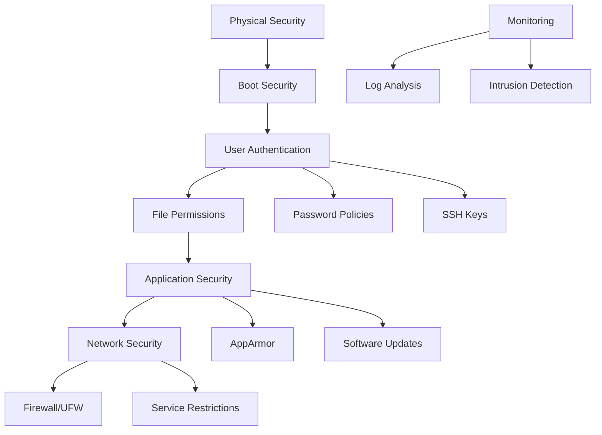

# Ubuntu Security Basics

## Introduction

Security is a critical aspect of any operating system, and Ubuntu provides robust tools and practices to help secure your system. This guide introduces fundamental security concepts for Ubuntu, designed for beginners who want to protect their systems effectively. By implementing these basic security measures, you can significantly reduce the risk of unauthorized access and potential data breaches.

## User Management and Permissions

### Understanding Linux Permissions

Ubuntu, like all Linux distributions, uses a permission-based security model that controls how files and directories can be accessed.

The basic permission types are:
- **Read (r)**: View file contents or list directory contents
- **Write (w)**: Modify files or create/delete files in a directory
- **Execute (x)**: Run programs or access directories

Each file and directory has permissions assigned to three categories:
- **Owner**: The user who created the file
- **Group**: A collection of users with similar access needs
- **Others**: All other users on the system

#### Viewing Permissions

You can view permissions using the `ls -l` command:

```bash
ls -l /etc/passwd
```

Output:
```
-rw-r--r-- 1 root root 2572 Mar 10 2023 /etc/passwd
```

In this output:
- The first `-` indicates it's a regular file
- `rw-` shows the owner (root) has read and write permissions
- `r--` shows the group has read-only permission
- `r--` shows others have read-only permission

### Changing Permissions

You can change permissions using the `chmod` command:

```bash
# Give execute permission to the owner
chmod u+x myscript.sh

# Remove write permission from others
chmod o-w myfile.txt

# Set specific permissions (owner=rwx, group=r-x, others=r--)
chmod 754 myfile.txt
```

### User and Group Management

Properly managing users and groups is essential for security.

#### Creating and Managing Users

```bash
# Create a new user
sudo adduser newusername

# Add a user to a group
sudo usermod -aG sudo username

# Lock a user account
sudo passwd -l username

# Delete a user
sudo deluser username
```

#### Managing Groups

```bash
# Create a new group
sudo addgroup newgroup

# Add a user to a group
sudo adduser username groupname

# View all groups a user belongs to
groups username
```

## Firewall Configuration

Ubuntu comes with a built-in firewall called UFW (Uncomplicated Firewall), a user-friendly interface for iptables.

### Basic UFW Commands

```bash
# Check firewall status
sudo ufw status

# Enable the firewall
sudo ufw enable

# Allow SSH connections
sudo ufw allow ssh

# Allow specific port
sudo ufw allow 8080/tcp

# Deny specific port
sudo ufw deny 23/tcp

# Allow specific IP address
sudo ufw allow from 192.168.1.100

# Delete a rule
sudo ufw delete allow 8080/tcp
```

### Common Firewall Configurations

Here's a basic configuration for a web server:

```bash
# Enable firewall
sudo ufw enable

# Allow SSH
sudo ufw allow ssh

# Allow HTTP and HTTPS
sudo ufw allow 80/tcp
sudo ufw allow 443/tcp

# Verify rules
sudo ufw status verbose
```

Output:
```
Status: active
Logging: on (low)
Default: deny (incoming), allow (outgoing), disabled (routed)
New profiles: skip

To                         Action      From
--                         ------      ----
22/tcp                     ALLOW IN    Anywhere
80/tcp                     ALLOW IN    Anywhere
443/tcp                    ALLOW IN    Anywhere
22/tcp (v6)                ALLOW IN    Anywhere (v6)
80/tcp (v6)                ALLOW IN    Anywhere (v6)
443/tcp (v6)               ALLOW IN    Anywhere (v6)
```

## System Updates and Package Security

Keeping your system updated is one of the most important security practices.

### Updating Your System

```bash
# Update package lists
sudo apt update

# Upgrade installed packages
sudo apt upgrade

# Full system upgrade (may add/remove packages)
sudo apt full-upgrade

# Automatically remove unused packages
sudo apt autoremove
```

### Automatic Security Updates

You can configure Ubuntu to automatically install security updates:

```bash
# Install the unattended-upgrades package
sudo apt install unattended-upgrades

# Configure automatic updates
sudo dpkg-reconfigure unattended-upgrades
```

To customize the configuration, edit `/etc/apt/apt.conf.d/50unattended-upgrades`.

### Verifying Package Integrity

Ubuntu uses digital signatures to verify package authenticity:

```bash
# Update package lists with signatures
sudo apt update

# Check if a package is installed and its version
apt list --installed | grep package-name
```

## Secure SSH Configuration

SSH (Secure Shell) is commonly used for remote access. Securing it is crucial.

### Basic SSH Security Measures

Edit the SSH configuration file:

```bash
sudo nano /etc/ssh/sshd_config
```

Recommended settings:

```
# Disable root login
PermitRootLogin no

# Use SSH protocol 2
Protocol 2

# Restrict users who can log in
AllowUsers youruser anotheruser

# Set idle timeout (300 seconds)
ClientAliveInterval 300
ClientAliveCountMax 0

# Disable password authentication (if using key-based auth)
PasswordAuthentication no
```

After making changes, restart the SSH service:

```bash
sudo systemctl restart ssh
```

### Setting Up SSH Key Authentication

SSH keys provide stronger security than passwords:

1. Generate a key pair on your client machine:

```bash
ssh-keygen -t ed25519 -C "your_email@example.com"
```

2. Copy the public key to your server:

```bash
ssh-copy-id username@server_ip
```

3. Test logging in with your key:

```bash
ssh username@server_ip
```

## Auditing and Monitoring

Regular auditing helps identify potential security issues.

### Basic System Auditing with Auditd

```bash
# Install the audit system
sudo apt install auditd

# Start and enable the service
sudo systemctl enable auditd
sudo systemctl start auditd

# Add a rule to audit access to /etc/passwd
sudo auditctl -w /etc/passwd -p rwxa -k passwd_changes
```

### Checking for Suspicious Login Attempts

```bash
# View failed login attempts
sudo grep "Failed password" /var/log/auth.log

# View successful logins
sudo grep "Accepted password" /var/log/auth.log

# View last logged in users
last
```

### Setting Up Log Monitoring

The `logwatch` utility can email daily reports of system activity:

```bash
# Install logwatch
sudo apt install logwatch

# Run a report for the last day
sudo logwatch --output stdout --format html --range yesterday
```

## Application Security

### AppArmor

Ubuntu uses AppArmor to restrict programs' capabilities:

```bash
# Check AppArmor status
sudo aa-status

# View enforced profiles
sudo aa-status | grep "profiles are in enforce mode"

# Put a profile in complain mode (for testing)
sudo aa-complain /path/to/binary
```

### Restricting sudo Access

Edit the sudoers file to restrict which commands users can run:

```bash
# Edit sudoers safely
sudo visudo
```

Example configuration:

```
# Allow user to run only specific commands
username ALL=(ALL) /sbin/iptables, /usr/bin/apt
```

## Security Flow Diagram

Here's a visual representation of basic Ubuntu security layers:



## Best Practices Summary

1. **Keep your system updated**: Regular updates patch security vulnerabilities
2. **Use strong passwords**: Implement complex passwords and consider password rotation
3. **Implement least privilege**: Give users only the permissions they need
4. **Enable the firewall**: Configure UFW to allow only necessary services
5. **Use SSH keys**: Replace password authentication with SSH key pairs
6. **Monitor system logs**: Regularly check for suspicious activities
7. **Backup your data**: Maintain regular backups of important information
8. **Disable unnecessary services**: Remove or disable services you don't need
9. **Encrypt sensitive data**: Use encryption for confidential information
10. **Install only trusted software**: Use official repositories and verify sources

## Practical Exercise: Basic Security Audit

Here's a simple security audit script you can run to check basic security settings:

```bash
#!/bin/bash
# Simple Ubuntu Security Audit Script

echo "=== Ubuntu Security Audit ==="
echo

echo "Checking UFW status:"
sudo ufw status

echo -e "
Checking for failed login attempts (last 10):"
sudo grep "Failed password" /var/log/auth.log | tail -10

echo -e "
Checking SSH configuration:"
grep "PermitRootLogin\|PasswordAuthentication" /etc/ssh/sshd_config

echo -e "
Checking system updates:"
apt list --upgradable

echo -e "
Checking open ports:"
sudo ss -tulpn

echo -e "
Checking users with sudo access:"
grep -r "sudo" /etc/group

echo -e "
Checking AppArmor status:"
sudo aa-status | head -10

echo -e "
Audit complete!"
```

Save this script as `security_audit.sh`, make it executable with `chmod +x security_audit.sh`, and run it with `sudo ./security_audit.sh`.

## Additional Resources

- [Ubuntu Security Documentation](https://ubuntu.com/security)
- [Linux Permissions Explained](https://www.redhat.com/sysadmin/linux-file-permissions-explained)
- [UFW Essentials](https://www.digitalocean.com/community/tutorials/ufw-essentials-common-firewall-rules-and-commands)
- [SSH Hardening Guide](https://linux-audit.com/audit-and-harden-your-ssh-configuration/)

## Summary

Securing your Ubuntu system involves multiple layers of protection, from user management and permissions to firewall configuration and system updates. By implementing these basic security measures, you can significantly enhance your system's security posture.

Remember that security is an ongoing process, not a one-time setup. Regularly update your system, monitor logs for suspicious activity, and stay informed about new security practices and vulnerabilities.

Start with these basics, and as you become more comfortable with Ubuntu, you can implement more advanced security measures to further protect your system.