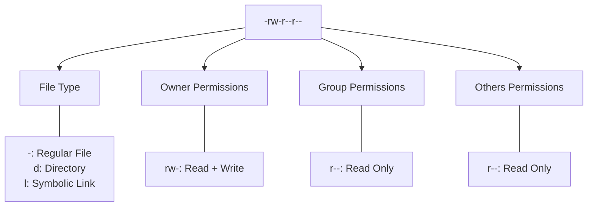

# Ubuntu User Permissions

## Introduction

User permissions are a fundamental aspect of Ubuntu's security model. They determine who can access, modify, or execute files and directories on your system. Understanding permissions is essential for anyone using Ubuntu, whether you're setting up a personal workstation or managing a server.

In this guide, we'll explore how Ubuntu's permission system works, how to view and modify permissions, and best practices to ensure your system remains secure while allowing legitimate users to perform their tasks.

## Understanding Linux File Permissions Basics

Ubuntu, like all Linux distributions, uses a permissions model based on three types of access (read, write, execute) for three categories of users (owner, group, others).

### Permission Types

Each file and directory in Ubuntu has three basic permission types:

- **Read (`r`)**: Allows viewing file contents or listing directory contents
- **Write (`w`)**: Allows modifying the file or creating/deleting files within a directory
- **Execute (`x`)**: Allows running the file as a program or accessing a directory

### User Categories

Permissions are assigned to three categories of users:

- **Owner**: The user who created or owns the file
- **Group**: Users belonging to the file's assigned group
- **Others**: All other users on the system

## Viewing Permissions

You can view permissions using the `ls -l` command:

```bash
ls -l /path/to/file
```

Let's check the permissions for a file in our home directory:

```bash
ls -l ~/.bashrc
```

Output:
```
-rw-r--r-- 1 ubuntu ubuntu 3771 Jan 25 12:34 .bashrc
```

Let's break down this output:



The first character indicates the file type:
- `-` Regular file
- `d` Directory
- `l` Symbolic link

The next nine characters represent permissions in groups of three:
- Characters 2-4: Owner permissions (`rw-`)
- Characters 5-7: Group permissions (`r--`)
- Characters 8-10: Others permissions (`r--`)

In our example, the owner can read and write the file, while the group and others can only read it.

## Understanding Permission Notation

Permissions can be represented in two ways: symbolic (letters) and numeric (octal numbers).

### Symbolic Notation

- `r`: Read permission
- `w`: Write permission
- `x`: Execute permission
- `-`: No permission

### Numeric (Octal) Notation

Each permission type has a numeric value:
- Read (`r`): 4
- Write (`w`): 2
- Execute (`x`): 1

By adding these values, we get a single digit representing permissions for each category:
- `7`: Read + Write + Execute (4+2+1)
- `6`: Read + Write (4+2)
- `5`: Read + Execute (4+1)
- `4`: Read only (4)
- `3`: Write + Execute (2+1)
- `2`: Write only (2)
- `1`: Execute only (1)
- `0`: No permissions (0)

For example, the permission set `rw-r--r--` in numeric notation is `644`:
- Owner: `rw-` = 4+2+0 = `6`
- Group: `r--` = 4+0+0 = `4`
- Others: `r--` = 4+0+0 = `4`

## Changing File Permissions

### Using chmod with Symbolic Notation

The `chmod` command can modify permissions using symbolic notation:

```bash
chmod [who][operation][permissions] filename
```

Where:
- `who` is `u` (owner), `g` (group), `o` (others), or `a` (all)
- `operation` is `+` (add), `-` (remove), or `=` (set exactly)
- `permissions` is any combination of `r`, `w`, and `x`

Examples:

```bash
# Add execute permission for the owner
chmod u+x script.sh

# Remove write permission for others
chmod o-w myfile.txt

# Set read and write for owner, read-only for group and others
chmod u=rw,go=r myfile.txt
```

### Using chmod with Numeric Notation

```bash
chmod [numeric_permissions] filename
```

Examples:

```bash
# Set permissions to: rw-r--r-- (644)
chmod 644 myfile.txt

# Set permissions to: rwxr-xr-x (755)
chmod 755 script.sh

# Set permissions to: rwx------ (700)
chmod 700 private_directory
```

## Common Permission Scenarios

### Default Permissions

Ubuntu sets default permissions for new files and directories based on the system's `umask` value. Typically:
- New files: `664` (rw-rw-r--)
- New directories: `775` (rwxrwxr-x)

### Executable Scripts

To make a script executable:

```bash
chmod u+x myscript.sh
```

Then run it with:

```bash
./myscript.sh
```

### Web Server Files

For files served by a web server like Apache:

```bash
# Make a file readable by the web server
sudo chmod 644 /var/www/html/index.html

# Make directories accessible
sudo chmod 755 /var/www/html/images
```

## Special Permissions

Beyond the basic permissions, Ubuntu supports special permissions:

### SetUID (SUID)

When set on an executable file, the file runs with the permissions of the file owner, not the user executing it.

```bash
# Set SUID (adds 4 to the beginning of permissions)
chmod 4755 myprogram

# Result: -rwsr-xr-x
```

Example: The `passwd` command has SUID bit set, allowing ordinary users to update their passwords in the protected `/etc/shadow` file.

```bash
ls -l /usr/bin/passwd
```

Output:
```
-rwsr-xr-x 1 root root 59640 Jan 25 2023 /usr/bin/passwd
```

### SetGID (SGID)

Similar to SUID but applies to the group. When set on a directory, new files created within inherit the directory's group.

```bash
# Set SGID on a directory (adds 2 to the beginning of permissions)
chmod 2775 shared_directory

# Result: drwxrwsr-x
```

### Sticky Bit

Used primarily on directories to prevent users from deleting files they don't own.

```bash
# Set sticky bit (adds 1 to the beginning of permissions)
chmod 1777 /tmp

# Result: drwxrwxrwt
```

Example: The `/tmp` directory has the sticky bit set:

```bash
ls -ld /tmp
```

Output:
```
drwxrwxrwt 15 root root 4096 Mar 13 10:24 /tmp
```

## Access Control Lists (ACLs)

For more complex permission scenarios, Ubuntu supports Access Control Lists that allow you to specify permissions for multiple users and groups.

### Installing ACL Support

```bash
sudo apt-get update
sudo apt-get install acl
```

### Setting ACLs

```bash
# Grant user bob read and write permissions
setfacl -m u:bob:rw- myfile.txt

# Grant group developers read-only access
setfacl -m g:developers:r-- myfile.txt
```

### Viewing ACLs

```bash
getfacl myfile.txt
```

Output:
```
# file: myfile.txt
# owner: alice
# group: alice
user::rw-
user:bob:rw-
group::r--
group:developers:r--
mask::rw-
other::r--
```

## Changing Ownership

The `chown` command changes the owner and/or group of a file or directory:

```bash
# Change owner
sudo chown username filename

# Change group
sudo chown :groupname filename

# Change both owner and group
sudo chown username:groupname filename

# Change recursively for directories
sudo chown -R username:groupname directory/
```

Example:

```bash
# Transfer ownership of website files to www-data user
sudo chown -R www-data:www-data /var/www/html/
```

## Real-World Examples

### Scenario 1: Setting Up a Collaborative Project Directory

Create a shared directory for a development team:

```bash
# Create project directory
sudo mkdir /opt/project

# Assign ownership to a specific group
sudo chown :developers /opt/project

# Set permissions with SGID bit to keep group inheritance
sudo chmod 2775 /opt/project
```

Result: All team members in the "developers" group can work in this directory, and new files will automatically belong to the "developers" group.

### Scenario 2: Securing Configuration Files

```bash
# Restrict sensitive configuration file
sudo chmod 600 /etc/app/config.conf

# Change ownership to the application user
sudo chown appuser:appuser /etc/app/config.conf
```

Result: Only the file owner (appuser) can read and modify the configuration file.

### Scenario 3: Deploying a Web Application

```bash
# Create directories with proper permissions
sudo mkdir -p /var/www/myapp/{public_html,logs,data}

# Set ownership to web server user
sudo chown -R www-data:www-data /var/www/myapp

# Set directory permissions
sudo find /var/www/myapp -type d -exec chmod 755 {} \;

# Set file permissions
sudo find /var/www/myapp -type f -exec chmod 644 {} \;

# Make log directory writable
sudo chmod 775 /var/www/myapp/logs

# Make data directory writable
sudo chmod 775 /var/www/myapp/data
```

Result: A secure web application setup with appropriate permissions for the web server.

## Best Practices for Managing Permissions

1. **Follow the principle of least privilege**: Only grant the minimum permissions needed.
2. **Regularly audit permissions**: Use `find` to identify files with potentially insecure permissions:
   ```bash
   # Find world-writable files
   sudo find /path/to/check -type f -perm -002
   ```
3. **Use groups effectively**: Assign users to groups and manage permissions at the group level.
4. **Protect system files**: Don't change permissions on system files unless absolutely necessary.
5. **Be careful with recursive changes**: Use the `-R` option with caution to avoid unintended consequences.
6. **Set appropriate default permissions**: Configure `umask` in the system or user profiles to set secure defaults.

## Common Issues and Troubleshooting

### "Permission Denied" Errors

When encountering "Permission denied" errors:

1. Check file permissions: `ls -l file`
2. Check directory permissions: `ls -ld directory`
3. Verify you are the owner or in the right group: `id`
4. Use `sudo` if needed for administrative tasks

### Recovering from Permission Mistakes

If you accidentally change permissions system-wide:

```bash
# For system binaries (typical permissions)
sudo find /usr/bin -type f -exec chmod 755 {} \;

# For configuration files
sudo find /etc -type f -exec chmod 644 {} \;
```

## Summary

Ubuntu's permission system provides a powerful framework for securing your system while allowing appropriate access for legitimate users and processes. Key concepts to remember:

- Permissions include read (`r`), write (`w`), and execute (`x`) for owner, group, and others
- Use `chmod` to modify permissions in either symbolic or numeric notation
- Use `chown` to change ownership of files and directories
- Special permissions (SUID, SGID, sticky bit) provide additional control for specific use cases
- ACLs allow for more granular permission management

By understanding and properly configuring user permissions, you can maintain a secure Ubuntu system that meets your operational needs.

## Additional Resources

- Man pages: `man chmod`, `man chown`, `man getfacl`
- Ubuntu Security documentation: [Ubuntu Security](https://ubuntu.com/security)
- Linux Permissions tutorial on the Ubuntu Community Help Wiki

## Practice Exercises

1. Create a directory structure for a collaborative project with appropriate permissions
2. Set up a secure configuration file that only specific users can access
3. Find all world-writable files in your home directory and secure them
4. Create a script that checks for and reports insecure permissions
5. Practice using ACLs to grant specific permissions to individual users