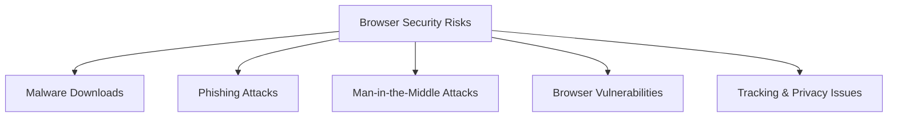

# Ubuntu Safe Browsing

## Introduction

Safe browsing is a critical aspect of maintaining your Ubuntu system's security. As more of our computing activities move to the web, browsers have become primary targets for attackers seeking to compromise systems, steal data, or distribute malware. Ubuntu provides several tools and configurations to enhance browsing security, but understanding safe browsing practices is equally important.

This guide will introduce you to essential concepts, tools, and practices to help you browse securely on your Ubuntu system. Whether you're a complete beginner or have some experience with Ubuntu, these recommendations will help protect you from common web-based threats.

## Understanding Browser Security Risks

Before diving into specific tools and practices, it's important to understand what we're protecting against:

1. **Malware downloads** - Malicious software that can be inadvertently downloaded
2. **Phishing attacks** - Deceptive websites that impersonate legitimate services
3. **Man-in-the-middle attacks** - Interception of communications between your browser and websites
4. **Browser vulnerabilities** - Security flaws in the browser itself
5. **Tracking and privacy concerns** - Unwanted collection of your browsing data



## Choosing a Secure Browser in Ubuntu

Ubuntu offers several browser options with different security features. Here are the main contenders:

### Firefox (Default in Ubuntu)

Firefox comes pre-installed in Ubuntu and offers strong security and privacy features:

- **Built-in tracking protection**
- **Regular security updates**
- **Strong community support**
- **Extensive privacy-focused add-ons**

### Chromium

The open-source project that Google Chrome is based on:

- **Sandboxed tabs** for better isolation
- **Frequent security updates**
- **Large extension ecosystem**

### Specialized Security-Focused Browsers

- **Tor Browser** - For maximum anonymity (available through the Tor Project)
- **Brave** - Built-in ad and tracker blocking
- **Ungoogled-Chromium** - Chromium without Google-specific features

## Installing and Updating Your Browser

### Installing Firefox (if not already installed)

```bash
sudo apt update
sudo apt install firefox
```

### Installing Chromium

```bash
sudo apt update
sudo apt install chromium-browser
```

### Installing Brave Browser

```bash
sudo apt install apt-transport-https curl
sudo curl -fsSLo /usr/share/keyrings/brave-browser-archive-keyring.gpg https://brave-browser-apt-release.s3.brave.com/brave-browser-archive-keyring.gpg
echo "deb [signed-by=/usr/share/keyrings/brave-browser-archive-keyring.gpg arch=amd64] https://brave-browser-apt-release.s3.brave.com/ stable main" | sudo tee /etc/apt/sources.list.d/brave-browser-release.list
sudo apt update
sudo apt install brave-browser
```

### Keeping Browsers Updated

Regularly updating your browser is one of the most important security practices:

```bash
# Update all installed software including browsers
sudo apt update
sudo apt upgrade
```

## Essential Browser Security Settings

### Configuring Firefox for Enhanced Security

1. **Enable HTTPS-Only Mode**:
   - Open Firefox and go to Menu (≡) > Settings
   - Select "Privacy & Security"
   - Scroll down to "HTTPS-Only Mode" and select "Enable HTTPS-Only Mode in all windows"

2. **Enhanced Tracking Protection**:
   - In the same Privacy & Security section
   - Under "Enhanced Tracking Protection" select "Strict" 
   - Note: This may break some websites, so you can switch back to "Standard" if needed

3. **Disable Dangerous Features** (for maximum security):
   ```javascript
   // In Firefox address bar, type:
   about:config

   // Search and set these values:
   javascript.enabled = false        // Disables JavaScript (will break many sites)
   media.peerconnection.enabled = false  // Disables WebRTC (prevents IP leaks)
   ```

### Configuring Chromium/Brave for Enhanced Security

1. **Enable Safe Browsing**:
   - Go to Settings > Privacy and security
   - Under "Safe Browsing" select "Enhanced protection"

2. **Force HTTPS**:
   - Go to Settings > Privacy and security > Security
   - Enable "Always use secure connections"

## Essential Security Extensions

Browser extensions can significantly enhance your security. Here are some recommended ones:

### For Firefox

```bash
# You can install these through the Firefox Add-ons menu or web store
```

1. **uBlock Origin** - Efficient blocker for ads and trackers
2. **HTTPS Everywhere** - Forces secure connections where available
3. **Privacy Badger** - Learns to block invisible trackers
4. **NoScript** - Blocks scripts from untrusted domains

### For Chromium/Brave

Similar extensions are available in the Chrome Web Store.

## Command Line Tools for Web Security

Ubuntu provides several command line tools to enhance browser security:

### Using `curl` to Test Website Security

Check if a website supports HTTPS:

```bash
curl -I https://example.com
```

Example output:
```
HTTP/2 200 
server: nginx
date: Wed, 13 Mar 2025 15:22:30 GMT
content-type: text/html; charset=UTF-8
strict-transport-security: max-age=31536000
```

### Using `openssl` to Check SSL/TLS Certificate

```bash
openssl s_client -connect example.com:443 -showcerts
```

This will show detailed information about the SSL/TLS certificate, helping you verify its authenticity.

### Network Monitoring with `wireshark`

Install Wireshark to monitor network traffic:

```bash
sudo apt install wireshark
```

After installation, you can monitor browser traffic (requires some networking knowledge):

```bash
sudo wireshark
```

## DNS-Level Protection

### Using Secure DNS in Ubuntu

Set up DNS-over-HTTPS (DoH) or DNS-over-TLS (DoT) for encrypted DNS queries:

1. **Install systemd-resolved** (if not already installed):
   ```bash
   sudo apt install systemd-resolved
   ```

2. **Configure DoH**:
   ```bash
   sudo nano /etc/systemd/resolved.conf
   ```

   Add these lines:
   ```
   [Resolve]
   DNS=1.1.1.1 8.8.8.8
   DNSOverTLS=yes
   ```

3. **Restart the service**:
   ```bash
   sudo systemctl restart systemd-resolved
   ```

## Safe Browsing Practices

Technical tools are important, but safe browsing practices are equally crucial:

1. **Verify website URLs carefully** - Check for typos or slight variations from legitimate domains
2. **Don't download files from untrusted sources**
3. **Keep your system updated** using:
   ```bash
   sudo apt update && sudo apt upgrade
   ```
4. **Use a password manager** like KeePassXC:
   ```bash
   sudo apt install keepassxc
   ```
5. **Enable two-factor authentication** whenever possible
6. **Regularly clear browser data**:
   ```javascript
   // In Firefox address bar:
   about:preferences#privacy

   // Then click "Clear History"
   ```

## Sandboxing Your Browser

For additional security, run your browser in a sandbox. Ubuntu offers several options:

### Using Firejail

Firejail is a SUID sandbox program that restricts applications' access to your system:

```bash
# Install Firejail
sudo apt install firejail

# Launch Firefox in a sandbox
firejail firefox

# Launch Chromium in a sandbox
firejail chromium-browser
```

### Using AppArmor Profiles

Ubuntu uses AppArmor by default. Ensure it's enabled and properly configured:

```bash
# Check AppArmor status
sudo aa-status

# Install browser profiles if not present
sudo apt install apparmor-profiles apparmor-profiles-extra
```

## Safe Browsing for Multiple Users

If your Ubuntu system has multiple users, consider these additional measures:

```bash
# Create a limited user account for web browsing
sudo adduser browsing-user

# Switch to this user when browsing sensitive sites
su - browsing-user
```

## Detecting and Removing Browser Malware

If you suspect your browser has been compromised:

1. **Clear all browser data**:
   ```bash
   # For Firefox, remove the profile folder
   rm -rf ~/.mozilla/firefox/*/

   # For Chromium-based browsers
   rm -rf ~/.config/chromium/
   ```

2. **Scan your system with ClamAV**:
   ```bash
   sudo apt install clamav
   sudo freshclam
   sudo clamscan -r --bell -i /home
   ```

## Understanding Browser Privacy Tools in Ubuntu

Ubuntu offers several tools to enhance browser privacy:

### Using Tor for Anonymous Browsing

```bash
# Install Tor Browser
sudo add-apt-repository ppa:micahflee/ppa
sudo apt update
sudo apt install torbrowser-launcher

# Launch Tor Browser
torbrowser-launcher
```

### VPN Configuration

Consider using a VPN for additional privacy:

```bash
# Install OpenVPN
sudo apt install openvpn network-manager-openvpn-gnome

# Configure through Network Manager GUI
# Settings > Network > VPN > + > Import from file...
```

## Summary

Safe browsing on Ubuntu involves multiple layers of protection:

1. Choosing and properly configuring a secure browser
2. Installing essential security extensions
3. Keeping your system and browsers updated
4. Using secure DNS and network configurations
5. Following safe browsing practices
6. Considering additional tools like sandboxing and VPNs for sensitive activities

By implementing these recommendations, you'll significantly reduce your risk of browser-based attacks and privacy violations while using Ubuntu.

## Additional Resources

For further learning, consider these resources:

- [Mozilla's Firefox security guide](https://support.mozilla.org/en-US/kb/how-stay-safe-web)
- [Ubuntu Security Documentation](https://ubuntu.com/security)
- [EFF's Surveillance Self-Defense](https://ssd.eff.org/)

## Exercises

1. Install and configure a security-focused browser extension
2. Test a website's HTTPS configuration using curl
3. Set up Firejail for your preferred browser
4. Configure DNS-over-HTTPS on your Ubuntu system
5. Create a limited user account for web browsing