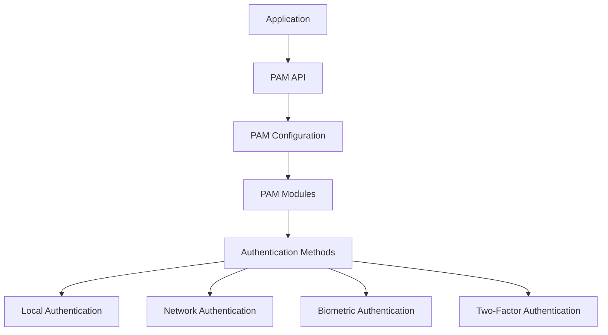

# Ubuntu Authentication Methods

## Introduction

Authentication is a fundamental aspect of system security in Ubuntu. It's the process that verifies the identity of users or services before granting them access to system resources. Understanding the various authentication methods available in Ubuntu is essential for maintaining a secure system environment.

In this guide, we'll explore the different authentication mechanisms that Ubuntu offers, how they work, and how to implement them effectively. Whether you're setting up a personal workstation or managing enterprise servers, having a solid grasp of authentication methods will help you build secure and reliable systems.

## Basic Authentication Components in Ubuntu

Before diving into specific authentication methods, let's understand the core components that make up Ubuntu's authentication system.

### PAM (Pluggable Authentication Modules)

PAM serves as the backbone of authentication in Ubuntu and most Linux distributions. It provides a flexible framework that allows different authentication methods to be integrated into the system without modifying individual applications.



PAM configuration files are located in `/etc/pam.d/` and define how authentication should work for each service:

```bash
# Example content of /etc/pam.d/login
auth     required       pam_securetty.so
auth     required       pam_env.so
auth     required       pam_unix.so nullok
account  required       pam_unix.so
session  required       pam_unix.so
session  required       pam_limits.so
```

### NSS (Name Service Switch)

NSS works alongside PAM to determine where and how user account information is stored and retrieved. The NSS configuration file `/etc/nsswitch.conf` defines the sources for various database lookups:

```bash
# Excerpt from /etc/nsswitch.conf
passwd:     files systemd
group:      files systemd
shadow:     files
```

## Local Authentication Methods

### Password Authentication

The most common authentication method is password-based authentication, managed through the `/etc/passwd` and `/etc/shadow` files.

#### How Password Authentication Works:

1. A user enters their username and password
2. The system hashes the entered password
3. The hash is compared with the stored hash in `/etc/shadow`
4. If they match, authentication succeeds

Let's see how to create a new user with password authentication:

```bash
# Create a new user
sudo adduser newuser

# Sample Output:
Adding user `newuser' ...
Adding new group `newuser' (1001) ...
Adding new user `newuser' (1001) with group `newuser' ...
Creating home directory `/home/newuser' ...
Copying files from `/etc/skel' ...
New password: 
Retype new password: 
passwd: password updated successfully
Changing the user information for newuser
Enter the new value, or press ENTER for the default
        Full Name []: New User
        Room Number []: 
        Work Phone []: 
        Home Phone []: 
        Other []: 
Is the information correct? [Y/n] Y
```

### Password Policy Management

To enhance security, you can enforce password policies using the `pam_pwquality` module:

```bash
# Install the required package
sudo apt install libpam-pwquality

# Edit the PAM configuration
sudo nano /etc/pam.d/common-password
```

Add or modify the following line:

```
password requisite pam_pwquality.so retry=3 minlen=12 difok=3 ucredit=-1 lcredit=-1 dcredit=-1 ocredit=-1 reject_username enforce_for_root
```

This configuration:
- Allows 3 password retry attempts
- Requires minimum password length of 12 characters
- Requires at least 3 character changes when changing password
- Requires at least 1 uppercase, 1 lowercase, 1 digit, and 1 special character
- Rejects passwords containing the username
- Enforces the policy for the root user

### Key-based Authentication (SSH)

For SSH access, Ubuntu supports public key authentication, which is more secure than passwords:

```bash
# Generate SSH key pair on your local machine
ssh-keygen -t ed25519 -C "your_email@example.com"

# Sample Output:
Generating public/private ed25519 key pair.
Enter file in which to save the key (/home/user/.ssh/id_ed25519): 
Created directory '/home/user/.ssh'.
Enter passphrase (empty for no passphrase): 
Enter same passphrase again: 
Your identification has been saved in /home/user/.ssh/id_ed25519
Your public key has been saved in /home/user/.ssh/id_ed25519.pub
The key fingerprint is:
SHA256:abcdefghijklmnopqrstuvwxyz1234567890ABCDEF your_email@example.com
The key's randomart image is:
+--[ED25519 256]--+
|        .        |
|       . .       |
|      . o        |
|     . = .       |
|    . = S        |
|   . * * .       |
|  . * * = .      |
| . + = = + .     |
|  . . . . .      |
+----[SHA256]-----+
```

Copy the public key to the server:

```bash
# Method 1: Using ssh-copy-id
ssh-copy-id username@remote_host

# Method 2: Manual copy
cat ~/.ssh/id_ed25519.pub | ssh username@remote_host "mkdir -p ~/.ssh && cat >> ~/.ssh/authorized_keys"
```

To enforce key-based authentication (disabling password authentication), edit `/etc/ssh/sshd_config`:

```bash
sudo nano /etc/ssh/sshd_config
```

Update these lines:

```
PasswordAuthentication no
PubkeyAuthentication yes
```

Restart the SSH service:

```bash
sudo systemctl restart ssh
```

### Sudo Authentication

The `sudo` command allows authorized users to execute commands with elevated privileges. Configuration is managed through the `/etc/sudoers` file:

```bash
# Edit sudoers file safely using visudo
sudo visudo
```

Example configurations:

```
# Allow user to run any command without password
username ALL=(ALL) NOPASSWD: ALL

# Allow user to run specific commands without password
username ALL=(ALL) NOPASSWD: /usr/bin/apt update, /usr/bin/apt upgrade

# Allow users in the admin group to run any command with password
%admin ALL=(ALL) ALL
```

## Network Authentication Methods

### LDAP Authentication

LDAP (Lightweight Directory Access Protocol) provides centralized authentication for multiple systems:

```bash
# Install LDAP client packages
sudo apt install libnss-ldap libpam-ldap ldap-utils
```

During installation, you'll be prompted to provide LDAP server information. After installation, verify the configuration in `/etc/ldap.conf`.

Configure NSS to use LDAP by editing `/etc/nsswitch.conf`:

```
passwd:         files ldap
group:          files ldap
shadow:         files ldap
```

Configure PAM by editing `/etc/pam.d/common-auth`:

```
auth sufficient pam_ldap.so
auth required pam_unix.so try_first_pass nullok_secure
```

### Kerberos Authentication

Kerberos provides strong authentication through ticket-based access:

```bash
# Install Kerberos client
sudo apt install krb5-user libpam-krb5
```

During installation, you'll need to specify the Kerberos realm and servers. Edit `/etc/krb5.conf` to fine-tune the configuration:

```
[libdefaults]
    default_realm = EXAMPLE.COM
    
[realms]
    EXAMPLE.COM = {
        kdc = kerberos.example.com
        admin_server = kerberos.example.com
    }
    
[domain_realm]
    .example.com = EXAMPLE.COM
    example.com = EXAMPLE.COM
```

Configure PAM for Kerberos by editing `/etc/pam.d/common-auth`:

```
auth sufficient pam_krb5.so
auth required pam_unix.so try_first_pass nullok_secure
```

### SSSD (System Security Services Daemon)

SSSD improves the integration of Linux systems with various identity and authentication providers:

```bash
# Install SSSD
sudo apt install sssd libpam-sss libnss-sss
```

Create a basic SSSD configuration file at `/etc/sssd/sssd.conf`:

```
[sssd]
config_file_version = 2
domains = example.com
services = nss, pam

[domain/example.com]
id_provider = ldap
auth_provider = ldap
ldap_uri = ldap://ldap.example.com
ldap_search_base = dc=example,dc=com
```

Set proper permissions and restart SSSD:

```bash
sudo chmod 600 /etc/sssd/sssd.conf
sudo systemctl restart sssd
```

Update NSS configuration in `/etc/nsswitch.conf`:

```
passwd:         files sss
group:          files sss
shadow:         files sss
```

## Multi-factor Authentication

### Two-Factor Authentication (2FA)

Ubuntu supports various forms of two-factor authentication to add an extra layer of security.

#### Google Authenticator

```bash
# Install Google Authenticator
sudo apt install libpam-google-authenticator

# Run the setup for your user
google-authenticator
```

Sample output and process:

```
Do you want authentication tokens to be time-based (y/n) y

Your new secret key is: ABCDEFGHIJKLMNOPQRSTUVWXYZ234567
Your verification code is 123456
Your emergency scratch codes are:
  12345678
  23456789
  34567890
  45678901
  56789012

Do you want me to update your "~/.google_authenticator" file? (y/n) y
Do you want to disallow multiple uses of the same authentication token? (y/n) y
By default, a new token is generated every 30 seconds.
Do you want to do so? (y/n) y
Do you want to enable rate-limiting? (y/n) y
```

Configure PAM to use Google Authenticator by editing `/etc/pam.d/sshd`:

```
# Add this line at the top
auth required pam_google_authenticator.so
```

Edit SSH configuration in `/etc/ssh/sshd_config`:

```
ChallengeResponseAuthentication yes
AuthenticationMethods publickey,keyboard-interactive
```

Restart SSH service:

```bash
sudo systemctl restart ssh
```

### YubiKey Authentication

YubiKey provides hardware-based two-factor authentication:

```bash
# Install required packages
sudo apt install libpam-u2f
```

Register your YubiKey:

```bash
# Create the necessary directory
mkdir -p ~/.config/u2f

# Register the key
pamu2fcfg > ~/.config/u2f/u2f_keys
```

Configure PAM by editing `/etc/pam.d/sudo`:

```
# Add after the @include common-auth line
auth required pam_u2f.so
```

## Biometric Authentication

Ubuntu supports fingerprint authentication through the fprintd service:

```bash
# Install fingerprint reader software
sudo apt install fprintd libpam-fprintd
```

Enroll your fingerprint:

```bash
fprintd-enroll
```

Configure PAM by editing `/etc/pam.d/common-auth`:

```
auth sufficient pam_fprintd.so
```

## Best Practices for Authentication in Ubuntu

1. **Use Strong Passwords**: Enforce complex passwords with appropriate policies.
2. **Implement Multi-Factor Authentication**: Combine something you know (password) with something you have (security key).
3. **Limit SSH Access**: Use key-based authentication and disable password authentication.
4. **Regular Audits**: Monitor authentication logs regularly:
   ```bash
   sudo journalctl -u ssh
   sudo cat /var/log/auth.log
   ```
5. **Account Lockout Policies**: Configure PAM to lock accounts after failed attempts:
   ```
   auth required pam_tally2.so deny=5 unlock_time=1800
   ```
6. **Principle of Least Privilege**: Grant users only the permissions they need.

## Troubleshooting Authentication Issues

### Common Problems and Solutions

1. **Failed Login Attempts**:
   - Check `/var/log/auth.log` for specific error messages
   - Verify correct username and password
   - Check PAM configuration

2. **SSH Key Authentication Failure**:
   - Verify permissions on `~/.ssh` directory and files:
     ```bash
     chmod 700 ~/.ssh
     chmod 600 ~/.ssh/authorized_keys
     ```
   - Check SSH configuration in `/etc/ssh/sshd_config`

3. **LDAP Authentication Issues**:
   - Test LDAP connectivity:
     ```bash
     ldapsearch -x -h ldap.example.com -b "dc=example,dc=com"
     ```
   - Verify correct LDAP configuration

4. **PAM Configuration Errors**:
   - Keep a backup of working PAM configurations before making changes
   - Test changes with a separate SSH session to avoid lockouts

## Summary

Ubuntu offers a rich ecosystem of authentication methods to suit various security requirements, from basic password authentication to sophisticated multi-factor and network-based solutions. By understanding these options, you can implement a robust authentication strategy that balances security with usability.

Remember that authentication is just one component of a comprehensive security approach. It should be complemented with proper authorization (controlling what authenticated users can do), regular system updates, intrusion detection, and security monitoring.

## Additional Resources

- [Ubuntu Security Documentation](https://ubuntu.com/security)
- [PAM Documentation](http://www.linux-pam.org/Linux-PAM-html/)
- [OpenLDAP Documentation](https://www.openldap.org/doc/)
- [Kerberos Documentation](https://web.mit.edu/kerberos/krb5-latest/doc/)

## Practice Exercises

1. Set up password-based authentication with a strong password policy.
2. Configure SSH key-based authentication and disable password authentication.
3. Implement Google Authenticator for two-factor authentication.
4. Set up a local LDAP server and configure a client to authenticate against it.
5. Create a comprehensive authentication policy for a small organization, including password policies, account lockout settings, and multi-factor authentication requirements.