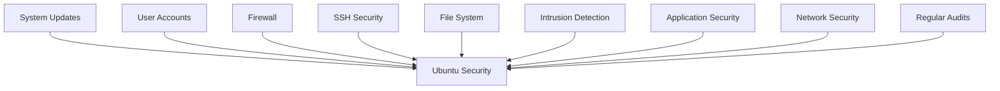

# Ubuntu Security Best Practices

## Introduction

Security is a critical aspect of any operating system, and Ubuntu is no exception. As one of the most popular Linux distributions, Ubuntu provides several built-in security features, but proper configuration and maintenance are essential to ensure your system remains protected against various threats.

This guide will walk you through essential security practices for Ubuntu systems. Whether you're setting up a personal workstation, a development environment, or a server, these best practices will help you establish a strong security foundation for your Ubuntu installation.

## Keeping Your System Updated

### Why Updates Matter

Security vulnerabilities are regularly discovered in operating systems and applications. Keeping your system updated is your first line of defense against these vulnerabilities.

### Updating Ubuntu with APT

Ubuntu's package manager, APT (Advanced Package Tool), makes it easy to keep your system updated.

```bash
# Update package lists
sudo apt update

# Upgrade installed packages
sudo apt upgrade

# Output example:
# Reading package lists... Done
# Building dependency tree... Done
# Reading state information... Done
# Calculating upgrade... Done
# The following packages will be upgraded:
#   firefox libssl1.1 openssh-client openssh-server
# 4 upgraded, 0 newly installed, 0 to remove and 0 not upgraded.
```

### Automating Updates

For critical security updates, you can configure automatic updates:

```bash
# Install unattended-upgrades package
sudo apt install unattended-upgrades

# Configure automatic updates
sudo dpkg-reconfigure unattended-upgrades
```

You can also edit the configuration file for more granular control:

```bash
sudo nano /etc/apt/apt.conf.d/50unattended-upgrades
```

Uncomment and modify this line to enable automatic security updates:

```
Unattended-Upgrade::Allowed-Origins {
    "${distro_id}:${distro_codename}-security";
    // "${distro_id}:${distro_codename}-updates";
};
```

## User Account Security

### Strong Password Policies

Implement strong password policies for all user accounts:

```bash
# Install password quality checking library
sudo apt install libpam-pwquality

# Edit the password configuration file
sudo nano /etc/pam.d/common-password
```

Add or modify the password requirements line:

```
password requisite pam_pwquality.so retry=3 minlen=12 difok=3 ucredit=-1 lcredit=-1 dcredit=-1 ocredit=-1 reject_username enforce_for_root
```

This configuration:
- Sets minimum password length to 12 characters
- Requires at least 1 uppercase letter, 1 lowercase letter, 1 digit, and 1 special character
- Prevents using the username in the password
- Applies rules to the root user

### Using Sudo Properly

Configure sudo access to limit administrative privileges:

```bash
# Edit sudoers file safely using visudo
sudo visudo
```

Add specific command permissions for users:

```
# Allow user to run only specific commands
username ALL=(ALL) /bin/ls, /usr/bin/apt
```

### Account Lockout Policies

Protect against brute-force attacks by configuring account lockout:

```bash
# Install the required package
sudo apt install libpam-faillock

# Edit the PAM configuration
sudo nano /etc/pam.d/common-auth
```

Add this line before the `pam_unix.so` line:

```
auth required pam_faillock.so preauth silent deny=5 unlock_time=1800
```

Add this line after the `pam_unix.so` line:

```
auth [default=die] pam_faillock.so authfail
auth sufficient pam_faillock.so authsucc
```

This will lock an account for 30 minutes after 5 failed login attempts.

## Firewall Configuration

### Using UFW (Uncomplicated Firewall)

Ubuntu comes with UFW, a user-friendly interface for managing iptables:

```bash
# Install UFW if not already installed
sudo apt install ufw

# Check UFW status
sudo ufw status

# Enable UFW
sudo ufw enable

# Output:
# Firewall is active and enabled on system startup
```

### Basic Firewall Rules

Configure basic firewall rules for common services:

```bash
# Allow SSH
sudo ufw allow ssh

# Allow HTTP and HTTPS
sudo ufw allow http
sudo ufw allow https

# Deny incoming traffic by default
sudo ufw default deny incoming

# Allow outgoing traffic by default
sudo ufw default allow outgoing

# Check the configured rules
sudo ufw status verbose

# Output example:
# Status: active
# Logging: on (low)
# Default: deny (incoming), allow (outgoing)
# New profiles: skip
# 
# To                         Action      From
# --                         ------      ----
# 22/tcp                     ALLOW IN    Anywhere
# 80/tcp                     ALLOW IN    Anywhere
# 443/tcp                    ALLOW IN    Anywhere
```

### Rate Limiting with UFW

Protect against brute-force attacks by rate limiting connection attempts:

```bash
# Limit SSH login attempts
sudo ufw limit ssh

# Output:
# Rule updated
# Rule updated (v6)
```

## Securing SSH

SSH is often a primary target for attackers. Here are some ways to secure your SSH service:

### Change the Default Port

Edit the SSH configuration file:

```bash
sudo nano /etc/ssh/sshd_config
```

Find the `#Port 22` line and change it:

```
Port 2222  # Choose a non-standard port number
```

### Disable Root Login

In the same configuration file, set:

```
PermitRootLogin no
```

### Use Key-Based Authentication

Generate SSH keys:

```bash
# Generate keys on your client machine
ssh-keygen -t ed25519 -C "your_email@example.com"

# Output:
# Generating public/private ed25519 key pair.
# Enter file in which to save the key (/home/username/.ssh/id_ed25519):
# Created directory '/home/username/.ssh'.
# Enter passphrase (empty for no passphrase):
# Enter same passphrase again:
# Your identification has been saved in /home/username/.ssh/id_ed25519
# Your public key has been saved in /home/username/.ssh/id_ed25519.pub
```

Transfer your public key to the server:

```bash
ssh-copy-id -i ~/.ssh/id_ed25519.pub username@server_ip
```

Disable password authentication in SSH config:

```
PasswordAuthentication no
```

### Apply SSH Configuration Changes

```bash
sudo systemctl restart sshd
```

## File System Security

### Secure Mount Options

Edit the `/etc/fstab` file to add secure mount options:

```bash
sudo nano /etc/fstab
```

Add `noexec`, `nosuid`, and `nodev` options for non-system partitions:

```
# Example for a data partition
UUID=xxxxx  /data  ext4  defaults,noexec,nosuid,nodev  0  2
```

### File Permissions Audit

Regularly check for files with insecure permissions:

```bash
# Find world-writable files
sudo find / -type f -perm -002 -not -path "/proc/*" -not -path "/sys/*" -ls

# Find files without owners
sudo find / -nouser -o -nogroup -not -path "/proc/*" -not -path "/sys/*"
```

### Using File Access Control Lists (ACLs)

For more granular permissions:

```bash
# Install ACL support
sudo apt install acl

# Set an ACL for a specific user
sudo setfacl -m u:username:rx /path/to/file

# Check ACLs on a file
getfacl /path/to/file

# Output example:
# # file: path/to/file
# # owner: root
# # group: root
# user::rw-
# user:username:r-x
# group::r--
# mask::r-x
# other::r--
```

## System Hardening

### Disable Unused Services

Identify and disable unnecessary services:

```bash
# List all running services
systemctl list-units --type=service --state=running

# Disable a service
sudo systemctl disable service_name
sudo systemctl stop service_name
```

### Configure System Logging

Enhanced logging helps detect security incidents:

```bash
# Install rsyslog if not already installed
sudo apt install rsyslog

# Configure syslog
sudo nano /etc/rsyslog.conf
```

Add or modify logging rules as needed:

```
# Log auth messages to a separate file
auth,authpriv.*                 /var/log/auth.log
```

### Secure Boot Configuration

Modify the GRUB bootloader configuration:

```bash
sudo nano /etc/default/grub
```

Add these parameters to `GRUB_CMDLINE_LINUX`:

```
GRUB_CMDLINE_LINUX="... apparmor=1 security=apparmor"
```

Update GRUB:

```bash
sudo update-grub
```

## Intrusion Detection

### Install and Configure AIDE

AIDE (Advanced Intrusion Detection Environment) monitors file changes:

```bash
# Install AIDE
sudo apt install aide

# Initialize the database
sudo aideinit

# This will create a snapshot of your file system
# Output will show progress as it scans files
```

Configure daily checks in cron:

```bash
sudo nano /etc/cron.daily/aide
```

Add:

```bash
#!/bin/bash
/usr/bin/aide --check | mail -s "AIDE report for $(hostname)" root@localhost
```

Make it executable:

```bash
sudo chmod +x /etc/cron.daily/aide
```

### Install RKHunter

RKHunter (Rootkit Hunter) scans for rootkits and other malware:

```bash
# Install RKHunter
sudo apt install rkhunter

# Update RKHunter
sudo rkhunter --update

# Run a scan
sudo rkhunter --check

# Output will show progress and any warnings
```

## Network Security

### TCP Wrappers

Control service access with TCP wrappers:

```bash
# Edit hosts.allow
sudo nano /etc/hosts.allow
```

Add allowed hosts:

```
# Allow SSH from local network only
sshd: 192.168.1.0/24
```

Edit hosts.deny:

```bash
sudo nano /etc/hosts.deny
```

Deny all other connections:

```
# Deny all other connections
ALL: ALL
```

### Network Monitoring with Netstat

Monitor active connections:

```bash
# Install net-tools if not already installed
sudo apt install net-tools

# Check all listening ports
sudo netstat -tulpn

# Output example:
# Proto  Local Address  Foreign Address  State   PID/Program name
# tcp    0.0.0.0:22     0.0.0.0:*        LISTEN  1234/sshd
# tcp    0.0.0.0:80     0.0.0.0:*        LISTEN  5678/apache2
```

## Application Security

### AppArmor Profiles

AppArmor provides application isolation. Check its status:

```bash
# Check AppArmor status
sudo aa-status

# Output example:
# apparmor module is loaded.
# 32 profiles are loaded.
# 32 profiles are in enforce mode.
# 0 profiles are in complain mode.
# 0 processes have profiles defined.
# 0 processes are in enforce mode.
# 0 processes are in complain mode.
# 0 processes are unconfined but have a profile defined.
```

Create or modify AppArmor profiles:

```bash
# Install AppArmor utilities
sudo apt install apparmor-utils

# Generate a profile for an application
sudo aa-genprof /path/to/application
```

### Securing Web Servers

If running Apache:

```bash
# Install mod_security
sudo apt install libapache2-mod-security2

# Enable it
sudo a2enmod security2
sudo systemctl restart apache2
```

## Regular Security Audits

### Using Lynis for Security Scanning

Lynis is a security auditing tool:

```bash
# Install Lynis
sudo apt install lynis

# Run a system scan
sudo lynis audit system

# The output will provide a detailed security report
# with recommendations for improvement
```

### Creating a Security Checklist

Create a script to check for common security issues:

```bash
#!/bin/bash
# Simple security check script

echo "=== Ubuntu Security Check ==="
echo "Date: $(date)"
echo

echo "=== Checking for pending updates ==="
apt list --upgradable

echo "=== Checking UFW status ==="
ufw status

echo "=== Checking running services ==="
systemctl list-units --type=service --state=running

echo "=== Checking SSH configuration ==="
grep "^PermitRootLogin\|^PasswordAuthentication" /etc/ssh/sshd_config

echo "=== Checking for unusual SUID files ==="
find /usr/bin /usr/sbin -perm -4000 -ls

echo "=== Checking for unauthorized users in sudo group ==="
grep sudo /etc/group
```

Save this as `/usr/local/bin/security-check.sh` and make it executable:

```bash
sudo chmod +x /usr/local/bin/security-check.sh
```

## Security Visualization

Here's a diagram showing the layers of Ubuntu security:



## Summary

Implementing proper security measures on your Ubuntu system is an ongoing process that requires vigilance and regular maintenance. By following these best practices, you can significantly reduce your system's attack surface and protect it from common threats.

Remember that security is a layered approach - no single measure provides complete protection. Combining these practices creates a comprehensive security strategy that addresses multiple vectors of attack.

## Additional Resources

- [Ubuntu Security Documentation](https://ubuntu.com/security)
- [Linux Security Hardening Guide](https://wiki.ubuntu.com/Security/Features)
- [CIS Ubuntu Linux Benchmarks](https://www.cisecurity.org/benchmark/ubuntu_linux/)

## Exercises

1. **Baseline Security Audit**: Run Lynis to perform a baseline security audit of your Ubuntu system. Review the results and implement at least three recommended improvements.

2. **Custom Firewall Rules**: Create a set of UFW rules specific to your environment that allows only the necessary services.

3. **Intrusion Detection Setup**: Configure AIDE to monitor critical system files and set up email notifications for any detected changes.

4. **AppArmor Profile Creation**: Identify a critical application on your system and create a custom AppArmor profile for it.

5. **Security Incident Response Plan**: Create a basic incident response plan outlining the steps you would take if you detected a security breach on your Ubuntu system.