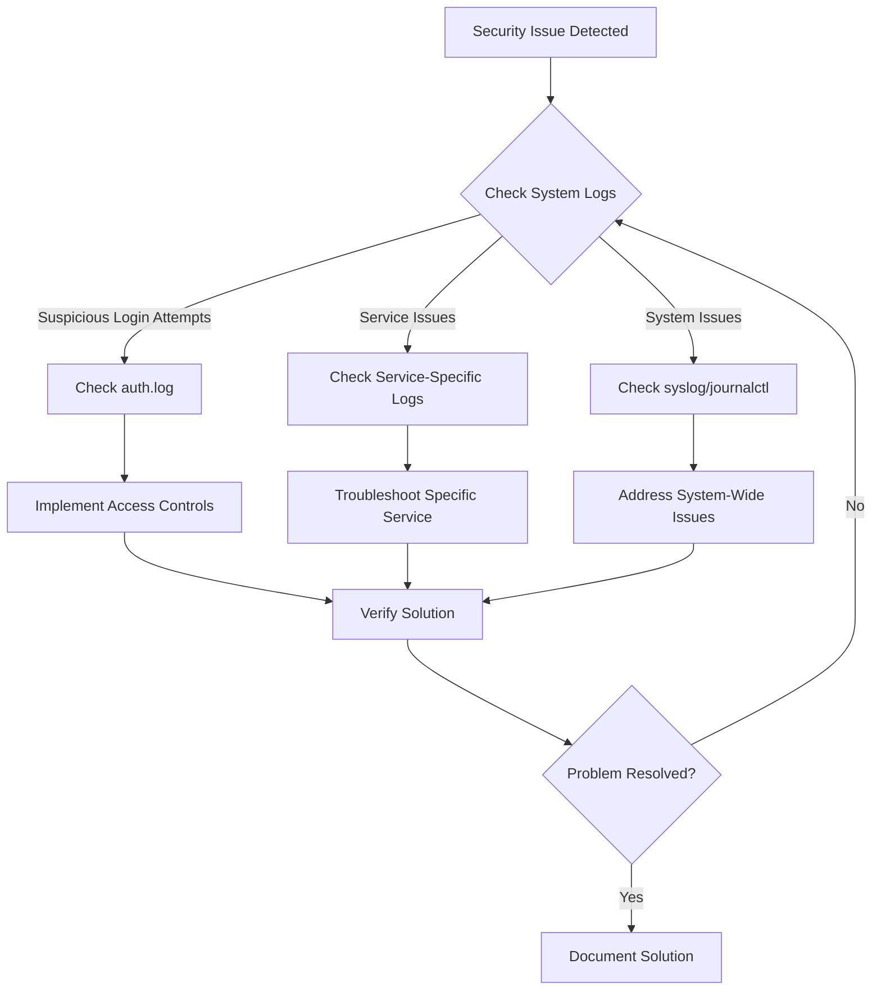

# Ubuntu Security Troubleshooting

## Introduction

Security is a critical aspect of any operating system, and Ubuntu is no exception. Even with Ubuntu's robust security features, issues can arise that require troubleshooting. This guide will help you understand common security problems in Ubuntu systems and provide practical solutions to resolve them. Whether you're managing a personal computer or a server, these troubleshooting techniques will help you maintain a secure Ubuntu environment.

## Understanding Ubuntu Security Logs

### Where to Find Security Logs

Ubuntu stores various logs that can help you identify security issues:

```bash
# Main system log
sudo cat /var/log/syslog

# Authentication logs (login attempts, sudo usage)
sudo cat /var/log/auth.log

# Application-specific logs
ls -la /var/log/
```

### Analyzing Authentication Logs

The `auth.log` file contains valuable information about authentication attempts:

```bash
# View recent authentication attempts
sudo tail -n 100 /var/log/auth.log

# Search for failed login attempts
sudo grep "Failed password" /var/log/auth.log

# Check for successful logins
sudo grep "session opened" /var/log/auth.log
```

### Using journalctl for Log Analysis

The `journalctl` utility provides a powerful way to analyze system logs:

```bash
# View all logs from the current boot
journalctl -b

# View authentication-related logs
journalctl -u ssh

# View logs from a specific time period
journalctl --since "2023-09-01" --until "2023-09-02"
```

## Common Security Issues and Solutions

### Detecting and Handling Unusual Login Attempts

If you notice suspicious login attempts in your logs, take these steps:

1. Check for repeated failed login attempts:

```bash
sudo grep "Failed password" /var/log/auth.log | wc -l
```

2. Identify the source IP addresses:

```bash
sudo grep "Failed password" /var/log/auth.log | awk '{print $(NF-3)}' | sort | uniq -c | sort -nr
```

3. Block suspicious IPs using UFW (Uncomplicated Firewall):

```bash
sudo ufw deny from <suspicious-ip> to any
```

### Diagnosing and Resolving Firewall Issues

Ubuntu's built-in firewall, UFW, can sometimes cause connectivity problems:

1. Check the current firewall status:

```bash
sudo ufw status verbose
```

2. If needed, reset the firewall to default settings:

```bash
sudo ufw reset
```

3. Allow essential services:

```bash
sudo ufw allow ssh
sudo ufw allow http
sudo ufw allow https
```

4. Enable the firewall:

```bash
sudo ufw enable
```

### Checking for Rootkits and Malware

Ubuntu provides tools to scan for malicious software:

1. Install and run RKHunter (Rootkit Hunter):

```bash
sudo apt update
sudo apt install rkhunter
sudo rkhunter --update
sudo rkhunter --check
```

2. Install and run ClamAV antivirus:

```bash
sudo apt install clamav clamav-daemon
sudo freshclam
sudo clamscan -r --bell -i /home
```

## Fixing Common Security Vulnerabilities

### Updating System Packages

Out-of-date software can contain security vulnerabilities:

```bash
# Update package lists
sudo apt update

# Upgrade installed packages
sudo apt upgrade

# Specifically install security updates
sudo unattended-upgrade --dry-run -d
```

### Securing SSH Access

SSH is a common target for attackers. Enhance its security with these steps:

1. Edit the SSH configuration file:

```bash
sudo nano /etc/ssh/sshd_config
```

2. Make these recommended changes:

```text
# Disable root login
PermitRootLogin no

# Use SSH key authentication only
PasswordAuthentication no

# Change default port (optional)
Port 2222

# Limit user access
AllowUsers yourusername

# Set idle timeout (in seconds)
ClientAliveInterval 300
ClientAliveCountMax 2
```

3. Restart the SSH service:

```bash
sudo systemctl restart ssh
```

### Managing User Permissions

Incorrect permissions can lead to security vulnerabilities:

1. Check for files with SUID/SGID bits:

```bash
sudo find / -type f \( -perm -4000 -o -perm -2000 \) -exec ls -la {} \;
```

2. Find world-writable files (potentially dangerous):

```bash
sudo find / -type f -perm -o=w -exec ls -la {} \;
```

3. Check for accounts with empty passwords:

```bash
sudo awk -F: '($2 == "") {print $1}' /etc/shadow
```

## Troubleshooting Security Tools

### AppArmor Issues

AppArmor protects your system by restricting program capabilities:

1. Check AppArmor status:

```bash
sudo aa-status
```

2. If a program is being blocked incorrectly, check its profile:

```bash
sudo aa-complain /path/to/program
```

3. To disable a profile temporarily:

```bash
sudo ln -s /etc/apparmor.d/profile.name /etc/apparmor.d/disable/
sudo apparmor_parser -R /etc/apparmor.d/profile.name
```

### SELinux Troubleshooting

If you've installed SELinux on Ubuntu:

1. Check SELinux status:

```bash
sestatus
```

2. View SELinux denials (blocked actions):

```bash
sudo grep "denied" /var/log/audit/audit.log
```

3. Set SELinux to permissive mode for troubleshooting:

```bash
sudo setenforce 0
```

## Security Auditing and Monitoring

### Using Lynis for Security Auditing

Lynis is a powerful security auditing tool:

```bash
# Install Lynis
sudo apt install lynis

# Run a system audit
sudo lynis audit system

# View the report
less /var/log/lynis.log
```

### Setting Up Basic Intrusion Detection

1. Install AIDE (Advanced Intrusion Detection Environment):

```bash
sudo apt install aide
```

2. Initialize the AIDE database:

```bash
sudo aideinit
```

3. Check for changes to system files:

```bash
sudo aide --check
```

### Monitoring Failed Login Attempts with fail2ban

fail2ban helps protect against brute force attacks:

1. Install fail2ban:

```bash
sudo apt install fail2ban
```

2. Create a custom jail configuration:

```bash
sudo nano /etc/fail2ban/jail.local
```

3. Add a configuration for SSH:

```text
[sshd]
enabled = true
port = ssh
filter = sshd
logpath = /var/log/auth.log
maxretry = 3
bantime = 3600
```

4. Restart fail2ban:

```bash
sudo systemctl restart fail2ban
```

5. Check the status:

```bash
sudo fail2ban-client status
```

## Practical Troubleshooting Workflow

When facing security issues in Ubuntu, follow this workflow:



### Case Study: Resolving SSH Brute Force Attacks

Here's a practical example of identifying and resolving a common security issue:

1. Symptoms: Slow system performance and unusual network activity

2. Investigation:

```bash
# Check for failed SSH login attempts
sudo grep "Failed password" /var/log/auth.log | wc -l
# Output: 1,532 (Unusually high number of attempts)

# Identify source IPs
sudo grep "Failed password" /var/log/auth.log | awk '{print $(NF-3)}' | sort | uniq -c | sort -nr
# Output:
#   983 192.168.1.10
#   485 192.168.1.15
#    64 192.168.1.20
```

3. Solution implementation:

```bash
# Install and configure fail2ban
sudo apt install fail2ban
sudo nano /etc/fail2ban/jail.local

# Add configuration
# [sshd]
# enabled = true
# maxretry = 3
# bantime = 86400

# Start fail2ban
sudo systemctl enable fail2ban
sudo systemctl start fail2ban

# Block immediate threats
sudo ufw deny from 192.168.1.10 to any
sudo ufw deny from 192.168.1.15 to any
```

4. Verification:

```bash
# Check if fail2ban is working
sudo fail2ban-client status sshd
# Confirm IPs are blocked
sudo ufw status numbered
```

## Summary

Ubuntu security troubleshooting involves understanding system logs, recognizing common vulnerabilities, and implementing effective solutions. By learning to analyze log files, configure security tools, and follow systematic troubleshooting processes, you can maintain a secure Ubuntu environment.

Remember these key points:
- Regularly check security logs for unusual activity
- Keep your system and packages updated
- Configure firewalls and intrusion detection systems
- Follow the principle of least privilege for user permissions
- Document security incidents and solutions for future reference

## Additional Resources

For further learning on Ubuntu security:

- The [Ubuntu Security Documentation](https://ubuntu.com/security)
- [Linux Security Cookbook](https://www.oreilly.com/library/view/linux-security-cookbook/0596003919/)
- [Ubuntu Security Podcast](https://ubuntusecuritypodcast.org/)

## Exercises

1. Analyze your system's auth.log file and identify any unusual login attempts.
2. Configure fail2ban for a service of your choice (SSH, Apache, etc.).
3. Run a Lynis security audit on your system and address the high-priority findings.
4. Create a basic backup and recovery plan for your security configuration files.
5. Set up a regular security update schedule using cron and unattended-upgrades.