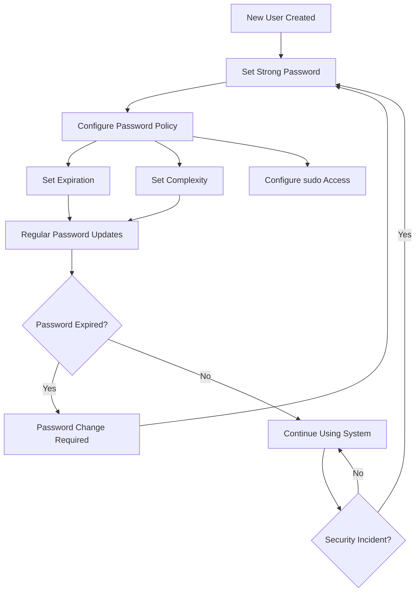

# Ubuntu Password Management

## Introduction

Password management is a fundamental aspect of system security in Ubuntu. As a beginner, understanding how to properly create, manage, and secure passwords is essential for protecting your system from unauthorized access. This guide covers the basics of password management in Ubuntu, including how to set strong passwords, change them regularly, configure password policies, and use sudo privileges effectively.

Password management in Ubuntu extends beyond just setting a login password. It encompasses:

- Creating and updating user passwords
- Managing sudo access and privileges
- Setting password expiration policies
- Securing password storage
- Implementing password complexity requirements

By mastering these concepts, you'll significantly improve your Ubuntu system's security posture.

## Basic Password Commands

### Setting a User Password

When you create a new user account or need to change an existing password, you can use the `passwd` command:

```bash
sudo passwd username
```

If you want to change your own password, simply type:

```bash
passwd
```

The system will prompt you to enter your current password followed by the new password twice for verification:

```
Changing password for user johndoe.
Current password: 
New password: 
Retype new password: 
passwd: password updated successfully
```

### Removing a Password

To remove a password from an account (not recommended for security reasons):

```bash
sudo passwd -d username
```

### Locking and Unlocking User Accounts

To lock a user account, preventing the user from logging in:

```bash
sudo passwd -l username
```

To unlock the account:

```bash
sudo passwd -u username
```

## Password Policies and Security

### Checking Password Status

You can check the status of a user's password with:

```bash
sudo passwd -S username
```

Example output:

```
johndoe P 02/15/2025 0 99999 7 -1
```

This output shows:
- The username (johndoe)
- Password status (P = password is set)
- Date of last password change (February 15, 2025)
- Minimum password age (0 days)
- Maximum password age (99999 days)
- Warning period (7 days)
- Inactivity period (-1 = no enforcement)

### Setting Password Expiration

To enforce regular password changes, you can set the maximum age for passwords:

```bash
sudo chage -M 90 username
```

This command sets the password to expire every 90 days.

To view all password aging information for a user:

```bash
sudo chage -l username
```

Example output:

```
Last password change                                : Feb 15, 2025
Password expires                                    : May 16, 2025
Password inactive                                   : never
Account expires                                     : never
Minimum number of days between password change      : 0
Maximum number of days between password change      : 90
Number of days of warning before password expires   : 7
```

## Password Complexity and Security

### Setting Password Complexity Requirements

Ubuntu uses the PAM (Pluggable Authentication Modules) system to enforce password policies. To enhance password security, you can install the `libpam-pwquality` package:

```bash
sudo apt install libpam-pwquality
```

After installation, edit the PAM configuration file:

```bash
sudo nano /etc/pam.d/common-password
```

Look for the line containing `pam_pwquality.so` and modify it to add complexity requirements:

```
password requisite pam_pwquality.so retry=3 minlen=12 difok=3 ucredit=-1 lcredit=-1 dcredit=-1 ocredit=-1 reject_username enforce_for_root
```

This configuration:
- Allows 3 password change attempts before failing
- Requires a minimum password length of 12 characters
- Requires at least 3 characters different from the previous password
- Requires at least 1 uppercase letter (ucredit=-1)
- Requires at least 1 lowercase letter (lcredit=-1)
- Requires at least 1 digit (dcredit=-1)
- Requires at least 1 special character (ocredit=-1)
- Rejects passwords containing the username
- Applies these rules to the root user as well

Save the file and exit. The new policy will be applied immediately for any new password changes.

## Sudo Password Management

### Understanding Sudo

The `sudo` command allows authorized users to execute commands with administrative (root) privileges. By default, Ubuntu prompts for a password when using sudo:

```bash
sudo apt update
[sudo] password for johndoe: 
```

### Configuring Sudo Timeout

By default, sudo caches your password for 15 minutes. To change this timeout:

```bash
sudo visudo
```

Add or modify the following line:

```
Defaults        timestamp_timeout=10
```

This sets the sudo password timeout to 10 minutes. Setting it to 0 requires a password every time, while -1 will never prompt for a password again (not recommended).

### Configuring Sudo Access

To give a user sudo privileges, add them to the sudo group:

```bash
sudo usermod -aG sudo username
```

For more granular control over sudo privileges, you can edit the sudoers file:

```bash
sudo visudo
```

For example, to allow a user to run only specific commands without a password:

```
username ALL=(ALL) NOPASSWD: /usr/bin/apt update, /usr/bin/apt upgrade
```

## Password Storage in Ubuntu

Ubuntu uses the `/etc/shadow` file to store encrypted password hashes. This file is only readable by the root user, providing an additional layer of security.

To view the encryption method used for passwords:

```bash
sudo grep -A 1 "ENCRYPT_METHOD" /etc/login.defs
```

The output will show something like:

```
# The ENCRYPT_METHOD variable defines the encryption method used to process
# passwords
ENCRYPT_METHOD SHA512
```

Modern Ubuntu versions use SHA-512 hashing by default, which is currently considered secure.

## Working with Keyring and Credential Storage

Ubuntu uses the GNOME Keyring to securely store passwords for applications, Wi-Fi networks, and other services.

To manage your keyring passwords graphically:

1. Open "Passwords and Keys" (seahorse) from the application menu
2. Browse through different keyrings to view or modify stored credentials

For command-line management, you can use the `secret-tool` utility:

```bash
# Store a password
secret-tool store --label="My API Key" service api.example.com username johndoe

# Retrieve a password
secret-tool lookup service api.example.com username johndoe
```

## Password Management Best Practices

### 1. Use Strong, Unique Passwords

Create passwords that:
- Are at least 12 characters long
- Include uppercase and lowercase letters, numbers, and special characters
- Avoid dictionary words, names, or common phrases
- Are unique for each service or system

### 2. Implement Regular Password Changes

- Set up password expiration policies using `chage`
- Rotate critical passwords every 90 days
- Change passwords immediately if a breach is suspected

### 3. Use Two-Factor Authentication Where Possible

For critical services that support it, enable two-factor authentication as an additional security layer.

### 4. Consider a Password Manager

For managing multiple complex passwords, consider using a password manager like:
- KeePassXC (open-source, works offline)
- Bitwarden (open-source, cloud-based)

To install KeePassXC on Ubuntu:

```bash
sudo apt install keepassxc
```

### 5. Audit Password Policies Regularly

Periodically review your system's password policies and user access:

```bash
# List all users who can use sudo
grep -Po '^sudo.+:\K.*$' /etc/group | tr ',' '
'

# Check for accounts with empty passwords
sudo awk -F: '($2 == "") {print $1}' /etc/shadow

# Check for users who haven't logged in recently
lastlog | grep "Never logged in"
```

## Practical Example: Setting Up a Secure User Account

Here's a complete workflow to create a new user with secure password policies:

```bash
# Create a new user
sudo adduser newuser

# Add user to sudo group
sudo usermod -aG sudo newuser

# Set password expiration policy
sudo chage -M 90 -m 1 -W 7 newuser

# Verify the settings
sudo chage -l newuser

# Ensure password complexity requirements are in place
sudo apt install libpam-pwquality
sudo nano /etc/pam.d/common-password
# (add complexity requirements as shown earlier)
```

## Password Management Flow



## Summary

Effective password management is a cornerstone of Ubuntu security. In this guide, we've covered:

- Basic password commands like `passwd` and `chage`
- Setting up password policies and complexity requirements
- Managing sudo access and privileges
- Securely storing credentials using the GNOME Keyring
- Best practices for maintaining strong password security

By implementing these practices, you'll significantly enhance your Ubuntu system's security posture and protect your data from unauthorized access.

## Additional Resources

- The Ubuntu Security Team's documentation: [https://ubuntu.com/security](https://ubuntu.com/security)
- The Linux Documentation Project's Password Security guide
- The `man` pages for each command (`man passwd`, `man chage`, `man pam_pwquality`)

## Practice Exercises

1. Create a new user and set up a password policy that requires changing the password every 60 days
2. Configure sudo to require a password every time it's used (no timeout)
3. Set up a system-wide password complexity policy
4. Create a script that identifies users with weak password settings
5. Configure password-less sudo access for a specific command only