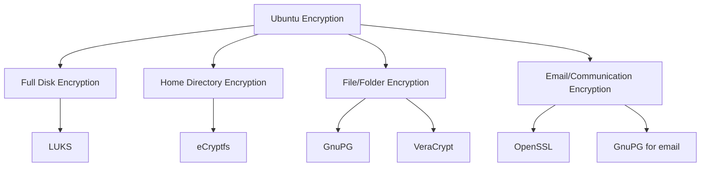

# Ubuntu Encryption

## Introduction

Encryption is a critical aspect of modern computing security that transforms your readable data (plaintext) into an encoded format (ciphertext) that can only be read or processed after it's been decrypted with the correct key. In Ubuntu, encryption serves as a powerful tool to protect sensitive information from unauthorized access, whether it's stored on your disk or being transmitted over a network.

This guide will walk you through various encryption options available in Ubuntu, from full-disk encryption to file-level encryption and secure communications. By the end, you'll understand how to implement these security measures to protect your data effectively.

## Why Encryption Matters

Before diving into the technical aspects, let's understand why encryption is essential:

- **Data Protection**: Prevents unauthorized access to your files and personal information
- **Privacy Preservation**: Keeps your communications and stored data confidential
- **Compliance**: Many industries require encryption to meet regulatory standards
- **Theft Protection**: Renders data unreadable if your device is stolen

## Types of Encryption in Ubuntu

Ubuntu offers several encryption methods, each serving different security needs:



## Full Disk Encryption with LUKS

Linux Unified Key Setup (LUKS) is Ubuntu's standard method for full disk encryption.

### Setting Up LUKS During Ubuntu Installation

The easiest way to implement full disk encryption is during the Ubuntu installation process:

1. Start the Ubuntu installation
2. When you reach the "Installation type" screen, select "Advanced features"
3. Check the "Encrypt the new Ubuntu installation for security" option
4. Create a strong security key when prompted

Here's what happens during this process:

```bash
# Behind the scenes, Ubuntu creates a LUKS-encrypted partition using something like:
cryptsetup luksFormat /dev/sda2

# And sets up the encrypted device for mounting
cryptsetup luksOpen /dev/sda2 cryptroot
```

### Manually Setting Up LUKS After Installation

If you didn't enable encryption during installation, you can still encrypt individual partitions:

```bash
# Install the required tools
sudo apt update
sudo apt install cryptsetup

# Create an encrypted partition (replace /dev/sdXY with your target partition)
sudo cryptsetup -y -v luksFormat /dev/sdXY

# Open the encrypted partition
sudo cryptsetup luksOpen /dev/sdXY encrypted_drive

# Create a filesystem on the encrypted partition
sudo mkfs.ext4 /dev/mapper/encrypted_drive

# Mount the encrypted partition
sudo mkdir /mnt/encrypted
sudo mount /dev/mapper/encrypted_drive /mnt/encrypted
```

When you're done, you can unmount and close the encrypted volume:

```bash
sudo umount /mnt/encrypted
sudo cryptsetup luksClose encrypted_drive
```

### LUKS Key Management

LUKS supports multiple key slots, allowing you to add backup keys or change keys without re-encrypting all data:

```bash
# Add a new key to a LUKS partition
sudo cryptsetup luksAddKey /dev/sdXY

# Remove a key
sudo cryptsetup luksRemoveKey /dev/sdXY

# Check LUKS header information
sudo cryptsetup luksDump /dev/sdXY
```

## Encrypting the Home Directory

While Ubuntu previously offered automatic home directory encryption during installation using eCryptfs, newer versions have moved away from this in favor of full disk encryption. However, you can still set it up manually:

```bash
# Install the required packages
sudo apt install ecryptfs-utils

# Create a temporary user with admin privileges
sudo adduser temporary_user
sudo usermod -aG sudo temporary_user

# Log out and log in as the temporary user
# Then migrate your main user's home directory
sudo ecryptfs-migrate-home -u your_username

# Log out and log back in as your main user
# Then run this to set up the automatic mounting
ecryptfs-unwrap-passphrase
```

Save the generated passphrase in a secure location, as you'll need it for recovery if your system fails.

## File and Folder Encryption with GnuPG

For encrypting individual files or folders, GnuPG (GPG) provides a flexible and powerful solution:

### Setting Up GPG Keys

```bash
# Install GnuPG if not already installed
sudo apt install gnupg

# Generate a new key pair
gpg --full-generate-key
```

Follow the prompts to specify key type, size, and expiration. The default options (RSA and RSA, 3072 bits) are usually sufficient for most users.

### Encrypting and Decrypting Files

To encrypt a file for yourself:

```bash
# Encrypt a file
gpg -e -r "Your Name" document.txt

# The encrypted file will be saved as document.txt.gpg
```

To decrypt the file:

```bash
# Decrypt a file
gpg -d document.txt.gpg > document.txt
```

### Encrypting Files for Others

You can encrypt files for other people if you have their public key:

```bash
# Import someone's public key (from a file)
gpg --import their_public_key.asc

# Encrypt a file for them
gpg -e -r "Their Name" document.txt
```

## Creating Encrypted Archives

For encrypting multiple files or folders, you can create encrypted archives:

```bash
# Install zip with encryption support
sudo apt install zip

# Create an encrypted zip archive
zip -e secure_archive.zip file1.txt file2.txt folder/

# You'll be prompted to create a password
```

## Using VeraCrypt for Cross-Platform Encryption

VeraCrypt is a powerful alternative to LUKS that works across different operating systems:

```bash
# Install VeraCrypt
sudo add-apt-repository ppa:unit193/encryption
sudo apt update
sudo apt install veracrypt

# Create an encrypted volume
veracrypt -c
```

The graphical interface will guide you through creating an encrypted container or partition.

To mount a VeraCrypt volume:

```bash
# Mount a VeraCrypt volume
veracrypt /path/to/container.vc /mnt/veracrypt
```

## Secure Communications

### Setting Up OpenSSL for Secure Communications

OpenSSL provides tools for securing network communications:

```bash
# Generate a private key
openssl genrsa -out private.key 2048

# Create a certificate signing request
openssl req -new -key private.key -out request.csr

# Create a self-signed certificate
openssl x509 -req -days 365 -in request.csr -signkey private.key -out certificate.crt
```

### Encrypting Email with GnuPG

To use GPG with email clients like Thunderbird:

1. Install the Enigmail add-on for Thunderbird
2. Configure it with your GPG key
3. You can then encrypt, decrypt, sign, and verify emails

## Best Practices for Ubuntu Encryption

To maximize the effectiveness of your encryption:

1. **Use Strong Passphrases**: Create complex passphrases with a mix of characters
2. **Keep Keys Secure**: Store encryption keys and recovery passphrases in safe locations
3. **Regular Backups**: Always maintain encrypted backups of important data
4. **Update Regularly**: Keep encryption software up to date with security patches
5. **Key Rotation**: Change encryption keys periodically for sensitive systems

## Troubleshooting Common Encryption Issues

### Forgotten LUKS Passphrase

If you forget your LUKS passphrase and don't have a backup key slot configured, data recovery is virtually impossible. This emphasizes the importance of keeping passphrases secure and maintaining backups.

### Recovering Encrypted Home Directories

If you saved your eCryptfs unwrapped passphrase, you can recover files with:

```bash
sudo ecryptfs-recover-private
```

Then follow the prompts to locate and mount your encrypted directory.

### GPG Key Management

If you need to back up your GPG keys:

```bash
# Export private key (keep this very secure)
gpg --export-secret-keys --armor your_email@example.com > private_key.asc

# Export public key
gpg --export --armor your_email@example.com > public_key.asc
```

## Summary

Encryption is an essential tool in protecting your data on Ubuntu systems. By implementing appropriate encryption methods—whether full disk encryption, file-level encryption, or secure communications—you're taking crucial steps toward comprehensive security.

Remember that the strength of your encryption is typically only as good as the strength of your passwords or keys. Always use strong, unique passphrases and keep them secure.

## Exercises for Practice

1. Set up a small encrypted container using VeraCrypt and practice moving files in and out of it.
2. Create a GPG key pair and practice encrypting and decrypting files.
3. Write a simple bash script that automates the mounting of an encrypted partition at startup.
4. Create an encrypted backup of your important documents using one of the methods described in this guide.

## Additional Resources

- [Ubuntu Security Documentation](https://ubuntu.com/security)
- [LUKS Documentation](https://gitlab.com/cryptsetup/cryptsetup/wikis/home)
- [GnuPG Handbook](https://www.gnupg.org/documentation/)
- [VeraCrypt Documentation](https://www.veracrypt.fr/en/Documentation.html)