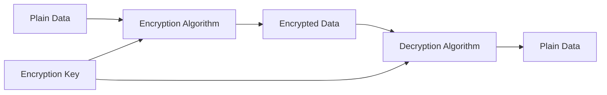
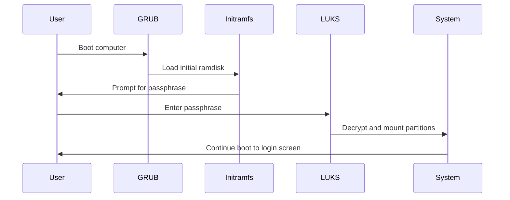

# Ubuntu Disk Encryption

## Introduction

Disk encryption is a critical security measure that protects your data from unauthorized access, especially in case of device theft or loss. In Ubuntu, disk encryption transforms your data into an unreadable format that can only be accessed with the correct authentication key or passphrase.

This guide will walk you through the concepts, implementation, and best practices of disk encryption in Ubuntu. By the end, you'll understand how to secure your system using Ubuntu's built-in encryption tools and make informed decisions about your security setup.

## What is Disk Encryption?

Disk encryption is a security technology that protects information by converting it into unreadable code that cannot be deciphered easily without the correct key or password. When your disk is encrypted:

- Data at rest (stored on your disk) is protected
- Files cannot be read by simply removing your hard drive and connecting it to another system
- Your data remains secure even if your device is stolen or lost



### Types of Disk Encryption in Ubuntu

Ubuntu offers several approaches to disk encryption:

1. **Full Disk Encryption (FDE)**: Encrypts the entire disk including the operating system, swap space, and all user data
2. **Home Directory Encryption**: Encrypts only the user's home directory
3. **eCryptfs**: A cryptographic filesystem that can encrypt individual directories
4. **LUKS (Linux Unified Key Setup)**: The standard for Linux hard disk encryption

## Setting Up Full Disk Encryption During Ubuntu Installation

The simplest way to implement full disk encryption is during the Ubuntu installation process.

### Step-by-Step Guide

1. **Start the Ubuntu Installation**:
   Boot from your Ubuntu installation media and select "Install Ubuntu".

2. **Choose Installation Type**:
   When you reach the "Installation type" screen, select "Advanced features" or "Encrypt the new Ubuntu installation for security" option.

   ![Installation Type Selection Screen would be here]

3. **Set Encryption Passphrase**:
   You'll be prompted to create a strong encryption passphrase. This is different from your user password.

   :::caution
   **Remember your encryption passphrase!** If you forget it, your data will be permanently inaccessible.
   :::

4. **Complete Installation**:
   Follow the remaining installation prompts to complete your Ubuntu setup.

### What Happens After Installation?

Once installed with encryption, here's what happens when you boot your system:



The system will prompt you for your encryption passphrase before the operating system loads. After successful authentication, your disk will be decrypted and the boot process will continue.

## Encrypting Existing Systems

If you already have Ubuntu installed without encryption, you have several options:

### Option 1: Encrypting Home Directory Using eCryptfs

```bash
sudo apt update
sudo apt install ecryptfs-utils
```

To encrypt your home directory:

```bash
sudo ecryptfs-migrate-home -u your_username
```

Example output:
```
INFO:  Checking disk space, this may take a few moments.
INFO:  Checking for open files in /home/your_username
INFO:  Moving /home/your_username to /home/your_username.randomstring
INFO:  Creating /home/your_username
INFO:  Mounting encrypted home directory at /home/your_username
INFO:  Migrating data from /home/your_username.randomstring to /home/your_username
```

After the process completes, log out and log back in. Then, generate your recovery passphrase:

```bash
ecryptfs-unwrap-passphrase
```

:::warning
Write down the recovery passphrase and store it in a secure location.
:::

### Option 2: Creating Encrypted Volumes Using LUKS

For additional storage drives or partitions:

1. Install the required tools:
   ```bash
   sudo apt update
   sudo apt install cryptsetup
   ```

2. Format the partition with LUKS (replace `/dev/sdXY` with your partition):
   ```bash
   sudo cryptsetup luksFormat /dev/sdXY
   ```

3. Open the encrypted partition:
   ```bash
   sudo cryptsetup luksOpen /dev/sdXY encrypted_volume
   ```

4. Create a filesystem:
   ```bash
   sudo mkfs.ext4 /dev/mapper/encrypted_volume
   ```

5. Mount the encrypted volume:
   ```bash
   sudo mkdir /mnt/encrypted
   sudo mount /dev/mapper/encrypted_volume /mnt/encrypted
   ```

6. To automatically mount at boot, add to `/etc/crypttab` and `/etc/fstab`:
   ```bash
   # Add to /etc/crypttab
   encrypted_volume UUID=device-uuid none luks
   
   # Add to /etc/fstab
   /dev/mapper/encrypted_volume /mnt/encrypted ext4 defaults 0 2
   ```

## Checking Encryption Status

To verify if your disk is encrypted:

```bash
sudo lsblk -f
```

Example output:
```
NAME                   FSTYPE      LABEL UUID                                   MOUNTPOINT
sda                                                                             
├─sda1                 ext4              a1b2c3d4-e5f6-7890-a1b2-c3d4e5f67890  /boot
└─sda2                 crypto_LUKS       f6e5d4c3-b2a1-0987-f6e5-d4c3b2a10987  
  └─sda2_crypt         LVM2_member       7890a1b2-c3d4-e5f6-7890-a1b2c3d4e5f6  
    ├─ubuntu--vg-root  ext4              e5f67890-a1b2-c3d4-e5f6-7890a1b2c3d4  /
    └─ubuntu--vg-swap_1 swap             a1b2c3d4-e5f6-7890-a1b2-c3d4e5f67890  [SWAP]
```

If you see `crypto_LUKS` as the FSTYPE, your disk is using LUKS encryption.

## Performance Considerations

Disk encryption adds some overhead to your system:

- **CPU Usage**: Encryption/decryption operations require CPU resources
- **Disk I/O**: May be slightly slower than unencrypted disks
- **Boot Time**: Increases due to the decryption process

Modern processors with AES-NI (Advanced Encryption Standard New Instructions) minimize this overhead. To check if your CPU supports AES-NI:

```bash
grep -m1 -o aes /proc/cpuinfo
```

If the output shows "aes", your CPU has hardware acceleration for encryption.

## Best Practices for Ubuntu Disk Encryption

1. **Use Strong Passphrases**:
   - At least 12 characters
   - Mix of uppercase, lowercase, numbers, and special characters
   - Avoid dictionary words and personal information

2. **Backup Your Encryption Keys**:
   ```bash
   sudo cryptsetup luksHeaderBackup /dev/sdXY --header-backup-file /path/to/safe/location/header-backup.img
   ```

3. **Consider Multi-Factor Authentication**:
   Add a keyfile to your LUKS volume for two-factor authentication:
   ```bash
   sudo dd if=/dev/urandom of=/root/keyfile bs=1024 count=4
   sudo chmod 400 /root/keyfile
   sudo cryptsetup luksAddKey /dev/sdXY /root/keyfile
   ```

4. **Store Backups Encrypted**:
   When backing up your system, ensure backups are also encrypted.

## Troubleshooting Common Issues

### 1. Forgotten Passphrase

If you've forgotten your LUKS passphrase but have a header backup or an additional key slot configured:

```bash
# If you have a header backup and remember an old passphrase
sudo cryptsetup luksHeaderRestore /dev/sdXY --header-backup-file /path/to/header-backup.img
```

### 2. GRUB Issues with Encrypted /boot

If you're having trouble booting:

1. Boot from a live USB
2. Open and mount your encrypted partition:
   ```bash
   sudo cryptsetup luksOpen /dev/sdXY encrypted_system
   sudo mount /dev/mapper/encrypted_system /mnt
   ```
3. Chroot into your system and repair GRUB:
   ```bash
   sudo mount -o bind /dev /mnt/dev
   sudo mount -o bind /proc /mnt/proc
   sudo mount -o bind /sys /mnt/sys
   sudo chroot /mnt
   update-grub
   grub-install /dev/sdX
   exit
   ```

### 3. Slow Performance

If encryption is causing noticeable slowdowns:

1. Check if your CPU supports AES-NI (as shown above)
2. Consider using hardware with better encryption support
3. For less critical data, use selective encryption rather than full disk encryption

## Summary

Ubuntu disk encryption provides a robust security layer for protecting your data from unauthorized access. Key points to remember:

- Full disk encryption offers the most comprehensive protection
- LUKS is the standard encryption technology in Ubuntu
- Strong passphrases are essential for maintaining security
- Modern CPUs with AES-NI minimize performance impact
- Regular backups of encryption headers can save you from data loss

By implementing disk encryption, you've taken a significant step toward securing your Ubuntu system against physical security threats.

## Additional Resources

- [Ubuntu Security Documentation](https://ubuntu.com/security)
- [LUKS Official Documentation](https://gitlab.com/cryptsetup/cryptsetup)
- [eCryptfs Wiki](https://www.ecryptfs.org/documentation)

## Practice Exercises

1. Set up a test system with full disk encryption and practice the recovery process
2. Create an encrypted USB drive for sensitive file storage
3. Implement a backup strategy for your encrypted system
4. Configure an encrypted swap partition on an existing system
5. Research and compare the performance impact of different encryption algorithms in Ubuntu