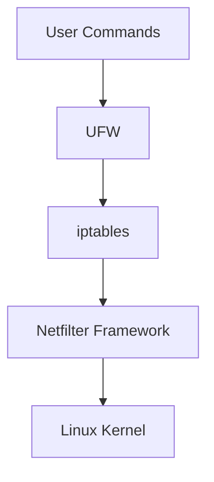

# Ubuntu Firewall Configuration

## Introduction

A firewall is an essential security component that monitors and controls incoming and outgoing network traffic based on predetermined security rules. In Ubuntu, the firewall functionality is built into the Linux kernel through a framework called Netfilter, which is typically managed through tools like UFW (Uncomplicated Firewall) or directly through iptables. This guide will walk you through the process of configuring your Ubuntu firewall to enhance your system's security.

## Understanding Firewalls in Ubuntu

Ubuntu uses two primary firewall management tools:

1. **UFW (Uncomplicated Firewall)** - A user-friendly interface for managing iptables
2. **iptables** - The underlying firewall system in Linux

For beginners, UFW is recommended as it simplifies the complex syntax of iptables while providing robust security capabilities.



## Getting Started with UFW

### Checking UFW Status

Before configuring UFW, let's check if it's installed and its current status:

```bash
sudo apt-get install ufw
sudo ufw status
```

The output will typically look like:

```
Status: inactive
```

### Basic UFW Commands

Here are some essential UFW commands to get you started:

#### Enabling UFW

```bash
sudo ufw enable
```

Output:
```
Firewall is active and enabled on system startup
```

#### Disabling UFW

```bash
sudo ufw disable
```

Output:
```
Firewall stopped and disabled on system startup
```

#### Resetting UFW

If you need to start over with your configuration:

```bash
sudo ufw reset
```

Output:
```
Resetting all rules to installed defaults. This may disrupt existing ssh connections. Proceed with operation (y|n)? y
Firewall reloaded
```

## Configuring Basic Firewall Rules

### Default Policies

Setting default policies is crucial for a secure firewall configuration:

```bash
sudo ufw default deny incoming
sudo ufw default allow outgoing
```

This configuration:
- Blocks all incoming connections by default
- Allows all outgoing connections by default

### Allowing Specific Services

You'll typically want to allow specific services like SSH:

```bash
sudo ufw allow ssh
```

Output:
```
Rule added
Rule added (v6)
```

You can also specify services by port number:

```bash
sudo ufw allow 22/tcp
```

### Allowing Web Server Traffic

If you're running a web server, you'll need to open HTTP and HTTPS ports:

```bash
sudo ufw allow 80/tcp
sudo ufw allow 443/tcp
```

Or using service names:

```bash
sudo ufw allow http
sudo ufw allow https
```

### Allowing Port Ranges

For applications that use a range of ports:

```bash
sudo ufw allow 6000:6007/tcp
sudo ufw allow 6000:6007/udp
```

### Allowing Specific IP Addresses

To allow connections from a specific IP address:

```bash
sudo ufw allow from 192.168.1.100
```

To allow connections to a specific port from a specific IP:

```bash
sudo ufw allow from 192.168.1.100 to any port 22
```

## Advanced UFW Configuration

### Denying Specific Services or Ports

While the default incoming policy is set to deny, you might want to explicitly deny certain ports:

```bash
sudo ufw deny 25
```

This blocks SMTP port 25, which is commonly used for mail servers but can be exploited if not properly secured.

### Working with Application Profiles

UFW includes application profiles that make it easier to manage firewall rules:

```bash
sudo ufw app list
```

Output might include:
```
Available applications:
  OpenSSH
  Nginx Full
  Nginx HTTP
  Nginx HTTPS
```

To allow an application:

```bash
sudo ufw allow 'Nginx HTTP'
```

### Rate Limiting to Prevent Brute Force Attacks

UFW can limit connection attempts to prevent brute force attacks:

```bash
sudo ufw limit ssh
```

This limits SSH connection attempts to 6 per 30 seconds from a single IP address.

## Monitoring and Maintaining Your Firewall

### Checking Firewall Status with Numbered Rules

To see all active rules with numbers (useful for deleting rules):

```bash
sudo ufw status numbered
```

Output:
```
Status: active

     To                         Action      From
     --                         ------      ----
[ 1] 22/tcp                     ALLOW IN    Anywhere
[ 2] 80/tcp                     ALLOW IN    Anywhere
[ 3] 443/tcp                    ALLOW IN    Anywhere
[ 4] 22/tcp (v6)                ALLOW IN    Anywhere (v6)
[ 5] 80/tcp (v6)                ALLOW IN    Anywhere (v6)
[ 6] 443/tcp (v6)               ALLOW IN    Anywhere (v6)
```

### Deleting Rules

To delete a rule using its number:

```bash
sudo ufw delete 2
```

You can also delete rules by specifying them:

```bash
sudo ufw delete allow 80/tcp
```

### Enabling Logging

To troubleshoot or monitor your firewall, enable logging:

```bash
sudo ufw logging on
```

For more verbose logging:

```bash
sudo ufw logging high
```

Logs are stored in `/var/log/ufw.log`.

## Working with iptables Directly

While UFW is sufficient for most users, some advanced configurations require direct iptables management.

### Viewing Current iptables Rules

```bash
sudo iptables -L
```

Output will show all current iptables rules in a detailed format.

### Saving and Restoring iptables Rules

Save current rules:

```bash
sudo iptables-save > /etc/iptables/rules.v4
```

Restore saved rules:

```bash
sudo iptables-restore < /etc/iptables/rules.v4
```

## Real-World Example: Securing a LAMP Server

Let's configure UFW for a typical LAMP (Linux, Apache, MySQL, PHP) server:

```bash
# Enable UFW
sudo ufw enable

# Set default policies
sudo ufw default deny incoming
sudo ufw default allow outgoing

# Allow SSH (for remote administration)
sudo ufw allow ssh

# Allow HTTP and HTTPS
sudo ufw allow 80/tcp
sudo ufw allow 443/tcp

# Allow MySQL only from local network
sudo ufw allow from 192.168.1.0/24 to any port 3306

# Rate limit SSH connections
sudo ufw limit ssh

# Check the status
sudo ufw status
```

This configuration:
1. Blocks all incoming traffic by default
2. Allows all outgoing traffic
3. Permits SSH connections with rate limiting to prevent brute force attacks
4. Opens HTTP and HTTPS ports for web server traffic
5. Allows MySQL connections only from the local network
6. Verifies the active rules

## Troubleshooting Common Issues

### UFW Not Starting

If UFW fails to start, check for conflicts with other firewall tools:

```bash
sudo systemctl status ufw
```

### Locked Out of SSH

If you accidentally lock yourself out of SSH:

1. Access the server physically or through console access
2. Disable UFW: `sudo ufw disable`
3. Correct your rules
4. Re-enable UFW: `sudo ufw enable`

### Testing Your Firewall

You can test your firewall configuration from another machine:

```bash
# Test SSH connection
ssh user@your-server-ip

# Test web server
curl http://your-server-ip
```

## Summary

In this guide, we've covered:

- Basic concepts of Ubuntu firewalls
- Setting up and configuring UFW
- Creating and managing firewall rules
- Advanced configurations for specific use cases
- Monitoring and maintaining your firewall
- Troubleshooting common issues

A properly configured firewall is your first line of defense against network-based attacks. By following the steps in this guide, you've taken a significant step toward securing your Ubuntu system.

## Additional Resources

- [Ubuntu Security Documentation](https://ubuntu.com/security)
- [UFW Community Help Wiki](https://help.ubuntu.com/community/UFW)
- [iptables Manual](https://www.netfilter.org/documentation/index.html)

## Practice Exercises

1. Configure UFW to allow traffic on a custom port (e.g., 8080)
2. Set up UFW to allow traffic from a specific subnet to a specific service
3. Create a rule to forward traffic from one port to another
4. Implement a more restrictive configuration that only allows essential services
5. Set up logging and analyze the logs to identify potential security issues