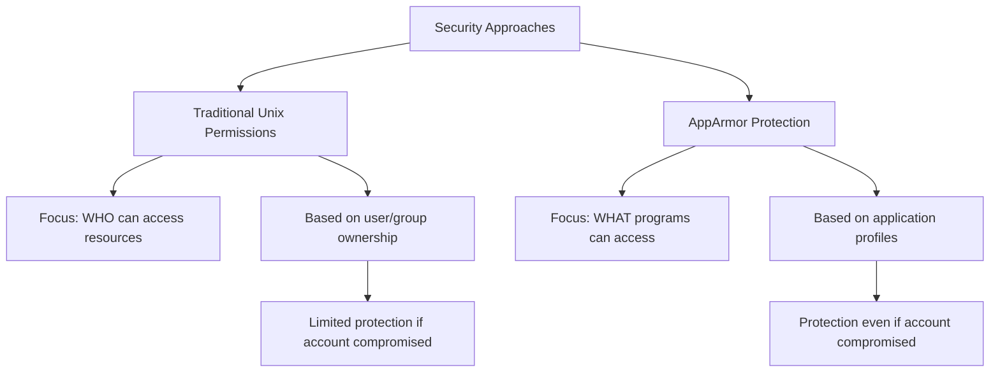

# Ubuntu AppArmor

## Introduction

AppArmor is one of Ubuntu's core security features that helps protect your system from both known and unknown vulnerabilities. Unlike traditional access control systems that focus on who can access files (user permissions), AppArmor focuses on what programs can access, creating a powerful layer of application isolation.

Think of AppArmor as a security guard for your applications - it restricts what files a program can access and what actions it can perform, even if that program is compromised or malicious. This approach, known as Mandatory Access Control (MAC), significantly reduces the potential damage from security breaches.

## Understanding AppArmor Basics

### What is AppArmor?

AppArmor ("Application Armor") is a Linux Security Module (LSM) that allows system administrators to restrict programs' capabilities with per-program profiles. These profiles can allow or deny access to:

- File operations (read, write, execute)
- Network capabilities
- Linux capabilities (privileged operations)
- Mount points and more

### How AppArmor Differs from Traditional Security

Let's compare traditional Unix permissions with AppArmor protection:



### AppArmor Modes

AppArmor profiles can run in two primary modes:

1. **Enforce Mode**: Actively blocks prohibited actions and logs violations
2. **Complain Mode**: Permits all actions but logs what would have been blocked (learning mode)

## Getting Started with AppArmor

### Checking AppArmor Status

Let's verify that AppArmor is running on your Ubuntu system:

```bash
sudo aa-status
```

Example output:
```
apparmor module is loaded.
31 profiles are loaded.
28 profiles are in enforce mode.
   /sbin/dhclient
   /usr/bin/firefox
   ...
3 profiles are in complain mode.
   /usr/bin/pidgin
   ...
0 processes have profiles defined.
0 processes are in enforce mode.
0 processes are in complain mode.
```

### Installing AppArmor Tools

If not already installed, you can get the AppArmor utilities with:

```bash
sudo apt update
sudo apt install apparmor-utils
```

## Working with AppArmor Profiles

AppArmor profiles are text files that define what resources an application can access. Profiles are stored in `/etc/apparmor.d/`.

### Examining an Existing Profile

Let's look at a simplified example of the Firefox profile:

```
# /etc/apparmor.d/usr.bin.firefox

/usr/bin/firefox {
  # Firefox needs to read configuration files
  /etc/firefox/** r,
  /etc/mozilla/** r,
  
  # Firefox needs to write to the user's Firefox directory
  owner @{HOME}/.mozilla/firefox/** rwk,
  
  # Firefox needs to read fonts
  /usr/share/fonts/** r,
  
  # Firefox needs network access
  network inet stream,
  network inet6 stream,
  
  # Include common rules
  #include <abstractions/base>
  #include <abstractions/user-download>
  #include <abstractions/audio>
}
```

### Understanding Profile Syntax

The profile syntax includes:

- Path patterns (with wildcards like `*` and `**`)
- Access modes (`r` for read, `w` for write, `x` for execute)
- Owner matching (`owner` keyword)
- Network access rules
- Capability rules
- Include statements for common rule sets

### Creating a Simple AppArmor Profile

Let's create a simple profile for a hypothetical custom script called `mybackup`:

1. First, create the program we want to secure:

```bash
sudo nano /usr/local/bin/mybackup
```

Add this content:

```bash
#!/bin/bash
# Simple backup script
SOURCE_DIR="$1"
BACKUP_DIR="$2"

if [ -z "$SOURCE_DIR" ] || [ -z "$BACKUP_DIR" ]; then
  echo "Usage: mybackup <source_dir> <backup_dir>"
  exit 1
fi

cp -r "$SOURCE_DIR" "$BACKUP_DIR"
echo "Backup completed!"
```

Make it executable:

```bash
sudo chmod +x /usr/local/bin/mybackup
```

2. Generate a basic AppArmor profile in complain mode:

```bash
sudo aa-genprof /usr/local/bin/mybackup
```

3. Exercise the program to generate learning data:

```bash
/usr/local/bin/mybackup /home/user/documents /home/user/backups
```

4. Finish the profile generation:

Press `s` when prompted to scan the system log for AppArmor events, then `f` to finish.

5. View and edit the generated profile:

```bash
sudo nano /etc/apparmor.d/usr.local.bin.mybackup
```

The generated profile might look something like:

```
# Last Modified: Sat Mar 13 10:00:00 2025
#include <tunables/global>

/usr/local/bin/mybackup {
  #include <abstractions/base>
  #include <abstractions/bash>

  /usr/local/bin/mybackup r,
  /bin/bash ix,
  /bin/cp ix,
  
  owner /home/*/documents/ r,
  owner /home/*/documents/** r,
  owner /home/*/backups/ rw,
  owner /home/*/backups/** rw,
}
```

6. Put the profile in enforce mode:

```bash
sudo aa-enforce /usr/local/bin/mybackup
```

## Managing AppArmor

### Common AppArmor Commands

Here are some essential commands for working with AppArmor:

```bash
# List all profiles and their status
sudo aa-status

# Generate a new profile
sudo aa-genprof /path/to/program

# Update an existing profile
sudo aa-logprof

# Put a profile in complain mode
sudo aa-complain /path/to/program

# Put a profile in enforce mode
sudo aa-enforce /path/to/program

# Disable a profile
sudo ln -s /etc/apparmor.d/program /etc/apparmor.d/disable/
sudo apparmor_parser -R /etc/apparmor.d/program

# Enable a disabled profile
sudo rm /etc/apparmor.d/disable/program
sudo apparmor_parser -r /etc/apparmor.d/program
```

### Reading AppArmor Logs

AppArmor logs violations to the system log. You can view them with:

```bash
sudo aa-notify -s 1 --display $DISPLAY
```

Or by checking the logs directly:

```bash
sudo journalctl -f | grep apparmor
```

Example violation log:
```
Mar 13 10:15:30 ubuntu kernel: [42187.614237] audit: type=1400 audit(1647152130.257:83): apparmor="DENIED" operation="open" profile="/usr/local/bin/mybackup" name="/etc/passwd" pid=2854 comm="mybackup" requested_mask="r" denied_mask="r" fsuid=1000 ouid=0
```

## Real-World Examples

### Securing a Web Server

Let's create a simple profile for securing nginx:

```bash
sudo aa-genprof /usr/sbin/nginx
```

After running nginx and testing it thoroughly, the profile might look like:

```
#include <tunables/global>

/usr/sbin/nginx {
  #include <abstractions/base>
  #include <abstractions/nginx>
  #include <abstractions/openssl>

  # Main executable
  /usr/sbin/nginx mr,

  # Configuration
  /etc/nginx/** r,
  
  # Web content
  /var/www/** r,
  
  # Logs
  /var/log/nginx/*.log w,
  
  # Server functionality
  capability net_bind_service,
  capability setgid,
  capability setuid,
  
  # Network access
  network inet stream,
  network inet6 stream,
  
  # Process management
  /run/nginx.pid rw,
}
```

### Securing Custom Applications

For developers, you can integrate AppArmor into your deployment process:

1. Develop in complain mode for learning
2. Test extensively to capture all legitimate access patterns
3. Analyze and refine profiles
4. Deploy in enforce mode
5. Monitor for legitimate access that was missed

## Troubleshooting AppArmor

### Common Issues and Solutions

1. **Application doesn't work with AppArmor enabled**:
   - Check logs: `sudo journalctl -f | grep apparmor`
   - Temporarily switch to complain mode: `sudo aa-complain /path/to/program`
   - Update profile: `sudo aa-logprof`

2. **False positives in profile**:
   - Edit profile manually: `sudo nano /etc/apparmor.d/path.to.program`
   - Add necessary rules
   - Reload: `sudo apparmor_parser -r /etc/apparmor.d/path.to.program`

3. **AppArmor status shows "inactive"**:
   - Enable AppArmor: `sudo systemctl enable --now apparmor`
   - Verify boot parameters don't include `apparmor=0`

### Debugging Tools

AppArmor includes several debugging tools:

```bash
# Profile troubleshooting wizard
sudo aa-logprof

# Profile generation tool
sudo aa-genprof /path/to/program

# Profile verification
sudo apparmor_parser -p /etc/apparmor.d/program
```

## Advanced Features

### Using AppArmor Abstractions

Abstractions are reusable sets of rules in `/etc/apparmor.d/abstractions/`:

```
#include <abstractions/base>
#include <abstractions/user-tmp>
#include <abstractions/python>
```

### Using Variables in Profiles

AppArmor supports variables for more flexible profiles:

```
@{HOME}/.config/myapp/** rw,
@{PROC}/@{pid}/status r,
```

### Creating Profile Namespaces

For more complex deployments, you can use namespaces:

```bash
sudo mkdir /etc/apparmor.d/mycompany/
sudo nano /etc/apparmor.d/mycompany/myapp
```

## Summary

AppArmor provides a powerful but approachable security layer for Ubuntu systems:

1. It restricts what applications can access, not just who can access files
2. It provides protection against both known and unknown vulnerabilities
3. It can run in complain mode for learning or enforce mode for protection
4. Profiles can be generated automatically and refined manually
5. It integrates with Ubuntu's security infrastructure

By implementing AppArmor profiles for your critical applications, you significantly reduce the attack surface and potential impact of security breaches.

## Additional Resources

- [Ubuntu AppArmor Documentation](https://wiki.ubuntu.com/AppArmor)
- [AppArmor Project Page](https://gitlab.com/apparmor/apparmor/-/wikis/home)
- [Debian AppArmor Wiki](https://wiki.debian.org/AppArmor)

## Exercises

1. Install AppArmor utilities and check the status of AppArmor on your system.
2. Create a simple script and generate an AppArmor profile for it.
3. Examine existing profiles in `/etc/apparmor.d/` and try to understand their structure.
4. Put a profile in complain mode, test the application, and check the logs for denied actions.
5. Create a profile for a network service you use and test it thoroughly.

By completing these exercises, you'll gain practical experience with AppArmor and be better equipped to secure your Ubuntu systems.