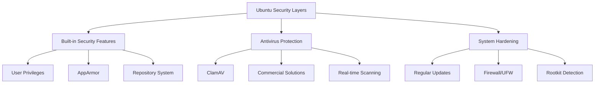

# Ubuntu Antivirus

## Introduction

When transitioning from Windows or macOS to Ubuntu (or any Linux distribution), you might wonder: "Do I need an antivirus on Ubuntu?" This is a reasonable question, especially for beginners. While Ubuntu is generally considered more secure than Windows, it's not immune to malware and other security threats. This guide will explain Ubuntu's security model, the real threats that exist, and how to implement effective antivirus protection on your Ubuntu system.

## Do You Need Antivirus on Ubuntu?

Ubuntu has several inherent security advantages:

1. **User Privilege Separation**: By default, Ubuntu uses a non-root user account for daily operations, limiting potential damage from malware.

2. **Repository-based Software Management**: Most software is installed from trusted official repositories, reducing the risk of malicious software.

3. **Open Source Scrutiny**: The open-source nature of Ubuntu means many eyes review the code, potentially catching vulnerabilities faster.

4. **Smaller Target**: Linux has a smaller desktop market share, making it a less attractive target for malware creators.

Despite these advantages, several scenarios warrant antivirus protection on Ubuntu:

- If your Ubuntu machine serves files to Windows systems
- When you frequently exchange files with Windows users
- If you run a mail server that handles files for Windows clients
- For regulatory compliance in certain professional environments
- To protect yourself against the growing number of Linux-targeted malware

## Common Security Threats to Ubuntu

Ubuntu faces several types of threats:

### 1. Linux-specific Malware

While less common than Windows malware, Linux-specific threats exist:

- **Linux.Encoder**: A ransomware targeting Linux web servers
- **Mirai**: Malware targeting IoT devices running Linux
- **XorDDoS**: A DDoS botnet targeting Linux systems

### 2. Cross-platform Threats

Some threats affect multiple operating systems:

- **Web-based exploits**: Attacks through browsers are often platform-independent
- **Social engineering**: Phishing works regardless of operating system
- **Crypto miners**: Unauthorized cryptocurrency mining software

### 3. Windows Malware Transmission

Ubuntu systems can inadvertently pass Windows malware to Windows machines even if the malware doesn't affect Ubuntu itself.

## Popular Antivirus Solutions for Ubuntu

Let's explore some effective antivirus options for Ubuntu:

### ClamAV

ClamAV is an open-source antivirus engine designed for detecting trojans, viruses, malware, and other malicious threats.

#### Installation

```bash
sudo apt update
sudo apt install clamav clamav-daemon
```

#### Updating Virus Definitions

```bash
sudo systemctl stop clamav-freshclam
sudo freshclam
sudo systemctl start clamav-freshclam
```

#### Scanning Your System

To scan a specific directory:

```bash
clamscan -r /home/username/
```

To scan your entire system:

```bash
sudo clamscan -r /
```

For a more comprehensive scan with infected file isolation:

```bash
sudo mkdir /virus_quarantine
sudo clamscan -r --move=/virus_quarantine / 
```

Output example:

```
----------- SCAN SUMMARY -----------
Known viruses: 8607440
Engine version: 0.103.6
Scanned directories: 12723
Scanned files: 147371
Infected files: 2
Data scanned: 5447.62 MB
Data read: 2811.09 MB (ratio 1.94:1)
Time: 1200.660 sec (20 m 0 s)
```

### ESET NOD32

ESET offers a commercial Linux antivirus solution with advanced features:

1. Download the installer from the ESET website
2. Navigate to your download directory and run:

```bash
chmod +x eset_nod32av_64bit.linux
sudo ./eset_nod32av_64bit.linux
```

3. Follow the installation wizard

### Sophos Antivirus for Linux

Sophos offers a free antivirus for home use:

1. Register on the Sophos website
2. Download the installer
3. Extract and install:

```bash
tar -xzvf sav-linux-free-9.tgz
cd sophos-av
sudo ./install.sh
```

4. Update virus definitions:

```bash
sudo /opt/sophos-av/bin/savupdate
```

5. Run a scan:

```bash
sudo /opt/sophos-av/bin/savscan /
```

## Setting Up Automatic Scans with ClamAV

For regular protection, you can automate ClamAV scans using cron jobs:

### Creating a Weekly Scan Script

1. Create a script file:

```bash
sudo nano /usr/local/bin/clamav-scan.sh
```

2. Add the following content:

```bash
#!/bin/bash
# ClamAV weekly scan script

LOGFILE="/var/log/clamav/weekly_scan.log"
SCAN_DIR="/"

echo "ClamAV scan started at $(date)" > $LOGFILE
clamscan -ri $SCAN_DIR >> $LOGFILE
echo "Scan completed at $(date)" >> $LOGFILE
```

3. Make it executable:

```bash
sudo chmod +x /usr/local/bin/clamav-scan.sh
```

4. Set up a weekly cron job:

```bash
sudo crontab -e
```

5. Add this line to run the scan every Sunday at 2 AM:

```
0 2 * * 0 /usr/local/bin/clamav-scan.sh
```

## Real-time Protection with ClamAV

You can enable real-time scanning with ClamAV using on-access scanning:

```bash
sudo apt install clamav-daemon
sudo systemctl enable clamav-daemon
sudo systemctl start clamav-daemon
```

Configure the on-access scanner by editing its configuration:

```bash
sudo nano /etc/clamav/clamd.conf
```

Ensure these lines are uncommented and configured:

```
OnAccessIncludePath /home
OnAccessExcludePath /home/user/downloads
OnAccessPrevention yes
```

## Best Practices Beyond Antivirus

Antivirus is just one component of a comprehensive security strategy:

### Regular System Updates

```bash
sudo apt update
sudo apt upgrade
```

### Firewall Configuration with UFW

Enable and configure the built-in firewall:

```bash
sudo apt install ufw
sudo ufw enable
sudo ufw status
```

Allow specific services:

```bash
sudo ufw allow ssh
sudo ufw allow http
```

### Implementing Malware Detection with RKHunter

RKHunter checks for rootkits and other malware:

```bash
sudo apt install rkhunter
sudo rkhunter --update
sudo rkhunter --check
```

## Visualizing Ubuntu Security Layers



## Understanding False Positives

Antivirus software sometimes flags legitimate files as malicious. Here's how to handle potential false positives in ClamAV:

1. Check the detection name against known false positives
2. Verify the file source
3. Submit the file to the ClamAV team for analysis:

```bash
sigtool --md5 /path/to/suspicious_file
# Report the MD5 and file details to the ClamAV team
```

## Summary

While Ubuntu is inherently more secure than some operating systems, implementing antivirus protection adds an important layer of security, especially in mixed-OS environments. ClamAV provides a robust, free, and open-source solution for most users, while commercial options offer additional features for enterprise environments.

Remember that antivirus is just one part of a comprehensive security strategy. Regular updates, proper user privilege management, firewall configuration, and good computing practices are equally important for maintaining a secure Ubuntu system.

## Additional Resources

- [ClamAV Official Documentation](https://www.clamav.net/documents/clam-antivirus-user-manual)
- [Ubuntu Security Documentation](https://ubuntu.com/security)
- [Linux Malware Detect (LMD)](https://www.rfxn.com/projects/linux-malware-detect/)

## Exercises

1. Install ClamAV and run a complete system scan. How many files were scanned, and were any threats detected?

2. Configure an automated weekly scan using cron and check the generated log file.

3. Research and list three recent Linux-specific malware threats not mentioned in this guide.

4. Set up on-access scanning for your home directory and test it by downloading the EICAR test file.

5. Compare the resource usage of a full system scan using ClamAV versus a commercial antivirus solution if available.