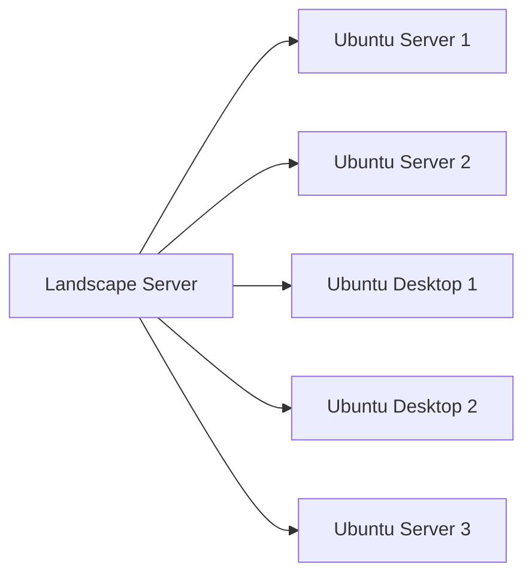

# Ubuntu Security Updates

## Introduction

Security is a critical aspect of any operating system, and Ubuntu takes it seriously. Security updates are patches and fixes released to address vulnerabilities discovered in the software. Without regular updates, your system could be exposed to various security threats and exploits.

In this guide, we'll explore how Ubuntu handles security updates, how to manage them effectively, and best practices for maintaining a secure system.

## Understanding Ubuntu's Security Update System

Ubuntu uses a well-structured security update mechanism that categorizes updates based on their importance and impact. Let's break down how this system works.

### Security Update Classifications

Ubuntu classifies updates into several categories:

- **Security Updates**: Fix critical security vulnerabilities
- **Recommended Updates**: Address important software issues that aren't security vulnerabilities
- **Optional Updates**: Provide new features or non-critical fixes
- **Backports**: Newer versions of software ported to your stable Ubuntu release

For security purposes, the most important category is "Security Updates," which receives priority attention from the Ubuntu Security Team.

## How to Check for Security Updates

There are several ways to check for security updates on Ubuntu:

### Using the Command Line

The command line offers the most direct way to check for and apply security updates.

```bash
# Update package lists
sudo apt update

# Show available security updates
sudo apt list --upgradable

# Apply all available updates
sudo apt upgrade

# Apply only security updates
sudo unattended-upgrade --dry-run
```

The output will look something like this:

```
Reading package lists... Done
Building dependency tree... Done
Reading state information... Done
Calculating upgrade... Done
The following packages will be upgraded:
  firefox libssl1.1 openssh-client openssh-server
4 upgraded, 0 newly installed, 0 to remove and 0 not upgraded.
```

### Using the Software Updater GUI

For desktop users, Ubuntu provides a graphical Software Updater:

1. Press the Super key (Windows key) and search for "Software Updater"
2. Click on the Software Updater icon
3. The tool will automatically check for updates
4. If security updates are available, they will be highlighted

## Automating Security Updates

For servers or systems requiring minimal intervention, Ubuntu offers a way to automate security updates.

### Setting Up Unattended Upgrades

The `unattended-upgrades` package allows automatic installation of security updates:

```bash
# Install unattended-upgrades
sudo apt install unattended-upgrades

# Configure unattended-upgrades
sudo dpkg-reconfigure unattended-upgrades
```

To customize the configuration, edit the main configuration file:

```bash
sudo nano /etc/apt/apt.conf.d/50unattended-upgrades
```

Here's an example configuration that enables only security updates:

```
Unattended-Upgrade::Allowed-Origins {
    "${distro_id}:${distro_codename}-security";
//  "${distro_id}:${distro_codename}-updates";
//  "${distro_id}:${distro_codename}-proposed";
//  "${distro_id}:${distro_codename}-backports";
};
```

### Setting Update Frequency

You can adjust how often the system checks for updates by modifying the update timer:

```bash
sudo nano /etc/apt/apt.conf.d/20auto-upgrades
```

Add or modify these lines to check daily and download/install security updates:

```
APT::Periodic::Update-Package-Lists "1";
APT::Periodic::Download-Upgradeable-Packages "1";
APT::Periodic::Unattended-Upgrade "1";
APT::Periodic::AutocleanInterval "7";
```

## Understanding Ubuntu Security Notices (USNs)

Ubuntu Security Notices (USNs) provide detailed information about security issues that have been fixed in Ubuntu. Each USN includes:

- A unique identifier (e.g., USN-5647-1)
- The affected packages
- A description of the vulnerability
- CVE identifiers (Common Vulnerabilities and Exposures)
- References to upstream sources

### Checking USNs via Command Line

You can install the `ubuntu-security-status` tool to get a quick overview:

```bash
sudo apt install ubuntu-security-status
ubuntu-security-status
```

Example output:

```
456 packages installed:
    437 packages are from Ubuntu Main/Restricted repository
    19 packages are from Ubuntu Universe/Multiverse repository
    0 packages are from third-party repositories
    0 packages are no longer available for download

All installed packages are updated.
No pending security updates.

This system is receiving security updates until April 2025.
```

## Managing Security Updates for Multiple Systems

For organizations managing multiple Ubuntu systems, there are several approaches:

### Using Landscape

Canonical's Landscape service provides centralized management for Ubuntu systems:



### Using Configuration Management Tools

For more advanced setups, configuration management tools can automate security updates:

```bash
# Example Ansible playbook snippet for security updates
- name: Ensure security updates are applied
  apt:
    update_cache: yes
    upgrade: dist
    cache_valid_time: 3600
  when: ansible_distribution == 'Ubuntu'
```

## Best Practices for Ubuntu Security Updates

Here are some recommended practices for managing security updates:

1. **Regular Updates**: Schedule regular update checks, at least weekly
2. **Testing Environment**: Test updates in a non-production environment first
3. **Update Policies**: Develop clear policies for when and how updates are applied
4. **Monitoring**: Monitor systems after updates for any issues
5. **Backup**: Always back up important data before major updates
6. **Documentation**: Keep records of applied updates and any issues encountered

## Troubleshooting Update Issues

Sometimes, you might encounter issues with security updates:

### Dealing with Package Conflicts

If you encounter package conflicts:

```bash
# Fix broken packages
sudo apt --fix-broken install

# Force reconfiguration of packages
sudo dpkg --configure -a
```

### Handling Failed Updates

If an update fails:

```bash
# Clear package cache and try again
sudo apt clean
sudo apt update
sudo apt upgrade
```

### Managing Repository Issues

If you're having trouble accessing repositories:

```bash
# Check repository status
sudo apt update

# Switch to a different mirror if needed
sudo nano /etc/apt/sources.list
```

## Summary

Keeping your Ubuntu system updated with the latest security patches is a fundamental aspect of system security. Ubuntu provides multiple ways to manage security updates, from manual methods via the command line to fully automated solutions.

By following the practices outlined in this guide, you can ensure your Ubuntu system remains protected against known security vulnerabilities while minimizing disruption to your workflow.

## Additional Resources

- [Ubuntu Security Notices](https://ubuntu.com/security/notices)
- [Ubuntu Security Team](https://wiki.ubuntu.com/SecurityTeam)
- [Canonical Landscape](https://landscape.canonical.com/)

## Practice Exercises

1. Set up unattended-upgrades to automatically install security updates on your system.
2. Create a simple shell script that checks for security updates and sends you an email if updates are available.
3. Configure a test system to use a different update mirror and compare update speeds.
4. Research and document three recent USNs that affected packages installed on your system.
5. Design an update policy for a hypothetical organization with 50 Ubuntu servers and 100 desktop systems.