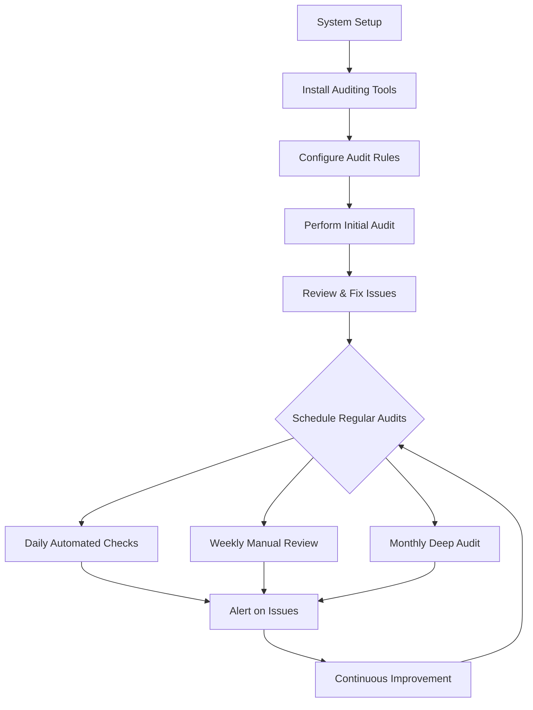

# Ubuntu Security Auditing

## Introduction

Security auditing is a critical aspect of maintaining a robust Ubuntu system. It involves systematically examining your system configurations, processes, and logs to identify potential security vulnerabilities before they can be exploited. For beginners venturing into Ubuntu security, understanding how to properly audit your system is an essential skill that forms the foundation of a strong security posture.

This guide will walk you through the fundamentals of Ubuntu security auditing, from basic concepts to practical implementation. We'll explore various tools and techniques that help identify security weaknesses, monitor system activities, and ensure compliance with security best practices.

## Why Security Auditing Matters

Before diving into the technical details, let's understand why security auditing is crucial:

- **Prevention**: Identifying vulnerabilities before they can be exploited
- **Compliance**: Meeting organizational or regulatory security requirements
- **Evidence**: Providing proof of security diligence
- **Improvement**: Establishing a baseline for ongoing security enhancements

## Getting Started with Ubuntu Security Auditing

To begin auditing your Ubuntu system, you'll need to familiarize yourself with several built-in tools and additional utilities that can be installed. Let's explore these tools step by step.

### Basic System Information Gathering

The first step in security auditing is understanding what you're working with. These commands help gather basic system information:

```bash
# Check Ubuntu version
lsb_release -a

# Output:
# No LSB modules are available.
# Distributor ID: Ubuntu
# Description:    Ubuntu 22.04.3 LTS
# Release:        22.04
# Codename:       jammy

# Check kernel version
uname -a

# Output:
# Linux ubuntu-server 5.15.0-79-generic #86-Ubuntu SMP Mon Jul 10 16:07:21 UTC 2023 x86_64 x86_64 x86_64 GNU/Linux

# Check system uptime and load
uptime

# Output:
# 14:23:16 up 37 days, 2:34, 2 users, load average: 0.08, 0.03, 0.01
```

### User and Account Auditing

Unauthorized or misconfigured user accounts are common security issues. Here's how to audit them:

```bash
# List all users
cat /etc/passwd | grep -v "nologin" | grep -v "false"

# Output sample:
# root:x:0:0:root:/root:/bin/bash
# ubuntu:x:1000:1000:Ubuntu:/home/ubuntu:/bin/bash

# Check users with sudo privileges
grep -Po '^sudo.+:\K.*$' /etc/group

# Output:
# ubuntu

# Check for users with empty passwords
sudo grep -v ':!:' /etc/shadow | grep '::' 

# List failed login attempts
sudo lastb | head -n 10

# Output sample:
# admin    ssh:notty    180.76.224.228  Tue Aug  1 07:52 - 07:52  (00:00)
# guest    ssh:notty    180.76.224.228  Tue Aug  1 07:52 - 07:52  (00:00)
# ftpuser  ssh:notty    180.76.224.228  Tue Aug  1 07:52 - 07:52  (00:00)
```

### Network Security Auditing

Understanding your network exposure is essential for security:

```bash
# Check listening ports and associated services
sudo netstat -tulpn | grep LISTEN

# Output sample:
# tcp        0      0 0.0.0.0:22              0.0.0.0:*               LISTEN      1234/sshd
# tcp6       0      0 :::80                   :::*                    LISTEN      5678/apache2

# Check active connections
sudo netstat -tuapn

# Check firewall status
sudo ufw status

# Output:
# Status: active
# 
# To                         Action      From
# --                         ------      ----
# 22/tcp                     ALLOW       Anywhere
# 80,443/tcp                 ALLOW       Anywhere
```

## Installing Essential Security Auditing Tools

Ubuntu offers several powerful tools specifically designed for security auditing. Let's install some key utilities:

```bash
# Update package lists
sudo apt update

# Install common security tools
sudo apt install -y lynis rkhunter chkrootkit auditd aide
```

Let's explore each of these tools:

### Lynis: Comprehensive System Auditing

Lynis is an open-source security auditing tool that performs hundreds of security checks:

```bash
# Run a system audit with Lynis
sudo lynis audit system

# Output sample (truncated):
# Lynis 3.0.3 
# Running security scan for UNIX-based systems
# 
# [+] Security warnings
# --------------------------------
# ! Firewall is active, but doesn't log dropped packets [FIRE-4513]
# ! NTP daemon is configured but not running [TIME-3008]
# 
# [+] Suggestions
# --------------------------------
# * Consider hardening SSH configuration [SSH-7408]
#   - Details  : AllowTcpForwarding (YES --> NO)
```

Lynis provides a comprehensive report with:
- Security warnings requiring immediate attention
- Suggestions for hardening your system
- Information about the system configuration

### AIDE: File Integrity Monitoring

AIDE (Advanced Intrusion Detection Environment) helps detect unauthorized file changes:

```bash
# Initialize AIDE database
sudo aideinit

# Output:
# AIDE, version 0.17.3
# Creating AIDE database...
# Adding new entries to AIDE database...
# AIDE database created.

# Check for file changes since the last initialization
sudo aide --check

# Output when files are modified:
# AIDE found differences between database and filesystem!!
# Start timestamp: 2023-08-10 15:22:13
# 
# Summary:
#   Total number of entries:    121983
#   Added entries:              0
#   Removed entries:            0
#   Changed entries:            1
# 
# Changed entries:
# f   : /etc/passwd
```

### Rootkit Detection

Rootkits are malicious software designed to hide from normal detection methods. Two tools can help detect them:

```bash
# Run rkhunter scan
sudo rkhunter --check

# Output sample:
# Checking for rootkits...
# Checking for root trojans...
# System checks summary
#   File properties checks...
#     Files checked: 147
#     Suspect files: 0

# Run chkrootkit scan
sudo chkrootkit

# Output sample:
# ROOTDIR is `/'
# Checking `amd'... not found
# Checking `basename'... not infected
# Checking `biff'... not found
```

## Setting Up System Auditing with Auditd

The Linux Audit system provides a way to track security-relevant information on your system. The `auditd` daemon can be configured to log system calls and file access:

```bash
# Install audit
sudo apt install -y auditd audispd-plugins

# Start the service
sudo systemctl start auditd

# Check status
sudo systemctl status auditd

# Output:
# ● auditd.service - Security Auditing Service
#      Loaded: loaded (/lib/systemd/system/auditd.service; enabled; vendor preset: enabled)
#      Active: active (running) since Mon 2023-08-10 15:45:22 UTC; 10s ago
```

### Configuring Basic Audit Rules

Let's set up some basic auditing rules:

```bash
# Create a new rules file
sudo nano /etc/audit/rules.d/audit.rules
```

Add the following rules to monitor critical activities:

```bash
# Monitor file modifications in /etc
-w /etc/passwd -p wa -k identity
-w /etc/group -p wa -k identity
-w /etc/shadow -p wa -k identity
-w /etc/sudoers -p wa -k sudoers

# Monitor command execution
-a exit,always -F arch=b64 -S execve -k exec

# Monitor failed access attempts
-a always,exit -F arch=b64 -S open -F exit=-EACCES -F key=access
-a always,exit -F arch=b64 -S open -F exit=-EPERM -F key=access
```

Reload the rules:

```bash
sudo auditctl -R /etc/audit/rules.d/audit.rules
```

### Reviewing Audit Logs

To review the audit logs and search for specific events:

```bash
# View all audit logs
sudo ausearch --start today --raw | aureport

# Search for file modifications
sudo ausearch -f /etc/passwd

# Generate a summary report
sudo aureport --summary

# Output sample:
# Summary Report
# ======================
# Range of time in logs: 08/10/2023 15:45:22.128 - 08/10/2023 16:01:35.078
# Selected time for report: 08/10/2023 15:45:22 - 08/10/2023 16:01:35
# Number of changes in configuration: 2
# Number of changes to accounts, groups, or roles: 1
# Number of logins: 3
# Number of failed logins: 1
# Number of authentications: 12
# Number of failed authentications: 2
# Number of users: 3
# Number of terminals: 7
# Number of host names: 4
# Number of executables: 18
# Number of commands: 27
# Number of files: 41
# Number of AVC's: 0
# Number of MAC events: 0
# Number of failed syscalls: 9
# Number of anomaly events: 0
# Number of responses to anomaly events: 0
# Number of crypto events: 0
# Number of integrity events: 0
# Number of virt events: 0
# Number of keys: 11
# Number of process IDs: 38
# Number of events: 142
```

## Automating Security Audits

For ongoing monitoring, we can automate the security auditing process:

### Creating a Simple Security Audit Script

```bash
#!/bin/bash
# security_audit.sh - Basic security audit script

# Set output file
DATE=$(date +%Y-%m-%d)
OUTPUT="/var/log/security_audit_$DATE.log"

echo "Security Audit Report - $DATE" > $OUTPUT
echo "===============================" >> $OUTPUT

# System information
echo -e "

[SYSTEM INFORMATION]" >> $OUTPUT
echo "Hostname: $(hostname)" >> $OUTPUT
echo "Kernel: $(uname -r)" >> $OUTPUT
echo "Ubuntu Version: $(lsb_release -d | cut -f2)" >> $OUTPUT

# User information
echo -e "

[USER INFORMATION]" >> $OUTPUT
echo "Users with login shell:" >> $OUTPUT
cat /etc/passwd | grep -v "nologin" | grep -v "false" >> $OUTPUT

echo -e "
Sudo users:" >> $OUTPUT
grep -Po '^sudo.+:\K.*$' /etc/group >> $OUTPUT

# Network information
echo -e "

[NETWORK INFORMATION]" >> $OUTPUT
echo "Open ports:" >> $OUTPUT
netstat -tulpn | grep LISTEN >> $OUTPUT

echo -e "
Firewall status:" >> $OUTPUT
ufw status >> $OUTPUT

# Run Lynis audit
echo -e "

[LYNIS SECURITY SCAN]" >> $OUTPUT
lynis audit system --no-colors --quiet >> $OUTPUT

# Check for file changes with AIDE
echo -e "

[AIDE FILE INTEGRITY CHECK]" >> $OUTPUT
aide --check >> $OUTPUT 2>&1

# Notify admin
echo "Security audit completed. Report saved to $OUTPUT"
```

Make the script executable and set up a cron job to run it daily:

```bash
# Make script executable
sudo chmod +x security_audit.sh

# Add to crontab to run daily at 3 AM
sudo crontab -e

# Add this line:
0 3 * * * /path/to/security_audit.sh
```

## Visualizing Security Audit Data

Security data is easier to interpret with visual representations. We can create a simple diagram of our security auditing workflow using Mermaid:



## Compliance Checking with OpenSCAP

For organizations requiring compliance with security standards, OpenSCAP is a valuable tool:

```bash
# Install OpenSCAP
sudo apt install -y libopenscap8 ssg-base ssg-debderived ssg-debian ssg-nondebian ssg-applications

# Run a scan using the Ubuntu security profile
sudo oscap xccdf eval --profile xccdf_org.ssgproject.content_profile_standard --results scan-results.xml --report scan-report.html /usr/share/xml/scap/ssg/content/ssg-ubuntu2004-ds.xml
```

This generates an HTML report with compliance information for various security standards.

## Best Practices for Ubuntu Security Auditing

Here are some key practices to follow for effective security auditing:

1. **Regular Scheduling**: Perform audits on a consistent schedule
2. **Baseline Comparison**: Always compare current results against previous baselines
3. **Change Management**: Document all system changes
4. **Update Tools**: Keep security tools updated
5. **Comprehensive Approach**: Use multiple tools to get different perspectives
6. **Action Plan**: Create a plan to address identified issues
7. **Documentation**: Maintain detailed records of all audit activities

## Real-World Example: Responding to Security Issues

Let's walk through a practical example of responding to security findings:

1. **The Issue**: Lynis reports SSH configuration allows TCP forwarding, which is a potential security risk.

2. **Investigation**:
   ```bash
   # Check current SSH configuration
   grep "AllowTcpForwarding" /etc/ssh/sshd_config
   
   # Output:
   # AllowTcpForwarding yes
   ```

3. **Remediation**:
   ```bash
   # Edit SSH configuration file
   sudo nano /etc/ssh/sshd_config
   
   # Change the line to:
   AllowTcpForwarding no
   
   # Restart SSH service
   sudo systemctl restart sshd
   ```

4. **Verification**:
   ```bash
   # Run lynis again to check if the issue is resolved
   sudo lynis audit system --tests SSH-7408
   
   # Output:
   # Hardening: Checking OpenSSH configuration
   # - OK: SSH option AllowTcpForwarding is set to no
   ```

5. **Documentation**: Record the change, justification, and verification in your security changelog.

## Summary

Security auditing is not a one-time activity but an ongoing process essential for maintaining a secure Ubuntu environment. In this guide, we've covered:

- Basic security auditing concepts
- Essential auditing tools for Ubuntu
- Setting up automated auditing
- Addressing security issues
- Compliance checking
- Best practices for effective security auditing

By implementing these practices, even beginners can establish a robust security posture for their Ubuntu systems. Remember that security is a journey, not a destination—continuous monitoring, regular updates, and proactive measures are your best defenses against evolving threats.

## Additional Resources

For further learning, consider exploring:

- The [Ubuntu Security Guide](https://ubuntu.com/security/guides)
- The [Center for Internet Security (CIS) Benchmarks](https://www.cisecurity.org/benchmark/ubuntu_linux/)
- The [Lynis Documentation](https://cisofy.com/documentation/lynis/)
- The [Linux Audit Framework Documentation](https://github.com/linux-audit/audit-documentation)

## Exercises for Practice

1. Set up a test Ubuntu system and run a full Lynis audit. Try to resolve at least three security issues found.
2. Configure AIDE to monitor a specific directory and test the alerting by making changes to files.
3. Create a custom audit script that focuses on one aspect of security (e.g., user accounts, network, or file permissions).
4. Use auditd to monitor access to a sensitive file and generate a report of all access attempts.
5. Compare the security posture of a fresh Ubuntu installation versus one that has been hardened using the techniques in this guide.