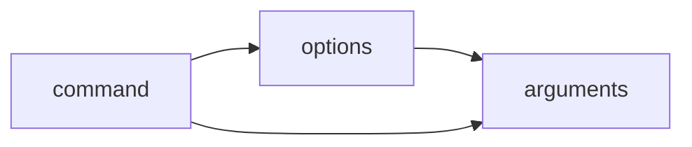

# Ubuntu Shell Introduction

## What is the Ubuntu Shell?

The Ubuntu shell is a powerful text-based interface that allows you to interact with your Ubuntu operating system by typing commands. Also known as the "terminal" or "command line," the shell provides direct access to the core functionality of your system, enabling you to perform tasks ranging from simple file operations to complex system administration.

The default shell in Ubuntu is called **Bash** (Bourne Again SHell), which is the most common shell in Linux-based systems.

## Why Learn Shell Commands?

Learning to use the shell offers several advantages:

- **Efficiency**: Many tasks can be completed faster through the shell than using a graphical interface
- **Automation**: Commands can be combined and saved as scripts to automate repetitive tasks
- **Remote access**: You can manage systems remotely through SSH without needing a graphical interface
- **Resource efficiency**: Shell commands typically use fewer system resources than graphical applications
- **Precision**: Shell commands offer fine-grained control over system operations

## Accessing the Terminal

There are several ways to access the terminal in Ubuntu:

1. Press `Ctrl+Alt+T` (keyboard shortcut)
2. Search for "Terminal" in the Applications menu
3. Right-click on the desktop and select "Open Terminal" (if available)

When you open the terminal, you'll see a prompt that looks something like this:

```
username@hostname:~$
```

This prompt tells you:
- Your username (`username`)
- Your computer's hostname (`hostname`)
- Your current directory (`~` represents your home directory)
- The `$` symbol indicates you're operating as a regular user (a `#` would indicate root/administrator privileges)

## Basic Shell Navigation

### Checking Your Current Location

The `pwd` (Print Working Directory) command shows your current location in the file system:

```bash
pwd
```

Output:
```
/home/username
```

### Listing Files and Directories

The `ls` command lists files and directories:

```bash
ls
```

Output:
```
Desktop  Documents  Downloads  Music  Pictures  Public  Templates  Videos
```

Add options to see more details:

```bash
ls -l  # Long format with details
```

Output:
```
drwxr-xr-x 2 username username 4096 Jan 10 09:15 Desktop
drwxr-xr-x 2 username username 4096 Jan 10 09:15 Documents
drwxr-xr-x 2 username username 4096 Jan 10 09:15 Downloads
drwxr-xr-x 2 username username 4096 Jan 10 09:15 Music
drwxr-xr-x 2 username username 4096 Jan 10 09:15 Pictures
drwxr-xr-x 2 username username 4096 Jan 10 09:15 Public
drwxr-xr-x 2 username username 4096 Jan 10 09:15 Templates
drwxr-xr-x 2 username username 4096 Jan 10 09:15 Videos
```

```bash
ls -la  # Long format including hidden files (those starting with .)
```

### Changing Directories

The `cd` (Change Directory) command lets you navigate between directories:

```bash
cd Documents  # Move to Documents directory
```

Special directory references:
- `cd ~` - Go to your home directory
- `cd ..` - Go up one level (parent directory)
- `cd -` - Go back to the previous directory
- `cd /` - Go to the root directory

## Working with Files and Directories

### Creating Directories

Create new directories with the `mkdir` command:

```bash
mkdir Projects
```

Create nested directories with a single command:

```bash
mkdir -p Projects/WebDev/HTML
```

The `-p` flag creates parent directories if they don't exist.

### Creating Files

Create an empty file using `touch`:

```bash
touch notes.txt
```

Or create a file with content using text editors like `nano`:

```bash
nano notes.txt
```

### Copying Files

Copy files with the `cp` command:

```bash
cp notes.txt notes_backup.txt
```

Copy directories recursively:

```bash
cp -r Projects ProjectsBackup
```

### Moving/Renaming Files

The `mv` command moves or renames files:

```bash
mv notes.txt Documents/  # Move to Documents directory
```

```bash
mv notes.txt meeting_notes.txt  # Rename file
```

### Deleting Files and Directories

Remove files with `rm`:

```bash
rm notes.txt
```

Remove directories with `rmdir` (only works on empty directories):

```bash
rmdir EmptyFolder
```

Remove directories and their contents with `rm -r`:

```bash
rm -r Projects
```

⚠️ **Warning**: Be extremely careful with `rm -r` and especially `rm -rf` commands. They delete files permanently without sending them to a trash bin.

## Viewing File Content

### Displaying Entire Files

View a file's content with `cat`:

```bash
cat notes.txt
```

### Viewing Files Page by Page

For longer files, use `less` to paginate:

```bash
less long_document.txt
```

Use these keys with `less`:
- `Space`: Next page
- `b`: Previous page
- `/pattern`: Search for "pattern"
- `q`: Quit

### Viewing File Beginnings and Endings

Show the first 10 lines of a file:

```bash
head filename.txt
```

Show the last 10 lines of a file:

```bash
tail filename.txt
```

Specify a different number of lines:

```bash
head -n 5 filename.txt  # First 5 lines
tail -n 20 filename.txt  # Last 20 lines
```

## Getting Help

Ubuntu offers several ways to get help on commands:

### The man Command

Access manual pages for commands:

```bash
man ls
```

### The --help Option

Most commands provide built-in help:

```bash
ls --help
```

### The info Command

Provides more detailed information than man pages:

```bash
info ls
```

## Command Structure

Most shell commands follow this pattern:

```
command [options] [arguments]
```

Where:
- **command** is the name of the program
- **options** (or "flags") modify how the command works
- **arguments** are what the command operates on (like filenames)



For example:
```bash
ls -la /home/username
```

Here:
- `ls` is the command
- `-la` are the options (`-l` for long format, `-a` for all files)
- `/home/username` is the argument (the directory to list)

## Shell Features

### Command History

Access previously used commands with the up/down arrow keys.
View your command history:

```bash
history
```

Execute a command from history by its number:

```bash
!123  # Executes command number 123 from history
```

### Tab Completion

Save typing by pressing `Tab` to autocomplete commands, filenames, and directories:

1. Start typing a command or path: `cd Doc`
2. Press `Tab`: It completes to `cd Documents/`

### Wildcards

Wildcards let you match multiple files at once:

- `*` - Matches any number of characters
- `?` - Matches exactly one character
- `[...]` - Matches any character in the brackets

Examples:
```bash
ls *.txt         # Lists all files ending in .txt
ls document?.txt # Matches document1.txt, documentA.txt, etc.
ls image[1-3].jpg # Matches image1.jpg, image2.jpg, image3.jpg
```

## Practical Examples

### Example 1: Organizing Files

Let's create a project structure and organize some files:

```bash
# Create project directory and subdirectories
mkdir -p MyProject/{docs,src,tests}

# Create some files
touch MyProject/README.md
touch MyProject/src/{main.py,utils.py}
touch MyProject/docs/documentation.md

# List the structure
ls -R MyProject
```

Output:
```
MyProject:
docs  README.md  src  tests

MyProject/docs:
documentation.md

MyProject/src:
main.py  utils.py

MyProject/tests:
```

### Example 2: Finding and Processing Files

Find all Python files in a directory and count lines of code:

```bash
# Find all .py files and display their line count
find MyProject -name "*.py" -exec wc -l {} \;
```

Output:
```
0 MyProject/src/main.py
0 MyProject/src/utils.py
```

### Example 3: System Information

Get basic system information:

```bash
# Display Ubuntu version
lsb_release -a
```

Output:
```
No LSB modules are available.
Distributor ID: Ubuntu
Description:    Ubuntu 22.04.2 LTS
Release:        22.04
Codename:       jammy
```

```bash
# Display system uptime
uptime
```

Output:
```
 14:30:25 up  3:42,  2 users,  load average: 0.45, 0.38, 0.39
```

## Summary

In this introduction to the Ubuntu shell, we've covered:

- What the shell is and why it's useful
- How to navigate the filesystem using commands like `pwd`, `ls`, and `cd`
- Working with files and directories using `mkdir`, `touch`, `cp`, `mv`, and `rm`
- Viewing file contents with `cat`, `less`, `head`, and `tail`
- Getting help with `man`, `--help`, and `info`
- Understanding command structure and shell features like history, tab completion, and wildcards
- Several practical examples demonstrating real-world shell usage

## Further Learning

To continue your journey with the Ubuntu shell:

1. Practice these commands regularly
2. Explore more advanced commands like `grep`, `sed`, and `awk`
3. Learn how to redirect input/output with `>`, `>>`, and `|`
4. Start writing simple shell scripts to automate tasks

## Exercises

1. Create a directory structure for a fictional web project with folders for HTML, CSS, and JavaScript files
2. Find all text files in your home directory and copy them to a new backup folder
3. Write a command to display the 5 largest files in your downloads folder
4. Create a simple text file, then use shell commands to count the number of words and lines it contains