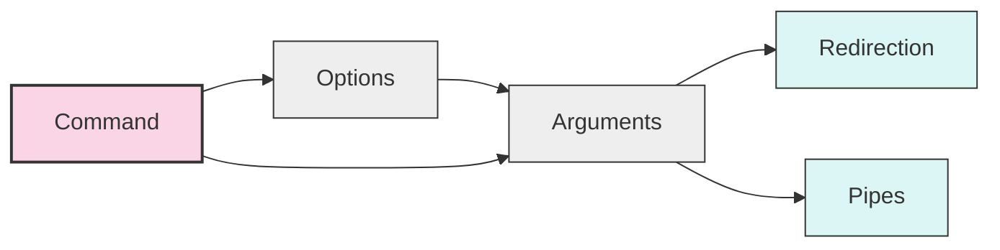

# Ubuntu Bash Basics

## Introduction

Bash (Bourne Again SHell) is the default command-line interpreter for Ubuntu and most Linux distributions. It serves as an interface between you and the operating system, allowing you to execute commands, run programs, and automate tasks. Mastering Bash basics is essential for anyone working with Ubuntu or any Linux-based system.

This guide will introduce you to the fundamental concepts and commands of the Bash shell, helping you become comfortable with the command line interface in Ubuntu.

## Accessing the Terminal

Before diving into Bash commands, you need to know how to access the terminal in Ubuntu:

1. Press `Ctrl+Alt+T` (keyboard shortcut)
2. Search for "Terminal" in the Applications menu
3. Right-click on the desktop and select "Open Terminal" (if available)

When you open the terminal, you'll see a prompt that typically looks like:

```
username@hostname:~$
```

This indicates:
- `username`: Your user account
- `hostname`: Your computer's name
- `~`: Your current directory (~ represents your home directory)
- `$`: Indicates you're logged in as a regular user (a `#` would indicate root user)

## Basic Navigation Commands

### Viewing Current Directory

To see your current location in the file system:

```bash
pwd
```

**Output:**
```
/home/username
```

The `pwd` command (Print Working Directory) shows your current location in the file system.

### Listing Files and Directories

To view the contents of a directory:

```bash
ls
```

**Output:**
```
Documents  Downloads  Music  Pictures  Videos
```

Common options for `ls`:

```bash
ls -l    # Long format with details
```

**Output:**
```
total 20
drwxr-xr-x 2 username username 4096 Mar 10 15:30 Documents
drwxr-xr-x 2 username username 4096 Mar 10 15:30 Downloads
drwxr-xr-x 2 username username 4096 Mar 10 15:30 Music
drwxr-xr-x 2 username username 4096 Mar 10 15:30 Pictures
drwxr-xr-x 2 username username 4096 Mar 10 15:30 Videos
```

```bash
ls -a    # Show all files (including hidden ones)
```

**Output:**
```
.  ..  .bash_history  .bash_logout  .bashrc  Documents  Downloads  Music  Pictures  Videos
```

```bash
ls -lh   # Human-readable file sizes
```

**Output:**
```
total 20K
drwxr-xr-x 2 username username 4.0K Mar 10 15:30 Documents
drwxr-xr-x 2 username username 4.0K Mar 10 15:30 Downloads
drwxr-xr-x 2 username username 4.0K Mar 10 15:30 Music
drwxr-xr-x 2 username username 4.0K Mar 10 15:30 Pictures
drwxr-xr-x 2 username username 4.0K Mar 10 15:30 Videos
```

### Changing Directories

To navigate between directories:

```bash
cd Documents
```

No output is shown when the command succeeds.

Useful `cd` shortcuts:

```bash
cd          # Go to home directory
cd ~        # Go to home directory (same as above)
cd ..       # Go up one level
cd ../..    # Go up two levels
cd -        # Go to previous directory
```

## File Operations

### Creating Files and Directories

To create a new directory:

```bash
mkdir my_project
```

To create a new empty file:

```bash
touch myfile.txt
```

To create multiple directories at once:

```bash
mkdir -p projects/web/html
```

The `-p` flag creates parent directories if they don't exist.

### Copying Files

Basic syntax:

```bash
cp source destination
```

Example:

```bash
cp myfile.txt Documents/
```

To copy directories recursively:

```bash
cp -r my_project backup_project
```

### Moving and Renaming Files

The `mv` command is used for both moving and renaming:

```bash
mv myfile.txt Documents/    # Move file to Documents directory
mv myfile.txt newname.txt   # Rename file
```

### Removing Files and Directories

To delete a file:

```bash
rm myfile.txt
```

To delete an empty directory:

```bash
rmdir my_project
```

To delete a directory and all its contents:

```bash
rm -r my_project
```

**Warning:** Be extremely careful with `rm -r` and especially `rm -rf` (which forces deletion without prompting). There's no "recycle bin" or "undo" in the terminal.

## Viewing File Content

### Displaying Entire Files

To display the contents of a file:

```bash
cat myfile.txt
```

**Output:**
```
This is the content of my file.
It has multiple lines.
```

### Viewing Large Files

For large files, use pagers like `less` to view content one screen at a time:

```bash
less myfile.txt
```

Navigate in `less`:
- Press `Space` or `Page Down` to go forward
- Press `b` or `Page Up` to go backward
- Press `q` to quit

### Viewing File Beginnings and Endings

To see the first few lines of a file:

```bash
head myfile.txt
```

To see the last few lines:

```bash
tail myfile.txt
```

To specify the number of lines:

```bash
head -n 5 myfile.txt    # First 5 lines
tail -n 10 myfile.txt   # Last 10 lines
```

## Bash Special Characters

Bash uses several special characters that have specific meanings:

| Character | Description |
|-----------|-------------|
| `*` | Wildcard - matches any characters |
| `?` | Wildcard - matches any single character |
| `>` | Redirect output to a file (overwrite) |
| `>>` | Redirect output to a file (append) |
| `|` | Pipe output to another command |
| `&` | Run a command in the background |
| `;` | Command separator |
| `$` | Variable expression |
| `\` | Escape character |

### Examples of Special Characters

Using wildcards:

```bash
ls *.txt         # List all .txt files
ls document?.txt # Lists document1.txt, documentA.txt, etc.
```

Redirecting output:

```bash
echo "Hello World" > greeting.txt   # Write to file
echo "More text" >> greeting.txt    # Append to file
```

Using pipes:

```bash
ls -l | grep "txt"   # List only files containing "txt"
```

## Environment and Variables

### Checking Environment Variables

To see all environment variables:

```bash
env
```

To see a specific variable:

```bash
echo $HOME
```

**Output:**
```
/home/username
```

### Setting Variables

Set a temporary variable:

```bash
MYVAR="Hello World"
echo $MYVAR
```

**Output:**
```
Hello World
```

## Command History

### Viewing Command History

To see previously executed commands:

```bash
history
```

**Output:**
```
1  pwd
2  ls
3  cd Documents
4  touch file.txt
5  history
```

### Searching Command History

Press `Ctrl+R` and type to search through your command history.

### Re-executing Commands

```bash
!5        # Execute command number 5 from history
!!        # Execute the last command again
!cd       # Execute the most recent command starting with "cd"
```

## Basic Text Processing

### Searching in Files

To search for text in files:

```bash
grep "search_term" filename.txt
```

**Output:**
```
This line contains the search_term in it.
```

Common `grep` options:

```bash
grep -i "term" file.txt    # Case-insensitive search
grep -r "term" directory/  # Recursive search through directories
grep -n "term" file.txt    # Show line numbers
```

### Simple Text Editing

While there are advanced text editors like vim and nano, you can do simple edits with stream editors:

```bash
sed 's/old/new/' file.txt  # Replace first occurrence of "old" with "new"
sed 's/old/new/g' file.txt # Replace all occurrences
```

## Process Management

### Viewing Running Processes

To see currently running processes:

```bash
ps
```

**Output:**
```
  PID TTY          TIME CMD
 1234 pts/0    00:00:00 bash
 5678 pts/0    00:00:00 ps
```

For a more detailed view:

```bash
ps aux
```

For a dynamic, real-time view:

```bash
top
```

### Killing Processes

To terminate a process:

```bash
kill 1234    # Kill process with PID 1234
```

For stubborn processes:

```bash
kill -9 1234
```

## Command Chaining

Bash allows you to chain commands in various ways:

```bash
command1 && command2    # Run command2 only if command1 succeeds
command1 || command2    # Run command2 only if command1 fails
command1 ; command2     # Run command1 then command2 regardless
```

Example:

```bash
mkdir project && cd project && touch readme.txt
```

This creates a directory, changes into it, and creates a file, but only if each previous step succeeds.

## Permissions

### Viewing Permissions

File permissions are shown in the output of `ls -l`:

```bash
ls -l myfile.txt
```

**Output:**
```
-rw-r--r-- 1 username groupname 123 Mar 10 15:30 myfile.txt
```

The first ten characters represent:
- File type (1st character): `-` for regular file, `d` for directory
- Owner permissions (2nd-4th): `rw-` means read and write, no execute
- Group permissions (5th-7th): `r--` means read-only
- Others permissions (8th-10th): `r--` means read-only

### Changing Permissions

To change permissions:

```bash
chmod permissions filename
```

Using symbolic mode:

```bash
chmod u+x script.sh    # Add execute permission for the user
chmod go-w file.txt    # Remove write permission for group and others
chmod a+r file.txt     # Add read permission for all
```

Using octal mode:

```bash
chmod 755 script.sh    # rwxr-xr-x
chmod 644 file.txt     # rw-r--r--
```

## Bash Scripting Basics

While full bash scripting deserves its own tutorial, here's a simple example:

Create a new file called `hello.sh`:

```bash
touch hello.sh
```

Edit it with a text editor or use this command:

```bash
echo '#!/bin/bash
echo "Hello, $USER!"
echo "Today is $(date)"
echo "Current directory: $(pwd)"' > hello.sh
```

Make it executable:

```bash
chmod +x hello.sh
```

Run it:

```bash
./hello.sh
```

**Output:**
```
Hello, username!
Today is Thu Mar 13 10:30:45 UTC 2025
Current directory: /home/username
```

## Working with Archives

### Creating Archives

To create a tar archive:

```bash
tar -cvf archive.tar file1 file2 directory/
```

To create a compressed tar archive:

```bash
tar -czvf archive.tar.gz file1 file2 directory/
```

### Extracting Archives

To extract a tar archive:

```bash
tar -xvf archive.tar
```

To extract a compressed tar archive:

```bash
tar -xzvf archive.tar.gz
```

## Using Man Pages

The `man` command displays the manual for a command:

```bash
man ls
```

This opens documentation explaining all options for the `ls` command.

Navigation in man pages works the same as in `less`:
- Press `Space` to page down
- Press `b` to page up
- Press `/` followed by a term to search
- Press `q` to quit

## Command Structure Visualization



## Summary

This guide has covered the essential Bash commands and concepts that every Ubuntu user should know:

- Navigating the file system with `pwd`, `ls`, and `cd`
- Managing files and directories with `mkdir`, `touch`, `cp`, `mv`, and `rm`
- Viewing file content with `cat`, `less`, `head`, and `tail`
- Understanding special characters and redirection
- Working with environment variables
- Managing command history
- Basic text processing with `grep` and `sed`
- Process management with `ps`, `top`, and `kill`
- Chaining commands
- Understanding and modifying file permissions
- Basic Bash scripting
- Working with archives
- Using man pages for help

Mastering these basics will make you comfortable using the Ubuntu terminal and provide a solid foundation for more advanced shell scripting topics.

## Additional Resources and Exercises

### Practice Exercises

1. Create a directory structure for a web project with folders for HTML, CSS, and JavaScript files.
2. Write a simple bash script that creates a backup of a specified directory.
3. Use grep to find all occurrences of a specific word in all text files in a directory.
4. Create a compressed archive of your home directory (excluding large subdirectories).
5. Set up environment variables that you might use in development work.

### Further Learning Resources

- The Bash manual: Run `man bash` in your terminal
- [GNU Bash Reference Manual](https://www.gnu.org/software/bash/manual/bash.html)
- [Ubuntu Documentation](https://help.ubuntu.com/community/UsingTheTerminal)
- [Linux Command Library](https://linuxcommandlibrary.com/)
- [ShellCheck](https://www.shellcheck.net/) - For validating your bash scripts