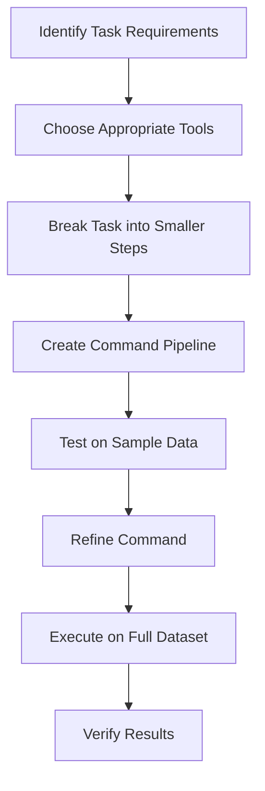

# Ubuntu Text Processing

## Introduction

Text processing is a fundamental skill for anyone working with Ubuntu or any Linux-based system. It involves manipulating, filtering, and transforming text data using powerful command-line tools. In Ubuntu, text processing allows you to search through files, extract specific information, modify text content, and automate repetitive text-related tasks.

Whether you're a system administrator, developer, data analyst, or just a curious Ubuntu user, mastering text processing will significantly enhance your productivity and problem-solving capabilities in the command line environment.

## Core Text Processing Tools

Ubuntu provides several powerful text processing utilities that form the backbone of text manipulation in the shell. Let's explore the most essential ones:

### 1. grep - Global Regular Expression Print

`grep` is a powerful tool for searching text patterns within files using regular expressions.

#### Basic Usage:

```bash
grep pattern filename
```

#### Examples:

Finding all occurrences of "ubuntu" in a file:

```bash
$ grep "ubuntu" file.txt
Ubuntu is a popular Linux distribution.
Many servers run ubuntu server edition.
Ubuntu Desktop provides a user-friendly interface.
```

Case-insensitive search with `-i` flag:

```bash
$ grep -i "ubuntu" file.txt
Ubuntu is a popular Linux distribution.
Many servers run ubuntu server edition.
Ubuntu Desktop provides a user-friendly interface.
ubuntu repositories contain thousands of packages.
```

Counting occurrences with `-c` flag:

```bash
$ grep -c "ubuntu" file.txt
3
```

Displaying line numbers with `-n` flag:

```bash
$ grep -n "ubuntu" file.txt
1:Ubuntu is a popular Linux distribution.
3:Many servers run ubuntu server edition.
5:Ubuntu Desktop provides a user-friendly interface.
```

Recursive search in directories with `-r` flag:

```bash
$ grep -r "function" /path/to/project/
/path/to/project/script.js:function processData() {
/path/to/project/utils.js:function formatText(text) {
```

### 2. sed - Stream Editor

`sed` is primarily used for text substitution, deletion, and insertion operations.

#### Basic Usage:

```bash
sed 'command' filename
```

#### Examples:

Replacing text:

```bash
$ cat file.txt
Hello World
$ sed 's/World/Ubuntu/' file.txt
Hello Ubuntu
```

Global substitution (all occurrences) with `g` flag:

```bash
$ cat file.txt
Hello World World
$ sed 's/World/Ubuntu/g' file.txt
Hello Ubuntu Ubuntu
```

Deleting specific lines:

```bash
$ cat numbers.txt
1
2
3
4
5
$ sed '3d' numbers.txt
1
2
4
5
```

Deleting a range of lines:

```bash
$ sed '2,4d' numbers.txt
1
5
```

In-place editing with `-i` flag:

```bash
$ sed -i 's/old/new/g' file.txt
```

### 3. awk - Aho, Weinberger, and Kernighan

`awk` is a powerful programming language designed for text processing and typically used as a data extraction and reporting tool.

#### Basic Usage:

```bash
awk 'pattern {action}' filename
```

#### Examples:

Printing specific columns:

```bash
$ cat data.txt
John 85 92
Lisa 93 88
Mike 78 85
$ awk '{print $1, $3}' data.txt
John 92
Lisa 88
Mike 85
```

Computing with columns:

```bash
$ awk '{print $1, $2 + $3}' data.txt
John 177
Lisa 181
Mike 163
```

Filtering rows with conditions:

```bash
$ awk '$2 >= 90 {print $1, "has high score:", $2}' data.txt
Lisa has high score: 93
```

Setting field separator with `-F`:

```bash
$ cat comma_data.csv
John,85,92
Lisa,93,88
Mike,78,85
$ awk -F, '{print $1, $3}' comma_data.csv
John 92
Lisa 88
Mike 85
```

Computing averages:

```bash
$ awk '{sum += $2} END {print "Average:", sum/NR}' data.txt
Average: 85.3333
```

## Text Analysis Tools

Beyond the core tools, Ubuntu offers additional utilities for text analysis:

### 1. sort - Sort Lines of Text

```bash
$ cat fruits.txt
banana
apple
orange
kiwi
$ sort fruits.txt
apple
banana
kiwi
orange
```

Numeric sort with `-n` flag:

```bash
$ cat numbers.txt
10
2
100
5
$ sort -n numbers.txt
2
5
10
100
```

Reverse sorting with `-r` flag:

```bash
$ sort -r fruits.txt
orange
kiwi
banana
apple
```

### 2. uniq - Report or Filter Repeated Lines

```bash
$ cat repeated.txt
apple
apple
banana
orange
orange
orange
$ uniq repeated.txt
apple
banana
orange
```

Counting occurrences with `-c` flag:

```bash
$ uniq -c repeated.txt
      2 apple
      1 banana
      3 orange
```

> **Note**: `uniq` only detects adjacent duplicate lines, so it's commonly used after `sort`.

### 3. wc - Word, Line, Character, and Byte Count

```bash
$ wc file.txt
  5  20 100 file.txt
```

This shows:
- 5 lines
- 20 words
- 100 characters

Counting only lines with `-l`, words with `-w`, or characters with `-c`:

```bash
$ wc -l file.txt
5 file.txt
$ wc -w file.txt
20 file.txt
$ wc -c file.txt
100 file.txt
```

## Advanced Text Processing Techniques

Let's explore some more advanced techniques that combine multiple tools:

### 1. Pipelines

One of the most powerful features in Ubuntu text processing is the ability to chain commands using pipes (`|`):

```bash
$ cat log.txt | grep "ERROR" | sort | uniq -c
      5 ERROR: Failed to connect to database
      2 ERROR: Invalid input parameters
     10 ERROR: Server timeout
```

This pipeline:
1. Reads log.txt
2. Filters only lines containing "ERROR"
3. Sorts the errors
4. Counts unique error occurrences

### 2. Regular Expressions

Regular expressions (regex) enable powerful pattern matching:

```bash
# Find all lines containing email addresses
$ grep -E "[a-zA-Z0-9._%+-]+@[a-zA-Z0-9.-]+\.[a-zA-Z]{2,}" contacts.txt

# Find all lines with phone numbers in format XXX-XXX-XXXX
$ grep -E "[0-9]{3}-[0-9]{3}-[0-9]{4}" contacts.txt
```

### 3. Text Extraction With cut

The `cut` command extracts portions of text from each line:

```bash
$ cat names.csv
John,Doe,35
Jane,Smith,28
Michael,Johnson,42

# Extract first names
$ cut -d ',' -f 1 names.csv
John
Jane
Michael

# Extract first and last names
$ cut -d ',' -f 1,2 names.csv
John,Doe
Jane,Smith
Michael,Johnson
```

### 4. Transforming Data With tr

The `tr` command translates or deletes characters:

```bash
# Convert lowercase to uppercase
$ echo "hello world" | tr 'a-z' 'A-Z'
HELLO WORLD

# Delete specific characters
$ echo "hello world" | tr -d 'aeiou'
hll wrld

# Squeeze repeated characters
$ echo "hello     world" | tr -s ' '
hello world
```

## Real-World Applications

Let's look at some practical examples of text processing in real-world scenarios:

### Example 1: Log Analysis

Analyzing Apache web server logs to find the most common IP addresses:

```bash
$ cat access.log | cut -d ' ' -f 1 | sort | uniq -c | sort -nr | head -5
    156 192.168.1.105
    142 192.168.1.107
     98 192.168.1.103
     87 192.168.1.115
     65 192.168.1.109
```

This shows the top 5 IP addresses with the number of requests each made.

### Example 2: CSV Data Processing

Processing a CSV file to calculate averages:

```bash
$ cat sales.csv
Region,Product,Sales
North,Widget A,5200
South,Widget A,4800
East,Widget B,6100
West,Widget B,5300
North,Widget B,5800

# Calculate average sales by product
$ grep "Widget A" sales.csv | cut -d ',' -f 3 | awk '{ sum += $1 } END { print "Widget A average:", sum/NR }'
Widget A average: 5000
$ grep "Widget B" sales.csv | cut -d ',' -f 3 | awk '{ sum += $1 } END { print "Widget B average:", sum/NR }'
Widget B average: 5733.33
```

### Example 3: System Monitoring

Monitoring system processes and memory usage:

```bash
# Find top 5 memory-consuming processes
$ ps aux | sort -nrk 4 | head -5

# Count processes by user
$ ps aux | cut -d ' ' -f 1 | sort | uniq -c

# Find zombie processes
$ ps aux | grep 'Z' | grep -v grep
```

### Example 4: Batch File Renaming

Using text processing to rename multiple files:

```bash
# Rename all .txt files to .md
$ for file in *.txt; do mv "$file" "${file%.txt}.md"; done

# Add prefix to all image files
$ for file in *.jpg; do mv "$file" "vacation_$file"; done
```

## Text Processing Workflow

When approaching a text processing task, follow this workflow:



## Summary

Ubuntu text processing provides a powerful toolkit for manipulating and analyzing text data directly from the command line. The core utilities—grep, sed, and awk—combined with supporting tools like sort, uniq, cut, and tr offer almost limitless possibilities for text transformation.

Key takeaways:
- `grep` excels at pattern matching and searching
- `sed` is perfect for text substitution and editing
- `awk` provides programming capabilities for complex text processing
- Pipelines allow you to chain commands for powerful workflows
- Regular expressions enable sophisticated pattern matching

Mastering these text processing tools and techniques will significantly enhance your productivity and capabilities when working with Ubuntu or any Linux-based system.

## Exercises

1. Create a script that extracts all email addresses from a text file.
2. Write a command to find the 5 most frequent words in a text file.
3. Process a CSV file of student grades to calculate the average score for each student.
4. Create a pipeline that finds all files in your home directory that contain a specific text string.
5. Write a sed command to replace all occurrences of "error" with "ERROR" in a log file, but only on lines that contain the word "critical".

## Additional Resources

- The GNU Grep Manual: `man grep`
- The GNU Sed Manual: `man sed`
- The GNU Awk Manual: `man awk`
- The Linux Documentation Project (TLDP) Text Processing Commands
- Ubuntu Community Help Wiki