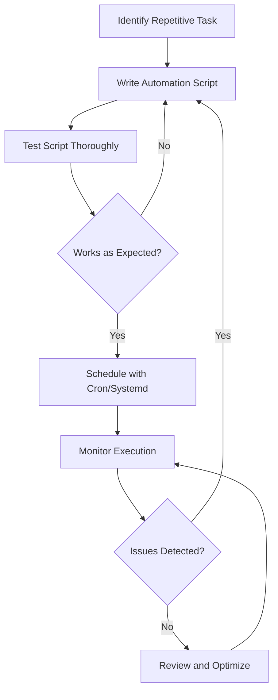

# Ubuntu Automation

## Introduction

Automation is a powerful skill that allows you to streamline repetitive tasks, increase productivity, and reduce the potential for human error. In Ubuntu, there are several built-in tools and techniques that you can use to automate common tasks, from simple script execution to scheduled jobs and system services.

This guide covers the fundamentals of Ubuntu automation, providing you with the knowledge to automate tasks efficiently. We'll explore shell scripts, cron jobs, systemd timers, and other automation tools available in Ubuntu.

## Why Automate Tasks in Ubuntu?

Before diving into the technical details, let's understand why automation is valuable:

- **Save time**: Execute repetitive tasks automatically without manual intervention
- **Increase consistency**: Ensure tasks are performed the same way every time
- **Reduce errors**: Eliminate human error from routine operations
- **Schedule tasks**: Run processes at specific times, even when you're not present
- **Chain actions**: Create complex workflows by connecting multiple commands

## Prerequisites

To follow along with this guide, you should have:

- Basic knowledge of Ubuntu and the terminal
- Familiarity with basic shell commands
- A Ubuntu system (18.04 LTS or newer)
- Text editor of your choice (nano, vim, VS Code, etc.)

## Shell Scripts: The Foundation of Automation

Shell scripts are the building blocks of automation in Ubuntu. They allow you to combine multiple commands into a single executable file.

### Creating Your First Automation Script

Let's create a simple backup script to understand the basics:

1. Open your terminal and create a new file:

```bash
nano backup.sh
```

2. Add the following code to the file:

```bash
#!/bin/bash

# Simple backup script
echo "Starting backup process..."

# Create backup directory if it doesn't exist
BACKUP_DIR="$HOME/backups/$(date +%Y-%m-%d)"
mkdir -p "$BACKUP_DIR"

# Backup important documents
cp -r "$HOME/Documents" "$BACKUP_DIR"

# Display completion message
echo "Backup completed at $(date)"
echo "Files stored in $BACKUP_DIR"
```

3. Save the file and exit the editor (in nano: Ctrl+O, Enter, Ctrl+X)

4. Make the script executable:

```bash
chmod +x backup.sh
```

5. Run the script:

```bash
./backup.sh
```

### Output:
```
Starting backup process...
Backup completed at Wed Mar 13 10:30:45 EDT 2025
Files stored in /home/username/backups/2025-03-13
```

### Adding Parameters to Your Scripts

To make scripts more flexible, you can add parameters:

```bash
#!/bin/bash

# Backup script with parameters
echo "Starting backup process..."

# If no directory is specified, use Documents as default
BACKUP_SOURCE="${1:-$HOME/Documents}"
BACKUP_DIR="$HOME/backups/$(date +%Y-%m-%d)"

# Create backup directory if it doesn't exist
mkdir -p "$BACKUP_DIR"

# Backup files
echo "Backing up $BACKUP_SOURCE to $BACKUP_DIR"
cp -r "$BACKUP_SOURCE" "$BACKUP_DIR"

# Display completion message
echo "Backup completed at $(date)"
echo "Files stored in $BACKUP_DIR"
```

Now you can specify which directory to back up:

```bash
./backup.sh /path/to/important/files
```

## Scheduling Tasks with Cron

Cron is a time-based job scheduler in Unix-like operating systems. It enables you to schedule commands or scripts to run automatically at specified times or intervals.

### Understanding Crontab Format

Cron uses a specific format to define when jobs should run:

```
* * * * * command_to_execute
│ │ │ │ │
│ │ │ │ └── Day of the week (0-7, where both 0 and 7 represent Sunday)
│ │ │ └──── Month (1-12)
│ │ └────── Day of month (1-31)
│ └──────── Hour (0-23)
└────────── Minute (0-59)
```

### Viewing and Editing Cron Jobs

To view your current cron jobs:

```bash
crontab -l
```

To edit your cron jobs:

```bash
crontab -e
```

### Common Cron Schedule Examples

Here are some common cron schedule patterns:

| Schedule | Description |
| -------- | ----------- |
| `0 0 * * *` | Run at midnight every day |
| `0 */2 * * *` | Run every 2 hours |
| `0 9-17 * * 1-5` | Run hourly from 9 AM to 5 PM, Monday to Friday |
| `*/15 * * * *` | Run every 15 minutes |
| `0 0 1 * *` | Run at midnight on the first day of each month |

### Scheduling Our Backup Script

Let's schedule our backup script to run every day at 9 PM:

```bash
crontab -e
```

Add the following line (adjust the path to your script):

```
0 21 * * * /path/to/backup.sh
```

Save and exit the editor.

## Systemd Timers: Modern Task Scheduling

Systemd timers are an alternative to cron jobs and offer some advantages like better logging, dependency handling, and more precise timing options.

### Creating a Simple Systemd Timer

1. Create a service file:

```bash
sudo nano /etc/systemd/system/backup.service
```

2. Add the following content:

```ini
[Unit]
Description=Daily Backup Service
After=network.target

[Service]
Type=oneshot
ExecStart=/path/to/backup.sh
User=your_username

[Install]
WantedBy=multi-user.target
```

3. Create a timer file:

```bash
sudo nano /etc/systemd/system/backup.timer
```

4. Add the following content:

```ini
[Unit]
Description=Run backup daily at 9 PM

[Timer]
OnCalendar=*-*-* 21:00:00
Persistent=true

[Install]
WantedBy=timers.target
```

5. Enable and start the timer:

```bash
sudo systemctl enable backup.timer
sudo systemctl start backup.timer
```

6. Verify the timer is active:

```bash
systemctl list-timers
```

## Event-Based Automation with Incron

While cron schedules tasks based on time, incron triggers actions based on filesystem events like file creation, modification, or deletion.

### Installing Incron

```bash
sudo apt-get update
sudo apt-get install incron
```

### Setting Up User Access

Add your username to the allowed users:

```bash
sudo nano /etc/incron.allow
```

Add your username and save the file.

### Creating Incron Jobs

Edit your incron table:

```bash
incrontab -e
```

Add a rule to automatically process files added to a directory:

```
/path/to/watch IN_CLOSE_WRITE /path/to/process_script.sh $@/$#
```

This runs `process_script.sh` whenever a file is completely written to the watched directory.

## Combining Tools: A Practical Example

Let's create a complete automation solution that:
1. Monitors a directory for new log files
2. Processes them automatically
3. Backs up processed files daily
4. Sends a weekly summary report

### The Monitoring Script (process_logs.sh)

```bash
#!/bin/bash

LOG_FILE="$1"
PROCESSED_DIR="$HOME/logs/processed"
ARCHIVE_DIR="$HOME/logs/archive"

# Create directories if they don't exist
mkdir -p "$PROCESSED_DIR" "$ARCHIVE_DIR"

# Process the log file (example: extract errors)
grep "ERROR" "$LOG_FILE" >> "$PROCESSED_DIR/errors.log"

# Move the processed file to archive
mv "$LOG_FILE" "$ARCHIVE_DIR/$(basename "$LOG_FILE").$(date +%s)"

echo "Processed $LOG_FILE at $(date)" >> "$HOME/logs/processing.log"
```

### Setup Incron to Watch for New Logs

```bash
incrontab -e
```

Add:

```
/path/to/logs IN_CLOSE_WRITE /path/to/process_logs.sh $@/$#
```

### Backup Script (backup_logs.sh)

```bash
#!/bin/bash

BACKUP_DIR="$HOME/backups/logs/$(date +%Y-%m-%d)"
LOG_ARCHIVE="$HOME/logs/archive"

# Create backup directory
mkdir -p "$BACKUP_DIR"

# Backup log archives
tar -czf "$BACKUP_DIR/logs_backup.tar.gz" "$LOG_ARCHIVE"

# Keep only backups from the last 30 days
find "$HOME/backups/logs" -type d -mtime +30 -exec rm -rf {} \;

echo "Log backup completed at $(date)" >> "$HOME/logs/backup.log"
```

### Weekly Report Script (weekly_report.sh)

```bash
#!/bin/bash

REPORT_FILE="$HOME/logs/reports/weekly_report_$(date +%Y-%m-%d).txt"
ERROR_LOG="$HOME/logs/processed/errors.log"

# Create report directory
mkdir -p "$(dirname "$REPORT_FILE")"

# Generate report header
echo "Weekly Log Analysis Report" > "$REPORT_FILE"
echo "Generated on: $(date)" >> "$REPORT_FILE"
echo "----------------------------" >> "$REPORT_FILE"

# Add error statistics
echo "Error Summary:" >> "$REPORT_FILE"
echo "Total errors: $(wc -l < "$ERROR_LOG")" >> "$REPORT_FILE"

# Add top 5 most common errors
echo -e "
Top 5 most common errors:" >> "$REPORT_FILE"
sort "$ERROR_LOG" | uniq -c | sort -nr | head -5 >> "$REPORT_FILE"

echo "Weekly report generated at $(date)" >> "$HOME/logs/reporting.log"
```

### Schedule Everything with Systemd Timers

Create service and timer files for each script:

1. Daily backup timer (runs at midnight)
2. Weekly report timer (runs Sunday at 6 AM)

## Automation Best Practices

When creating automation scripts in Ubuntu, follow these best practices:

1. **Include proper error handling**:
```bash
command || { echo "Command failed"; exit 1; }
```

2. **Add logging to all scripts**:
```bash
log_message() {
  echo "$(date '+%Y-%m-%d %H:%M:%S') - $1" >> "$LOG_FILE"
}
```

3. **Use absolute paths** for files and commands

4. **Set appropriate permissions** for your scripts and log files

5. **Test thoroughly** before implementing in production

6. **Document your automation** with comments and separate documentation

7. **Monitor your automated tasks** to ensure they're working as expected

## Advanced Automation with Tools

Beyond basic scripts and schedulers, Ubuntu offers several powerful automation tools:

### Ansible for System Configuration

Ansible allows for declarative automation of system configuration:

```bash
sudo apt-get install ansible
```

Create a simple playbook (example.yml):

```yaml
---
- name: Configure web server
  hosts: localhost
  become: yes
  tasks:
    - name: Install Nginx
      apt:
        name: nginx
        state: present
    
    - name: Start Nginx service
      service:
        name: nginx
        state: started
        enabled: yes
```

Run it with:

```bash
ansible-playbook example.yml
```

### Automating with Python and Shell

Python offers more flexibility for complex automation tasks:

```python
#!/usr/bin/env python3

import os
import sys
import datetime
import shutil

def backup_directory(source, destination):
    """Create a backup of the source directory"""
    timestamp = datetime.datetime.now().strftime("%Y%m%d_%H%M%S")
    backup_path = os.path.join(destination, f"backup_{timestamp}")
    
    try:
        shutil.copytree(source, backup_path)
        print(f"Backup created at {backup_path}")
        return True
    except Exception as e:
        print(f"Backup failed: {e}")
        return False

if __name__ == "__main__":
    if len(sys.argv) != 3:
        print("Usage: backup.py <source_dir> <backup_dir>")
        sys.exit(1)
    
    source = sys.argv[1]
    destination = sys.argv[2]
    
    if not os.path.exists(source):
        print(f"Source directory {source} does not exist")
        sys.exit(1)
    
    os.makedirs(destination, exist_ok=True)
    
    success = backup_directory(source, destination)
    sys.exit(0 if success else 1)
```

## Automation Workflow Diagram

Here's a visual representation of a typical automation workflow:



## Summary

Ubuntu automation is a powerful way to save time and increase efficiency by:

- Creating shell scripts to automate common tasks
- Scheduling jobs with cron and systemd timers
- Implementing event-based automation with incron
- Combining multiple tools for comprehensive workflows
- Following best practices for reliability and maintainability

By mastering these automation techniques, you can significantly reduce the time spent on repetitive tasks and focus on more creative and productive work.

## Exercises

1. Create a shell script that automatically updates your system packages weekly.
2. Write a backup script that archives and compresses your home directory.
3. Set up a cron job to clean temporary files older than 7 days.
4. Create a systemd timer that checks disk space usage and sends an alert if it exceeds 80%.
5. Build an automated workflow that monitors a network service and restarts it if it goes down.

## Additional Resources

For further learning about Ubuntu automation:

- The Ubuntu server guide: [https://ubuntu.com/server/docs](https://ubuntu.com/server/docs)
- Linux Documentation Project: [https://tldp.org/](https://tldp.org/)
- Cron job expressions generator: [https://crontab.guru/](https://crontab.guru/)
- Systemd manual: `man systemd.timer`
- Bash scripting guide: `man bash`